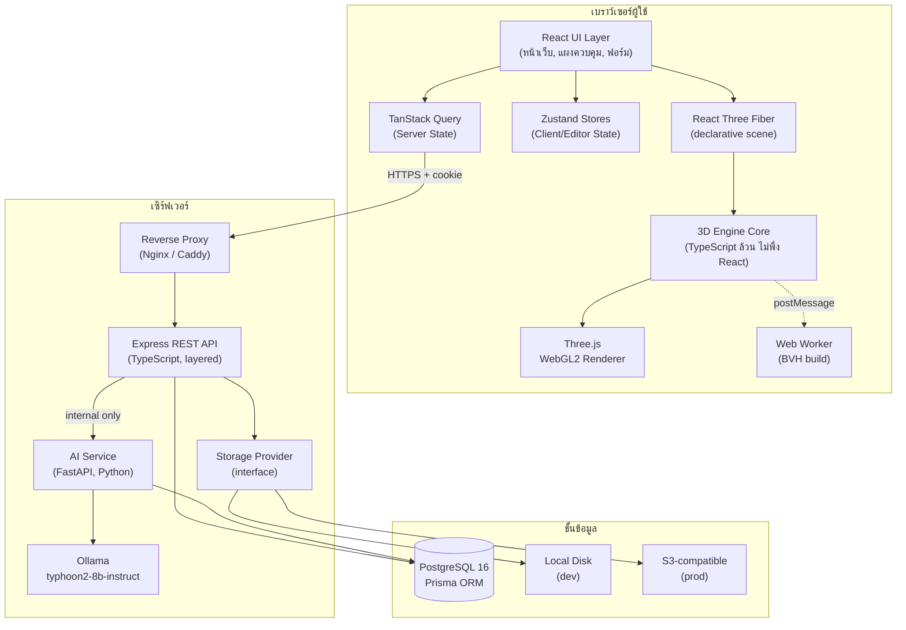
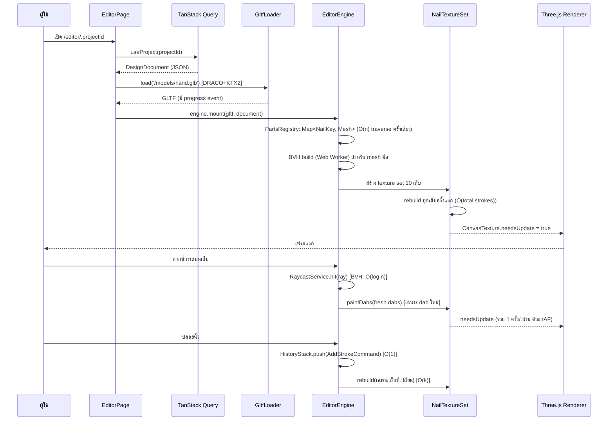
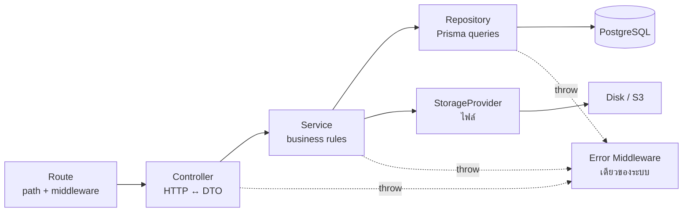
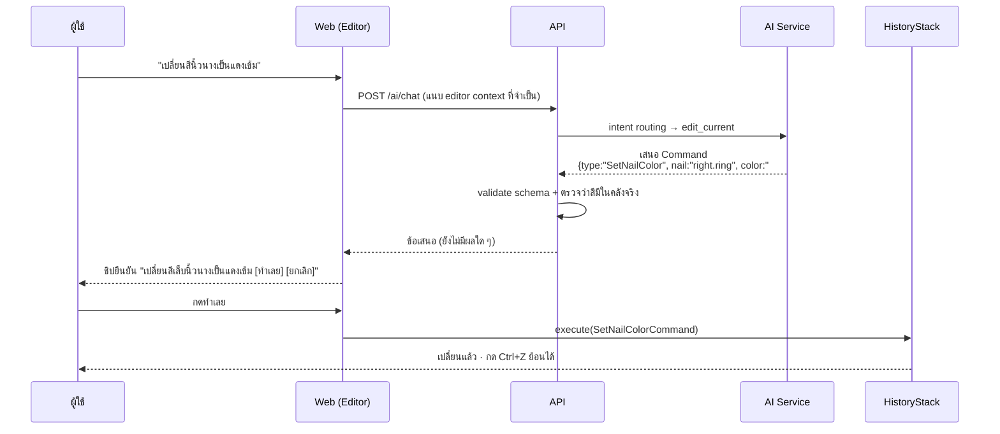
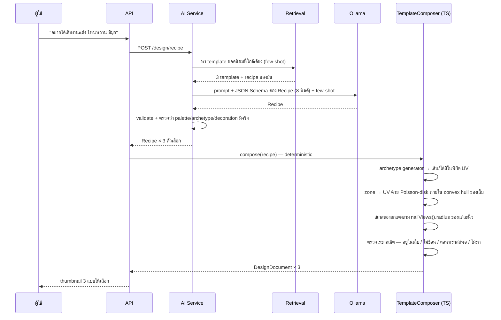
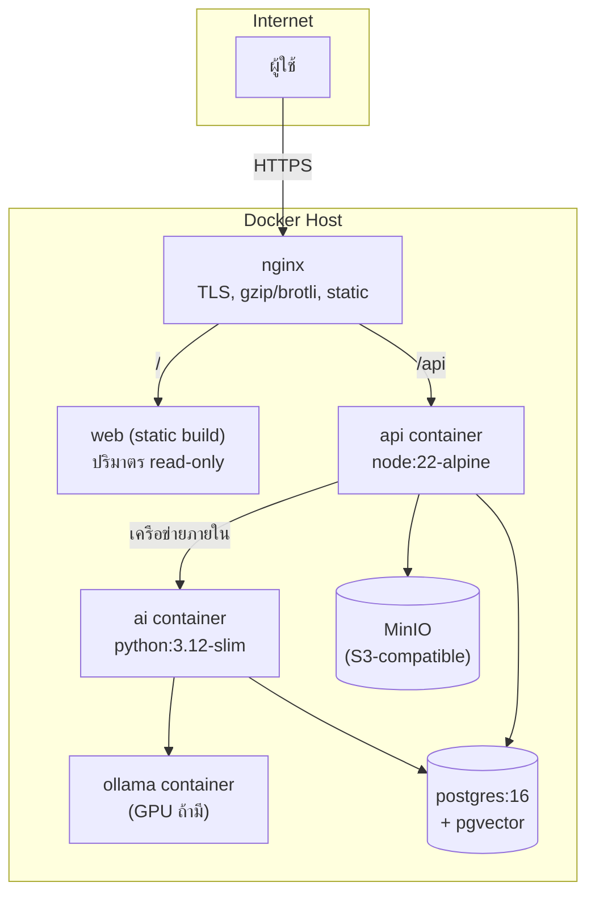

# System Architecture — NAIL STUDIO 3D

เอกสารสถาปัตยกรรมระบบ อ้างอิงผลการตรวจซอร์สใน [source-audit.md](source-audit.md)

ทุกการตัดสินใจในเอกสารนี้ระบุครบตาม Decision Rule ของโจทย์:
**อะไร → ทำไม → ทางเลือกอื่น → ทำไมไม่เลือก → ผลต่อ performance → ผลต่อ maintainability**

---

## 1. ภาพรวมระบบ



> **หมายเหตุด้านความปลอดภัย**: `AI` และ `OL` อยู่ในเครือข่ายภายในเท่านั้น
> เบราว์เซอร์เข้าถึงไม่ได้โดยตรง — ทุก request ต้องผ่าน `API` ซึ่งเป็นจุดเดียวที่ทำ
> authentication, authorization, rate limiting และ audit log (ปิดความเสี่ยง AD-1, AD-2, R-13)

### 1.1 กฎการไหลของข้อมูล (บังคับ)

```
UI Component  ─(action)→  Zustand store / Command Bus
Command Bus   ─(mutate)→  Editor Document (แหล่งความจริงเดียวของงานออกแบบ)
Document      ─(dirty ids)→ 3D Engine (rebuild เฉพาะที่เปลี่ยน)
3D Engine     ─(ไม่เคย)→  React setState ทุกเฟรม   ← ห้ามเด็ดขาด
TanStack Query ─(fetch/mutate)→ REST API
```

**ห้าม**: React component เรียก `three.js` API โดยตรงข้ามชั้น, engine เรียก `useStore.setState` ใน `useFrame`, server state ถูกคัดลอกเข้า Zustand

---

## 2. โครงสร้าง Monorepo

```
NAIL_STUDIO/
├── apps/
│   ├── web/                    # Vite + React + R3F (frontend)
│   ├── api/                    # Express + Prisma (backend)
│   └── ai/                     # FastAPI + Ollama + pgvector (AI service, Python)
├── packages/
│   ├── contracts/              # Zod schema + TS types ใช้ร่วม 2 ฝั่ง
│   └── config/                 # eslint / tsconfig base ใช้ร่วม
├── prisma/
│   ├── schema.prisma
│   └── migrations/
├── tools/                      # Python model pipeline (ยกมาจาก NailDesine-TEST)
├── docs/                       # เอกสารทั้งหมด
├── e2e/                        # Playwright
├── docker-compose.yml
└── package.json                # pnpm workspaces
```

### DECISION D-01 — Monorepo (pnpm workspaces)

| หัวข้อ | รายละเอียด |
|---|---|
| **อะไร** | pnpm workspaces + `packages/contracts` เป็นแหล่งนิยาม type/schema กลาง |
| **ทำไม** | frontend และ backend ต้องเห็น shape ของ "เอกสารงานออกแบบ" ตรงกัน ถ้าแยก repo จะเกิด drift ทันทีที่ schema เปลี่ยน — Zod ตัวเดียวใช้ทั้ง validate ฝั่ง server และ parse ฝั่ง client |
| **ทางเลือก** | (ก) 2 repo แยก + publish npm package (ข) repo เดียวไม่มี workspace (ค) Nx / Turborepo |
| **ทำไมไม่เลือก** | (ก) overhead การ publish/version สูงเกินสำหรับทีมขนาดนี้ (ข) dependency ชนกันระหว่าง frontend/backend (ค) เพิ่ม learning curve และ config โดยไม่จำเป็นสำหรับ 2 apps — ขัดหลัก KISS ของโจทย์ |
| **ผล performance** | เป็นกลาง (build-time เท่านั้น) |
| **ผล maintainability** | สูง — เปลี่ยน schema ที่เดียว TypeScript ฟ้อง compile error ทั้งสองฝั่งทันที |

---

## 3. Frontend Architecture

```
apps/web/src/
├── app/                    # bootstrap, router, providers, error boundary
│   ├── router.tsx
│   ├── providers.tsx       # QueryClientProvider, AuthProvider, ThemeProvider
│   └── App.tsx
├── pages/                  # หนึ่งไฟล์ = หนึ่ง route (บาง ประกอบ feature เข้าด้วยกัน)
│   ├── HomePage.tsx
│   ├── EditorPage.tsx      # ← หน้าหลัก 3D
│   ├── ProjectsPage.tsx
│   ├── ProfilePage.tsx
│   └── auth/
├── features/               # หนึ่งโฟลเดอร์ = หนึ่งความสามารถทางธุรกิจ
│   ├── auth/               # hooks + api + components
│   ├── projects/           # รายการงาน, สร้าง, ทำสำเนา, เวอร์ชัน
│   ├── editor/             # แผงควบคุมทั้งหมดของ editor
│   │   ├── panels/         # ColorPanel, MaterialPanel, LayerPanel, DecorationPanel...
│   │   ├── toolbar/
│   │   └── hooks/
│   └── catalog/            # คลังของตกแต่ง/สี/วัสดุ
├── 3d/                     # ← เครื่องยนต์ 3D (ดู §4)
├── components/             # design system: Button, Modal, Dropdown, Toggle...
├── stores/                 # Zustand slices (client state)
├── api/                    # HTTP client + query/mutation hooks (server state)
├── lib/                    # utils ทั่วไป (ไม่ผูกโดเมน)
└── styles/                 # tailwind entry + design tokens
```

### DECISION D-02 — แยก `features/` ออกจาก `components/`

- **อะไร**: จัดโค้ดตาม feature ไม่ใช่ตามชนิดไฟล์
- **ทำไม**: จากการตรวจซอร์ส CEPP พบว่า `assets/Components/DesignStudio/` มี 30+ ไฟล์ปนกันทั้ง state/data/UI ทำให้หาโค้ดที่เกี่ยวข้องกันยาก การจัดตาม feature ทำให้ "ลบฟีเจอร์" = "ลบโฟลเดอร์"
- **ทางเลือก**: จัดแบบ `components/ hooks/ utils/` แบนราบ (แบบ CEPP)
- **ทำไมไม่เลือก**: ที่ 100+ ไฟล์ โครงแบนราบทำให้ coupling ซ่อนตัว
- **ผล**: maintainability สูงขึ้นชัดเจน, performance เป็นกลาง (แต่ช่วย code-splitting ต่อ route ได้ง่ายกว่า)

### 3.1 การแยก Client State ↔ Server State

| ประเภท | เก็บที่ | ตัวอย่าง |
|---|---|---|
| **Client / Editor State** (Zustand) | หน่วยความจำเบราว์เซอร์ | `selectedNails: Set<NailKey>`, `activeTool`, `cameraMode`, `transformMode`, `brushSettings`, `editorSettings`, `layoutMode`, `isDirty` |
| **Server State** (TanStack Query) | cache ของ Query | รายการโปรเจกต์, เอกสารงานที่โหลดมา, แคตตาล็อกของตกแต่ง, โปรไฟล์ผู้ใช้, รายการเวอร์ชัน |
| **Runtime 3D State** (นอก React ทั้งคู่) | คลาสใน `3d/` | เมทริกซ์กล้อง, ตำแหน่ง pointer, wet-stroke buffer, BVH, texture cache |

**เหตุผลของชั้นที่สาม**: ข้อมูลที่เปลี่ยนทุกเฟรม (60 Hz) ถ้าเก็บใน React หรือ Zustand จะบังคับ re-render 60 ครั้ง/วินาที — ซอร์ส NailDesine-TEST แก้ปัญหานี้ไว้แล้วโดยผูก re-render กับ "การ commit" เท่านั้น (`Design.tsx:191`) เราจะทำให้ชัดเจนขึ้นด้วยการแยกเป็นชั้นที่มีชื่อ

### DECISION D-03 — Zustand + selector บังคับ

- **อะไร**: ทุก component subscribe ผ่าน selector (`useEditorStore(s => s.activeTool)`) ห้าม `useEditorStore()` เปล่า
- **ทำไม**: ซอร์สเดิม `Design.tsx:92` เรียก `useUiStore()` ทั้งก้อน → ขยับสไลเดอร์ขนาดแปรง 1 ครั้ง ทำให้ทั้งหน้ารวมถึง `<Canvas>` re-render (คอมเมนต์ในซอร์สเองก็เตือนเรื่องนี้ที่บรรทัด 245)
- **ทางเลือก**: Redux Toolkit / Jotai / Context
- **ทำไมไม่เลือก**: Redux boilerplate สูงเกินความจำเป็น; Context ทำให้ทุก consumer re-render พร้อมกันซึ่งคือปัญหาเดิม; Jotai ใช้ได้แต่ทีมคุ้น Zustand อยู่แล้วจากซอร์สเดิม
- **ผล performance**: ลด re-render จาก O(ทุก component) เหลือ O(component ที่ subscribe ค่านั้นจริง)

---

## 4. 3D Architecture

```
apps/web/src/3d/
├── core/
│   ├── EditorEngine.ts         # facade: ผูก document + textures + selection + history
│   ├── EngineContext.tsx       # React context ส่ง engine instance ลงไป (ครั้งเดียว)
│   ├── DirtySet.ts             # ชุด id ที่ต้อง rebuild (Set<NailKey>)
│   └── EventBus.ts             # pub/sub ภายใน engine (strokeEnd, selectionChange...)
├── scene/
│   ├── NailScene.tsx           # <Canvas> + providers ระดับฉาก
│   ├── SceneLighting.tsx       # แสง + Environment (ยกจาก Stage.tsx)
│   └── SceneSettings.ts        # dpr, tone mapping, color space
├── models/
│   ├── HandModel.tsx           # โหลด GLB + สร้าง PartsRegistry
│   ├── NailModel.tsx           # กลุ่มเล็บ 10 ชิ้น
│   ├── NailMesh.tsx            # เล็บหนึ่งชิ้น
│   └── PartsRegistry.ts        # Map<NailKey, Mesh> + Map<NailKey, Bone>
├── materials/
│   ├── NailMaterial.ts         # MeshPhysicalMaterial factory (ยกจากเดิม)
│   ├── finishes.ts             # preset glossy/matte/chrome/glitter (ยกจากเดิม)
│   └── MaterialPool.ts         # reuse material ข้ามเล็บที่ตั้งค่าเหมือนกัน
├── painting/                   # ← ยกมาจาก src/nail/ ทั้งชุด
│   ├── brush.ts  rasterizer.ts  layers.ts  simplify.ts  uvMapping.ts
│   └── NailTextureSet.ts       # แคช/composite เท็กซ์เจอร์ (ขยายเป็น 10 เล็บ)
├── geometry/
│   ├── hull.ts                 # convex hull (ยกจากเดิม)
│   ├── nailViews.ts            # center/normal/radius (ยกจากเดิม)
│   ├── handProportions.ts      # ปรับบอร์น + refresh bounds (ยกจากเดิม)
│   └── surfaceProjection.ts    # ← ใหม่: วางของตกแต่งบนผิวเล็บ
├── interactions/
│   ├── PaintController.tsx     # ลงสี (refactor จากเดิม)
│   ├── SelectionController.tsx # เลือกเล็บ/ของตกแต่ง
│   ├── TransformController.tsx # ← ใหม่: ย้าย/หมุน/ย่อขยาย decoration
│   └── pointerToRay.ts         # แปลง pointer → NDC → Ray (pure, testable)
├── selection/
│   ├── RaycastService.ts       # ← ใหม่: ห่อ raycaster + BVH
│   └── HitTestResult.ts
├── camera/
│   ├── EditorCamera.tsx        # OrbitControls + โหมดกล้อง
│   ├── NailFocus.tsx           # บินไปจ่อเล็บ (ยกจากเดิม)
│   └── cameraPresets.ts        # HOME/TOP/SIDE + สูตรจัดเฟรม
├── decorations/                # ← ใหม่ทั้งโฟลเดอร์
│   ├── NailDecoration.tsx
│   ├── DecorationInstances.tsx # InstancedMesh สำหรับชิ้นซ้ำ ๆ
│   └── decorationCatalog.ts
├── history/
│   ├── Command.ts              # interface: do() / undo() / merge()
│   ├── HistoryStack.ts         # undo/redo/limit/clear/group
│   └── commands/               # SetNailColorCommand, AddStrokeCommand, ...
├── loaders/
│   ├── GltfLoader.ts           # DRACO + KTX2 + cache + progress + dispose
│   └── AssetCache.ts           # Map<url, Promise<GLTF>>
├── exporters/
│   ├── exportSnapshot.ts       # PNG จาก canvas
│   ├── exportProjectJson.ts    # เอกสารงาน (.nail.json)
│   └── exportGlb.ts            # GLTFExporter (ถ้าเหมาะสมทางเทคนิค)
├── optimization/
│   ├── bvh.ts                  # setup three-mesh-bvh
│   ├── bvhWorker.ts            # สร้าง BVH นอก main thread
│   └── disposal.ts             # ทิ้ง geometry/material/texture อย่างถูกต้อง
└── utils/
```

### DECISION D-04 — Texture Painting บน UV (ไม่ใช่ vertex color / ไม่ใช่ decal geometry)

| หัวข้อ | รายละเอียด |
|---|---|
| **อะไร** | เก็บงานเป็น "รายการเส้น (stroke) ในพิกัด UV" แล้ว rasterize ลง `<canvas>` 1024×1024 ต่อเล็บ → ป้อนเข้า `CanvasTexture` → ใช้เป็น `map` ของ `MeshPhysicalMaterial` |
| **ทำไม** | (1) เล็บมีเพียง 128–512 สามเหลี่ยม (วัดได้จริง §1.3 ของ audit) — vertex color จะให้ความละเอียดแค่ระดับ 81–289 จุด วาดลายไม่ได้เลย (2) เก็บเป็น stroke ทำให้ไฟล์งานเล็ก (พิกัด float ไม่กี่ร้อยจุด) แทนที่จะเก็บ PNG 1024² (3) resolution-independent — เปลี่ยน `TEX_SIZE` ภายหลังได้โดยไม่เสียงาน |
| **ทางเลือก** | (ก) vertex color (ข) decal geometry ซ้อนบนเล็บ (ค) เก็บ texture เป็นภาพ PNG ตรง ๆ (ง) shader procedural |
| **ทำไมไม่เลือก** | (ก) ความละเอียดไม่พอตามที่วัดได้ (ข) เพิ่ม draw call ต่อ 1 ลาย และ z-fighting บนผิวโค้ง (ค) ไฟล์งานใหญ่มาก (1024²×RGBA ≈ 4 MB/เล็บ/เลเยอร์ → 240 MB ต่องาน) undo ทำไม่ได้ (ง) ผู้ใช้วาดอิสระไม่ได้ |
| **ผล performance** | 1 draw call ต่อเล็บ; ต้นทุนอยู่ที่ CPU rasterization ซึ่งลดด้วย incremental layer cache (A-04) |
| **ผล maintainability** | สูง — logic ทั้งหมดเป็น pure function ทดสอบใน Node ได้ ไม่ต้องมี WebGL |

### DECISION D-05 — Engine เป็นคลาส TypeScript ไม่ใช่ React component

- **อะไร**: `EditorEngine` เป็นคลาสธรรมดา สร้างครั้งเดียวต่อ session React แค่ถือ reference
- **ทำไม**: ป้องกันไม่ให้สถานะ 3D ผูกกับ lifecycle ของ React (StrictMode mount 2 รอบ, fast refresh) และทำให้ทดสอบ engine ได้โดยไม่ต้อง render React เลย
- **ทางเลือก**: เก็บทุกอย่างใน hooks/context
- **ทำไมไม่เลือก**: ซอร์สเดิมพิสูจน์แล้วว่าเจ็บ — คอมเมนต์ใน `HandModel.tsx:51` และ `Design.tsx:104` อธิบายบั๊กจากการที่ memo/effect ทำงานคนละจังหวะกับ Three.js
- **ผล**: ทดสอบง่ายขึ้นมาก, ลด re-render, แต่ต้องเขียน disposal เอง (มี `optimization/disposal.ts` รับผิดชอบ)

### 4.1 3D Pipeline (ตั้งแต่โหลดจนถึงพิกเซล)



### DECISION D-06 — Baked Raycast Proxy (แก้ไขหลัง Spike S3)

> **ฉบับแก้ไข 2026-08-12** — ร่างเดิมเขียนว่า "ใส่ BVH ให้ `Hand_Mesh`"
> [Spike S3](spikes/S3-bvh-skinnedmesh.md) พิสูจน์แล้วว่า **ทำแบบนั้นไม่ได้ผล**

| หัวข้อ | รายละเอียด |
|---|---|
| **ปัญหาที่ค้นพบ** | `three-mesh-bvh` **ไม่เร่งความเร็ว `SkinnedMesh` เลย และล้มเหลวแบบเงียบสนิท** — วิธีติดตั้งมาตรฐาน `Mesh.prototype.raycast = acceleratedRaycast` ถูกบดบัง เพราะ `THREE.SkinnedMesh.prototype` มีเมธอด `raycast` เป็นของตัวเอง (ยืนยันด้วย `hasOwnProperty` แล้ว) |
| **อะไร** | สร้าง **static raycast proxy**: bake ตำแหน่ง vertex ที่ผ่าน `applyBoneTransform` แล้ว → `BufferGeometry` ใหม่ → `MeshBVH` → ใส่ใน `Mesh` ธรรมดา (ไม่ใช่ SkinnedMesh) ใช้เป็น occluder ในการยิงรังสี **ไม่ใส่ใน scene ไม่เรนเดอร์** |
| **เมื่อไรที่ rebuild** | เฉพาะตอนท่าบอร์นเปลี่ยนจริง (ผู้ใช้ปล่อยสไลเดอร์สัดส่วน) — **ไม่ใช่ทุกเฟรม** debounce ที่ปลายการลาก |
| **ผลที่วัดได้** | 113,282 µs → **7.5 µs ต่อรังสี (เร็วขึ้น 15,104 เท่า)** และ **ถูกต้อง 100%** · ต้นทุน rebuild 54.8 ms · หน่วยความจำ +1.04 MB (BVH) +0.77 MB (position) |
| **ทางเลือก** | (ก) BVH ทุก mesh (ข) ไม่ใช้ BVH (ค) ตัด occluder ออก (ง) **แพตช์ `SkinnedMesh.prototype.raycast`** (จ) proxy mesh หยาบ |
| **ทำไมไม่เลือก** | (ก) เล็บมี 128–512 tris ต้นทุนสร้าง BVH มากกว่าที่ประหยัด (ข) 113 ms/รังสี ใช้งานไม่ได้ (ค) `PaintController.tsx:35` อธิบายว่าถ้าไม่มี occluder สีจะทะลุนิ้วไปลงเล็บที่มองไม่เห็น **(ง) วัดแล้ว — เร็วขึ้น 45,313 เท่าแต่ถูกต้องแค่ 22.5%** เพราะ BVH ค้างที่ท่า rest → สีลงผิดตำแหน่งเงียบ ๆ ทันทีที่เปลี่ยนสัดส่วนมือ (จ) ยังเปิดไว้ถ้าต้องการลดต้นทุน rebuild ให้ต่ำกว่า 54.8 ms |
| **ผล maintainability** | proxy เป็น `Mesh` ธรรมดา ทดสอบได้โดยไม่ต้องมี WebGL และไม่ต้องแพตช์ prototype ของ three.js ซึ่งเป็น global side effect ที่กระทบทั้งแอป |
| **สิ่งที่ต้องระวัง** | proxy ต้องถูก rebuild ทุกครั้งที่ท่าเปลี่ยนจริง ถ้าลืมจะได้ระบบที่ทาสีผิดแบบเงียบ ๆ → **ต้องมีเทสที่เทียบผลกับ `SkinnedMesh.raycast` ตัวจริง** ไม่ใช่แค่เทสว่าเร็ว |

**บทเรียนเชิงวิธีการที่ต้องบังคับใช้ทั้งโครงงาน**: benchmark ทุกตัวต้องมีคอลัมน์
**"ตรงกับความจริงกี่เปอร์เซ็นต์"** ควบคู่กับเวลาเสมอ — ทางเลือก (ง) เร็วกว่าทางที่ถูกต้อง
ถึง 3 เท่า ถ้าวัดแค่เวลาจะเลือกผิดทันที

---

## 5. Backend Architecture

```
apps/api/src/
├── config/          env schema (Zod), CORS, cookie, rate limit, storage config
├── routes/          กำหนด path + middleware เท่านั้น ห้ามมี business logic
├── controllers/     แปลง HTTP ↔ โดเมน (req → DTO → service → res)
├── services/        business logic ทั้งหมด ไม่รู้จัก Express ไม่รู้จัก Prisma
├── repositories/    ทุกการเข้าถึงฐานข้อมูล (Prisma อยู่ที่นี่ที่เดียว)
├── middleware/      auth, error handler, request id, rate limit, upload
├── validators/      Zod schema ต่อ endpoint (import จาก packages/contracts)
├── storage/         StorageProvider interface + LocalDisk + S3 implementation
├── errors/          AppError hierarchy + error code registry
├── types/           express augmentation (req.user), DTO
└── utils/           logger, hashing, pagination cursor
```



### DECISION D-07 — Layered architecture (ไม่ใช่ MVC แบบแบน)

- **อะไร**: 4 ชั้นชัดเจน ตามที่โจทย์กำหนด
- **ทำไม**: service ที่ไม่รู้จัก Express ทดสอบได้ด้วย unit test ธรรมดา (ไม่ต้องยิง HTTP); repository ที่รวม Prisma ไว้ที่เดียวทำให้เปลี่ยน ORM หรือเพิ่ม cache ทำได้จุดเดียว
- **ทางเลือก**: (ก) route handler ทำทุกอย่าง (แบบ `CEPP/BACKEND/index.js` 230 บรรทัด) (ข) NestJS
- **ทำไมไม่เลือก**: (ก) ขัดข้อกำหนดโจทย์โดยตรง (ข) NestJS มี DI container + decorator ที่เพิ่มความซับซ้อนเกินขนาดโปรเจกต์ — ขัดหลัก "อย่า over-engineer"
- **ผล maintainability**: สูง; **ผล performance**: เป็นกลาง (เพิ่ม function call 2 ชั้น ซึ่งไม่มีนัยสำคัญเทียบกับ I/O ฐานข้อมูล)

### 5.1 API Design

Base: `/api/v1`

| Method | Path | คำอธิบาย | Auth |
|---|---|---|---|
| `POST` | `/auth/register` | สมัคร (role: user \| shop) | — |
| `POST` | `/auth/login` | เข้าสู่ระบบ → ตั้ง httpOnly cookie | — |
| `POST` | `/auth/logout` | ออกจากระบบ (เพิกถอน session) | ✔ |
| `GET` | `/auth/me` | โปรไฟล์ปัจจุบัน | ✔ |
| `GET` | `/projects` | รายการงาน (keyset pagination) | ✔ |
| `POST` | `/projects` | สร้างงานใหม่ | ✔ |
| `GET` | `/projects/:id` | งาน + เอกสารเวอร์ชันปัจจุบัน | ✔ owner |
| `PATCH` | `/projects/:id` | เปลี่ยนชื่อ/สถานะ | ✔ owner |
| `DELETE` | `/projects/:id` | ลบ (soft delete) | ✔ owner |
| `POST` | `/projects/:id/duplicate` | ทำสำเนา | ✔ owner |
| `GET` | `/projects/:id/versions` | รายการเวอร์ชัน | ✔ owner |
| `POST` | `/projects/:id/versions` | บันทึกเวอร์ชันใหม่ (optimistic concurrency) | ✔ owner |
| `GET` | `/projects/:id/versions/:v` | โหลดเวอร์ชันเจาะจง | ✔ owner |
| `POST` | `/projects/:id/thumbnail` | อัปโหลดภาพพรีวิว | ✔ owner |
| `GET` | `/catalog/decorations` | คลังของตกแต่ง | ✔ |
| `GET` | `/catalog/materials` | คลังวัสดุ/preset | ✔ |
| `GET` | `/assets/:id` | ดาวน์โหลด/redirect ไป signed URL | ตามสิทธิ์ |

**รูปแบบ error ที่ตอบกลับ (ทุก endpoint):**

```json
{
  "success": false,
  "error": {
    "code": "VALIDATION_ERROR",
    "message": "ข้อมูลงานออกแบบไม่ถูกต้อง",
    "details": [{ "path": "nails.0.layers", "message": "ต้องมีอย่างน้อย 1 เลเยอร์" }],
    "requestId": "01J..."
  }
}
```

**รูปแบบสำเร็จ:** `{ "success": true, "data": ... , "meta": { "cursor": "..." } }`

### DECISION D-08 — Session cookie (ไม่ใช่ JWT ใน localStorage)

| หัวข้อ | รายละเอียด |
|---|---|
| **อะไร** | opaque session token สุ่ม 256-bit เก็บ **hash** ในตาราง `sessions` ส่งกลับผ่าน cookie `HttpOnly; Secure; SameSite=Lax` |
| **ทำไม** | (1) `HttpOnly` ทำให้ XSS ขโมย token ไม่ได้ (2) เพิกถอนได้ทันที (logout ทุกอุปกรณ์) ซึ่ง JWT stateless ทำไม่ได้ (3) เก็บ hash ไม่ใช่ token ดิบ → ฐานข้อมูลรั่วก็ปลอมไม่ได้ |
| **ทางเลือก** | (ก) JWT ใน localStorage (แบบ CEPP ปัจจุบัน) (ข) JWT ใน cookie (ค) OAuth ภายนอกอย่างเดียว |
| **ทำไมไม่เลือก** | (ก) เข้าถึงได้ด้วย JS ใด ๆ = XSS หนึ่งจุดเสียทั้งบัญชี และเพิกถอนไม่ได้ (ข) ยังเพิกถอนไม่ได้ ต้องมี blacklist ซึ่งก็คือ session table อยู่ดี (ค) ผูกกับผู้ให้บริการภายนอก ไม่เหมาะกับโครงงานที่ต้องสาธิตออฟไลน์ |
| **ผล performance** | เพิ่ม 1 query ต่อ request → แก้ด้วย index `UNIQUE(token_hash)` (lookup O(log n)) |
| **ผล security** | สูงกว่าชัดเจน |

### DECISION D-09 — Storage Provider abstraction

```ts
export interface StorageProvider {
  put(key: string, data: Buffer, meta: ObjectMeta): Promise<StoredObject>
  get(key: string): Promise<Readable>
  delete(key: string): Promise<void>
  signedUrl(key: string, ttlSeconds: number): Promise<string>
}
```

- **อะไร**: interface เดียว มี 2 implementation — `LocalDiskProvider` (dev) และ `S3Provider` (prod) เลือกจาก `STORAGE_DRIVER` ใน env
- **ทำไม**: โจทย์บังคับว่าต้องสลับได้โดยไม่แก้แกนแอป; และ **ห้ามเก็บ GLB/texture ใน PostgreSQL** (bytea ทำให้ backup อ้วน, ไม่มี range request, ไม่มี CDN)
- **ทางเลือก**: เก็บใน DB เป็น `bytea` / เก็บใน filesystem ตรง ๆ ไม่มี abstraction
- **ทำไมไม่เลือก**: DB — ไฟล์ 11.2 MB ต่อโมเดล + thumbnail ทุกงาน จะทำให้ dump/restore ช้าและ WAL โต; filesystem ตรง ๆ — ย้ายขึ้น cloud ต้องแก้ทุกจุดที่เรียกใช้
- **ผล**: `services/` เรียก `StorageProvider` เท่านั้น ไม่รู้ว่าไฟล์อยู่ที่ไหน

---

## 5B. AI Service Architecture

> **ปรับปรุงครั้งที่ 2 (2026-08-12)** — ออกแบบใหม่ทั้งส่วนหลังตรวจ `knowledge.py` อย่างละเอียด
> หลักการที่เปลี่ยนไป: **LLM เลือก ไม่ใช่ LLM สร้าง**

### 5B.0 ปัญหาที่พบในซอร์สเดิม (เป็นเหตุผลของการออกแบบใหม่)

| ปัญหา | หลักฐาน | ผลที่เกิด |
|---|---|---|
| `detect_intent()` เทียบ substring ภาษาไทยแบบ hardcode | `knowledge.py:34-44` (`if "สี" in query`) | จับเจตนาผิดแทบทุกประโยคที่ไม่ได้ใช้คำตรงตัว |
| `is_relevant()` ใช้ keyword filter **หลัง** vector search | `knowledge.py:50-59` | **ตัวกรอง keyword ทำลายงานของ semantic search** — ผลลัพธ์ที่ embedding หาเจอถูกต้องถูกโยนทิ้งถ้าไม่มีคำว่า "สี"/"เล็บ"/"ลาย" อยู่จริง |
| retrieve จากตาราง Q&A ที่คนป้อนมือเท่านั้น | `knowledge.py:74-84` | มองไม่เห็น template หลักหมื่นชิ้น คลังของตกแต่ง คลังสี ร้าน และงานของผู้ใช้เอง — ซึ่งเป็นความรู้ที่มีค่ากว่ามาก |
| เปิด/ปิด DB connection ต่อการเรียก 1 ครั้ง | `knowledge.py:72,88` | ไม่มี pooling |
| ให้ LLM สร้าง document เต็มรูป | `ollama_service.py:32-63` | พื้นที่ JSON ที่ถูก schema มหาศาล แต่พื้นที่ที่**สวย**เล็กนิดเดียว → สุ่มลงในส่วนที่ไม่สวยแทบทุกครั้ง |

### 5B.1 โครงสร้าง

```
apps/ai/                      # FastAPI (Python) — รวม AI_CHAT_BOT + AI_JSON_Generation
├── app/
│   ├── main.py               # lifespan: โหลด embedding model + intent exemplars ครั้งเดียว
│   ├── config.py             # env schema (pydantic-settings)
│   ├── deps.py               # ตรวจ internal token (เรียกได้เฉพาะจาก apps/api)
│   ├── routers/
│   │   ├── chat.py           # POST /chat (SSE streaming)
│   │   ├── design.py         # POST /design/recipe
│   │   └── recommend.py      # POST /recommend
│   ├── retrieval/            # ← ชั้นค้นคืนที่ใช้ร่วมกันทั้งแชตและ generation
│   │   ├── embedding.py      # sentence-transformers → vector(384)
│   │   ├── intent.py         # จัดเส้นทางด้วย embedding (A-19)
│   │   ├── lexical.py        # ตัดคำไทย (PyThaiNLP) → tsvector
│   │   ├── hybrid.py         # vector + lexical → RRF (A-18)
│   │   └── structured.py     # ดึงจากตารางจริงด้วย SQL (ไม่ผ่าน LLM)
│   ├── chat/
│   │   ├── memory.py         # สรุปสะสม + K ข้อความล่าสุด
│   │   ├── grounding.py      # อ้างอิงแหล่ง + ปฏิเสธเมื่อไม่มีข้อมูล
│   │   └── command_proposer.py  # แปลงเจตนา → Command ที่ต้องให้ผู้ใช้ยืนยัน
│   ├── generation/
│   │   ├── recipe.py         # LLM → Recipe (8 ฟิลด์) + validate + repair
│   │   └── prompts/          # prompt template แยกไฟล์ + few-shot จาก template ยอดนิยม
│   ├── schemas/              # Pydantic — generate จาก contracts เดียวกับ TS (D-13)
│   └── repositories/         # SQLAlchemy + connection pool
└── tests/
    ├── fixtures/             # response ของ Ollama ที่บันทึกไว้ (เทสไม่พึ่ง LLM จริง)
    └── golden/               # ชุดคำถามไทย 100 ข้อ + เฉลยว่าควรดึงเอกสารไหน
```

> **หมายเหตุ**: การประกอบ `DesignDocument` จริงอยู่ใน **TypeScript** (`apps/web/src/3d/generation/`)
> ไม่ใช่ Python — เพราะต้องใช้ `convexHullUv`, `nailViews` และ composer เดียวกับที่ editor ใช้
> Python รับผิดชอบแค่ "ภาษาคน → Recipe" เท่านั้น

### DECISION D-12 — AI เป็น service แยก (Python) ไม่ใช่ส่วนหนึ่งของ Express API

| หัวข้อ | รายละเอียด |
|---|---|
| **อะไร** | FastAPI service แยก คุยกับ `apps/api` ผ่าน HTTP ภายในเท่านั้น (มี shared secret) |
| **ทำไม** | (1) request ที่ใช้เวลา 5–60 วินาทีไม่ควรอยู่ใน event loop เดียวกับ API ที่ต้องตอบภายในมิลลิวินาที (2) ecosystem ของ embedding/RAG อยู่ใน Python (3) scale แยกได้ — AI ต้องการ GPU/RAM มาก ส่วน API ต้องการ I/O (4) ถ้า AI ล่ม แอปหลักต้องยังใช้งานได้ |
| **ทางเลือก** | (ก) เขียนใหม่เป็น TypeScript ใน `apps/api` (ข) เรียก Ollama จาก Express ตรง ๆ (ค) แยกเป็น 2 service ตามซอร์สเดิม |
| **ทำไมไม่เลือก** | (ก) ต้องเขียน embedding pipeline + pgvector client ใหม่โดยไม่ได้อะไรกลับมา (ข) บล็อก event loop + สูญเสีย backpressure control (ค) ทั้งสอง service คุย Ollama เหมือนกัน ต่างแค่ prompt — การแยกเป็นการเพิ่ม deployment surface โดยไม่มีเหตุผล (ปัจจุบันยังใช้ framework คนละตัวคือ Flask กับ FastAPI ซึ่งเป็นความไม่สม่ำเสมอที่ไม่ควรยกมา) |
| **ผล performance** | แยกทรัพยากร; latency เพิ่มจาก network hop ภายใน ~1 ms ซึ่งไม่มีนัยสำคัญเทียบกับเวลา inference |
| **ผล maintainability** | ขอบเขตชัด ทดสอบแยกได้ แต่ต้องดูแล 2 runtime |

### DECISION D-13 — Contract เดียวสำหรับ 3 ภาษา

**ปัญหาที่พบในซอร์สเดิม (AD-13)**: schema ถูกเขียนซ้ำ 2 ที่ — ใน prompt string
(`ollama_service.py:32`) และใน Pydantic model (`nail_design_schema.py`) และ **ไม่ตรงกัน**
(`asset_id` vs `name`) → LLM สร้างฟิลด์ตาม prompt แล้ว Pydantic ปฏิเสธ

**ทางแก้**: `packages/contracts` เป็นแหล่งความจริงเดียว → generate ออกเป็น
(1) TypeScript types (2) JSON Schema (3) Pydantic model (4) **ส่วน SCHEMA ใน prompt**

```
packages/contracts/src/design.ts  (Zod)
        │
        ├─→ TypeScript types            (tsc)
        ├─→ JSON Schema                 (zod-to-json-schema)
        │        ├─→ Pydantic model     (datamodel-code-generator)
        │        └─→ prompt SCHEMA block (ฝัง JSON Schema ตรง ๆ ใน prompt)
        └─→ runtime validation ทั้ง frontend และ API
```

→ schema เปลี่ยนที่เดียว ทุกฝั่งตามทันที และ prompt ไม่มีทางหลุดจาก validator

### DECISION D-18 — ชั้นค้นคืนเดียวรับใช้ทั้งแชตและการสร้างดีไซน์

- **อะไร**: `retrieval/` เป็นชั้นเดียวที่ทั้งแชตและ generation เรียกใช้ — ต่างกันแค่ว่าค้น
  "ความรู้ (ข้อความ)" หรือ "template (ดีไซน์)" ซึ่งทั้งคู่คือ vector search + lexical + RRF บน pgvector เดียวกัน
- **ทำไม**: ทั้งสองฟีเจอร์ต้องการ "หาสิ่งที่ใกล้เคียงกับที่ผู้ใช้พูด" เหมือนกันทุกประการ
  การเขียนสองชั้นคือ DRY violation ที่จะทำให้คุณภาพการค้นคืนของสองฝั่งไหลห่างกัน
- **ทางเลือก**: แยก retrieval ของแต่ละฟีเจอร์ / ใช้ vector อย่างเดียวไม่มี lexical
- **ทำไมไม่เลือก**: แยก — โค้ดซ้ำและ tuning สองที่; vector อย่างเดียว — ดูข้อ D-19

### DECISION D-19 — Hybrid retrieval + RRF และการตัดคำภาษาไทย

| หัวข้อ | รายละเอียด |
|---|---|
| **ปัญหา** | vector search ล้วนพังกับชื่อเฉพาะ — "GELISH สี VG08", "ทรง stiletto", ตัวเลข — เพราะ embedding จับความหมายไม่ใช่ตัวอักษร |
| **อะไร** | ค้นสองทางพร้อมกัน (vector + lexical) แล้วรวมอันดับด้วย **Reciprocal Rank Fusion** (A-18) |
| **อุปสรรคเฉพาะภาษาไทย** | PostgreSQL **ไม่มี** text search configuration สำหรับภาษาไทย และภาษาไทยไม่มีช่องว่างระหว่างคำ → `to_tsvector('thai', …)` ใช้ไม่ได้ |
| **ทางเลือกที่พิจารณา** | (ก) `pg_trgm` trigram similarity (ข) ตัดคำด้วย **PyThaiNLP** แล้วเก็บเป็น `tsvector` (ค) ไม่ทำ lexical เลย |
| **เลือก (ข)** | `apps/ai` เป็น Python อยู่แล้ว ต้นทุนเพิ่มแทบเป็นศูนย์ และคุณภาพดีกว่า trigram ชัดเจน — **ข้อบังคับ**: ต้องตัดคำด้วยตัวเดียวกันทั้งตอน index และตอน query ไม่งั้นไม่มีทางแมตช์ |
| **ทำไมไม่เลือก (ก)** | trigram จับแค่ตัวอักษรซ้อน ไม่รู้ขอบเขตคำ — "เล็บสั้น" กับ "สั้นเล็บ" ได้คะแนนใกล้กัน |
| **ทำไมไม่เลือก (ค)** | คือปัญหาที่กำลังแก้ |
| **ทิ้ง `is_relevant()` เดิม** | ตัวกรอง keyword หลัง vector search เป็นการทำลายผลลัพธ์ที่ถูกต้อง — แทนที่ด้วยเกณฑ์คะแนนจาก RRF |

### DECISION D-20 — ดึงข้อเท็จจริงด้วย SQL ไม่ใช่ vector search

- **อะไร**: คำถามที่มีคำตอบชัดเจนในฐานข้อมูล — "แนะนำแบบ minimalistic สีนู้ด", "ร้านแถวนี้คะแนนดี ๆ",
  "งานของฉันที่บันทึกไว้เมื่อวาน" — ตอบด้วย **SQL query ที่มี index รองรับ** ไม่ใช่ vector search
- **ทำไม**: (1) เร็วกว่าและแม่นกว่ามาก (2) ข้อมูลใหม่เสมอ ไม่ต้องรอ re-index
  (3) **หลอนไม่ได้** เพราะ LLM ไม่ได้เป็นคนแต่งคำตอบ แค่เรียบเรียงผลลัพธ์ที่ระบบส่งให้
- **ทางเลือก**: embed ทุกอย่างเข้า vector store / ให้ LLM เขียน SQL เอง (text-to-SQL)
- **ทำไมไม่เลือก**: embed ทุกอย่าง — ข้อมูลล้าสมัยทันทีที่มีการเปลี่ยนแปลง และเสีย filter/sort ที่แม่นยำ;
  text-to-SQL — เปิดช่องให้ LLM เข้าถึงข้อมูลนอกสิทธิ์และ SQL injection **ไม่ทำเด็ดขาด**

### DECISION D-21 — AI สั่งงานผ่าน Command ที่ผู้ใช้ต้องยืนยัน

> **กลับคำจากร่างก่อนหน้า** ที่เขียนว่า "ไม่ให้ LLM เข้าถึงเครื่องมือใด ๆ"
> เหตุผล: คุณค่าของแชตบอตส่วนใหญ่อยู่ที่การ **ลงมือทำ** ไม่ใช่การตอบคำถาม
> ทางออกด้านล่างได้ทั้งความปลอดภัยและความมีประโยชน์



| หลักการ | ผล |
|---|---|
| LLM **เสนอ** Command ไม่ใช่ **เรียก** เครื่องมือ | ไม่มีการกระทำใดเกิดขึ้นจากข้อความของ LLM โดยตรง |
| ทุก Command ผ่าน validator เดิม | LLM สร้างสถานะที่ผิดรูปแบบไม่ได้ แม้ถูก prompt injection สำเร็จ |
| ทำงานผ่าน `HistoryStack` (Phase 9) | **ย้อนได้ด้วย Ctrl+Z เหมือนการกระทำของผู้ใช้เอง** ไม่มีทางลัด |
| ผู้ใช้ต้องกดยืนยันทุกครั้ง | ขอบเขตความเสียหายสูงสุด = ผู้ใช้กดยืนยันสิ่งที่ตัวเองอ่านแล้ว |
| ไม่มี text-to-SQL, ไม่มีการรันโค้ด, ไม่มีการเรียก API ภายนอก | ผิวการโจมตีจำกัดอยู่ที่ชุด Command ที่ประกาศไว้เท่านั้น |

### 5B.2 การไหลของ "สร้างดีไซน์ด้วย AI"



### DECISION D-22 — LLM ออก "Recipe" ไม่ใช่ "DesignDocument"

| หัวข้อ | รายละเอียด |
|---|---|
| **ปัญหา** | พื้นที่ของ JSON ที่ถูกต้องตาม schema มหาศาล แต่พื้นที่ของ**ดีไซน์ที่สวย**เล็กนิดเดียวในนั้น การสุ่มจาก prior ของโมเดล 8B จึงตกลงในส่วนที่ไม่สวยแทบทุกครั้ง — **แม้ JSON จะถูก 100%** |
| **อะไร** | LLM ออก Recipe ~8 ฟิลด์ (archetype, paletteId, accentNails, finish, shape, length, decorations[{catalogId, zone, density}]) แล้ว **TypeScript composer** ประกอบเป็น document เต็ม |
| **ทำไมได้ผล** | (1) output เล็กลงหลายพันเท่า → อัตราผ่าน schema พุ่งขึ้น (2) ทุกค่าเป็น enum ที่ตรวจกับฐานข้อมูลได้ (3) **ความสวยมาจาก composer ที่คนเขียน ไม่ใช่จากโมเดลที่เดา** (4) LLM ไม่ได้เลือกพิกัด → วางของหลุดขอบเล็บไม่ได้เลย |
| **ทางเลือก** | (ก) ให้ LLM สร้าง document เต็ม (ซอร์สเดิม) (ข) fine-tune โมเดล (ค) diffusion model สร้างภาพแล้ว trace |
| **ทำไมไม่เลือก** | (ก) เหตุผลข้างต้น — และเป็นแนวทางที่ `algorithms.md` A-17 ระบุไว้ว่าให้ถอยถ้าอัตราผ่าน < 85%; (ข) ต้องมีชุดข้อมูลและ GPU สำหรับ train — เกินขอบเขต บันทึกเป็นงานต่อยอด; (ค) ได้ภาพ ไม่ได้ดีไซน์ที่แก้ต่อได้ ซึ่งขัดกับแก่นของผลิตภัณฑ์ |
| **ผลต่อ A-17** | **เลื่อนทางเลือก (จ) ขึ้นเป็นแนวทางหลัก** ไม่ใช่แผนสำรอง |

**ห้าชั้นที่ทำให้ผลลัพธ์สวย**

| ชั้น | ทำอะไร | ใช้ของที่มีอยู่แล้ว |
|---|---|---|
| 1 · จำกัดคำศัพท์ | เลือกจากพาเลทที่คัดไว้ + archetype ที่เป็นฟังก์ชัน + zone แทนพิกัดดิบ | `GEOMETRY_LIBRARY`, `PEN_LIBRARY`, `seededPoints()` จาก `designLibraries.js` **เป็น archetype รุ่นแรกได้ทันที** |
| 2 · Composer | ประกอบ document — ความสวยอยู่ที่นี่ทั้งหมด เพราะเป็นโค้ดที่คนเขียน | — (เขียนใหม่) |
| 3 · ตรวจเรขาคณิต | อยู่ในขอบเล็บ / ไม่ซ้อนกัน / ขนาดสัมพันธ์กับนิ้ว / คอนทราสต์พอ / ไม่รกเกิน | `convexHullUv` (A-01), `nailViews().radius` (A-09), A-20, A-21, A-22 |
| 4 · ให้คนเลือก | เรนเดอร์ 3 ตัวเลือกให้ผู้ใช้เลือก ไม่ยัดอันเดียว | pipeline thumbnail จาก Phase 10 |
| 5 · เรียนจากข้อมูลจริง | ถอด recipe จาก template ที่ยอดไลก์สูง → เข้าคลัง + เป็น few-shot | `like_count` / `remix_count` ที่ออกแบบไว้ใน §3.12 |

**ชั้นที่ 5 คือจุดที่ระบบปิดวงจร**: ตัวเลขการมีส่วนร่วมที่เก็บไว้กลายเป็นสัญญาณสอนตัวสร้าง
โดยไม่ต้อง train โมเดลใหม่ — เป็นการใช้ประโยชน์จาก schema ที่ออกแบบไว้แล้วโดยตรง

**ข้อจำกัดที่อัลกอริทึมแก้ไม่ได้ (ต้องบันทึกไว้อย่างซื่อสัตย์)**

`decorationLibrary.js` ปัจจุบันเป็น mock ที่วนรูปซ้ำ 2 รูป และ `model3dUrl: null` ทุกชิ้น
**คุณภาพของ asset คือเพดานของคุณภาพผลลัพธ์** — ไม่มีอัลกอริทึมใดทำให้ของตกแต่งที่ไม่สวยกลายเป็นสวย
งานที่กำหนดคุณภาพปลายทางมากที่สุดอาจไม่ใช่งานโค้ด แต่คือการทำคลังของตกแต่ง 3D
และพาเลทสีที่ดีจริง 30–50 ชิ้น (บรรจุไว้ใน Slice 5 ของแผนงาน)

### 5B.3 หลักการจัดการ Prompt Injection

| หลักการ | การนำไปใช้ |
|---|---|
| ข้อความจาก retrieval และจากผู้ใช้ = **ข้อมูล ไม่ใช่คำสั่ง** | คั่นด้วย delimiter ชัดเจน + system prompt ระบุว่าห้ามทำตามคำสั่งในส่วนข้อมูล |
| ฐานความรู้เขียนได้เฉพาะ admin | ปิดช่องโหว่ AD-2 |
| จำกัดความยาว input | 2,000 ตัวอักษรต่อข้อความ |
| ผลลัพธ์ผ่าน validator เสมอ | สร้างสถานะที่ผิดรูปแบบไม่ได้ แม้ inject สำเร็จ |
| การกระทำทุกอย่างต้องผู้ใช้ยืนยัน (D-21) | ผิวการโจมตีจำกัดที่ชุด Command ที่ประกาศไว้ |
| ไม่มี text-to-SQL / ไม่รันโค้ด / ไม่เรียก API ภายนอก | LLM แตะข้อมูลนอกสิทธิ์ไม่ได้ |

---

## 5C. Nail Template / Community Architecture

**ขอบเขต** (ยืนยัน 2026-08-12): แชร์ดีไซน์เป็น template → เรียกดู → ไลก์ → แชร์ → remix → คอมเมนต์ → รายงาน

> **เปลี่ยนจากร่างก่อน**: ยุบ `community_posts` รวมเป็น `nail_templates` ตัวเดียว
> ทั้งสองคือสิ่งเดียวกัน การมีสองตารางคือตารางที่ไม่จำเป็น (ดู `database.md §3.12`)

| Endpoint | คำอธิบาย |
|---|---|
| `POST /templates` | แชร์ดีไซน์ (อ้าง `design_version_id` ที่ตัวเองเป็นเจ้าของ) |
| `GET /templates` | ฟีด (keyset; `sort=latest\|popular`; กรอง `category`, `color`) |
| `GET /templates/:id` | รายละเอียด + คอมเมนต์ (เพิ่ม `view_count` แบบ throttle) |
| `PUT`/`DELETE` `/templates/:id/like` | ❤️ ไลก์/เลิกไลก์ — **idempotent** ด้วย composite PK |
| `POST /templates/:id/share` | ↗ บันทึกการแชร์ + `channel` |
| `POST /templates/:id/remix` | 🔁 ทำสำเนาเป็นโปรเจกต์ของตัวเอง |
| `POST` `/templates/:id/comments` | คอมเมนต์ |
| `POST /templates/:id/report` | รายงานเนื้อหา |

**ตัวเลข 3 ตัวบนการ์ด** — อ้างอิงจาก `RecommendationCard.jsx:28-41` ที่มี `likes / edits / shares` อยู่แล้ว
โดย `edits` = จำนวนการนำไปแก้ต่อ ตั้งชื่อใหม่เป็น `remix_count` ให้ความหมายชัด

### DECISION D-14 — template อ้าง `design_version_id` แบบ immutable

- **อะไร**: template ชี้ไปที่ **เวอร์ชันที่ถูก freeze** ไม่ใช่ชี้ไปที่ project
- **ทำไม**: ถ้าชี้ที่ project เจ้าของแก้งานเมื่อไร ดีไซน์ที่คนอื่นไลก์/คอมเมนต์ไว้จะเปลี่ยนไปด้วย
  ซึ่งทำให้คอมเมนต์ไม่สอดคล้องกับสิ่งที่เห็น (และเปิดช่องให้ bait-and-switch หลังได้ยอดไลก์)
- **ทางเลือก**: ชี้ที่ project / คัดลอก document เข้า template
- **ทำไมไม่เลือก**: ชี้ที่ project — ปัญหาข้างต้น; คัดลอก document — ข้อมูลซ้ำโดยไม่จำเป็น
  เพราะ `design_versions` เป็น immutable อยู่แล้วตามการออกแบบ
- **ผล**: การ "อัปเดต template" = ชี้ไปเวอร์ชันใหม่ ซึ่งเป็นการกระทำที่ชัดเจนและบันทึกได้

---

## 5D. Shop / Appointment Architecture

**ขอบเขต** (ยืนยัน 2026-08-12): ร้านมีนัดหมายและรีวิว
**นัดหมายไม่ล็อกเวลา** — ลูกค้าเสนอเวลา ร้านกดยอมรับเองหรือเสนอเวลาอื่นกลับได้

| Endpoint | คำอธิบาย |
|---|---|
| `GET /shops` | ค้นหาร้าน (กรองตามคะแนน/พื้นที่) |
| `GET /shops/:id` | โปรไฟล์ร้าน + บริการ + รีวิว |
| `PUT /shops/me` | แก้โปรไฟล์ร้าน (role=shop) |
| `POST`/`PATCH`/`DELETE` `/shops/me/services` | จัดการบริการ |
| `POST /appointments` | ลูกค้าขอนัด (สร้าง proposal แรกอัตโนมัติ) |
| `GET /appointments` | รายการนัดของฉัน (แยกมุมมองลูกค้า/ร้าน) |
| `GET /appointments/:id` | รายละเอียด + **ไทม์ไลน์การต่อรอง** |
| `POST /appointments/:id/accept` | ยอมรับข้อเสนอที่ค้างอยู่ |
| `POST /appointments/:id/propose` | **เสนอเวลาอื่นกลับ** (ทำได้ทั้งสองฝ่าย) |
| `POST /appointments/:id/decline` / `cancel` / `complete` | เปลี่ยนสถานะ |
| `POST /appointments/:id/review` | รีวิว (เฉพาะสถานะ `completed`) |
| `POST /reviews/:id/reply` | ร้านตอบกลับรีวิว |

### DECISION D-15 — การต่อรองเวลาเป็น "รายการข้อเสนอ" ไม่ใช่ฟิลด์เดียว

| หัวข้อ | รายละเอียด |
|---|---|
| **อะไร** | ทุกการเสนอเวลาสร้างแถวใน `appointment_proposals`; `appointments.agreed_start_at` ถูกเติมเมื่อมีข้อเสนอถูก accept เท่านั้น |
| **ทำไม** | ผู้ใช้ต้องเห็นประวัติการต่อรอง ("ร้านเสนอบ่ายสาม เราเสนอกลับห้าโมง") ไม่ใช่แค่เวลาสุดท้าย; เป็นหลักฐานเมื่อมีข้อพิพาท; วิเคราะห์ได้ว่าร้านไหนต่อรองกี่รอบ |
| **ทางเลือก** | เขียนทับฟิลด์เดียว / เก็บประวัติเป็น JSONB array |
| **ทำไมไม่เลือก** | เขียนทับ — เสียประวัติ + race ถ้าสองฝ่ายเสนอพร้อมกัน; JSONB — ไม่มี constraint บังคับ "ค้างได้ทีละ 1" และ query "ข้อเสนอที่รอฉันตอบ" ต้องสแกน |
| **การควบคุม race** | `UNIQUE (appointment_id) WHERE status='pending'` — ฐานข้อมูลบังคับว่ามีข้อเสนอค้างได้ครั้งละ 1 รายการ ถ้าสองฝ่ายกดพร้อมกัน คนที่สองได้ `409 CONFLICT` |
| **ผล** | +1 ตาราง แลกกับ audit trail และ constraint ที่โกงไม่ได้ |

---

## 5E. VR Preview Architecture

**ขอบเขต** (ยืนยัน 2026-08-12): หน้า `/vr-preview` ต้องทำ

```
apps/web/src/features/vr/
├── VrPreviewPage.tsx       # หน้าเลือกงาน + สร้าง QR
├── VrScene.tsx             # ฉาก WebXR (ใช้ 3d/ ตัวเดิม โหมด read-only)
├── XrSessionButton.tsx     # เข้าสู่ immersive-vr
└── useXrSupport.ts         # feature detection + fallback
```

| Endpoint | คำอธิบาย | สิทธิ์ |
|---|---|---|
| `POST /vr/tokens` | สร้าง token + QR ของงานตัวเอง → `{ url, qrDataUri, expiresAt }` | เจ้าของงาน |
| `GET /vr/scenes/:token` | คืน scene สำหรับ WebXR + เพิ่ม `use_count` แบบ atomic | token |
| `GET /vr/scenes/template/:id` | เปิด template สาธารณะใน VR โดยไม่ต้องมี token | สาธารณะ |
| `DELETE /vr/tokens/:id` | เพิกถอน token ก่อนหมดอายุ | ผู้สร้าง |

### DECISION D-16 — VR ใช้ token ชั่วคราวแทนการล็อกอินบนแว่น

| หัวข้อ | รายละเอียด |
|---|---|
| **ปัญหา** | พิมพ์อีเมล/รหัสผ่านบนแว่น VR ด้วยคีย์บอร์ดลอยเป็น UX ที่แย่มาก และผู้ใช้มักไม่อยากล็อกอินบัญชีจริงบนอุปกรณ์ที่ใช้ร่วมกัน |
| **อะไร** | กด "ดูใน VR" บนคอม → token อายุ 15 นาที ใช้ได้ 5 ครั้ง → แสดงเป็น QR + ลิงก์สั้น → เปิดบนแว่นได้ทันที |
| **ทำไมปลอดภัยพอ** | อายุสั้น + จำกัดจำนวนครั้ง + ผูกกับ **design version เดียว** ไม่ใช่ทั้งบัญชี + **read-only** + เก็บเป็น hash |
| **ทางเลือก** | ล็อกอินปกติ / เปิดสาธารณะทุกดีไซน์ / OAuth device code flow |
| **ทำไมไม่เลือก** | ล็อกอิน — UX แย่; เปิดสาธารณะ — งานส่วนตัวรั่ว; device code — ถูกต้องที่สุดแต่ซับซ้อนเกินขนาดโครงงานสำหรับการ **ดูอย่างเดียว** |
| **ขอบเขตความเสียหายถ้ารั่ว** | ดีไซน์ 1 ชิ้น 15 นาที 5 ครั้ง read-only |

### DECISION D-17 — VR ใช้ scene graph เดิม ไม่สร้างระบบ 3D แยก

- **อะไร**: `VrScene` ใช้ `3d/models/`, `3d/materials/`, `3d/painting/` ชุดเดียวกับ editor
  ต่างกันแค่ **ไม่โหลด** `interactions/`, `history/`, `selection/`
- **ทำไม**: ถ้าเขียนฉาก VR แยก จะเกิด "ดีไซน์เดียวกันแต่แสดงผลไม่เหมือนกัน" ทันทีที่วัสดุเปลี่ยน
  และต้องแก้บั๊กสองที่ตลอดไป
- **ผลด้าน performance**: VR ต้องเรนเดอร์ 2 ตา × 72–90 Hz = ภาระ ~3 เท่าของ editor
  → ต้องมี **VR budget แยก**: ปิด clearcoat, ลด texture เป็น 512, ปิด Environment map ความละเอียดสูง
  → **ต้องวัดจริงใน Phase 14** ก่อนสรุปว่าตั้งค่าไหนใช้ได้
- **ความเสี่ยงใหม่ R-15**: WebXR รองรับเฉพาะ Chromium-based บน Quest / Android
  Safari/iOS ยังไม่รองรับ `immersive-vr` → ต้องมี fallback เป็นโหมด "หมุนดูรอบ ๆ" บนจอปกติ

---

## 6. รูปแบบเอกสารงานออกแบบ (Design Document)

เก็บ **พารามิเตอร์ที่จำเป็นต่อการประกอบฉากกลับ** ไม่ใช่ scene graph

```jsonc
{
  "schemaVersion": 2,
  "hand": {
    "skinTone": "#e8bfa0",
    "proportions": { "handScale": 1, "palmWidth": 1, "fingerLength": 1, "fingerWidth": 1 }
  },
  "nails": {
    "right.index": {
      "shape": "almond",          // ทรงเล็บ
      "length": 1.2,              // สเกลความยาว
      "finish": "glossy",
      "baseColor": "#b3122e",
      "layers": [
        { "id": "…", "name": "เลเยอร์ 1", "visible": true, "opacity": 1,
          "blend": "normal",
          "strokes": [ { "kind": "brush", "brush": "round", "color": "#fff",
                         "size": 60, "opacity": 1, "softness": 0.3,
                         "points": [{ "x": 0.5, "y": 0.4, "p": 0.8 }] } ] }
      ],
      "decorations": [
        { "id": "…", "catalogId": "charm-bow-01",
          "uv": { "u": 0.5, "v": 0.35 },
          "rotation": 0.4, "scale": 0.12, "color": "#ffffff" }
      ]
    }
    // … อีก 9 เล็บ
  },
  "editorSettings": { "cameraMode": "orbit", "layout": "split" }
}
```

### DECISION D-10 — เก็บ decoration เป็นพิกัด **UV** ไม่ใช่พิกัดโลก

- **อะไร**: ตำแหน่งของตกแต่งเก็บเป็น `(u, v)` บนผิวเล็บ + มุมหมุนรอบ normal + สเกล
- **ทำไม**: ถ้าเก็บเป็น world position ทันทีที่ผู้ใช้เปลี่ยนสัดส่วนมือ/ความยาวเล็บ ของตกแต่งจะลอยหลุดออกจากเล็บ; พิกัด UV ยึดติดกับผิวเสมอ — ใช้หลักเดียวกับที่ซอร์สเดิมเก็บ stroke เป็น UV
- **ทางเลือก**: world position / local position ของ mesh เล็บ
- **ทำไมไม่เลือก**: ทั้งคู่พังเมื่อ geometry เปลี่ยนรูป ซึ่งเป็นฟีเจอร์หลักของระบบนี้
- **ผล**: ต้องมี `geometry/surfaceProjection.ts` แปลง UV → world (ดู `algorithms.md` A-11) แต่ได้ความถูกต้องข้ามการเปลี่ยนรูปฟรี

---

## 7. Deployment Architecture



> `ai` และ `ollama` **ไม่ถูก expose ผ่าน nginx** — อยู่ใน docker network ภายในเท่านั้น
> `ollama` ต้องการ VRAM หลาย GB สำหรับโมเดล 8B → ถ้าเครื่อง deploy ไม่มี GPU
> ต้องยอมรับ latency ที่สูงขึ้นมาก หรือใช้โมเดลที่เล็กลง (บันทึกใน `docs/deployment.md`)

| สภาพแวดล้อม | Storage | Database | Assets |
|---|---|---|---|
| **dev** | `LocalDiskProvider` (`./storage/`) | postgres ใน docker-compose | `apps/web/public/models/` |
| **prod** | `S3Provider` (MinIO / AWS S3) | managed PostgreSQL | signed URL + CDN cache |

**Health checks**: `GET /api/v1/health` (liveness), `GET /api/v1/health/ready` (ตรวจ DB + storage)

### DECISION D-11 — เสิร์ฟ frontend เป็น static ผ่าน nginx (ไม่ใช่ผ่าน Express)

- **ทำไม**: ไฟล์ static (โดยเฉพาะ GLB 11.2 MB) ต้องการ HTTP range request, `Cache-Control` ยาว, และ brotli — nginx ทำได้ดีกว่าและไม่กิน event loop ของ Node
- **ทางเลือก**: `express.static`
- **ทำไมไม่เลือก**: การส่งไฟล์ใหญ่บล็อก event loop ของ API ทำให้ request อื่นช้าตาม
- **ผล performance**: แยกภาระ I/O ออกจาก API อย่างสมบูรณ์

---

## 8. สรุปตารางการตัดสินใจ

| ID | เรื่อง | เลือก | ทางเลือกที่ปฏิเสธ |
|---|---|---|---|
| D-01 | โครง repo | pnpm monorepo | multi-repo, Nx |
| D-02 | จัดโค้ด frontend | feature-based | type-based (แบบ CEPP) |
| D-03 | client state | Zustand + selector | Redux, Context |
| D-04 | วิธีวาดลาย | UV texture painting | vertex color, decal, PNG ดิบ |
| D-05 | 3D engine | คลาส TS นอก React | hooks/context ล้วน |
| D-06 | spatial index | BVH เฉพาะ mesh มือ | BVH ทุก mesh, ไม่ใช้เลย |
| D-07 | backend | layered 4 ชั้น | route-only, NestJS |
| D-08 | auth | session cookie + hash | JWT localStorage |
| D-09 | ไฟล์ | StorageProvider interface | bytea ใน DB |
| D-10 | ตำแหน่ง decoration | พิกัด UV | world/local position |
| D-11 | เสิร์ฟ static | nginx | express.static |
| D-12 | AI service | FastAPI แยก (Python) | พอร์ตเป็น TS, เรียก Ollama จาก Express, แยก 2 service |
| D-13 | schema ของ AI | generate จาก contracts เดียว | เขียน schema ซ้ำใน prompt (บั๊กเดิม AD-13) |
| D-14 | nail template | อ้าง design_version (immutable) | อ้าง project, คัดลอก document |
| D-15 | ต่อรองเวลานัด | ตารางข้อเสนอ + UNIQUE partial | เขียนทับฟิลด์เดียว, JSONB array |
| D-16 | เข้าถึง VR | token ชั่วคราว + QR | ล็อกอินบนแว่น, เปิดสาธารณะ, OAuth device flow |
| D-17 | ฉาก VR | ใช้ scene graph เดิม + budget แยก | เขียนฉาก VR แยกต่างหาก |
| D-18 | ชั้นค้นคืน | ชั้นเดียวรับใช้ทั้งแชตและ generation | แยก retrieval ต่อฟีเจอร์ |
| D-19 | วิธีค้นคืน | hybrid (vector + lexical) + RRF, ตัดคำไทยด้วย PyThaiNLP | vector ล้วน, pg_trgm, keyword filter แบบเดิม |
| D-20 | ข้อเท็จจริง | SQL ที่มี index รองรับ | embed ทุกอย่าง, text-to-SQL |
| D-21 | AI สั่งงาน | เสนอ Command → ผู้ใช้ยืนยัน → HistoryStack | tool calling ตรง, ห้ามสั่งงานเลย |
| D-22 | AI สร้างดีไซน์ | LLM ออก Recipe 8 ฟิลด์ + TS composer | LLM สร้าง document เต็ม, fine-tune, diffusion |
| D-23 | การแสดงสองมือ | **เลื่อนออกไปก่อน — แก้ไขมือขวาข้างเดียว** | เรนเดอร์สองมือพร้อมกัน, กลับด้านโมเดลเดิม, ทำโมเดลมือซ้ายแยก |
| D-24 | ปลายทางของ autosave | คอลัมน์ draft บน projects | สร้างเวอร์ชันใหม่ทุกครั้ง, เขียนทับเวอร์ชันล่าสุด |
| D-25 | แผงวาด 2 มิติ | คลี่ผิวเล็บเป็นผืนแบน เขียนลงเอกสารชุดเดียวกับ 3D | ระบบวาด 2D แยกที่ต้องซิงก์ (แบบซอร์สเดิม), วาดบน 3D อย่างเดียว |
| D-26 | ความถูกต้องของประวัติ | ขยับ cursor หลังรู้ผล + ปฏิเสธพร้อมเหตุผลเสมอ | ขยับ cursor ก่อนแล้วดักผลทีหลัง, ปล่อยให้ล้มเหลวเงียบ |
| D-27 | ทรง/ความยาวเล็บเป็น morph target | 7 morph target ต่อเล็บ (4 ทรง + 3 ความยาว) คำนวณจาก taper_weight เดียวกับ D-25 | เก็บโมเดลแยกไฟล์ต่อทรง, เปลี่ยนรูปทรงด้วย bone/skeleton แทน morph |

---

### DECISION D-27 — ทรง/ความยาวเล็บเป็น morph target 7 ชุด, ผูกกับ TAPER_START เดียวกับแผงวาด 2 มิติ

**อะไร**: แต่ละเล็บมี 7 shape key: `almond, square, squoval, stiletto, short, long, extra`
(ลำดับตายตัว ตรวจซ้ำใน `verify_model.py` ด่าน 4.1) คำนวณด้วย `tools/nail_geometry.py`
(PCA หาแกนเล็บ แล้วดัดตาม `taper_weight(t01)` ที่ตัด gradient ให้เป็น 0 ก่อนถึง
`TAPER_START = 0.45` เสมอ — ยกสูตรมาจาก `spikes/s2-nail-shapes/make_shapes.py` ตรงตัว
ไม่ปัดค่า) ฝั่งเว็บอ่าน morph ที่ผสมแล้วแบบ CPU-side ผ่าน `nailMorph.ts`
(`morphedPosition`/`morphedNormal`) ให้ `nailViews.ts` (จ่อกล้อง) และ `nailFlatten.ts`
(แผงวาด 2 มิติ) ใช้ร่วมกัน ไม่ใช่แค่ GPU morph ที่ฝั่ง JS มองไม่เห็น

**ทำไม**: D-25 (แผงวาด 2 มิติ) ต้องอ่านตำแหน่งจุดยอด "ที่ตาเห็นจริงบนจอ" — ถ้าทรง/
ความยาวเปลี่ยนแล้วแผง 2 มิติยังฉายจากรูปทรงเดิม (`round`/`medium`) ผู้ใช้จะวาดวงกลม
บนแผงแล้วเห็นรอยเพี้ยนไปจากทรงจริงบนโมเดล การอ่าน morph แบบ CPU-side จึงเป็นเงื่อนไข
บังคับ ไม่ใช่แค่ทางเลือกที่สวยกว่า

**ค่าที่วัดได้จริงจาก `verify:model` (task 4)**: `MAX_UV_DISTORTION` ตั้งไว้ล่วงหน้าที่
`1.15` แต่ค่าความบิด UV ที่วัดได้จริงหลังกาง UV ใหม่คือ thumb 25.525, index 1.792,
middle 3.262, ring 1.544, little 5.428 — thumb เกินเกณฑ์มาก เป็นข้อจำกัดที่รู้ตัวแล้ว
(ดู D-25 "ข้อจำกัดที่ยังเหลือและวัดแล้ว") ไม่ใช่บั๊กใหม่จากงานนี้ ทางแก้ที่ประเมินไว้คือ
เปลี่ยนจาก LSCM/ABF unwrap แทนการฉายตามแกน PCA ปัจจุบัน แต่ยังไม่ทำในรอบนี้เพราะ
ตำแหน่ง/รูปเส้นบนแผงวาดถูกต้องแล้ว เหลือเฉพาะรอยหัวแปรงที่บิดเป็นวงรี

**ค่าเชิงศิลป์ของ square/squoval ยังไม่ปรับ**: `tools/nail_geometry.py` ยังใช้ค่า
ตั้งต้นจาก Spike S2 (`square` 0.11/0.18, `squoval` 0.055/0.06) โดยไม่ได้ปรับแรงขึ้น
ตามที่ S2 §6 แนะนำ (~0.20–0.25·L) — เป็นการตัดสินใจตั้งใจเลื่อนไปทำรอบถัดไป เพราะ
เป็นงานปรับค่าเชิงศิลป์ (art judgment) ไม่ใช่ข้อบกพร่องทางกลไก

**ทำไม `nail_geometry.py` กับ `nailFlatten.ts` ไม่ใช้ฟังก์ชันเดียวกัน**: ทั้งสองประมาณ
ผิวเล็บแบบเดียวกันแต่คนละบริบท — ฝั่ง Python (`local_frame`) หาแกนหลักด้วย PCA จาก
จุดยอดทั้งหมดของเล็บ (มีข้อมูลเรขาคณิตครบ ไม่มีข้อจำกัดเรื่องเฟรมเรต) ส่วนฝั่งเว็บ
(`nailFlatten.ts`) ใช้ normal เฉลี่ยของเล็บ + แกนตั้งของโลกแทน (เร็วกว่า PCA มาก เรียก
ทุกครั้งที่ผู้ใช้ขยับเมาส์บนแผงวาด) แนวคิดเดียวกัน (หาแกนยาวโคน→ปลาย แล้วฉายพิกัดสัมพัทธ์)
แต่ไม่ใช่สูตรเดียวกันเป๊ะ — บันทึกไว้กันคนในอนาคตพยายาม refactor ให้เป็นฟังก์ชันเดียว
ข้าม Python/TypeScript แล้วงงว่าทำไมผลตัวเลขไม่ตรงกันเป๊ะ

**ผลข้างเคียงที่ยอมรับ**: `nailMorph.ts`'s `addMorphDelta` ต้องรับทั้ง `BufferAttribute`
และ `InterleavedBufferAttribute` (three.js เก็บ morph POSITION เป็นแบบหลังในบางกรณี) —
ขยาย type ให้กว้างขึ้นแบบ type-only ไม่กระทบพฤติกรรม runtime

---

### DECISION D-23 — แก้ไขมือขวาข้างเดียวไปก่อน

**อะไร**: ระบบแก้ไขทำงานกับมือขวา 5 นิ้วเท่านั้น (`EDITABLE_HAND` ใน `designStore.ts`)
เอกสารงานยังเก็บครบ 10 นิ้วตามเดิม เล็บมือซ้ายอยู่ในสถานะค่าเริ่มต้นและไม่ถูกแตะ

**ทำไม**:
- ฟีเจอร์สองมือไม่ได้เพิ่มความสามารถในการออกแบบ — ผู้ใช้ออกแบบลายเล็บ ไม่ได้ออกแบบ
  "มือ" การมีมือที่สองจึงเป็นเรื่องการนำเสนอ ซึ่งรอไปทำพร้อมระบบพรีวิว/เทมเพลตได้
- ตัดสถานะ `activeHand` และกฎการย้ายการเลือกข้ามมือออกไปทั้งชุด เหลือค่าคงตัวที่ต้อง
  รักษาน้อยลงหนึ่งข้อ
- แคนวาสเท็กซ์เจอร์จองเฉพาะ 5 นิ้วที่มองเห็นอยู่แล้ว (~21 MB) และสามเหลี่ยมต่อเฟรม
  คงที่ ~122k (ดู performance.md M0)

**ทำไมไม่ตัด schema ลงเหลือ 5 นิ้ว**: การเปลี่ยนรูปแบบเอกสารต้องมี migration ของงาน
ที่ผู้ใช้บันทึกไว้แล้ว ซึ่งเป็นราคาที่ไม่ควรจ่ายเพื่อการตัดฟีเจอร์ชั่วคราว การเก็บ
10 นิ้วไว้ทำให้เปิดมือซ้ายกลับมาได้โดยไม่ต้องแตะข้อมูลเก่าเลย

**วิธีที่ประเมินไว้แล้วสำหรับตอนเปิดมือซ้ายกลับมา**: กลับด้านโมเดลเดิมด้วย
`scale.x = -1` — ถูกต้องทางเรขาคณิตเพราะมือสองข้างเป็นภาพสะท้อนของกันและกันจริง ๆ
ไม่ต้องทำ asset เพิ่มและไม่มีทางหลุดจากกันเมื่อแก้โมเดล **ข้อควรระวังที่เจอมาแล้ว**:
การคูณสเกลด้วยค่าลบทำให้ลำดับจุดยอดของสามเหลี่ยมกลับทิศ ต้องสลับวัสดุไปเรนเดอร์
ด้านหลัง (`side = BackSide`) ทุกครั้งที่วัสดุถูกผูกใหม่ ไม่งั้นจะเห็นมือกลวงเป็นรู

**ทางเลือกที่ปฏิเสธ**: เรนเดอร์สองมือพร้อมกันโดย clone scene graph พร้อม skeleton
(ต้องใช้ `SkeletonUtils.clone` และมีสถานะ pose สองชุดที่ต้องซิงก์กัน แลกกับเล็บที่
เล็กลงและสามเหลี่ยมเป็นสองเท่า); ทำโมเดลมือซ้ายเป็น asset แยก (ของสองชิ้นที่ต้อง
แก้พร้อมกันตลอดไป)

---

### DECISION D-26 — ประวัติต้องบรรยายเอกสารที่อยู่บนจอเสมอ และต้องพูดเมื่อทำไม่ได้

**อะไร**: `HistoryStack` ขยับตัวชี้ตำแหน่ง (cursor) **หลัง** จากรู้ผลของคำสั่ง ไม่ใช่ก่อน
`undo()` / `redo()` คืน `applied: boolean` ออกมา และขยับ cursor เฉพาะตอนที่เอกสาร
เปลี่ยนจริง (เทียบด้วย identity) ส่วน `execute()` ใช้กลไกเดียวกันนี้อยู่แล้วผ่าน `recorded`

**ทำไม**: คำสั่งทุกตัวมีทางลัดคืนเอกสารเดิมเมื่อสถานะไม่ตรงกับที่มันคาดไว้ — เป็นการ
ออกแบบที่ถูกต้อง เพราะคำสั่งไม่ควรทำงานบนสถานะที่มันไม่รู้จัก แต่ถ้า cursor ขยับไปก่อน
โดยไม่ดูผล ประวัติจะเลื่อนไปหนึ่งช่องทั้งที่เอกสารอยู่ที่เดิม แล้ว **การกดย้อนครั้งถัดไป
จะข้ามการกระทำหนึ่งรายการโดยไม่มีใครสังเกตเห็น** ซึ่งเป็นความเสียหายที่ผู้ใช้ตรวจไม่ได้
และย้อนไม่ได้ ค่าคงตัวที่ต้องรักษาจึงเขียนเป็นประโยคเดียวว่า
**"ทุกรายการในประวัติต้องเล่นย้อนกับเอกสารปัจจุบันได้จริง"**

**เมื่อค่าคงตัวถูกละเมิด ต้องพูด ไม่ใช่เงียบ**: เดิม store ดักผลลัพธ์ที่ไม่เปลี่ยนแล้ว
`return` เฉย ๆ ผู้ใช้จึงเห็นแค่ "กดแล้วไม่มีอะไรเกิดขึ้น" ตอนนี้ขึ้นข้อความบอกว่าประวัติ
ไม่ตรงกับงานบนหน้าจอแล้ว — บทเรียนเดียวกับ `beginStroke` ที่ค้างเงียบใน Slice 2

**หลักเดียวกันนี้ใช้กับการลงสีด้วย**: `compositeLayers` ข้ามเลเยอร์ที่ซ่อนหรือความทึบ 0
อย่างถูกต้อง แต่การกันไว้ที่ปลายทางอย่างเดียวทำให้ผู้ใช้ลากเส้นได้ตามปกติ เส้นถูกบันทึก
ลงเอกสารจริง แต่จอไม่เปลี่ยนเลย จึงรวมการตรวจไว้ที่ `paintTargetsOf` ตัวเดียวแล้วเปิด
เป็น `beginPaint()` ให้ทั้งโหมด 3 มิติและแผง 2 มิติเรียกผ่านประตูเดียวกัน — **ปฏิเสธ
พร้อมเหตุผลเสมอ ตั้งแต่ก่อนเริ่มลาก ไม่ใช่หลังปล่อยนิ้ว**

**ผลข้างเคียงที่ยอมรับ**: เลเยอร์ที่ใช้งานอยู่แยกต่อนิ้ว (`activeLayerIds`) จึงต้องมี
`repairActiveLayerIds` คอยพาไปยังชั้นที่ใกล้เคียงที่สุดเมื่อเลเยอร์ที่ชี้อยู่หายไปจาก
การ undo/redo ทางเลือกที่ง่ายกว่าคือใช้ดัชนีตัวเลขร่วมกันทุกนิ้ว แต่จะพังทันทีที่
เล็บสองนิ้วมีจำนวนเลเยอร์ไม่เท่ากัน ซึ่งเกิดได้ตั้งแต่การกดเพิ่มเลเยอร์ครั้งแรก

---

### DECISION D-25 — แผงวาด 2 มิติเป็น "มุมมองอีกมุม" ของงานเดียวกัน ไม่ใช่ระบบวาดที่สอง

**อะไร**: แผงวาดแบบแบนแสดง **รูปเล็บจริงที่ถูกกดให้แบน** ไม่ใช่ผืนเท็กซ์เจอร์ดิบ
การลากในแผงนี้เดินผ่านเส้นทางเดียวกับการวาดบนโมเดลทุกขั้น:
`toPaintPoint → settingsToDabs → paintDabs` แล้ว `settingsToStroke → addStroke`

**ทำไมต้องคลี่ ไม่แสดงผืนเท็กซ์เจอร์ตรง ๆ**: วัดจากโมเดลจริงแล้วพบว่า **UV ของเล็บ
ทุกนิ้วกางเต็มผืน 0–1 พอดี (ครอบคลุม 100%)** แปลว่าผืนเท็กซ์เจอร์ทั้งใบคือผิวเล็บ
ทั้งชิ้น — ไม่มีพื้นที่นอกเล็บเลย และรูปเล็บที่ยาวกว่ากว้างถูก *ยืด* ให้เต็มจัตุรัส
การแสดงผืนดิบจึงทำให้วงกลมที่ผู้ใช้วาดไปโผล่บนเล็บเป็นวงรี ผู้ใช้เดาผลลัพธ์ไม่ได้
`nailFlatten.ts` จึงฉายจุดยอดของเล็บลงระนาบที่ตั้งฉากกับทิศหน้าเล็บ แล้วจับคู่
สามเหลี่ยมระหว่างแผงกับเท็กซ์เจอร์ ใช้ทั้งขาวาด (affine ต่อสามเหลี่ยม) และขาแปลง
พิกัดชี้กลับ (barycentric) — แตะนอกรูปเล็บจึงไม่เริ่มเส้น เพราะไม่มีผิวให้ทา

> **อัปเดต (D-27, 2026-08-15)**: กาง UV ใหม่แบบรักษาสัดส่วนแล้ว ตัวเลขข้างล่างนี้เป็น
> ค่าก่อนแก้ ดู D-27 สำหรับค่าจริงหลังแก้ (UV coverage ~0.445–0.525, ไม่ใช่เต็มผืน
> 0–1 อีกต่อไป)
>
> **ข้อจำกัดที่ยังเหลือและวัดแล้ว**: หัวแปรงถูกวาดเป็นวงกลมใน *พิกัดเท็กซ์เจอร์*
> เมื่อเท็กซ์เจอร์ถูกยืด 1.4:1 เทียบกับรูปเล็บจริง รอยแปรงบนเล็บจึงเป็นวงรี 1.4:1
> ตำแหน่งและรูปเส้นถูกต้องแล้ว เหลือเฉพาะรอยหัวแปรง — ทางแก้ที่สะอาดที่สุดคือ
> **แก้ที่ asset**: กาง UV ใหม่ให้รักษาสัดส่วน แล้วปัญหาหายทั้งสายโดยไม่ต้องแก้โค้ดเลย
> (ดู `tools/build_model.py` — Slice 4)

**ทำไมต้องมีทั้งที่วาดบน 3 มิติได้แล้ว**: ที่ระยะมองทั้งมือ เล็บกินพื้นที่จอไม่กี่สิบพิกเซล
และมีทั้งความโค้งของผิวและมุมกล้องมาบิดอีกชั้น การลากเส้นละเอียดจึงทำได้ยากมาก
แผงนี้ให้พื้นที่วาดเต็มและแบน ส่วนการจ่อกล้อง (D-23 ในแผน) ช่วยอีกทาง — สองอย่างนี้
แก้ปัญหาเดียวกันคนละมุม จึงทำทั้งคู่

**ทำไมไม่ใช่ระบบวาด 2D แยก**: ซอร์สเดิม (CEPP) มีระบบ 2D ที่เก็บข้อมูลของตัวเอง
แล้วต้องคอยซิงก์กับ 3D ผลคือท่าทางเดียวกันได้เส้นคนละรูปในสองโหมด และมีสถานะสองชุด
ที่หลุดจากกันได้เสมอ ที่นี่ไม่มีข้อมูลของแผง 2 มิติเลยแม้แต่ฟิลด์เดียว — มันอ่าน
composite ที่มีอยู่แล้วมาแสดง และเขียนกลับผ่านประตูเดียวกับ 3 มิติ

**ราคาที่ต้องจ่าย**: ทั้งสองโหมดใช้แคนวาส "เส้นสด" ใบเดียวกัน จึงต้องมีเจ้าของเส้น
(`owner`) กำกับ ไม่งั้นการปล่อยนิ้วในโหมดหนึ่งจะไปตัดเส้นที่อีกโหมดกำลังลากอยู่ทิ้ง

---

### DECISION D-24 — autosave เขียนลงคอลัมน์ draft ไม่ใช่สร้างเวอร์ชันใหม่

**อะไร**: `projects.draft_document` เก็บงานที่ยังไม่ได้กดบันทึก autosave เขียนที่นี่
ทุก 3 วินาทีหลังผู้ใช้หยุดวาด ส่วน `design_versions` ถูกสร้างเมื่อผู้ใช้กดบันทึกเท่านั้น
และการบันทึกเวอร์ชันจะล้าง draft ทิ้งเพราะถูกรวมเข้าไปแล้ว

**ทำไม**:
- เวอร์ชันคือสิ่งที่ผู้ใช้ *ตั้งใจ* บันทึกและย้อนกลับมาดูได้ ถ้า autosave สร้างเวอร์ชัน
  รายการจะมีหลายร้อยแถวต่อการนั่งวาดหนึ่งชั่วโมง จนหาเวอร์ชันที่ต้องการไม่เจอ
- เวอร์ชันต้องเปลี่ยนแปลงไม่ได้ (immutable) ไม่งั้นการย้อนกลับไปเวอร์ชันเก่าจะได้
  ของที่ไม่ตรงกับตอนบันทึก — จึงเขียนทับเวอร์ชันล่าสุดไม่ได้เช่นกัน
- ผู้ใช้ปิดแท็บกลางคันแล้วงานต้องไม่หาย ซึ่งเป็นข้อกำหนด P1

**ทางเลือกที่ปฏิเสธ**: ให้ autosave สร้างเวอร์ชันใหม่ (รายการเวอร์ชันไร้ประโยชน์);
เขียนทับเวอร์ชันล่าสุด (ทำลาย immutability)

**ความปลอดภัยของข้อมูล**: draft พก `draft_base_version` ไปด้วย ถ้าไม่ตรงกับเวอร์ชัน
ล่าสุดในฐานข้อมูล คำขอจะถูกปฏิเสธด้วย 409 และตอนอ่านก็จะถูกมองข้าม — autosave
ที่เขียนทับงานที่คนอื่นตั้งใจบันทึกคือความเสียหายที่ผู้ใช้ไม่มีทางทันสังเกต
เพราะมันเกิดขึ้นเองโดยไม่ได้สั่ง

---

เอกสารต่อเนื่อง: [source-audit.md](source-audit.md) · [algorithms.md](algorithms.md) · [database.md](database.md) · [implementation-plan.md](implementation-plan.md) · performance.md (จะสร้างใน Phase 11)
