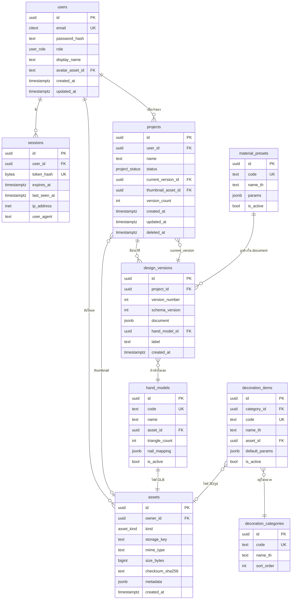
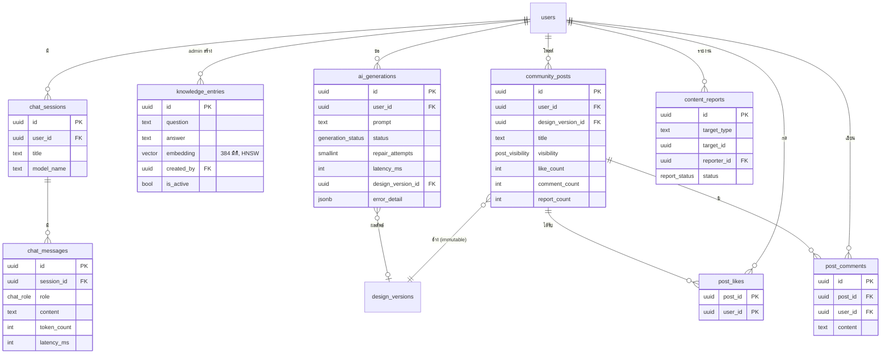
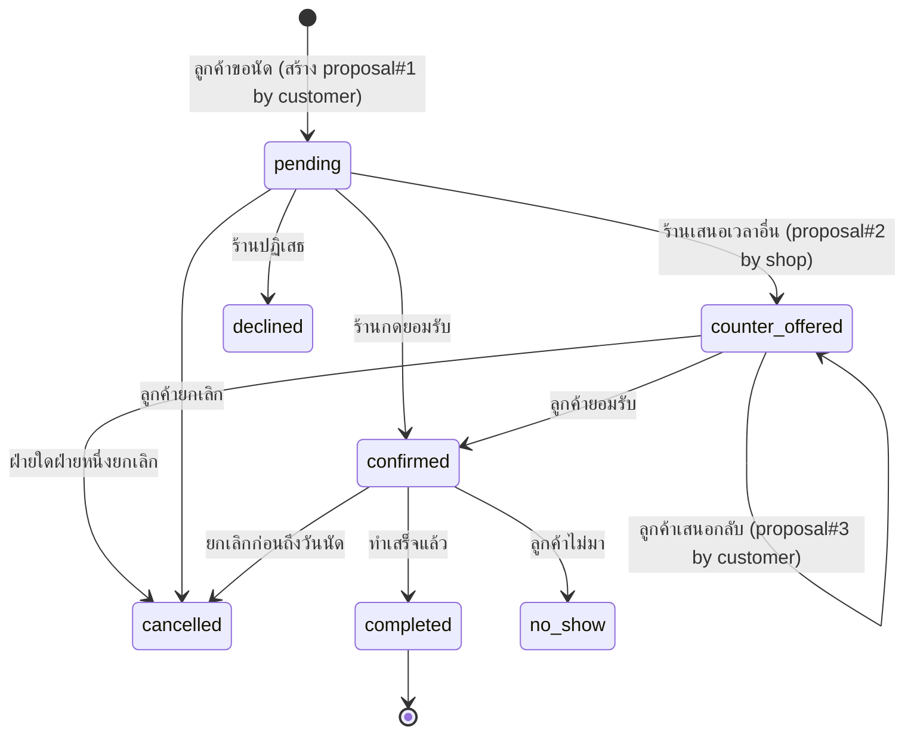

# Database Design — NAIL STUDIO 3D

PostgreSQL 16 + Prisma ORM

เอกสารนี้อธิบายตาราง ความสัมพันธ์ คีย์ ดัชนี การใช้ JSONB และเหตุผลของการ normalize
ทุกดัชนีมีคำอธิบายว่า "query ไหนใช้มัน" — ตามข้อกำหนดโจทย์ที่ห้ามใส่ index แบบมั่ว

---

## 1. หลักการออกแบบ

| หลักการ | การนำไปใช้ |
|---|---|
| **Normalize สิ่งที่ query** | ข้อมูลที่ใช้ค้นหา/กรอง/เรียง/นับ → เป็นคอลัมน์จริง มี type และ index |
| **JSONB เฉพาะสิ่งที่โครงสร้างยืดหยุ่นจริง** | เนื้อหางานออกแบบ (stroke, decoration, พารามิเตอร์วัสดุ) ที่ schema จะวิวัฒน์ตามฟีเจอร์ |
| **ห้ามเก็บไฟล์ไบนารีในฐานข้อมูล** | GLB/texture/thumbnail อยู่ใน object storage เก็บแค่ metadata + key |
| **อย่าสร้างตารางที่ไม่จำเป็น** | "10 เล็บต่องาน" ไม่เป็นตาราง (ดู §4 การตัดสินใจ DB-02) |
| **Soft delete เฉพาะที่ผู้ใช้ต้องกู้คืนได้** | `projects.deleted_at` เท่านั้น ที่เหลือลบจริง |
| **ทุก FK มี ON DELETE ที่ตั้งใจ** | ไม่ปล่อยให้เป็นค่า default โดยไม่คิด |
| **UUID เป็น PK** | ป้องกันการเดา id ของผู้อื่น (IDOR) และรวมข้อมูลข้ามระบบได้ |

---

## 2. ER Diagram



### 2.1 ER Diagram — ระบบย่อย AI + Community

แยกไดอะแกรมเพื่อให้อ่านได้ ทั้งสองส่วนอยู่ในฐานข้อมูลเดียวกันและอ้าง `users` / `design_versions` ตัวเดิม



**รวมทั้งระบบ 17 ตาราง**: หลัก 9 + AI 4 + Community 4

---

## 3. รายละเอียดตาราง

### 3.1 `users`

| คอลัมน์ | ชนิด | ข้อจำกัด | หมายเหตุ |
|---|---|---|---|
| `id` | `uuid` | PK, `gen_random_uuid()` | |
| `email` | `citext` | `UNIQUE NOT NULL` | `citext` = case-insensitive → `A@x.com` และ `a@x.com` เป็นคนเดียวกัน |
| `password_hash` | `text` | `NOT NULL` | Argon2id encoded string (มี salt+params ในตัว) |
| `role` | `user_role` | `NOT NULL DEFAULT 'user'` | enum: `user` \| `shop` \| `admin` (ตามที่ CEPP ออกแบบไว้) |
| `display_name` | `text` | `NOT NULL` | |
| `avatar_asset_id` | `uuid` | FK → `assets.id` `ON DELETE SET NULL` | |
| `email_verified_at` | `timestamptz` | NULL | รองรับการยืนยันอีเมลในอนาคต |
| `created_at` / `updated_at` | `timestamptz` | `NOT NULL DEFAULT now()` | |

**ดัชนี**

| ดัชนี | ใช้กับ query |
|---|---|
| PK `(id)` | `WHERE id = $1` — ทุกการ join |
| `UNIQUE (email)` | `WHERE email = $1` ตอน login/register — **บังคับความไม่ซ้ำด้วย ไม่ใช่แค่เร่งความเร็ว** |

**ไม่ใส่ index ที่**: `role`, `display_name` — ยังไม่มี query ที่กรองด้วยฟิลด์เหล่านี้
(จะเพิ่มเมื่อมีหน้า admin ที่ต้องกรองตาม role จริง)

---

### 3.2 `sessions`

| คอลัมน์ | ชนิด | ข้อจำกัด | หมายเหตุ |
|---|---|---|---|
| `id` | `uuid` | PK | |
| `user_id` | `uuid` | FK → `users.id` `ON DELETE CASCADE` | ลบผู้ใช้ = session หายหมด |
| `token_hash` | `bytea` | `UNIQUE NOT NULL` | **SHA-256 ของ token ดิบ** ไม่เก็บ token เอง |
| `expires_at` | `timestamptz` | `NOT NULL` | |
| `last_seen_at` | `timestamptz` | `NOT NULL DEFAULT now()` | สำหรับ sliding session |
| `ip_address` | `inet` | NULL | สำหรับหน้า "อุปกรณ์ที่เข้าสู่ระบบ" |
| `user_agent` | `text` | NULL | |
| `created_at` | `timestamptz` | `NOT NULL DEFAULT now()` | |

**ดัชนี**

| ดัชนี | ใช้กับ query | ความถี่ |
|---|---|---|
| `UNIQUE (token_hash)` | `WHERE token_hash = $1` — **ทุก authenticated request** | สูงสุดในระบบ |
| `(user_id)` | `WHERE user_id = $1` — logout ทุกอุปกรณ์, แสดงรายการ session | ต่ำ |
| `(expires_at)` | `DELETE WHERE expires_at < now()` — cron เก็บกวาด | 1 ครั้ง/ชั่วโมง |

**ทำไมเก็บ hash ไม่ใช่ token**: ถ้าฐานข้อมูลรั่ว ผู้โจมตีที่ได้ hash ไปไม่สามารถ
สร้าง cookie ที่ผ่านการตรวจได้ (ต้องรู้ค่า preimage) — หลักการเดียวกับรหัสผ่าน
แต่ใช้ SHA-256 ธรรมดาได้เพราะ token เป็นค่าสุ่ม 256-bit ที่ brute-force ไม่ได้อยู่แล้ว
(ไม่ต้องใช้ KDF ที่ช้าเหมือนรหัสผ่านซึ่ง entropy ต่ำ)

---

### 3.3 `projects`

| คอลัมน์ | ชนิด | ข้อจำกัด | หมายเหตุ |
|---|---|---|---|
| `id` | `uuid` | PK | |
| `user_id` | `uuid` | FK → `users.id` `ON DELETE CASCADE` | |
| `name` | `text` | `NOT NULL CHECK (length(name) BETWEEN 1 AND 120)` | |
| `status` | `project_status` | `NOT NULL DEFAULT 'draft'` | enum: `draft` \| `published` \| `archived` |
| `current_version_id` | `uuid` | FK → `design_versions.id` `ON DELETE SET NULL`, **DEFERRABLE** | ชี้เวอร์ชันที่เปิดอยู่ |
| `thumbnail_asset_id` | `uuid` | FK → `assets.id` `ON DELETE SET NULL` | |
| `version_count` | `integer` | `NOT NULL DEFAULT 0` | denormalized (ดูเหตุผลด้านล่าง) |
| `created_at` / `updated_at` | `timestamptz` | `NOT NULL` | |
| `deleted_at` | `timestamptz` | NULL | soft delete |

**ดัชนี**

| ดัชนี | ใช้กับ query |
|---|---|
| PK `(id)` | โหลดโปรเจกต์เดี่ยว |
| `(user_id, updated_at DESC, id DESC) WHERE deleted_at IS NULL` | **query หลักของหน้ารายการงาน** — รองรับทั้งการกรองเจ้าของ การเรียงล่าสุด และ keyset pagination (A-14) ในดัชนีเดียว เป็น **partial index** จึงไม่เก็บแถวที่ถูกลบ (ดัชนีเล็กลงและไม่ต้องกรองซ้ำ) |
| `(user_id, status) WHERE deleted_at IS NULL` | หน้าโปรไฟล์ที่กรองตามสถานะ |

**ลำดับคอลัมน์ในดัชนีสำคัญ**: `(user_id, updated_at DESC, id DESC)` เรียงแบบนี้
เพราะ PostgreSQL ใช้ดัชนี composite ได้เมื่อ predicate ตรงกับ **prefix** ของดัชนี
— `user_id` เป็นตัวกรอง (equality) จึงต้องมาก่อน แล้วตามด้วยคอลัมน์ที่ใช้เรียง
ถ้าสลับเป็น `(updated_at, user_id)` ระบบจะสแกนดัชนีทั้งหมดแล้วกรองทีหลัง

**เหตุผลของ `version_count` (denormalization ที่จงใจ)**

- ปัญหา: หน้ารายการงานแสดง "จำนวนเวอร์ชัน" ต่อการ์ด ถ้าทำ `COUNT(*)` ต่อโปรเจกต์
  จะเกิด **N+1 query** ทันที (20 การ์ด = 21 query)
- ทางเลือกที่พิจารณา: (ก) `LEFT JOIN LATERAL (SELECT count(*) ...)` (ข) subquery
  (ค) denormalize
- เลือก (ค) เพราะ: เขียน 1 ครั้ง (ตอนสร้างเวอร์ชัน) อ่านทุกครั้งที่โหลดรายการ
  → อัตราส่วน อ่าน:เขียน สูงมาก การนับทุกครั้งคือการทำงานซ้ำ
- **ความเสี่ยงและการควบคุม**: ค่าอาจไม่ตรงถ้าเขียนพลาด → บังคับให้การเพิ่มเวอร์ชัน
  และการเพิ่ม counter อยู่ใน **transaction เดียวกัน** และมีเทส integration ยืนยัน

**เหตุผลของ `current_version_id` แบบ DEFERRABLE**: `projects` ชี้ไป `design_versions`
และ `design_versions` ชี้กลับมาที่ `projects` เป็นวงกลม — การสร้างโปรเจกต์พร้อม
เวอร์ชันแรกในทรานแซกชันเดียวจึงต้องเลื่อนการตรวจ FK ไปตอน COMMIT

---

### 3.4 `design_versions`

| คอลัมน์ | ชนิด | ข้อจำกัด | หมายเหตุ |
|---|---|---|---|
| `id` | `uuid` | PK | |
| `project_id` | `uuid` | FK → `projects.id` `ON DELETE CASCADE` | |
| `version_number` | `integer` | `NOT NULL` | เริ่มที่ 1 เพิ่มทีละ 1 |
| `schema_version` | `integer` | `NOT NULL DEFAULT 2` | เวอร์ชันของ **โครงสร้าง** document (สำหรับ migration) |
| `document` | `jsonb` | `NOT NULL` | เนื้องานทั้งหมด (ดู §5) |
| `hand_model_id` | `uuid` | FK → `hand_models.id` `ON DELETE RESTRICT` | โมเดลที่ใช้ประกอบฉากกลับ |
| `label` | `text` | NULL | ชื่อที่ผู้ใช้ตั้งให้เวอร์ชัน เช่น "ก่อนเปลี่ยนสี" |
| `created_at` | `timestamptz` | `NOT NULL DEFAULT now()` | |

**ข้อจำกัดเพิ่ม**

```sql
UNIQUE (project_id, version_number)
CHECK  (version_number > 0)
CHECK  (pg_column_size(document) < 4 * 1024 * 1024)   -- กันเอกสารบวมผิดปกติ
```

**ดัชนี**

| ดัชนี | ใช้กับ query |
|---|---|
| PK `(id)` | โหลดเวอร์ชันเจาะจง |
| `UNIQUE (project_id, version_number DESC)` | รายการเวอร์ชันของโปรเจกต์ + หาเวอร์ชันล่าสุด + **บังคับไม่ให้เลขซ้ำ** (สำคัญกับ optimistic concurrency) |

**ไม่ใส่ GIN index บน `document`** — เหตุผล: ปัจจุบัน**ไม่มี query ใดที่ค้นหา
ภายในเอกสาร** เราอ่านทั้งก้อนด้วย `project_id` เสมอ GIN index บน JSONB ขนาด
หลายร้อย KB จะกินพื้นที่มากและทำให้การเขียนช้าลงโดยไม่ได้ประโยชน์
→ จะเพิ่มก็ต่อเมื่อมีฟีเจอร์ค้นหาจริง เช่น "หางานที่ใช้สี #FF0000"

**ทำไมเวอร์ชันเป็น immutable (ไม่ UPDATE)**: การบันทึกทุกครั้งสร้างแถวใหม่
ทำให้ (1) มีประวัติที่ย้อนดูได้จริง (2) ไม่มี race condition ระหว่างสองแท็บ
(3) ตอบโจทย์ "Create multiple design versions" โดยตรง

**นโยบายจำกัดจำนวนเวอร์ชัน**: เก็บ 50 เวอร์ชันล่าสุดต่อโปรเจกต์
เวอร์ชันเก่ากว่านั้นถูกลบด้วย cron (ยกเว้นเวอร์ชันที่มี `label` ซึ่งผู้ใช้ตั้งใจเก็บ)
→ ป้องกันตารางโตไม่จำกัดจากการกดบันทึกบ่อย ๆ

**Optimistic concurrency**: การบันทึกส่ง `expectedVersion` มาด้วย
ถ้า `version_number` ล่าสุดในฐานข้อมูล ≠ `expectedVersion` → ตอบ `409 CONFLICT`
(ป้องกันสองแท็บเขียนทับกันเงียบ ๆ)

---

### 3.5 `assets`

| คอลัมน์ | ชนิด | ข้อจำกัด | หมายเหตุ |
|---|---|---|---|
| `id` | `uuid` | PK | |
| `owner_id` | `uuid` | FK → `users.id` `ON DELETE CASCADE`, NULL ได้ | NULL = asset ของระบบ (โมเดลมือ, คลังของตกแต่ง) |
| `kind` | `asset_kind` | `NOT NULL` | enum: `hand_model` \| `decoration_model` \| `texture` \| `thumbnail` \| `avatar` |
| `storage_key` | `text` | `UNIQUE NOT NULL` | เช่น `thumbnails/2026/08/<uuid>.webp` — **ไม่ใช่ URL เต็ม** |
| `mime_type` | `text` | `NOT NULL` | ตรวจจาก magic bytes ไม่ใช่จาก header ที่ client ส่งมา |
| `size_bytes` | `bigint` | `NOT NULL CHECK (size_bytes > 0)` | |
| `checksum_sha256` | `bytea` | `NOT NULL` | ตรวจความสมบูรณ์ + dedupe |
| `metadata` | `jsonb` | `NOT NULL DEFAULT '{}'` | width/height/triangle count/duration — แล้วแต่ชนิด |
| `created_at` | `timestamptz` | `NOT NULL DEFAULT now()` | |

**ดัชนี**

| ดัชนี | ใช้กับ query |
|---|---|
| PK `(id)` | ทุกการ join |
| `UNIQUE (storage_key)` | กันเขียนทับไฟล์กันเอง |
| `(owner_id, kind, created_at DESC)` | "ไฟล์ทั้งหมดของผู้ใช้คนนี้ตามชนิด" + งานเก็บกวาด |
| `(checksum_sha256)` | ตรวจว่าไฟล์ซ้ำก่อนอัปโหลด (dedupe) |

**ทำไมเก็บ `storage_key` ไม่ใช่ URL**: URL ผูกกับ provider (localhost vs S3 endpoint
vs CDN domain) ถ้าเก็บ URL เต็ม การย้าย environment ต้องอัปเดตทุกแถว
เก็บ key แล้วให้ `StorageProvider` ประกอบ URL ตอน runtime (สอดคล้อง D-09)

---

### 3.6 `hand_models` (ตาราง catalog)

| คอลัมน์ | ชนิด | หมายเหตุ |
|---|---|---|
| `id` | `uuid` PK | |
| `code` | `text UNIQUE` | เช่น `hand-v2-female-medium` |
| `name` | `text` | ชื่อที่แสดงผู้ใช้ |
| `asset_id` | `uuid` FK → `assets.id` `ON DELETE RESTRICT` | ไฟล์ GLB |
| `triangle_count` | `integer` | สำหรับหน้าเลือกโมเดล/การวัดผล |
| `nail_mapping` | `jsonb` | `{ "right.index": "Nail_index", ... }` — mapping ชื่อ mesh (ปัจจุบันอยู่ในไฟล์ `nails.meta.json`) |
| `is_active` | `boolean` | ซ่อนโมเดลเก่าโดยไม่ต้องลบ (งานเก่ายังอ้างถึงได้) |

**เหตุผลที่มีตารางนี้**: ปัจจุบันชื่อไฟล์ `hand.glb` และ mapping ถูก hardcode ในโค้ด
(`HandModel.tsx:50`, `nails.meta.json`) การย้ายมาไว้ในฐานข้อมูลทำให้ (1) เพิ่มโมเดล
มือแบบใหม่ได้โดยไม่ deploy ใหม่ (2) งานเก่าอ้างโมเดลเวอร์ชันที่ตัวเองสร้างด้วยได้
→ **ถ้าโมเดลเปลี่ยน UV งานเก่าจะไม่เพี้ยน** ซึ่งเป็นความเสี่ยงจริง

`ON DELETE RESTRICT` — ห้ามลบ asset ของโมเดลที่ยังมีงานอ้างถึง

---

### 3.7 `decoration_categories` / `decoration_items` (ตาราง catalog)

ย้ายเนื้อหาจาก `CEPP/.../data/decorationLibrary.js` และ `designLibraries.js` เข้าฐานข้อมูล

**`decoration_categories`**: `id`, `code UNIQUE` (`charms`/`stickers`/`sculpt`/`glitter`),
`name_th`, `sort_order`, `is_active`

**`decoration_items`**: `id`, `category_id` FK `ON DELETE RESTRICT`, `code UNIQUE`,
`name_th`, `asset_id` FK, `default_params jsonb`, `is_active`, `sort_order`

**ดัชนี**: `(category_id, sort_order) WHERE is_active` — query เดียวของหน้าคลังของตกแต่ง

**ทำไมเป็นตาราง ไม่ใช่ไฟล์ JSON ในโค้ด**: (1) เพิ่มของตกแต่งใหม่ = insert แถว
ไม่ใช่ deploy (2) `ON DELETE RESTRICT` ป้องกันการลบของที่งานผู้ใช้อ้างถึงอยู่
(3) รองรับหน้าจัดการฝั่ง admin ในอนาคต

**`default_params jsonb`** — ตัวอย่าง: `{ "scale": 0.12, "emissive": 0.2, "instanced": true }`
พารามิเตอร์ต่างกันตามชนิดของตกแต่ง (คริสตัลมี IOR, สติกเกอร์มี alpha map)
→ เป็นกรณีที่ JSONB เหมาะสมจริง

---

### 3.8 `material_presets` (ตาราง catalog)

`id`, `code UNIQUE` (`glossy`/`matte`/`chrome`/`glitter`), `name_th`, `params jsonb`, `is_active`

`params` เก็บค่าที่ปัจจุบันอยู่ใน `finishes.ts`:
```json
{ "roughness": 0.12, "metalness": 0, "clearcoat": 1,
  "clearcoatRoughness": 0.05, "envMapIntensity": 1, "sparkle": false }
```

**ทำไม JSONB**: พารามิเตอร์ PBR เปลี่ยนตามรุ่นของ Three.js และตามวัสดุ
(chrome ไม่ต้องการ `sheen`, กำมะหยี่ต้องการ) การทำเป็นคอลัมน์จะได้ตารางที่มี
คอลัมน์ NULL เต็มไปหมด — เป็นตัวอย่างชัดเจนของ "โครงสร้างที่ยืดหยุ่นโดยธรรมชาติ"
ตามที่โจทย์อนุญาต

---

### 3.9 ตารางกลุ่ม AI

> Extension ที่ต้องเปิด: `CREATE EXTENSION IF NOT EXISTS vector;` (pgvector)
> ยกมาจาก `AI_CHAT_BOT/SQL.sql` แต่ปรับให้เข้ากับ schema หลัก (UUID, timestamptz, FK ที่ถูกต้อง)

**`chat_sessions`**

| คอลัมน์ | ชนิด | หมายเหตุ |
|---|---|---|
| `id` | `uuid` PK | |
| `user_id` | `uuid` FK → `users.id` `ON DELETE CASCADE` | **NOT NULL** — ปิดช่องโหว่ AD-1 (เดิมไม่มี auth) |
| `title` | `text` | สร้างอัตโนมัติจากข้อความแรก |
| `model_name` | `text NOT NULL` | บันทึกโมเดลที่ใช้ — ผลลัพธ์เปลี่ยนตามโมเดล ต้องรู้ว่าคำตอบนี้มาจากรุ่นไหน |
| `created_at` / `updated_at` | `timestamptz` | |

ดัชนี: `(user_id, updated_at DESC)` — รายการแชตของผู้ใช้

**`chat_messages`**

| คอลัมน์ | ชนิด | หมายเหตุ |
|---|---|---|
| `id` | `uuid` PK | |
| `session_id` | `uuid` FK → `chat_sessions.id` `ON DELETE CASCADE` | |
| `role` | `chat_role` | enum: `user` \| `assistant` \| `system` (ซอร์สเดิมใช้ `varchar` อิสระ) |
| `content` | `text NOT NULL CHECK (length(content) <= 8000)` | |
| `token_count` | `integer` | สำหรับติดตามต้นทุนและวัดผล |
| `latency_ms` | `integer` | สำหรับ benchmark (เฉพาะ role=assistant) |
| `created_at` | `timestamptz` | |

ดัชนี: `(session_id, created_at DESC)` — ดึงประวัติล่าสุด N ข้อความ (query หลัก)

**`knowledge_entries`** (ฐานความรู้ RAG)

| คอลัมน์ | ชนิด | หมายเหตุ |
|---|---|---|
| `id` | `uuid` PK | |
| `question` | `text NOT NULL` | |
| `answer` | `text NOT NULL` | |
| `embedding` | `vector(384)` | จาก sentence-transformers (มิติต้องตรงกับโมเดลที่ใช้) |
| `created_by` | `uuid` FK → `users.id` `ON DELETE SET NULL` | **เฉพาะ role=admin** — ปิดช่องโหว่ AD-2 |
| `is_active` | `boolean DEFAULT true` | |
| `created_at` | `timestamptz` | |

ดัชนี:

| ดัชนี | ใช้กับ query |
|---|---|
| `USING hnsw (embedding vector_cosine_ops) WHERE is_active` | ค้นความรู้ที่ใกล้เคียงที่สุด k อันดับ (ดู `algorithms.md` A-16) |

**`ai_generations`** (บันทึกการสร้างดีไซน์ด้วย AI)

| คอลัมน์ | ชนิด | หมายเหตุ |
|---|---|---|
| `id` | `uuid` PK | |
| `user_id` | `uuid` FK `ON DELETE CASCADE` | |
| `prompt` | `text NOT NULL` | คำขอของผู้ใช้ |
| `model_name` | `text NOT NULL` | |
| `status` | `generation_status` | enum: `succeeded` \| `validation_failed` \| `model_error` \| `timeout` |
| `repair_attempts` | `smallint NOT NULL DEFAULT 0` | จำนวนรอบที่ต้อง repair JSON |
| `latency_ms` | `integer` | |
| `design_version_id` | `uuid` FK → `design_versions.id` `ON DELETE SET NULL` | ผลลัพธ์ (ถ้าสำเร็จ) |
| `error_detail` | `jsonb` | ข้อผิดพลาดจาก validator (สำหรับปรับ prompt) |
| `created_at` | `timestamptz` | |

ดัชนี: `(user_id, created_at DESC)` — ประวัติ + rate limit; `(status, created_at DESC)` — หน้า monitoring

**ทำไมต้องมีตารางนี้**: (1) เป็น **ข้อมูลวัดผลเชิงวิชาการโดยตรง** — อัตราความสำเร็จของ
structured output, จำนวนรอบ repair เฉลี่ย, latency กระจายตัวอย่างไร (2) ใช้ปรับปรุง prompt
จากข้อมูลจริง (3) ใช้ทำ rate limit ระยะยาว (เช่น 50 ครั้ง/วัน)

---

### 3.10 ตารางกลุ่ม Community

**`community_posts`**

| คอลัมน์ | ชนิด | หมายเหตุ |
|---|---|---|
| `id` | `uuid` PK | |
| `user_id` | `uuid` FK → `users.id` `ON DELETE CASCADE` | |
| `design_version_id` | `uuid` FK → `design_versions.id` `ON DELETE RESTRICT` | **immutable** ตาม D-14 |
| `title` | `text NOT NULL CHECK (length BETWEEN 1 AND 120)` | |
| `caption` | `text CHECK (length <= 2000)` | |
| `thumbnail_asset_id` | `uuid` FK → `assets.id` | |
| `visibility` | `post_visibility` | enum: `public` \| `unlisted` \| `hidden` |
| `like_count` | `integer NOT NULL DEFAULT 0` | denormalized |
| `comment_count` | `integer NOT NULL DEFAULT 0` | denormalized |
| `report_count` | `integer NOT NULL DEFAULT 0` | denormalized |
| `created_at` / `updated_at` | `timestamptz` | |
| `deleted_at` | `timestamptz` | soft delete |

ดัชนี:

| ดัชนี | ใช้กับ query |
|---|---|
| `(created_at DESC, id DESC) WHERE visibility='public' AND deleted_at IS NULL` | **ฟีดล่าสุด** — keyset pagination (A-14) |
| `(like_count DESC, created_at DESC, id DESC) WHERE visibility='public' AND deleted_at IS NULL` | ฟีดยอดนิยม |
| `(user_id, created_at DESC)` | โพสต์ของผู้ใช้คนหนึ่ง (หน้าโปรไฟล์) |

**`post_likes`**

| คอลัมน์ | ชนิด |
|---|---|
| `post_id` | `uuid` FK `ON DELETE CASCADE` |
| `user_id` | `uuid` FK `ON DELETE CASCADE` |
| `created_at` | `timestamptz` |

**PK แบบ composite `(post_id, user_id)`** — ไม่มี surrogate id

**ทำไม**: (1) บังคับ "1 คน ไลก์ได้ 1 ครั้ง" ที่ระดับฐานข้อมูล ไม่ใช่ที่แอป
→ ทำให้ endpoint ไลก์เป็น **idempotent** ด้วย `ON CONFLICT DO NOTHING`
(2) ประหยัดพื้นที่และ index หนึ่งชุด
เพิ่มดัชนี `(user_id, created_at DESC)` สำหรับ "โพสต์ที่ฉันไลก์"

**`post_comments`**: `id`, `post_id` FK `CASCADE`, `user_id` FK `CASCADE`,
`content text CHECK (length BETWEEN 1 AND 1000)`, `created_at`, `deleted_at`
→ ดัชนี `(post_id, created_at DESC) WHERE deleted_at IS NULL`

**`content_reports`**: `id`, `target_type` (`post`\|`comment`), `target_id`, `reporter_id` FK,
`reason` enum, `detail text`, `status` (`pending`\|`reviewed`\|`dismissed`), `created_at`
→ `UNIQUE (target_type, target_id, reporter_id)` — คนเดียวรายงานซ้ำไม่ได้
→ ดัชนี `(status, created_at) WHERE status='pending'` — คิวของ moderator

**เกณฑ์ซ่อนอัตโนมัติ**: `report_count >= 5` → ตั้ง `visibility='hidden'` รอ moderator ตรวจ
(ปิดความเสี่ยง R-14 โดยไม่ต้องมี moderator ออนไลน์ตลอดเวลา)

**เหตุผลของ counter แบบ denormalized ทั้ง 3 ตัว**: เหมือน `version_count` (§3.3) —
ฟีดแสดงจำนวนไลก์/คอมเมนต์ทุกการ์ด ถ้า `COUNT(*)` ต่อโพสต์จะเป็น N+1 ทันที
อัปเดตใน transaction เดียวกับการ insert/delete เสมอ + มี job ตรวจความสอดคล้องรายวัน

---

### 3.11 ตารางกลุ่มร้าน / นัดหมาย / รีวิว

> ขอบเขตยืนยันโดยผู้ใช้ 2026-08-12: ร้านมี **นัดหมาย** และ **รีวิว**
> นัดหมาย **ไม่ล็อกเวลาล่วงหน้า** — ลูกค้าขอเวลา ร้านกดยอมรับเอง และ**เสนอเวลาอื่นกลับได้**ถ้าไม่ว่าง

**`shop_profiles`** — ข้อมูลร้าน (ขยายจาก `users` ที่ `role='shop'`)

| คอลัมน์ | ชนิด | หมายเหตุ |
|---|---|---|
| `user_id` | `uuid` **PK + FK** → `users.id` `ON DELETE CASCADE` | PK = FK (1:1) |
| `shop_name` | `text NOT NULL` | |
| `description` | `text` | |
| `location_text` | `text` | ที่อยู่แบบข้อความ (จาก CEPP `signupData.location`) |
| `phone_numbers` | `text[]` | CEPP รองรับหลายเบอร์อยู่แล้ว |
| `opening_hours` | `jsonb` | โครงสร้างยืดหยุ่นจริง (บางร้านปิดบางวัน, มีพักกลางวัน) |
| `is_verified` | `boolean DEFAULT false` | |
| `rating_avg` | `numeric(3,2) NOT NULL DEFAULT 0` | denormalized |
| `rating_count` | `integer NOT NULL DEFAULT 0` | denormalized |

**ทำไมเป็นตารางแยก ไม่ใช่คอลัมน์ใน `users`**: ถ้ารวม ผู้ใช้ทั่วไป (ซึ่งเป็นคนส่วนใหญ่)
จะมีคอลัมน์ NULL 8 ตัวติดตัวทุกแถว — เป็น normalization ที่ถูกต้อง (1:1 optional)
และทำให้ query หน้าค้นหาร้านไม่ต้องแตะตาราง `users` ที่ใหญ่กว่า

ดัชนี: `(rating_avg DESC, rating_count DESC) WHERE is_verified` — รายการร้านแนะนำ

**`shop_services`** — บริการที่ร้านเปิดรับ

`id`, `shop_id` FK `CASCADE`, `name`, `description`, `price_thb numeric(10,2)`,
`duration_minutes int`, `is_active bool`, `sort_order`
→ ดัชนี `(shop_id, sort_order) WHERE is_active`

**`appointments`** — การนัดหมาย

| คอลัมน์ | ชนิด | หมายเหตุ |
|---|---|---|
| `id` | `uuid` PK | |
| `customer_id` | `uuid` FK → `users.id` `ON DELETE CASCADE` | |
| `shop_id` | `uuid` FK → `shop_profiles.user_id` `ON DELETE CASCADE` | |
| `service_id` | `uuid` FK → `shop_services.id` `ON DELETE SET NULL` | |
| `design_version_id` | `uuid` FK → `design_versions.id` `ON DELETE SET NULL` | **ดีไซน์ที่ลูกค้าอยากทำ** — จุดเชื่อมระหว่าง studio กับร้าน |
| `status` | `appointment_status` | ดูเครื่องสถานะด้านล่าง |
| `agreed_start_at` | `timestamptz` | **NULL จนกว่าทั้งสองฝ่ายจะตกลงกัน** |
| `duration_minutes` | `integer` | |
| `price_quoted_thb` | `numeric(10,2)` | ราคาที่ตกลง (อาจต่างจากราคา service) |
| `customer_note` | `text CHECK (length <= 1000)` | |
| `shop_note` | `text CHECK (length <= 1000)` | |
| `created_at` / `updated_at` | `timestamptz` | |

**`appointment_proposals`** — ข้อเสนอเวลา (หัวใจของการต่อรอง)

| คอลัมน์ | ชนิด | หมายเหตุ |
|---|---|---|
| `id` | `uuid` PK | |
| `appointment_id` | `uuid` FK `ON DELETE CASCADE` | |
| `proposed_by` | `proposal_actor` | enum: `customer` \| `shop` |
| `proposed_start_at` | `timestamptz NOT NULL` | |
| `duration_minutes` | `integer NOT NULL` | |
| `message` | `text CHECK (length <= 500)` | เช่น "วันนั้นเต็มค่ะ ขอเลื่อนเป็นบ่ายสามได้ไหมคะ" |
| `status` | `proposal_status` | enum: `pending` \| `accepted` \| `rejected` \| `superseded` |
| `created_at` | `timestamptz` | |

ดัชนี: `(appointment_id, created_at DESC)` — ไทม์ไลน์การต่อรอง;
`(appointment_id) WHERE status='pending'` + `UNIQUE` — **บังคับว่ามีข้อเสนอที่ค้างอยู่ได้ครั้งละ 1 รายการเท่านั้น**

**เครื่องสถานะของการนัดหมาย**



**DECISION DB-06 — เก็บ "ข้อเสนอ" เป็นแถว ไม่ใช่แค่เขียนทับเวลาในนัดหมาย**

| หัวข้อ | รายละเอียด |
|---|---|
| **อะไร** | ทุกครั้งที่มีการเสนอเวลา สร้างแถวใหม่ใน `appointment_proposals` ส่วน `appointments.agreed_start_at` จะถูกเติมก็ต่อเมื่อมีข้อเสนอถูก `accepted` |
| **ทำไม** | (1) ผู้ใช้ต้องเห็น **ประวัติการต่อรอง** ("ร้านเสนอมาบ่ายสาม เราเสนอกลับห้าโมง") ไม่ใช่แค่เวลาสุดท้าย (2) เป็นหลักฐานเมื่อมีข้อพิพาท (3) เป็นข้อมูลวิเคราะห์ได้ — ร้านไหนต่อรองกี่รอบเฉลี่ย |
| **ทางเลือก** | (ก) เก็บ `proposed_start_at` เป็นคอลัมน์เดียวใน `appointments` แล้วเขียนทับ (ข) เก็บประวัติเป็น JSONB array |
| **ทำไมไม่เลือก** | (ก) เสียประวัติทั้งหมด และเกิด race ถ้าสองฝ่ายเสนอพร้อมกัน (ข) ไม่มี constraint บังคับ "ค้างได้ครั้งละ 1" และ query "ข้อเสนอที่รอฉันตอบ" ต้องสแกน |
| **ผล** | เพิ่ม 1 ตาราง แต่ได้ audit trail + constraint ระดับฐานข้อมูล |

**DECISION DB-07 — ไม่มีตาราง `availability_slots` / ปฏิทินร้าน**

- **ทำไม**: ผู้ใช้ระบุชัดว่า **"นัดหมายไม่ต้องล็อกเวลา ให้ร้านกดยอมรับเอง"**
  → ระบบไม่ต้องรู้ว่าร้านว่างเมื่อไร ไม่ต้องมี slot ไม่ต้องมี recurrence rule
  ไม่ต้องจัดการ timezone ของ business hours ไม่ต้องกันการจองซ้อน
- **สิ่งที่ประหยัดไป**: ตาราง slot + ตาราง blackout + อัลกอริทึมหาช่องว่าง (interval tree)
  + ปัญหา double-booking ที่ต้องใช้ `EXCLUDE USING gist` — **งานหลายวันที่ไม่ต้องทำ**
- **สิ่งที่แลก**: ร้านอาจรับนัดซ้อนกันเองโดยระบบไม่เตือน
  → ชดเชยด้วยการ**แสดงนัดที่ยืนยันแล้วในวันเดียวกันให้ร้านเห็น**ตอนกดยอมรับ (งาน UI ไม่ใช่งาน DB)
- **บันทึกไว้**: ถ้าอนาคตต้องการปฏิทินจริง เพิ่ม `availability_rules` ได้โดยไม่กระทบตารางที่มีอยู่

**`shop_reviews`**

| คอลัมน์ | ชนิด | หมายเหตุ |
|---|---|---|
| `id` | `uuid` PK | |
| `appointment_id` | `uuid` FK `ON DELETE CASCADE` **UNIQUE** | **1 นัด = 1 รีวิว** |
| `shop_id` | `uuid` FK `ON DELETE CASCADE` | denormalized จาก appointment เพื่อ query ตรง |
| `author_id` | `uuid` FK `ON DELETE CASCADE` | |
| `rating` | `smallint NOT NULL CHECK (rating BETWEEN 1 AND 5)` | |
| `comment` | `text CHECK (length <= 2000)` | |
| `shop_reply` | `text CHECK (length <= 2000)` | ร้านตอบกลับได้ |
| `created_at` / `deleted_at` | `timestamptz` | |

ดัชนี: `(shop_id, created_at DESC) WHERE deleted_at IS NULL` — รายการรีวิวของร้าน;
`(shop_id, rating) WHERE deleted_at IS NULL` — ตัวกรองตามดาว (CEPP มี `RatingFilterDropdown` อยู่แล้ว)

**DECISION DB-08 — รีวิวได้เฉพาะจากนัดหมายที่ `completed`**

- **อะไร**: `appointment_id` เป็น `UNIQUE NOT NULL` และ service layer ตรวจว่า
  `appointments.status = 'completed'` และ `author_id = appointments.customer_id`
- **ทำไม**: กันรีวิวปลอม/รีวิวถล่ม (review bombing) ซึ่งเป็นปัญหาจริงของทุกแพลตฟอร์ม
  ที่เปิดให้รีวิวอิสระ — คนที่ไม่เคยใช้บริการรีวิวไม่ได้เลยโดยโครงสร้าง ไม่ใช่โดยกฎในโค้ด
- **ทางเลือก**: ให้ใครก็รีวิวได้ / รีวิวได้หลายครั้งต่อร้าน
- **ทำไมไม่เลือก**: เปิดช่องให้บัญชีปลอมทำลายคะแนนร้าน และทำให้ `rating_avg` ไร้ความหมาย
- **ผล**: `rating_avg`/`rating_count` ใน `shop_profiles` อัปเดตใน transaction เดียวกับการ insert/ลบรีวิว

---

### 3.12 ตารางกลุ่ม Nail Template (แทน `community_posts`)

> **เปลี่ยนแปลงจากร่างก่อนหน้า**: ยุบ `community_posts` รวมเข้าเป็น **`nail_templates`** ตัวเดียว
> เหตุผล: ทั้งสองคือสิ่งเดียวกัน — "ดีไซน์ที่ถูกแชร์ออกไปพร้อมตัวเลขการมีส่วนร่วม"
> การมีสองตารางคือการทำ **ตารางที่ไม่จำเป็น** ซึ่งโจทย์ห้ามไว้

| คอลัมน์ | ชนิด | หมายเหตุ |
|---|---|---|
| `id` | `uuid` PK | |
| `author_id` | `uuid` FK → `users.id` `ON DELETE CASCADE` | |
| `design_version_id` | `uuid` FK → `design_versions.id` `ON DELETE RESTRICT` | **immutable** (D-14) |
| `name` | `text NOT NULL CHECK (length BETWEEN 1 AND 120)` | |
| `caption` | `text CHECK (length <= 2000)` | |
| `category` | `text` | #Tag บนการ์ด (Minimalistic / Modern / Festive / Geometric / Luxury) |
| `primary_color` | `text` | ตัวกรองสี (Red / Pink / Nude / Black / White) |
| `origin` | `template_origin` | enum: `original` \| `ai` \| `remix` — **ตรงกับ badge ของ `DesignCard.jsx`** |
| `source_template_id` | `uuid` FK → `nail_templates.id` `ON DELETE SET NULL` | ต้นทางถ้าเป็น remix (self-reference) |
| `thumbnail_asset_id` | `uuid` FK → `assets.id` | |
| `visibility` | `template_visibility` | enum: `public` \| `unlisted` \| `hidden` |
| **`like_count`** | `integer NOT NULL DEFAULT 0` | ❤️ **ตัวเลขที่ 1** |
| **`share_count`** | `integer NOT NULL DEFAULT 0` | ↗ **ตัวเลขที่ 2** |
| **`remix_count`** | `integer NOT NULL DEFAULT 0` | 🔁 **ตัวเลขที่ 3** — จำนวนคนที่เอาไปแก้ต่อ |
| `view_count` | `integer NOT NULL DEFAULT 0` | ไม่แสดงบนการ์ด แต่ใช้จัดอันดับ trending |
| `comment_count` / `report_count` | `integer NOT NULL DEFAULT 0` | |
| `created_at` / `updated_at` / `deleted_at` | `timestamptz` | |

**ตัวเลขทั้งสามบนการ์ด** — อ้างอิงจาก `RecommendationCard.jsx:28-41` ที่มี `likes / edits / shares`
อยู่แล้ว โดย `edits` = จำนวนการนำไปแก้ต่อ ซึ่งตรงกับ badge `"copy"` ใน `DesignCard.jsx`
→ ตั้งชื่อใหม่เป็น `remix_count` เพื่อให้ความหมายชัด (คำว่า "edit" กำกวมกับ "เจ้าของแก้เอง")

ดัชนี:

| ดัชนี | ใช้กับ query |
|---|---|
| `(created_at DESC, id DESC) WHERE visibility='public' AND deleted_at IS NULL` | ฟีดล่าสุด (keyset) |
| `(like_count DESC, created_at DESC, id DESC) WHERE visibility='public' AND deleted_at IS NULL` | **Trending / Popular** |
| `(category, primary_color, created_at DESC) WHERE visibility='public' AND deleted_at IS NULL` | ตัวกรองหน้า AI Recommend (Style + Color dropdown ที่ CEPP มีอยู่) |
| `(author_id, created_at DESC)` | ผลงานของผู้ใช้คนหนึ่ง |
| `(source_template_id)` | "ผลงานที่ต่อยอดจากดีไซน์นี้" |

**ตารางกิจกรรม 3 ตัว** (แหล่งความจริงของ counter ทั้งสาม)

| ตาราง | PK | หมายเหตุ |
|---|---|---|
| `template_likes` | **composite `(template_id, user_id)`** | บังคับ 1 คน 1 ไลก์ที่ระดับ DB → endpoint เป็น idempotent ด้วย `ON CONFLICT DO NOTHING` |
| `template_shares` | `id uuid` | `template_id`, `user_id` (NULL ได้ = ผู้ไม่ล็อกอิน), `channel` enum (`link`\|`facebook`\|`line`\|`instagram`\|`copy`), `created_at` |
| `template_remixes` | `id uuid` | `template_id`, `user_id`, `project_id` (โปรเจกต์ที่เกิดขึ้น), `created_at` — `UNIQUE (template_id, project_id)` |

**ทำไม share ต้องเป็นตาราง ไม่ใช่แค่ `UPDATE ... SET share_count = share_count + 1`**

- ต้องรู้ว่าแชร์ไปช่องทางไหนมากที่สุด (ข้อมูลเชิงธุรกิจ + ข้อมูลวิเคราะห์สำหรับโครงงาน)
- ป้องกันการปั่นตัวเลข: rate limit ต่อ (user, template) ได้เพราะมีแถวให้ตรวจ
- **ข้อแลกเปลี่ยนที่ยอมรับ**: ผู้ไม่ล็อกอินแชร์ได้โดยไม่มี `user_id` → กันการปั่นด้วย
  rate limit ระดับ IP แทน (ไม่สมบูรณ์แบบ แต่ตัวเลข share ไม่ใช่ข้อมูลสำคัญระดับที่ต้องกันสุดทาง)

**`template_comments`** และ **`content_reports`** — เหมือนที่ระบุใน §3.10 เดิม
เปลี่ยนแค่ `post_id` → `template_id`

---

### 3.12B ตารางกลุ่มคลังดีไซน์ (รองรับ AI generation)

> เพิ่มตามการออกแบบ AI ใหม่ (architecture.md D-22) — **ความสวยของผลลัพธ์มาจากคลังเหล่านี้
> ไม่ใช่จากโมเดล** ดังนั้นตารางกลุ่มนี้คือหัวใจของคุณภาพ ไม่ใช่ข้อมูลประกอบ

**`color_palettes`** — พาเลทดีไซน์ (คนละเรื่องกับคลังสีของแบรนด์)

| คอลัมน์ | ชนิด | หมายเหตุ |
|---|---|---|
| `id` | `uuid` PK | |
| `code` | `text UNIQUE` | เช่น `pal-nude-rose` |
| `name_th` | `text` | |
| `colors` | `jsonb` | `[{role:"base",hex:"#e0a884"},{role:"accent",hex:"#b3122e"},{role:"detail",hex:"#d4af37"}]` |
| `harmony` | `palette_harmony` | enum: `analogous` \| `complementary` \| `triadic` \| `monochrome` |
| `source` | `palette_source` | enum: `curated` \| `extracted` — extracted = ถอดจาก template ที่ยอดไลก์สูง |
| `popularity` | `integer NOT NULL DEFAULT 0` | ใช้ถ่วงน้ำหนักการสุ่มเลือก |
| `is_active` | `boolean` | |

**ทำไมต้องแยกจากคลังสีของแบรนด์**: `presetPalettes.js` เดิมเก็บ **สีที่แบรนด์มีขาย**
(GELISH 8 สี, VERY GOOD NAIL 12 สี, SANSU 5 สี) ซึ่งตอบคำถาม *"ร้านมีสีอะไรบ้าง"*
แต่ไม่ได้ตอบ *"สีชุดไหนใช้ด้วยกันแล้วสวย"* — สองอย่างนี้เป็นข้อมูลคนละชนิด
ระบบสร้างดีไซน์ต้องการอย่างหลัง ส่วนหน้าจอเลือกสีต้องการอย่างแรก → **ต้องมีทั้งคู่**

`brand_colors` เก็บสีของแบรนด์ (id, brand, name, hex, is_available) แยกต่างหาก
โดย `color_palettes.colors[].hex` อ้างอิงสีที่มีจริงในคลังแบรนด์ได้ (ตรวจตอน seed)

**`design_archetypes`** — แม่แบบการจัดวาง

| คอลัมน์ | ชนิด | หมายเหตุ |
|---|---|---|
| `id` | `uuid` PK | |
| `code` | `text UNIQUE` | `french-tip`, `ombre`, `accent-nail`, `negative-space`, `marble`, `geometric`, `glitter-gradient` |
| `name_th` | `text` | |
| `composer_key` | `text NOT NULL` | คีย์ที่ map ไปยัง **ฟังก์ชัน TypeScript** ใน `3d/generation/archetypes/` |
| `default_params` | `jsonb` | พารามิเตอร์ตั้งต้นของ generator ตัวนั้น |
| `supported_zones` | `text[]` | โซนที่ archetype นี้ยอมให้วางของตกแต่ง |
| `popularity` | `integer` | |
| `is_active` | `boolean` | |

**ข้อสำคัญ**: `composer_key` ชี้ไปที่**โค้ด** ไม่ใช่ข้อมูล — ฐานข้อมูลไม่ได้เก็บวิธีวาด
แต่เก็บว่า "มี archetype อะไรให้เลือกบ้าง" ส่วนวิธีวาดอยู่ในโค้ดที่ทดสอบได้
ถ้าเก็บสูตรวาดเป็น JSONB จะกลายเป็นภาษาโปรแกรมในฐานข้อมูล ซึ่งทดสอบและ debug ไม่ได้

**การเพิ่มคอลัมน์ใน `nail_templates`**

| คอลัมน์ | ชนิด | หมายเหตุ |
|---|---|---|
| `recipe` | `jsonb` | ใบสั่ง 8 ฟิลด์ที่ประกอบ template นี้ (NULL ถ้าผู้ใช้วาดเองทั้งหมด) |
| `embedding` | `vector(384)` | สำหรับค้น template ที่ใกล้เคียงคำขอ (few-shot + แนะนำ) |

ดัชนี: `USING hnsw (embedding vector_cosine_ops) WHERE visibility='public' AND deleted_at IS NULL`

**`recipe` มีไว้ทำอะไร**: (1) ใช้เป็น few-shot ตอน generate (2) ถอดออกมาเป็น archetype/palette
ใหม่เมื่อ template นั้นได้รับความนิยม (3) ให้ผู้ใช้ "ขอแบบนี้แต่เปลี่ยนสี" ได้โดยแก้แค่ `paletteId`

**การเพิ่มคอลัมน์ใน `chat_messages`** (สำหรับการประเมินผล)

| คอลัมน์ | ชนิด | หมายเหตุ |
|---|---|---|
| `intent` | `chat_intent` | เจตนาที่ router ตัดสิน (A-19) |
| `intent_confidence` | `real` | คะแนนความเชื่อมั่น — ใช้หา threshold ที่เหมาะสมจากข้อมูลจริง |
| `retrieved_ids` | `jsonb` | id ของเอกสารที่ถูกดึงมา — **ตรวจย้อนหลังได้ว่าคำตอบมาจากไหน** |
| `grounded` | `boolean` | คำตอบอ้างอิงแหล่งได้หรือไม่ |
| `proposed_command` | `jsonb` | Command ที่เสนอ (D-21) — NULL ถ้าไม่ได้เสนอ |
| `command_accepted` | `boolean` | ผู้ใช้กดยืนยันหรือไม่ — **วัดได้ว่า AI เสนอถูกใจแค่ไหน** |

**การเพิ่มใน `knowledge_entries`** (สำหรับ hybrid retrieval — D-19)

| คอลัมน์ | ชนิด | หมายเหตุ |
|---|---|---|
| `content_tokens` | `text` | ข้อความที่ **ตัดคำภาษาไทยด้วย PyThaiNLP แล้ว** คั่นด้วยช่องว่าง |
| `content_tsv` | `tsvector GENERATED ALWAYS AS (to_tsvector('simple', content_tokens)) STORED` | |

ดัชนี: `USING gin (content_tsv)` — lexical search

**ทำไมใช้ `'simple'` ไม่ใช่ `'thai'`**: PostgreSQL ไม่มี text search configuration
สำหรับภาษาไทย และภาษาไทยไม่มีช่องว่างระหว่างคำ จึงต้องตัดคำที่ชั้นแอปก่อน
แล้วให้ PostgreSQL มองข้อความที่ตัดแล้วเป็นคำที่คั่นด้วยช่องว่างธรรมดา
**ข้อบังคับ**: ต้องตัดคำด้วยตัวเดียวกันทั้งตอน index และตอน query — ถ้าใช้คนละตัว
หรือคนละเวอร์ชันของ dictionary จะไม่มีทางแมตช์กันเลย (บันทึกเวอร์ชันไว้ใน migration)

---

### 3.13 ตารางกลุ่ม VR Preview

> ขอบเขตยืนยันโดยผู้ใช้ 2026-08-12: **หน้า `/vr-preview` ต้องทำ**

**`vr_share_tokens`**

| คอลัมน์ | ชนิด | หมายเหตุ |
|---|---|---|
| `id` | `uuid` PK | |
| `design_version_id` | `uuid` FK → `design_versions.id` `ON DELETE CASCADE` | ดีไซน์ที่จะดูใน VR |
| `created_by` | `uuid` FK → `users.id` `ON DELETE CASCADE` | |
| `token_hash` | `bytea UNIQUE NOT NULL` | SHA-256 (หลักการเดียวกับ `sessions`) |
| `expires_at` | `timestamptz NOT NULL` | อายุสั้น (ค่าเริ่มต้น 15 นาที) |
| `max_uses` | `smallint NOT NULL DEFAULT 5` | |
| `use_count` | `smallint NOT NULL DEFAULT 0` | |
| `created_at` | `timestamptz` | |

ดัชนี: `UNIQUE (token_hash)`; `(expires_at)` สำหรับ cron เก็บกวาด

**DECISION DB-09 — VR เข้าถึงด้วย token ชั่วคราว ไม่ใช่ session ปกติ**

| หัวข้อ | รายละเอียด |
|---|---|
| **ปัญหา** | การพิมพ์อีเมล/รหัสผ่านบนแว่น VR (Meta Quest) ด้วยคีย์บอร์ดลอยเป็นประสบการณ์ที่แย่มาก และผู้ใช้มักไม่อยากล็อกอินบัญชีจริงบนอุปกรณ์ที่ใช้ร่วมกัน |
| **อะไร** | ผู้ใช้กด "ดูใน VR" บนคอม → ระบบสร้าง token อายุ 15 นาที → แสดงเป็น **QR code + ลิงก์สั้น** → เปิดบนแว่นแล้วดูได้ทันทีโดยไม่ต้องล็อกอิน |
| **ทำไมปลอดภัย** | token อายุสั้น, จำกัดจำนวนครั้งใช้, ผูกกับ **design version เดียว** (ไม่ใช่ทั้งบัญชี), เป็น **read-only** — แก้ไข/ลบ/ดูงานอื่นไม่ได้เลย, เก็บเป็น hash |
| **ทางเลือก** | (ก) ล็อกอินปกติบนแว่น (ข) เปิดสาธารณะทุกดีไซน์ (ค) device code flow แบบ OAuth |
| **ทำไมไม่เลือก** | (ก) UX แย่มาก (ข) ทำให้งานส่วนตัวรั่ว (ค) ถูกต้องที่สุดแต่ซับซ้อนเกินขนาดโครงงาน — token ชั่วคราวให้ความปลอดภัยที่เพียงพอสำหรับ **การดูอย่างเดียว** |
| **ผล** | ไม่ต้องมีระบบ auth แยกสำหรับ VR และ scope ของความเสียหายถ้า token รั่ว = ดีไซน์ 1 ชิ้น เป็นเวลา 15 นาที |

**หมายเหตุ**: ดีไซน์ที่เป็น `nail_templates.visibility = 'public'` เปิดดูใน VR ได้โดยไม่ต้องมี token
(เพราะเป็นสาธารณะอยู่แล้ว) — token มีไว้สำหรับ **งานส่วนตัวของผู้ใช้** เท่านั้น

---

## 4. การตัดสินใจเชิงออกแบบ

### DB-01 — `document` เป็น JSONB ไม่ใช่ตารางย่อย

| หัวข้อ | รายละเอียด |
|---|---|
| **อะไร** | เนื้องานออกแบบทั้งหมด (เล็บ 10 นิ้ว, เลเยอร์, stroke, ของตกแต่ง) เก็บเป็น `jsonb` ก้อนเดียว |
| **ทำไม** | (1) **รูปแบบการเข้าถึงเป็นแบบทั้งก้อนเสมอ** — เปิด editor = โหลดทุกเล็บ, บันทึก = เขียนทุกเล็บ ไม่มี use case ที่โหลดเล็บเดียว (2) ถ้า normalize ทั้งหมด: 1 งาน = 1 project + 1 version + 10 nails + ~60 layers + ~2,000 strokes + ~10,000 points = **หมื่นกว่าแถวต่อการบันทึกหนึ่งครั้ง** ซึ่งช้ากว่ามหาศาลและไม่ได้ประโยชน์ใด ๆ (3) โครงสร้าง stroke/decoration จะวิวัฒน์ตามฟีเจอร์ — การใช้ JSONB + `schema_version` ทำให้ migrate ในโค้ดได้โดยไม่ต้อง ALTER TABLE |
| **ทางเลือก** | (ก) normalize เต็มรูป (ตาราง nails/layers/strokes/points) (ข) เก็บเป็น `text` (ค) เก็บเป็น `bytea` บีบอัด |
| **ทำไมไม่เลือก** | (ก) insert หมื่นแถวต่อการกดบันทึก 1 ครั้ง + join 5 ชั้นเพื่ออ่าน — ไม่มีประโยชน์ใดชดเชยได้ (ข) เสียการตรวจ JSON ระดับฐานข้อมูล เสียตัวดำเนินการ `->` `@>` และ index ในอนาคต (ค) query/debug ไม่ได้เลย แลกกับพื้นที่ที่ TOAST บีบให้อยู่แล้ว |
| **สิ่งที่แลกไป** | ค้นหา "งานที่ใช้สีแดง" ต้องสแกน (ยังไม่มีฟีเจอร์นี้) และ **ฐานข้อมูลไม่บังคับความถูกต้องของเนื้อใน** → ชดเชยด้วย **Zod validation ที่ service layer ก่อนเขียนทุกครั้ง** (บังคับ) |
| **หมายเหตุ TOAST** | PostgreSQL บีบอัดและย้ายค่าที่ใหญ่กว่า ~2 KB ไป TOAST table อัตโนมัติ → แถว `design_versions` ยังเล็กและสแกนเร็ว ส่วน document ถูกอ่านเฉพาะตอนที่ SELECT คอลัมน์นั้นจริง |

### DB-02 — ไม่มีตาราง `nails`

- **อะไร**: เล็บ 10 นิ้วอยู่ใน `document` ไม่ใช่ตาราง
- **ทำไม**: จำนวนคงที่เสมอ (10), ไม่มี query ที่ค้นหา/กรอง/นับเล็บข้ามโปรเจกต์,
  ไม่มีข้อมูลใดของเล็บที่ต้อง join กับตารางอื่น → ตารางนี้จะเป็น "ตารางที่มีแต่
  FK และ JSONB" ซึ่งไม่ให้ประโยชน์ใดนอกจากทำให้การอ่าน/เขียนช้าลง 10 เท่า
- **โจทย์ระบุชัดว่า "Do not create unnecessary tables"** — นี่คือกรณีนั้นตรง ๆ
- **จะเปลี่ยนเมื่อไร**: ถ้ามีฟีเจอร์ "แชร์ดีไซน์เล็บเดี่ยวไปยัง community" หรือ
  "ค้นหาเล็บตามสี" เมื่อนั้นค่อยเพิ่มตาราง `shared_nail_designs` แยกต่างหาก

### DB-03 — Soft delete เฉพาะ `projects`

- **ทำไม**: ผู้ใช้ลบงานพลาดเป็นเหตุการณ์ที่เกิดจริงและกู้คืนได้มีค่า
  ส่วน session/asset/catalog ไม่มีเหตุผลให้กู้คืน
- **ผลข้างเคียงที่ต้องระวัง**: ทุก query ต้องมี `WHERE deleted_at IS NULL`
  → ป้องกันด้วยการ**บังคับให้ทุก query ผ่าน repository layer** ที่ใส่เงื่อนไขนี้ให้
  และใช้ partial index ที่ตรงกับเงื่อนไข (ทำให้ลืมไม่ได้ เพราะจะช้าอย่างเห็นได้ชัด)
- **cron**: ลบจริงหลัง 30 วัน

### DB-04 — UUID v4 เป็น PK (ไม่ใช่ bigserial)

| | |
|---|---|
| **ทำไม** | (1) id ปรากฏใน URL (`/editor/:projectId`) — serial ทำให้เดา id ของคนอื่นได้ (IDOR) และรู้จำนวนผู้ใช้ทั้งระบบ (2) client สร้าง id ได้ก่อนส่ง (optimistic UI) (3) รวมข้อมูลข้าม environment ได้ |
| **ทางเลือก** | `bigserial`, UUID v7, ULID |
| **ทำไมไม่เลือก** | serial — ปัญหาความปลอดภัยข้างต้น; **UUID v7 น่าสนใจกว่า v4** เพราะเรียงตามเวลา ทำให้ B-tree insert ไม่กระจายทั่ว index (ลด page split) → **บันทึกไว้เป็นการปรับปรุงที่ควรวัดใน Phase 14** ยังไม่ใช้ตอนนี้เพราะ `gen_random_uuid()` มีมาให้ในตัว ส่วน v7 ต้องเพิ่ม extension หรือสร้างฝั่งแอป |
| **ต้นทุนที่ยอมรับ** | 16 bytes vs 8 bytes ต่อคีย์ และ index ใหญ่กว่า — ที่ขนาดข้อมูลของระบบนี้ไม่มีนัยสำคัญ |

### DB-05 — ป้องกัน N+1 query

| จุดเสี่ยง | วิธีป้องกัน |
|---|---|
| รายการโปรเจกต์ + จำนวนเวอร์ชัน | คอลัมน์ `version_count` (denormalized) |
| รายการโปรเจกต์ + thumbnail | `include: { thumbnail: true }` ของ Prisma → 1 JOIN |
| รายการของตกแต่ง + หมวด | โหลด catalog ทั้งชุดครั้งเดียวแล้ว cache ใน TanStack Query (`staleTime: Infinity`) |
| รายการเวอร์ชัน + ขนาด document | `SELECT id, version_number, label, created_at, pg_column_size(document)` — **ไม่ SELECT `document`** ในหน้ารายการ |

**กฎบังคับ**: ห้ามเรียก repository ภายในลูป — มีเทส integration ที่นับจำนวน query
ด้วย Prisma middleware และ fail ถ้าเกินเพดานที่กำหนดต่อ endpoint

---

## 5. โครงสร้าง `document` (JSONB)

ดู `packages/contracts/src/design.ts` เป็นแหล่งความจริง (Zod schema)
ตัวอย่างและคำอธิบายเต็มอยู่ใน [architecture.md §6](architecture.md)

**นโยบาย schema versioning**

| `schema_version` | การเปลี่ยนแปลง | วิธี migrate |
|---|---|---|
| 1 | รูปแบบเดิมของ `NailDesine-TEST` (5 เล็บ, ไม่มี decoration) | migrate ตอนอ่าน: เติมเล็บมือซ้าย 5 นิ้วเป็นค่าว่าง |
| 2 | รูปแบบปัจจุบัน (10 เล็บ, decoration, ทรงเล็บ) | — |

**หลักการ**: migrate **ตอนอ่าน** (lazy) ไม่ใช่ batch update ทั้งตาราง
เพราะ (1) ไม่ต้องหยุดระบบ (2) เอกสารที่ไม่มีใครเปิดก็ไม่ต้องเสียเวลาแปลง
(3) ถ้า migration มีบั๊ก ข้อมูลเดิมยังอยู่ครบ
เมื่ออ่านแล้ว migrate สำเร็จ การบันทึกครั้งถัดไปจะเขียนด้วย schema ใหม่เอง

---

## 6. Query สำคัญและแผนการทำงานที่คาดหวัง

| # | Query | ดัชนีที่ควรถูกใช้ | แผนที่คาดหวัง |
|---|---|---|---|
| Q1 | ตรวจ session ทุก request | `sessions_token_hash_key` | Index Scan (1 แถว) |
| Q2 | รายการโปรเจกต์หน้าแรก | `projects_user_updated_idx` | Index Scan Backward + Limit |
| Q3 | รายการโปรเจกต์หน้าถัดไป (keyset) | เดียวกัน | Index Scan Backward จาก cursor |
| Q4 | โหลดโปรเจกต์ + เวอร์ชันปัจจุบัน | PK + PK | 2 Index Scan (หรือ 1 JOIN) |
| Q5 | รายการเวอร์ชัน | `design_versions_project_version_key` | Index Only Scan (ไม่แตะ document) |
| Q6 | บันทึกเวอร์ชันใหม่ | UNIQUE constraint | Insert + Update counter ใน tx เดียว |
| Q7 | คลังของตกแต่ง | `decoration_items_category_sort_idx` | Index Scan |
| Q8 | login ด้วยอีเมล | `users_email_key` | Index Scan (1 แถว) |
| Q9 | ค้นความรู้ RAG (k=5) | `knowledge_embedding_hnsw_idx` | Index Scan (approximate) |
| Q10 | ประวัติแชต 20 ข้อความล่าสุด | `chat_messages_session_created_idx` | Index Scan Backward + Limit |
| Q11 | ฟีด community ล่าสุด | `community_posts_public_created_idx` | Index Scan Backward + Limit |
| Q12 | ฟีด community ยอดนิยม | `community_posts_public_likes_idx` | Index Scan Backward + Limit |
| Q13 | คิว moderation | `content_reports_pending_idx` | Index Scan (partial) |

**ข้อกำหนด**: ทุก query ในตารางนี้ต้องมีผล `EXPLAIN (ANALYZE, BUFFERS)` บันทึกใน
`docs/performance.md` ก่อนปิด Phase 14 — **ยังไม่ได้วัด**
เกณฑ์ผ่าน: ห้ามมี `Seq Scan` บนตารางที่มีแถวเกิน 1,000 ในทุก query ข้างต้น

---

## 7. ความปลอดภัยระดับฐานข้อมูล

| มาตรการ | รายละเอียด |
|---|---|
| แอปเชื่อมต่อด้วย user ที่มีสิทธิ์จำกัด | `SELECT/INSERT/UPDATE/DELETE` เท่านั้น ไม่มี `CREATE`/`DROP` — migration ใช้ user แยก |
| ไม่มี SQL string concatenation | Prisma parameterize ทุกอย่าง; ถ้าต้อง raw ใช้ `$queryRaw` แบบ tagged template เท่านั้น ห้าม `$queryRawUnsafe` |
| `statement_timeout` | 5 วินาที — กัน query หลุดที่ล็อกทรัพยากร |
| Connection pool | จำกัดตามขนาดเครื่อง (`connection_limit` ใน DATABASE_URL) |
| ไม่เก็บข้อมูลอ่อนไหวเกินจำเป็น | ไม่เก็บรหัสผ่านดิบ, ไม่เก็บ token ดิบ, ไม่เก็บข้อมูลบัตร |
| Backup | `pg_dump` รายวัน + ทดสอบ restore — **แผนสำรองต้องพิสูจน์ว่ากู้คืนได้จริง** |
| การเข้าถึงข้อมูลข้ามผู้ใช้ | ทุก query ของ `projects`/`design_versions` มี `user_id = req.user.id` เสมอที่ repository layer (ไม่พึ่ง frontend) |

---

## 8. ข้อมูลตั้งต้น (seed)

| ตาราง | เนื้อหา | แหล่งที่มา |
|---|---|---|
| `hand_models` | 1 แถว: `hand-v2` → `hand.glb` | `Source/NailDesine-TEST/public/models/` |
| `material_presets` | 4 แถว: glossy, matte, chrome, glitter | `three/finishes.ts` |
| `decoration_categories` | 4 แถว: charms, stickers, sculpt, glitter | `CEPP/.../decorationLibrary.js` |
| `decoration_items` | ตามคลังเดิม | `decorationLibrary.js`, `designLibraries.js` |
| `users` (dev เท่านั้น) | บัญชีทดสอบ 2 บัญชี (user + shop) | — ห้าม seed ใน production |

---

เอกสารต่อเนื่อง: [architecture.md](architecture.md) · [algorithms.md](algorithms.md) · [source-audit.md](source-audit.md) · [implementation-plan.md](implementation-plan.md)
