# BPMN — Business Process Diagram

## 1. Purpose

แสดงกระบวนการทางธุรกิจ (Business Process) ทุกกระบวนการที่ระบบ Nail Studio 3D
รองรับจริง ในรูปแบบแนวคิด BPMN 2.0 — Start/End Event, User Task, Service Task,
Gateway, Data Store, External Service, Error Flow และ Alternative Flow
โดยแบ่ง Swimlane ตามระบบจริง (User / Frontend / Backend API / Database / Storage /
AI Service / External)

## 2. Scope

ครอบคลุม 11 กระบวนการ:

| # | Business Process | โมดูล |
|---|---|---|
| BP-01 | สมัครสมาชิก (Registration) | Auth |
| BP-02 | เข้าสู่ระบบ (Login) | Auth |
| BP-03 | ออกจากระบบ / เซสชันหมดอายุ | Auth |
| BP-04 | สร้างและออกแบบงาน + Autosave (กระบวนการหลัก) | Project / Editor |
| BP-05 | บันทึกเวอร์ชัน + ภาพตัวอย่าง | Project |
| BP-06 | แชร์ผลงานเข้าชุมชน (Publish) | Community |
| BP-07 | มีส่วนร่วมในชุมชน (Like / Comment / Remix / Share) | Community + Notification |
| BP-08 | รายงานเนื้อหาและการกลั่นกรอง (Moderation) | Moderation |
| BP-09 | นัดหมายกับร้าน — เจรจา ยืนยัน ทำงาน รีวิว | Appointment |
| BP-10 | จัดการข้อมูลร้านและบริการ | Shop |
| BP-11 | ผู้ช่วย AI (Chat / Recipe) พร้อม degradation | AI |
| BP-X | Cross-cutting: Error / Exception Handling | ทุกโมดูล |

### ข้อจำกัดของรูปแบบ (ต้องระบุตามข้อกำหนด)

**Mermaid ไม่รองรับสัญลักษณ์ BPMN 2.0 อย่างสมบูรณ์** — ไม่มี Pool/Lane จริง,
ไม่มีสัญลักษณ์ Event/Gateway มาตรฐาน (วงกลม/ข้าวหลามตัด), ไม่มี Message Flow เส้นประ
แบบมาตรฐาน เอกสารนี้จึงใช้ **Mermaid `flowchart` + `subgraph` แทน Pool/Lane** และ
กำกับชนิดของ element ไว้ในป้ายชื่อโหนดตามข้อตกลงด้านล่าง

| ข้อตกลงที่ใช้แทนสัญลักษณ์ BPMN | รูปแบบใน Mermaid |
|---|---|
| Start Event | `([...])` + ข้อความขึ้นต้นด้วย `START:` |
| End Event | `([...])` + ข้อความขึ้นต้นด้วย `END:` |
| Error End Event | `([...])` + ข้อความขึ้นต้นด้วย `ERROR:` |
| User Task | `[...]` + `UT:` |
| Service Task (ระบบทำเอง) | `[...]` + `ST:` |
| Script/Business Rule Task | `[...]` + `BR:` |
| Exclusive Gateway (XOR) | `{...}` |
| Data Store (ฐานข้อมูล/ดิสก์) | `[(...)]` |
| External Service | `[/.../]` |
| Message Flow ข้าม lane | เส้น `-.->` |
| Sequence Flow | เส้น `-->` |

## 3. Source Analysis

| กระบวนการ | หลักฐานในซอร์ส |
|---|---|
| BP-01 / BP-02 / BP-03 | `apps/api/src/auth/{routes,service,repository,session,password}.ts`, `apps/web/src/pages/{Register,Login}Page.tsx`, `features/auth/useAuth.ts` |
| BP-04 | `apps/api/src/projects/{routes,service,repository}.ts`, `apps/web/src/features/design/{useAutosave,useOfflineDraft,offlineDraft}.ts`, `RecoveryDialog.tsx`, `ConflictDialog.tsx` |
| BP-05 | `projects/service.ts:{saveVersion,saveThumbnail}`, `storage/{LocalDiskProvider,mimeSniff}.ts`, `apps/web/src/3d/scene/ThumbnailCapture.tsx` |
| BP-06 | `templates/{routes,service,repository}.ts:createTemplate`, `features/design/ShareTemplateDialog.tsx` |
| BP-07 | `templates/repository.ts:{addTemplateLike,removeTemplateLike,createTemplateComment,shareTemplate,remixTemplate}`, `notifications/repository.ts:createNotification` |
| BP-08 | `templates/repository.ts:{reportTemplate,listPendingTemplateReports}`, `pages/ModerationPage.tsx`, `middleware/requireUser.ts:requireAdmin` |
| BP-09 | `appointments/{routes,service}.ts` (โดยเฉพาะ `allowedTransition`), `apps/web/src/pages/AppointmentDetailPage.tsx`, `features/appointments/**` |
| BP-10 | `shops/{routes,service}.ts:assertShop`, `pages/ShopManagePage.tsx` |
| BP-11 | `apps/api/src/ai/{routes,client}.ts`, `apps/ai/app/routers/{chat,design}.py`, `apps/ai/app/{ollama,repositories}.py`, `app/generation/recipe.py`, `app/chat/{grounding,commands,memory}.py` |
| BP-X | `middleware/errorHandler.ts`, `errors/AppError.ts`, `middleware/{csrf,rateLimit,requestId}.ts` |

## 4. Diagram

### BP-01 — สมัครสมาชิก (Registration)

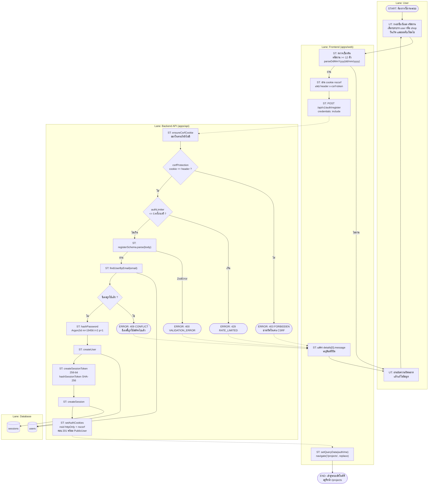

**กฎธุรกิจ**
- รหัสผ่านเน้น "ยาว" (>= 12) ไม่บังคับอักขระพิเศษ — ตามคำแนะนำ NIST/OWASP (`packages/contracts/src/auth.ts`)
- `role` รับได้เฉพาะ `user` และ `shop` — สมัครเป็น `admin` ไม่ได้
- `dateOfBirth` และ `termsAccepted` เป็น optional; ถ้าส่ง `termsAccepted: true` จะบันทึก `terms_accepted_at = now()`
- rate limit 5/นาที มีสองเหตุผล: กัน brute force **และ** กัน DoS ที่ชั้น Argon2 (19 MiB ต่อครั้ง)

---

### BP-02 — เข้าสู่ระบบ (Login)

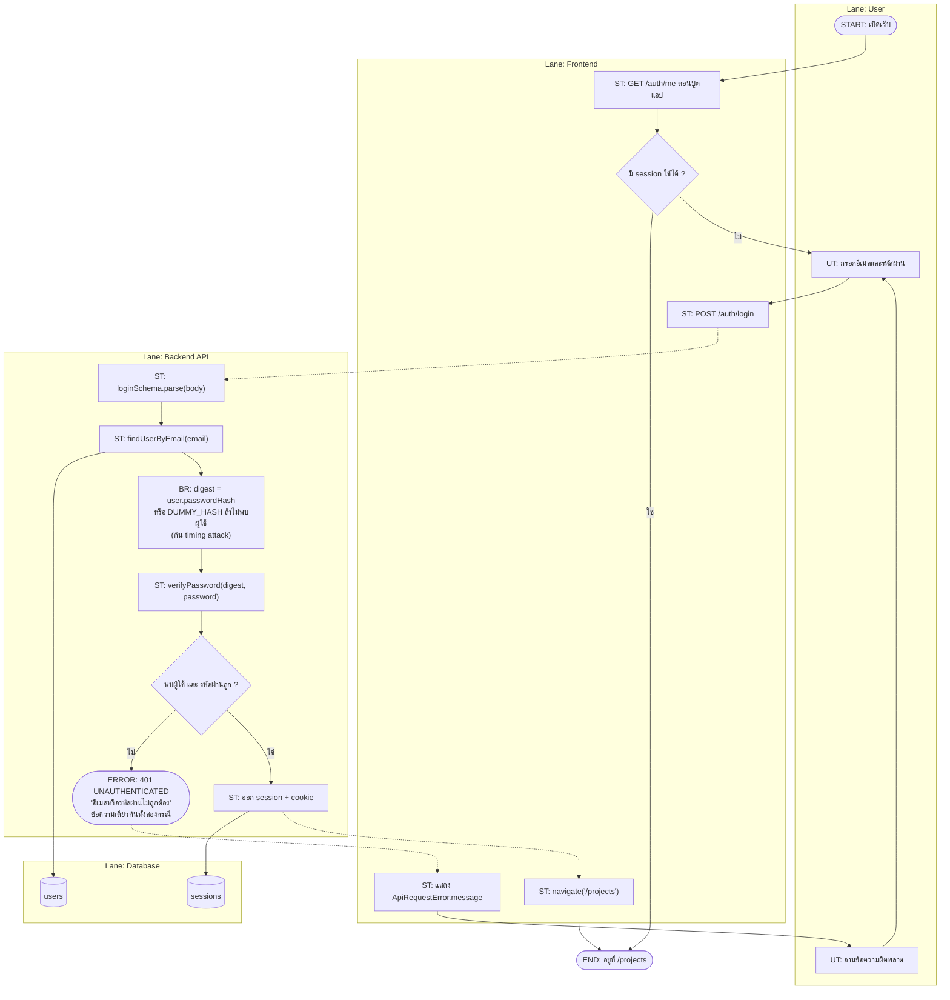

**กฎธุรกิจ** — ระบบต้องใช้เวลาตอบเท่ากันทั้งกรณีอีเมลไม่มีในระบบและรหัสผ่านผิด
จึงเรียก Argon2 เสมอ (`DUMMY_HASH`) เพื่อไม่ให้ผู้โจมตีไล่หาว่าอีเมลใดสมัครไว้แล้ว

---

### BP-03 — ออกจากระบบ / เซสชันหมดอายุ

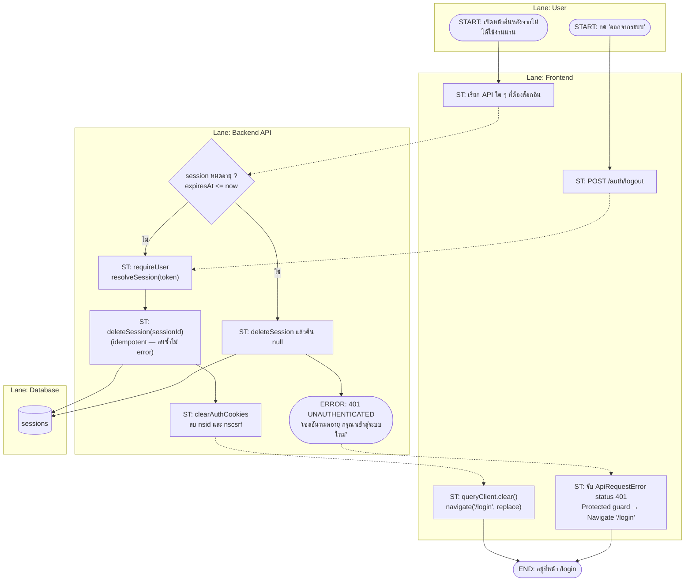

**ข้อสังเกต** — `deleteExpiredSessions()` มีอยู่ใน `auth/repository.ts` แต่
**ไม่มีตัวจับเวลา/งานเบื้องหลังใดเรียกใช้** แถวที่หมดอายุจึงถูกลบเฉพาะตอนมีคนพยายามใช้เท่านั้น

---

### BP-04 — สร้างและออกแบบงาน + Autosave (กระบวนการหลักของระบบ)

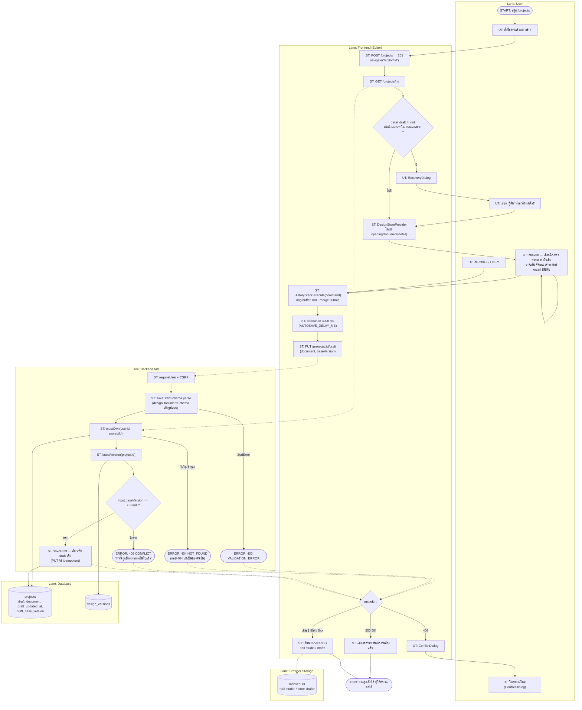

**กฎธุรกิจสำคัญ** (มีคอมเมนต์ยืนยันในซอร์ส)

| กฎ | ที่มา |
|---|---|
| Autosave เขียน **draft** ไม่ใช่สร้างเวอร์ชันใหม่ — ไม่งั้นรายการเวอร์ชันจะมีหลายร้อยแถวต่อการนั่งวาดหนึ่งชั่วโมง | คอมเมนต์ใน `prisma/schema.prisma` model `Project` |
| ห้ามเขียนทับเวอร์ชันล่าสุดแทน — เวอร์ชันต้อง **immutable** ไม่งั้นการย้อนกลับจะได้ของที่ไม่ตรงกับตอนบันทึก | แหล่งเดียวกัน |
| ใช้ `PUT` ไม่ใช่ `POST` เพราะเขียนทับ draft ทั้งก้อน → ยิงซ้ำได้ผลเดิม สำคัญกับ autosave ที่อาจยิงซ้ำเมื่อเครือข่ายสะดุด | `projects/routes.ts` |
| draft ถูกทิ้งเมื่อ `draftBaseVersion != latestVersionNumber` หรือ parse ไม่ผ่าน — งานที่ตั้งใจบันทึกชนะงานที่แค่ค้างอยู่เสมอ | `projects/service.ts:readDraft` |
| autosave ที่เขียนทับงานคนอื่นคือสิ่งที่แย่ที่สุด เพราะเกิดเองโดยผู้ใช้ไม่ได้สั่ง → ตอบ 409 แทนการเขียนทับเงียบ ๆ | `packages/contracts/src/project.ts` |
| ตอบ 404 ไม่ใช่ 403 เมื่อทรัพยากรเป็นของคนอื่น — กันการไล่เดา id เพื่อสำรวจว่าใครมีงานอะไร | `errors/AppError.ts:notFound` |

---

### BP-05 — บันทึกเวอร์ชัน + ภาพตัวอย่าง

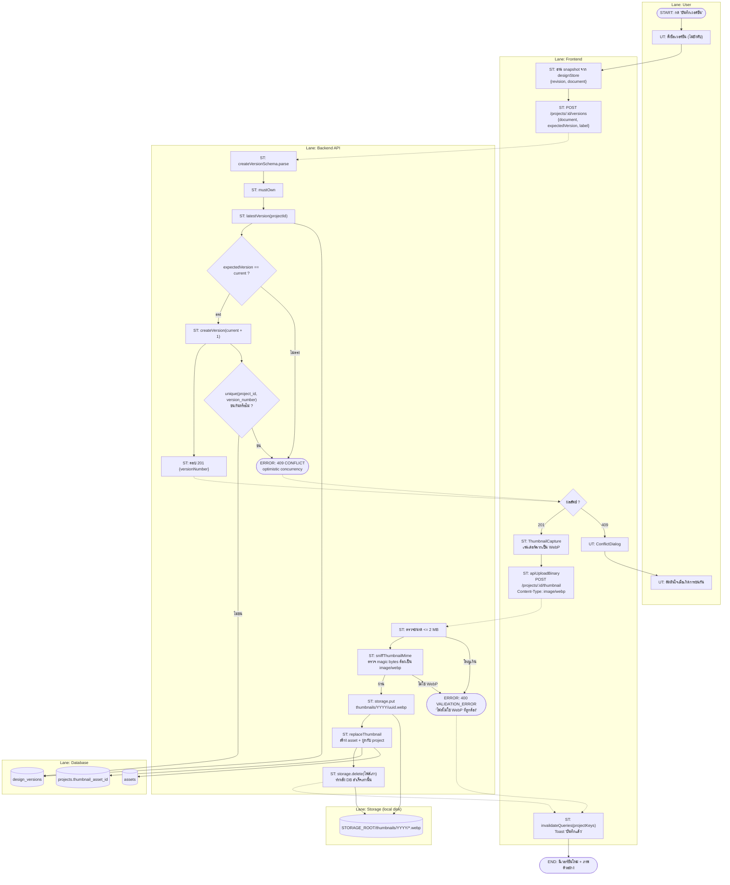

**กฎธุรกิจ** — ลบไฟล์เก่าออกจาก storage **หลัง** อัปเดตฐานข้อมูลสำเร็จเท่านั้น
ถ้าลบก่อนแล้ว DB update ล้มเหลว จะเหลือ `thumbnail_asset_id` ชี้ไปยัง asset ที่ไฟล์หายไปแล้ว
และการลบไฟล์เก่าไม่สำเร็จไม่ถือเป็นความล้มเหลวที่ผู้ใช้ต้องรู้

---

### BP-06 — แชร์ผลงานเข้าชุมชน (Publish Template)

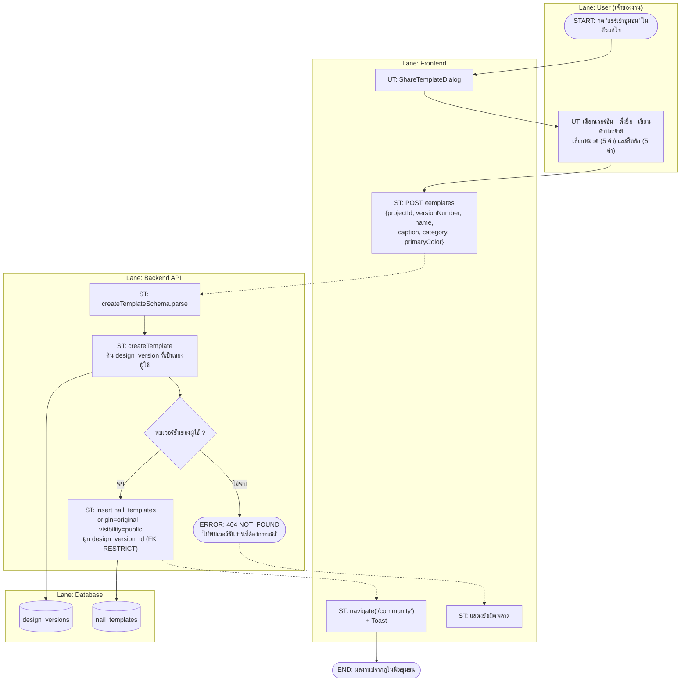

**กฎธุรกิจ** — template ผูกกับ `design_version` ที่ถูก freeze แล้ว และ FK เป็น
`onDelete: Restrict` จึงลบเวอร์ชันที่ถูกแชร์ไปแล้วไม่ได้ (ผลงานในชุมชนจะไม่กลายเป็นลิงก์เสีย)

---

### BP-07 — มีส่วนร่วมในชุมชน (Like / Comment / Remix / Share)

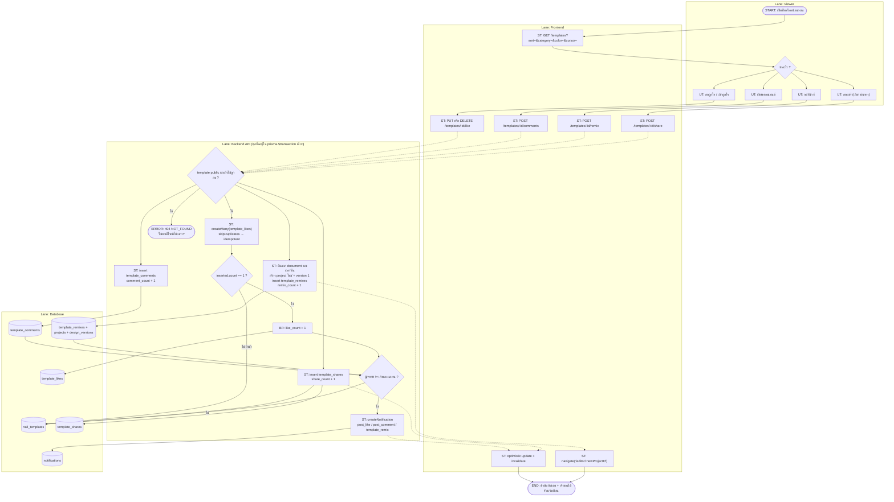

**กฎธุรกิจ**
- ไลก์/รายงานเป็น **idempotent** ที่ระดับฐานข้อมูล (composite PK / unique constraint + `skipDuplicates`) ตัวนับจึงไม่เพี้ยนแม้ผู้ใช้กดรัว
- ตัวนับถูก increment **ใน transaction เดียวกับ insert เสมอ**
- ไม่แจ้งเตือนเมื่อผู้กระทำคือเจ้าของผลงานเอง
- การแชร์ไม่มี unique constraint — ตั้งใจให้แชร์ซ้ำได้หลายครั้ง (เก็บเป็น event)

---

### BP-08 — รายงานเนื้อหาและการกลั่นกรอง (Moderation)

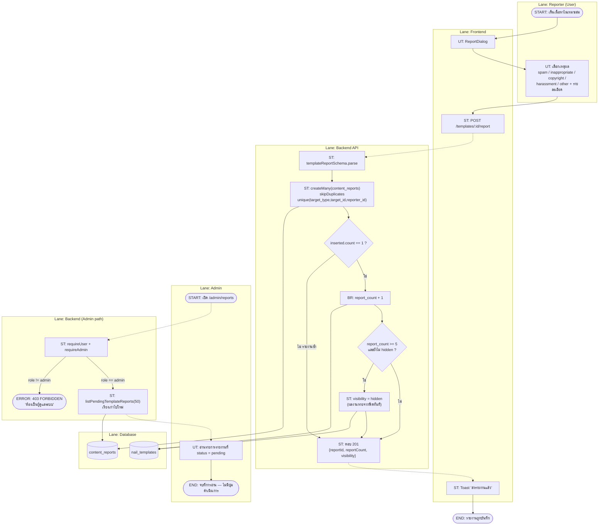

**ช่องว่างของกระบวนการ (ยืนยันจากซอร์ส)**
- `content_reports.status` **ไม่มีโค้ดใดเปลี่ยนจาก `pending`** — คิวจึงโตขึ้นเรื่อย ๆ
- ไม่มี endpoint สำหรับ ซ่อน/คืนค่า template ด้วยมือ, ลบคอมเมนต์, หรือระงับบัญชี
- การซ่อนอัตโนมัติที่ 5 รายงานเป็น**การกระทำเดียว**ที่ระบบทำกับเนื้อหาที่ถูกรายงาน

---

### BP-09 — นัดหมายกับร้าน (กระบวนการหลายฝ่าย)

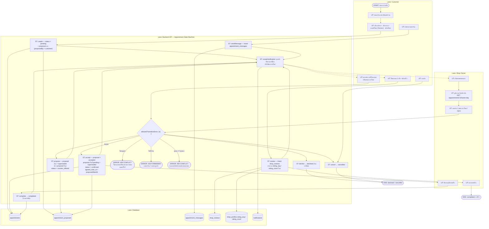

**State Machine ที่บังคับใน `allowedTransition()`**

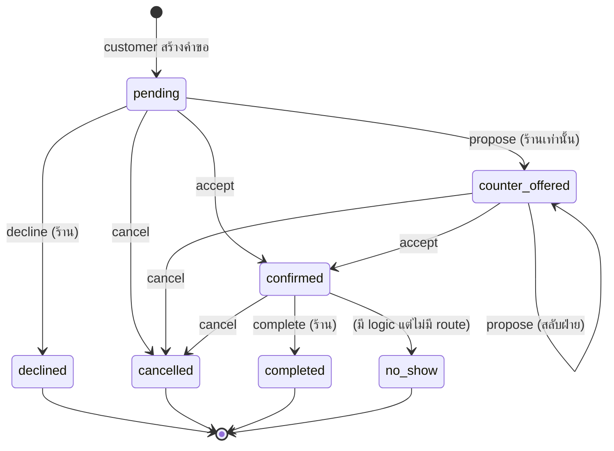

**กฎธุรกิจ**

| กฎ | หลักฐาน |
|---|---|
| นัดหมายกับร้านของตัวเองไม่ได้ | `appointments/service.ts:create` — `input.shopId === userId` |
| บริการที่เลือกต้องเป็นของร้านนั้นและ `is_active = true` | `create()` |
| ดีไซน์ที่แนบต้องเป็นเวอร์ชันของ project ที่ผู้ใช้เป็นเจ้าของ | `create()` |
| ตอบรับข้อเสนอของตัวเองไม่ได้ (`proposal.proposedBy === actor`) | `accept()` |
| ในขั้น `pending` ร้านเท่านั้นที่เสนอเวลาใหม่ได้ | `propose()` |
| เมื่อยืนยันแล้ว proposal อื่นที่ยัง pending ถูกทำเป็น `superseded` | `accept()` |
| decline / complete / no_show เป็นสิทธิ์ของร้านเท่านั้น | `transition()` |
| รีวิวได้เฉพาะลูกค้า + สถานะ `completed` + หนึ่งนัดหนึ่งรีวิว (unique constraint) | `review()` |
| ลบรีวิวได้เฉพาะผู้เขียน และต้องคำนวณ `rating_avg` ใหม่ทั้งร้าน | `deleteReview()` |
| ทุกการเปลี่ยนสถานะใช้ `updateMany` + เงื่อนไขสถานะเดิม เพื่อกัน race condition | `accept()` — `if (result.count === 0) throw conflict` |

---

### BP-10 — จัดการข้อมูลร้านและบริการ

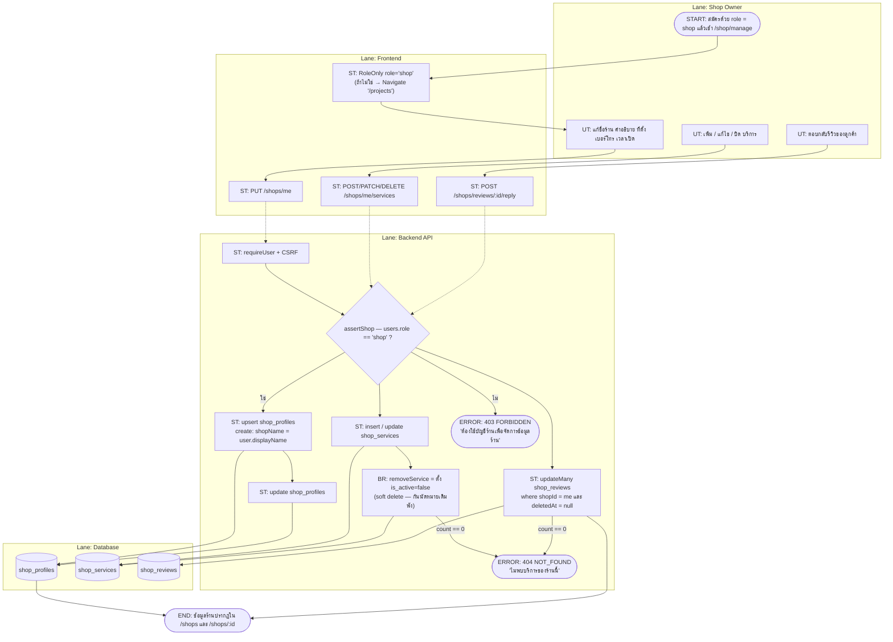

**ข้อสังเกต** — `shop_profiles` ถูกสร้างแบบ **lazy** ผ่าน `assertShop()` (upsert)
ไม่ได้สร้างตอนสมัครสมาชิก ผู้ใช้ role `shop` ที่ยังไม่เคยเข้าหน้าจัดการร้าน
จึงยังไม่ปรากฏในรายชื่อร้าน

---

### BP-11 — ผู้ช่วย AI (Chat / Recipe) พร้อม Degradation

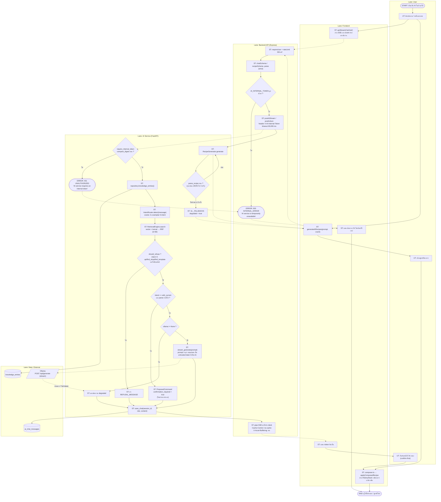

**กฎธุรกิจ / ความปลอดภัย**

| กฎ | หลักฐาน |
|---|---|
| `/health` เท่านั้นที่เปิดสาธารณะ — endpoint อื่นต้องมี `X-AI-Internal-Token` | `apps/ai/README.md`, `app/auth.py` |
| เทียบ token ด้วย `secrets.compare_digest` (constant-time) | `app/auth.py` |
| AI **ไม่แก้เอกสารเอง** — เสนอคำสั่งแล้วรอผู้ใช้ยืนยันเสมอ | `app/chat/commands.py` docstring |
| การเปลี่ยนแปลงที่ผู้ใช้ยืนยันไหลผ่าน `HistoryStack` เดียวกับการแก้ด้วยมือ → undo ได้ | `knowledge_entries` seed + `designStore.applyComposedRecipe` |
| คำถามเชิงข้อเท็จจริงต้องมีแหล่งอ้างอิง — ไม่มีก็ปฏิเสธ ไม่เดา | `app/chat/grounding.py:should_refuse` |
| Sources ถูกห่อด้วย `<untrusted_source>` และ prompt สั่งไม่ให้ทำตามคำสั่งภายใน source | `app/chat/grounding.py`, `app/routers/chat.py` |
| ระบบหลักต้องใช้งานได้แม้ AI ล่ม — degrade เป็น InMemoryRepository / ข้อความ degraded / `_FALLBACKS` | `apps/ai/README.md`, `main.py` lifespan |

---

### BP-X — กระบวนการจัดการข้อผิดพลาด (Cross-cutting)

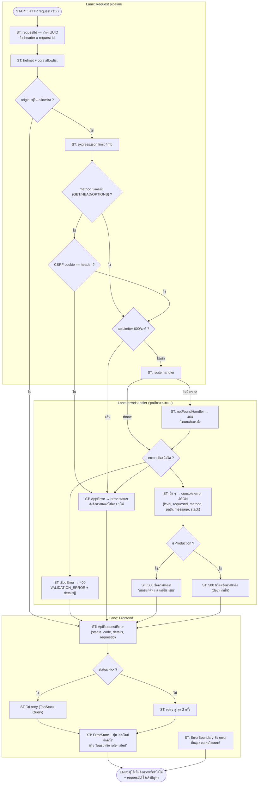

## 5. Components / Actors

### 5.1 Swimlane ที่ใช้ในเอกสารนี้

| Lane | ตรงกับอะไรในระบบจริง |
|---|---|
| **User / Customer / Shop Owner / Admin / Reporter** | ผู้ใช้จริงตาม `users.role` |
| **Frontend** | `apps/web` (React SPA) |
| **Backend API** | `apps/api` (Express 5) — รวม middleware, routes, service, repository |
| **AI Service** | `apps/ai` (FastAPI) |
| **Database** | PostgreSQL ผ่าน Prisma / psycopg |
| **Storage** | ดิสก์ในเครื่อง (`STORAGE_ROOT`) ผ่าน `LocalDiskProvider` |
| **Browser Storage** | IndexedDB `nail-studio` / object store `drafts` |
| **External** | Ollama (`OLLAMA_URL`) — optional |

### 5.2 Data Store ที่กระบวนการแตะต้อง

| Data Store | กระบวนการที่เขียน |
|---|---|
| `users` | BP-01 |
| `sessions` | BP-01, BP-02, BP-03 |
| `projects`, `design_versions` | BP-04, BP-05, BP-07 (remix) |
| `assets` + ดิสก์ | BP-05 |
| `nail_templates`, `template_likes/shares/remixes/comments` | BP-06, BP-07 |
| `content_reports` | BP-08 |
| `notifications` | BP-07, BP-09 |
| `shop_profiles`, `shop_services`, `shop_reviews` | BP-09, BP-10 |
| `appointments`, `appointment_proposals`, `appointment_messages` | BP-09 |
| `knowledge_entries`, `ai_chat_messages` | BP-11 |
| IndexedDB `drafts` | BP-04 |

## 6. Flow / Relationship

### 6.1 ความสัมพันธ์ระหว่างกระบวนการ

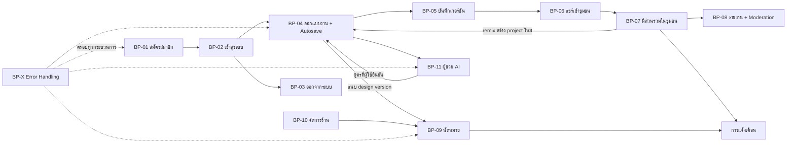

### 6.2 Alternative Flow / Error Flow ที่ครอบคลุม

| กระบวนการ | Alternative Flow | Error Flow |
|---|---|---|
| BP-01 | สมัครเป็น `shop` แทน `user` | 403 CSRF, 429 rate limit, 400 validation, 409 อีเมลซ้ำ |
| BP-02 | มี session อยู่แล้ว → ข้ามหน้า login | 401 (ข้อความเดียวกันทั้งอีเมล/รหัสผิด), 429 |
| BP-03 | เซสชันหมดอายุเอง (ไม่ได้กดออก) | 401 เซสชันหมดอายุ |
| BP-04 | กู้คืน draft, ทิ้ง draft, ทำงานต่อโดยไม่บันทึก | 404 ไม่ใช่เจ้าของ, 409 baseVersion ไม่ตรง, เครือข่ายล่ม → IndexedDB |
| BP-05 | บันทึกโดยไม่ตั้งชื่อเวอร์ชัน | 409 optimistic concurrency, 400 ไฟล์ไม่ใช่ WebP / ใหญ่เกิน 2 MB |
| BP-06 | เลือกเวอร์ชันเก่าแทนเวอร์ชันล่าสุด | 404 ไม่พบเวอร์ชันของผู้ใช้ |
| BP-07 | ไลก์ซ้ำ (ไม่เพิ่มตัวนับ), แชร์ซ้ำ (เพิ่มได้), รีมิกซ์งานตัวเอง (ไม่แจ้งเตือน) | 404 template ไม่ public / ถูกลบ |
| BP-08 | รายงานซ้ำโดยคนเดิม → ไม่เพิ่มตัวนับ | 403 ไม่ใช่ admin |
| BP-09 | ต่อรองเวลาสลับไปมาได้ไม่จำกัดรอบ, ยกเลิกได้ทั้งสองฝ่าย, ลบรีวิวได้ | 409 สถานะไม่อนุญาต, 409 รอฝ่ายตรงข้ามตอบ, 403 สิทธิ์ไม่ถูกฝ่าย, 409 รีวิวซ้ำ |
| BP-10 | ปิดบริการแทนการลบจริง | 403 ไม่ใช่บัญชีร้าน, 404 ไม่พบบริการ |
| BP-11 | ไม่มี knowledge → ปฏิเสธ; ไม่มี Ollama → ข้อความ degraded; JSON เพี้ยน → ซ่อม 3 ครั้ง แล้วใช้ `_FALLBACKS` | 503 AI service ไม่พร้อม, 401 internal token ผิด, 429 เกิน 30/นาที |

### 6.3 ความสอดคล้อง BPMN ↔ Use Case

| BPMN | Use Case ที่ครอบคลุม (ดู `Use case.md`) |
|---|---|
| BP-01 | UC-01 |
| BP-02 | UC-02 |
| BP-03 | UC-03 |
| BP-04 | UC-10, UC-11, UC-12, UC-15, UC-30…UC-36 |
| BP-05 | UC-16, UC-17, UC-18, UC-19, UC-21, UC-22 |
| BP-06 | UC-42 |
| BP-07 | UC-40, UC-41, UC-43, UC-44, UC-45, UC-46, UC-63 |
| BP-08 | UC-47, UC-50, UC-51 |
| BP-09 | UC-80…UC-92 |
| BP-10 | UC-70…UC-76 |
| BP-11 | UC-100, UC-101, UC-102, UC-103, UC-104, UC-105 |
| BP-X | ครอบทุก UC |

## 7. Source References

**Backend**
- `apps/api/src/app.ts`, `server.ts`
- `apps/api/src/auth/{routes,service,repository,session,password}.ts`
- `apps/api/src/projects/{routes,service,repository}.ts`
- `apps/api/src/templates/{routes,service,repository,cursor}.ts`
- `apps/api/src/appointments/{routes,service}.ts`
- `apps/api/src/shops/{routes,service}.ts`
- `apps/api/src/notifications/{routes,service,repository}.ts`
- `apps/api/src/users/{routes,service,repository}.ts`
- `apps/api/src/ai/{routes,client}.ts`
- `apps/api/src/middleware/{requestId,csrf,requireUser,rateLimit,errorHandler}.ts`
- `apps/api/src/errors/AppError.ts`, `apps/api/src/storage/**`

**Frontend**
- `apps/web/src/pages/{Register,Login,Projects,Editor,Community,TemplatePreview,Shops,ShopDetail,ShopManage,Appointments,AppointmentDetail,Moderation}Page.tsx`
- `apps/web/src/features/design/{NailEditor,useAutosave,useOfflineDraft,offlineDraft,RecoveryDialog,ConflictDialog,ShareTemplateDialog}.ts(x)`
- `apps/web/src/features/{auth,projects,community,appointments,shops,notifications,ai}/**`
- `apps/web/src/api/client.ts`, `app/providers.tsx`, `app/router.tsx`

**AI service**
- `apps/ai/app/routers/{chat,design,recommend}.py`
- `apps/ai/app/{auth,main,main_state,repositories,ollama,schemas}.py`
- `apps/ai/app/chat/{grounding,commands,memory}.py`
- `apps/ai/app/retrieval/{engine,intent,lexical,rrf,embedding}.py`
- `apps/ai/app/generation/recipe.py`

**Database**
- `prisma/schema.prisma` (ดูโดยเฉพาะคอมเมนต์ใน model `Project` ที่อธิบายกฎ autosave/versioning)
- `prisma/migrations/**`, `prisma/seed.mjs`

**API endpoints ที่กระบวนการเรียก** — ดูรายการเต็มใน `Use case.md` §7

## 8. Unknown / Missing Information

| ประเด็น | สถานะ |
|---|---|
| **กระบวนการชำระเงิน (Payment Process)** | **UNKNOWN / NOT FOUND** — มีเพียงฟิลด์ราคา (`shop_services.price_thb`, `appointments.price_quoted_thb`) ที่เป็นข้อมูลอ้างอิง ไม่มี payment gateway, ไม่มีตารางธุรกรรม, ไม่มี endpoint ตัดเงิน/คืนเงิน |
| **กระบวนการอนุมัติ (Approval Workflow) ของ admin** | **NOT FOUND** — `content_reports.status` ไม่มีโค้ดใดเปลี่ยนค่า; `shop_profiles.is_verified` ไม่มี endpoint ตั้งค่า |
| **กระบวนการแจ้งเตือนภายนอก** (อีเมล / SMS / Push) | **NOT FOUND** — การแจ้งเตือนอยู่ในตาราง `notifications` และแสดงผ่าน `NotificationBell` เท่านั้น |
| **Background job / Scheduled process** | **NOT FOUND** — ไม่มี cron, queue, worker; `deleteExpiredSessions()` ไม่มีผู้เรียก |
| **กระบวนการ no-show** | มี logic ใน `allowedTransition` + `transition()` แต่ **ไม่มี route** `/appointments/:id/no-show` จึงเรียกไม่ได้ |
| **กระบวนการรีเซ็ตรหัสผ่าน / ยืนยันอีเมล** | **NOT FOUND** |
| **กระบวนการลบบัญชี / ส่งออกข้อมูลส่วนบุคคล** | **NOT FOUND** |
| **BPMN ต้นฉบับ (.bpmn / Camunda / Bizagi)** | **NOT FOUND** ใน repository — เอกสารนี้สร้างจากซอร์สโดยตรง |
| ข้อจำกัดของ Mermaid ต่อ BPMN 2.0 | ระบุไว้แล้วในหัวข้อ 2 — ไม่มี Pool/Lane, Event, Gateway, Message Flow ตามมาตรฐาน จึงใช้ `flowchart` + `subgraph` + คำนำหน้า (`START:`, `UT:`, `ST:`, `BR:`, `ERROR:`) แทน |
