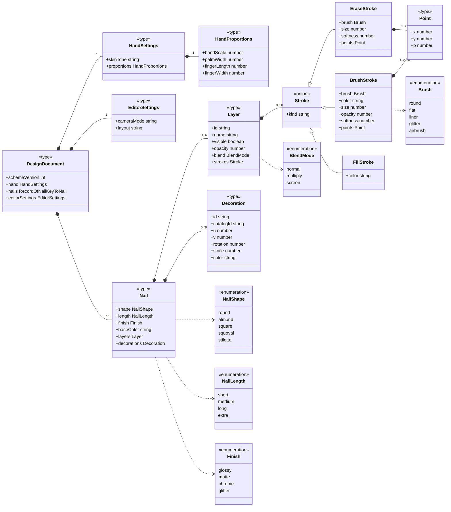
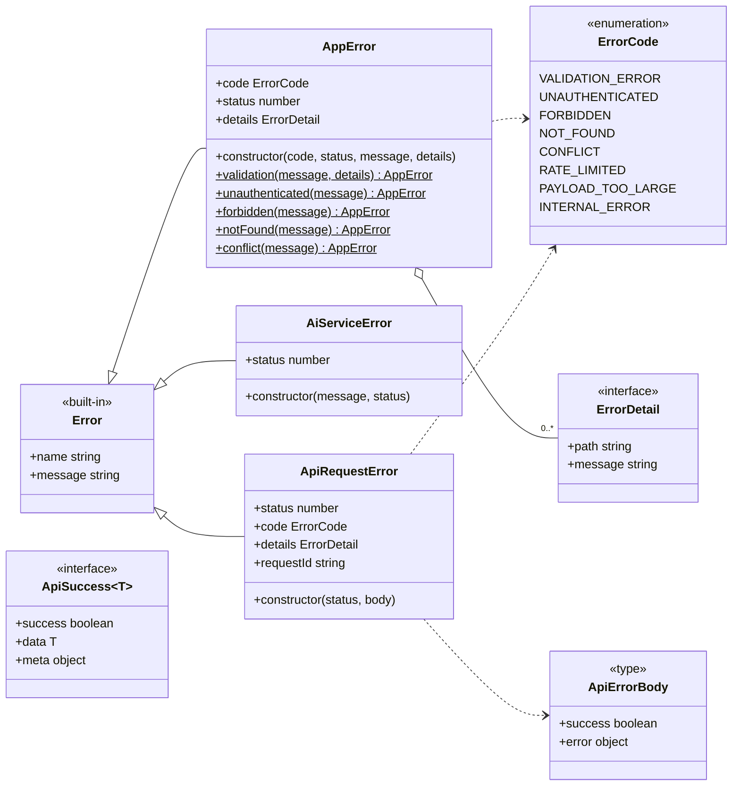
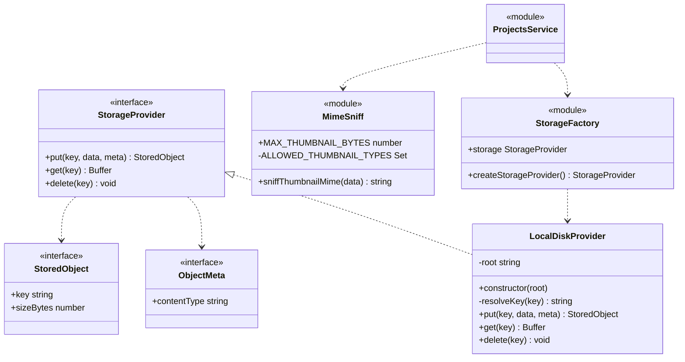
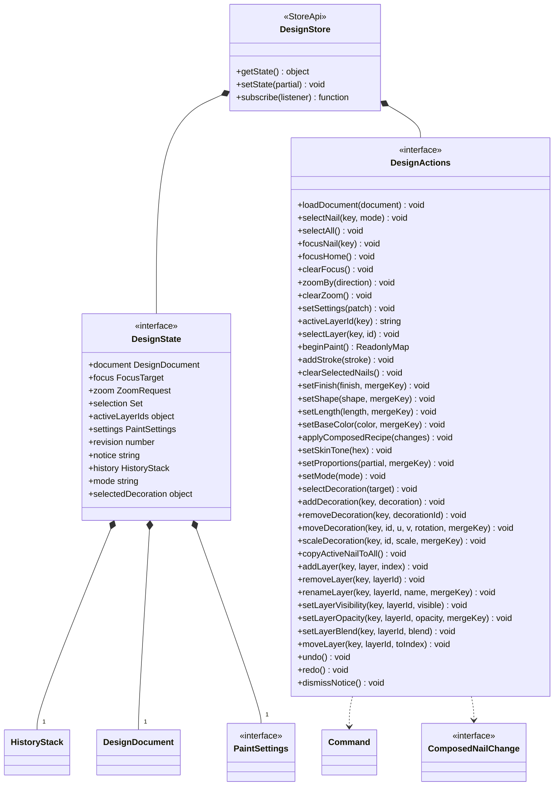
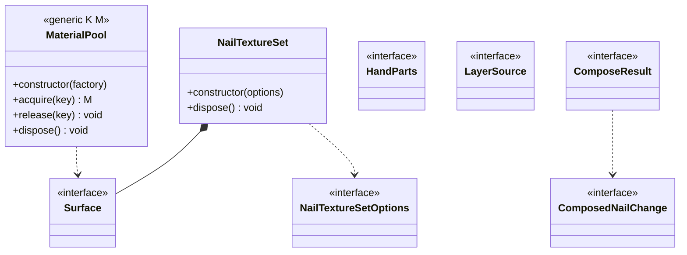
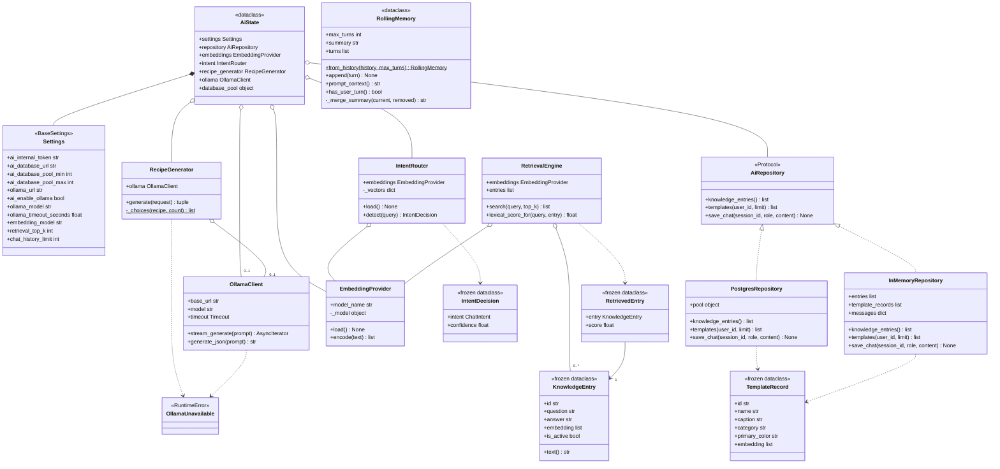
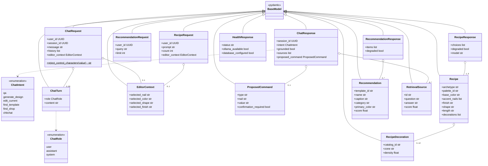

# Class Diagram

## 1. Purpose

แสดงคลาส อินเทอร์เฟซ enum และโครงสร้างข้อมูลจริงของทั้ง 4 แพ็กเกจ
(`packages/contracts`, `apps/api`, `apps/web`, `apps/ai`) พร้อมแอตทริบิวต์ เมท็อด
visibility และความสัมพันธ์ (association / aggregation / composition / inheritance /
realization / dependency) รวมถึง cardinality เมื่อระบุได้จากโค้ด

## 2. Scope

- **รวม**: class / interface / abstract (Protocol) / enum / type ที่ประกาศในซอร์สจริง
- **รวม**: โมดูลแบบ function-based (`export function` ในไฟล์ `service.ts` / `repository.ts`)
  ซึ่งเป็น pattern หลักของ backend — แสดงเป็นสเตอริโอไทป์ `module`
- **ไม่รวม**: โค้ดที่ Prisma generate (`apps/api/src/generated/prisma/**`) — 23 model class เป็นผลลัพธ์จาก `schema.prisma` (ดู `ER.md`)
- **ไม่รวม**: React component (อยู่ใน `UX UI.md`) ยกเว้นตัวที่ประกาศเป็น `class`/`interface` จริง

> **หมายเหตุสำคัญ:** Backend **ไม่ได้ใช้ OOP class เป็นหลัก** — ใช้ ES module ที่ export
> ฟังก์ชัน (`import * as service from './service.ts'`) มีคลาสจริงเพียง `AppError`,
> `AiServiceError`, `LocalDiskProvider` เท่านั้น ส่วน OOP class ที่แท้จริงกระจุกอยู่ที่
> editor ฝั่ง web (`Command` hierarchy, `HistoryStack`, `MaterialPool`, `NailTextureSet`)
> และ `apps/ai` (Python class)

## 3. Source Analysis

| กลุ่ม | ไฟล์หลัก |
|---|---|
| Shared contracts (Zod → type) | `packages/contracts/src/{api,auth,design,project,template,notification,appointment,profile}.ts` |
| Error hierarchy (API) | `apps/api/src/errors/AppError.ts`, `apps/api/src/ai/client.ts` |
| Storage abstraction | `apps/api/src/storage/{StorageProvider,LocalDiskProvider,index,mimeSniff}.ts` |
| โมดูล backend | `apps/api/src/{auth,projects,templates,notifications,shops,appointments,users,ai}/**` |
| Command / History (web) | `apps/web/src/3d/history/{Command,HistoryStack}.ts`, `3d/history/commands/*.ts` |
| Editor state (web) | `apps/web/src/features/design/designStore.ts`, `DesignStoreProvider.tsx` |
| 3D runtime (web) | `apps/web/src/3d/{materials,painting,models,geometry,generation,scene}/**` |
| API client (web) | `apps/web/src/api/client.ts` |
| AI service (Python) | `apps/ai/app/**` |

## 4. Diagram

### 4.1 Shared Domain Model — `@nail-studio/contracts`

**ข้อจำกัดค่าของแต่ละฟิลด์** (บังคับด้วย Zod ใน `packages/contracts/src/design.ts`)

| ฟิลด์ | ข้อจำกัด |
|---|---|
| `DesignDocument.schemaVersion` | ต้องเท่ากับ `DESIGN_SCHEMA_VERSION = 2` เท่านั้น |
| `DesignDocument.nails` | ต้องมีครบ 10 คีย์ (`NAIL_KEYS` = 2 มือ × 5 นิ้ว) เสมอ |
| `HandSettings.skinTone`, `Nail.baseColor`, `Stroke.color`, `Decoration.color` | ตรง regex `^#[0-9a-fA-F]{6}$` |
| `HandProportions.handScale` | 0.8 ถึง 1.2 |
| `palmWidth`, `fingerLength`, `fingerWidth` | 0.7 ถึง 1.3 |
| `EditorSettings.cameraMode` | `orbit` หรือ `focus` |
| `EditorSettings.layout` | `split` หรือ `dock` |
| `Nail.layers` | 1 ถึง `MAX_LAYERS_PER_NAIL` = 6 |
| `Nail.decorations` | 0 ถึง `MAX_DECORATIONS_PER_NAIL` = 30 |
| `Layer.name` | 1 ถึง 60 ตัวอักษร |
| `Layer.opacity`, `Stroke.opacity`, `softness`, `Point.p` | 0 ถึง 1 |
| `Layer.strokes` | 0 ถึง `MAX_STROKES_PER_LAYER` = 500 |
| `Stroke.kind` | `brush`, `erase`, `fill` (discriminated union) |
| `Stroke.size` | มากกว่า 0 และไม่เกิน 400 |
| `points` | 1 ถึง `MAX_POINTS_PER_STROKE` = 2000 |
| `Point.x`, `Point.y`, `Decoration.u`, `Decoration.v` | 0 ถึง 1 (พิกัด UV ไม่ใช่พิกัดหน้าจอ) |
| `Decoration.scale` | มากกว่า 0 และไม่เกิน 1 |

**ฟังก์ชันช่วยของ domain**: `nailKey(hand, finger)`, `handOf(key)`, `fingerOf(key)`,
`nailKeysOfHand(hand)`, `createEmptyDocument()`

### 4.2 API Transport & Error Model

`ApiResponse<T> = ApiSuccess<T> | ApiError` — ทุก endpoint ตอบรูปแบบนี้เสมอ
`AppError` และ `AiServiceError` อยู่ที่ `apps/api`, `ApiRequestError` อยู่ที่ `apps/web`

| Static factory ของ `AppError` | HTTP status | ErrorCode |
|---|---|---|
| `validation()` | 400 | `VALIDATION_ERROR` |
| `unauthenticated()` | 401 | `UNAUTHENTICATED` |
| `forbidden()` | 403 | `FORBIDDEN` |
| `notFound()` | 404 | `NOT_FOUND` |
| `conflict()` | 409 | `CONFLICT` |

### 4.3 Backend Module Structure (Layered, function-based)

```mermaid
classDiagram
    direction TB

    class ExpressApp {
        <<factory>>
        +createApp() Express
    }

    class AuthRoutes {
        <<module>>
        +postRegister()
        +postLogin()
        +postLogout()
        +getMe()
        +patchMe()
    }
    class AuthService {
        <<module>>
        -DUMMY_HASH string
        +register(input, userAgent) IssuedSession
        +login(input, userAgent) IssuedSession
        +logout(sessionId) void
        +updateProfile(userId, input) PublicUser
        +resolveSession(token) ResolvedSession
        -issueSession(user, userAgent) IssuedSession
    }
    class AuthRepository {
        <<module>>
        +findUserByEmail(email)
        +createUser(input)
        +updateUserDisplayName(id, name)
        +createSession(input)
        +findSessionByTokenHash(hash)
        +deleteSession(id)
        +touchSession(id)
        +deleteExpiredSessions(now)
        +toPublicUser(row) PublicUser
    }
    class SessionUtil {
        <<module>>
        +SESSION_COOKIE string
        +CSRF_COOKIE string
        +CSRF_HEADER string
        +createSessionToken() string
        +hashSessionToken(token) Uint8Array
        +sessionExpiry(from) Date
        +createCsrfToken() string
        +safeEqual(a, b) boolean
        +setAuthCookies(res, token, csrf, exp) void
        +clearAuthCookies(res) void
    }
    class PasswordUtil {
        <<module>>
        -OPTIONS object
        +hashPassword(plain) string
        +verifyPassword(digest, plain) boolean
    }

    class ProjectsRoutes {
        <<module>>
    }
    class ProjectsService {
        <<module>>
        +list(userId, limit, cursor)
        +create(userId, name) ProjectSummary
        +detail(userId, projectId) ProjectDetail
        +update(userId, projectId, input) ProjectSummary
        +remove(userId, projectId) void
        +saveDraft(userId, projectId, input)
        +saveVersion(userId, projectId, input)
        +listVersions(userId, projectId)
        +loadVersion(userId, projectId, versionNumber)
        +renameVersion(userId, projectId, versionNumber, input)
        +duplicateProject(userId, projectId, input)
        +saveThumbnail(userId, projectId, data) void
        +loadThumbnail(userId, projectId)
        +encodeCursor(row) string
        -mustOwn(userId, projectId) ProjectRow
        -readDraft(project, latestVersionNumber)
        -decodeCursor(raw) Cursor
    }
    class ProjectsRepository {
        <<module>>
        +listProjects(userId, limit, cursor)
        +findProject(userId, id)
        +createProject(userId, name, document)
        +softDeleteProject(userId, id)
        +updateProject(userId, id, data)
        +latestVersion(projectId)
        +findVersion(projectId, versionNumber)
        +listVersions(projectId)
        +updateVersionLabel(projectId, versionNumber, label)
        +createVersion(projectId, number, document, label)
        +saveDraft(projectId, document, baseVersion)
        +replaceThumbnail(userId, projectId, asset)
        +findAsset(id)
        +isDesignVersionNumberConflict(error) boolean
    }

    class TemplatesRoutes {
        <<module>>
    }
    class TemplatesService {
        <<module>>
        +create(userId, input) TemplateCard
        +list(input, viewerId) TemplateFeedResult
        +detail(templateId, viewerId) TemplateDetail
        +loadThumbnail(templateId)
        +like(userId, templateId)
        +unlike(userId, templateId)
        +share(userId, templateId, input)
        +remix(userId, templateId, input)
        +report(reporterId, templateId, input)
        +comment(userId, templateId, input)
        +moderationQueue()
        -toCard(row, isLiked) TemplateCard
    }
    class TemplatesRepository {
        <<module>>
        +createTemplate(userId, input)
        +listTemplates(options)
        +findPublicTemplateDetail(templateId)
        +findPublicTemplateThumbnail(templateId)
        +findLikedTemplateIds(userId, ids)
        +isTemplateLikedBy(userId, templateId)
        +createTemplateComment(templateId, userId, content)
        +addTemplateLike(templateId, userId)
        +removeTemplateLike(templateId, userId)
        +shareTemplate(templateId, userId, channel)
        +remixTemplate(templateId, userId, projectName)
        +reportTemplate(templateId, reporterId, reason, detail)
        +listPendingTemplateReports(limit)
    }
    class TemplateCursor {
        <<module>>
        +encodeTemplateCursor(cursor) string
        +decodeTemplateCursor(raw, sort)
    }

    class AppointmentsRoutes {
        <<module>>
    }
    class AppointmentsService {
        <<module>>
        +allowedTransition(from, to) boolean
        +create(userId, input) AppointmentDetail
        +list(userId, status, limit)
        +detail(userId, appointmentId) AppointmentDetail
        +accept(userId, appointmentId) AppointmentDetail
        +propose(userId, appointmentId, input) AppointmentDetail
        +decline(userId, appointmentId)
        +cancel(userId, appointmentId)
        +complete(userId, appointmentId)
        +review(userId, appointmentId, input)
        +deleteReview(userId, appointmentId) void
        +listMessages(userId, appointmentId)
        +sendMessage(userId, appointmentId, content)
        +markMessagesRead(userId, appointmentId) void
        +listSameDayConfirmed(userId, appointmentId)
        -findForParticipant(userId, appointmentId) AppointmentRow
        -actorFor(row, userId) string
        -transition(userId, appointmentId, to)
        -utcDayRange(date) object
    }

    class ShopsRoutes {
        <<module>>
    }
    class ShopsService {
        <<module>>
        +list(search, limit) ShopDetail
        +detail(userId) ShopDetail
        +updateProfile(userId, input) ShopDetail
        +createService(userId, input)
        +updateService(userId, serviceId, input)
        +removeService(userId, serviceId) void
        +replyToReview(userId, reviewId, reply) void
        -assertShop(userId)
        -mapDetail(profile) ShopDetail
        -mapService(service)
    }

    class NotificationsRoutes {
        <<module>>
    }
    class NotificationsService {
        <<module>>
        +list(userId, limit) NotificationPage
        +read(userId, notificationId) void
        +readAll(userId) void
    }
    class NotificationsRepository {
        <<module>>
        +createNotification(tx, event)
        +listForUser(userId, limit)
        +markRead(userId, notificationId)
        +markAllRead(userId)
    }

    class UsersRoutes {
        <<module>>
    }
    class UsersService {
        <<module>>
        +profile(userId, input) PublicProfile
        -toTemplateCard(row) TemplateCard
    }
    class UsersRepository {
        <<module>>
        +findUserProfile(userId)
        +countPublicTemplates(userId)
        +listPublicTemplates(userId, limit, cursor)
    }

    class AiRoutes {
        <<module>>
    }
    class AiClient {
        <<module>>
        +postAiJson(path, payload)
        +postAiStream(path, payload) Response
        -headers() object
    }

    class Db {
        <<module>>
        +prisma PrismaClient
        +disconnectDb() void
        -pool Pool
    }

    ExpressApp ..> AuthRoutes
    ExpressApp ..> ProjectsRoutes
    ExpressApp ..> TemplatesRoutes
    ExpressApp ..> NotificationsRoutes
    ExpressApp ..> AiRoutes
    ExpressApp ..> ShopsRoutes
    ExpressApp ..> AppointmentsRoutes
    ExpressApp ..> UsersRoutes

    AuthRoutes ..> AuthService
    AuthRoutes ..> SessionUtil
    AuthService ..> AuthRepository
    AuthService ..> PasswordUtil
    AuthService ..> SessionUtil
    AuthRepository ..> Db

    ProjectsRoutes ..> ProjectsService
    ProjectsService ..> ProjectsRepository
    ProjectsRepository ..> Db

    TemplatesRoutes ..> TemplatesService
    TemplatesService ..> TemplatesRepository
    TemplatesService ..> TemplateCursor
    TemplatesRepository ..> Db
    TemplatesRepository ..> NotificationsRepository

    AppointmentsRoutes ..> AppointmentsService
    AppointmentsService ..> Db
    AppointmentsService ..> NotificationsRepository

    ShopsRoutes ..> ShopsService
    ShopsService ..> Db

    NotificationsRoutes ..> NotificationsService
    NotificationsService ..> NotificationsRepository

    UsersRoutes ..> UsersService
    UsersService ..> UsersRepository
    UsersRepository ..> Db

    AiRoutes ..> AiClient
```

### 4.4 Storage Abstraction (Realization)

- `MAX_THUMBNAIL_BYTES = 2 * 1024 * 1024` (2 MB), อนุญาตเฉพาะ `image/webp` ตรวจด้วย magic bytes (`file-type`)
- `resolveKey()` กัน path traversal เป็นชั้นที่สอง — โยน error ถ้า resolved path หลุดออกนอก `root`
- `createStorageProvider()` มี exhaustiveness check (`const exhaustive: never`) เพื่อให้ลืมเพิ่มเคสแล้วพังตอน build

### 4.5 Editor Command Pattern (apps/web) — คลาส OOP หลักของระบบ

```mermaid
classDiagram
    direction TB

    class Command {
        <<interface>>
        +label string
        +mergeKey string
        +do(document) CommandResult
        +undo(document) CommandResult
        +merge(next) Command
    }

    class CommandResult {
        <<interface>>
        +document DesignDocument
        +affects ReadonlySet
    }
    class ReplayResult {
        <<interface>>
        +applied boolean
    }
    class ExecuteResult {
        <<interface>>
        +recorded boolean
    }
    class HistoryState {
        <<interface>>
        +canUndo boolean
        +canRedo boolean
        +undoLabel string
        +redoLabel string
    }

    class HistoryStack {
        -entries Array
        -start number
        -length number
        -cursor number
        +execute(document, command, now) ExecuteResult
        +undo(document) ReplayResult
        +redo(document) ReplayResult
        +clear() void
        +state() HistoryState
        -replay(document, entry, step, undo) ReplayResult
        -merge(previous, command, now) Command
        -append(entry) void
        -entryAt(index) HistoryEntry
        -indexOf(index) number
        -discardRedo() void
    }

    class CompositeCommand
    class AddStrokeCommand
    class SetBaseColorCommand
    class SetFinishCommand
    class SetShapeCommand
    class SetLengthCommand
    class ClearNailCommand
    class CopyNailCommand
    class AddLayerCommand
    class RemoveLayerCommand
    class RenameLayerCommand
    class SetLayerVisibilityCommand
    class SetLayerOpacityCommand
    class SetLayerBlendCommand
    class MoveLayerCommand
    class AddDecorationCommand
    class RemoveDecorationCommand
    class MoveDecorationCommand
    class ScaleDecorationCommand
    class SetSkinToneCommand
    class SetProportionsCommand

    CommandResult <|-- ReplayResult
    CommandResult <|-- ExecuteResult

    Command <|.. CompositeCommand
    Command <|.. AddStrokeCommand
    Command <|.. SetBaseColorCommand
    Command <|.. SetFinishCommand
    Command <|.. SetShapeCommand
    Command <|.. SetLengthCommand
    Command <|.. ClearNailCommand
    Command <|.. CopyNailCommand
    Command <|.. AddLayerCommand
    Command <|.. RemoveLayerCommand
    Command <|.. RenameLayerCommand
    Command <|.. SetLayerVisibilityCommand
    Command <|.. SetLayerOpacityCommand
    Command <|.. SetLayerBlendCommand
    Command <|.. MoveLayerCommand
    Command <|.. AddDecorationCommand
    Command <|.. RemoveDecorationCommand
    Command <|.. MoveDecorationCommand
    Command <|.. ScaleDecorationCommand
    Command <|.. SetSkinToneCommand
    Command <|.. SetProportionsCommand

    CompositeCommand o-- "1..*" Command
    HistoryStack o-- "0..100" Command
    Command ..> DesignDocument
```

| ค่าคงที่ของ `HistoryStack` | ค่า | เหตุผลในโค้ด |
|---|---|---|
| `HISTORY_CAPACITY` | 100 | ring buffer ความจุคงที่ → `execute`/`undo`/`redo` เป็น O(1) |
| `MERGE_WINDOW_MS` | 500 | รวมคำสั่งชนิดเดียวกันที่เกิดติดกัน (เช่น ลากสไลเดอร์) เป็นรายการเดียว |

`undo()`/`redo()` ขยับ `cursor` **ต่อเมื่อคำสั่งเปลี่ยนเอกสารได้จริง** (`applied === true`)
มิฉะนั้นประวัติกับเอกสารจะหลุดจากกันโดยไม่มีอาการ

### 4.6 Editor State (zustand store)

**ค่าคงที่:** `EDITABLE_HAND = 'right'`, `EDITABLE_NAILS = nailKeysOfHand('right')` (5 นิ้ว)
— ระบบให้แก้ไขได้เฉพาะมือขวา แม้ document จะเก็บครบ 10 นิ้ว
**`ZoomRequest` มี `nonce`** เพราะการกด "ซูมเข้า" สองครั้งติดกันคือคำขอคนละครั้งที่มีทิศทางเดียวกัน

### 4.7 3D Runtime Classes (apps/web)

**โมดูลเชิงฟังก์ชันของ 3D** (มี unit test คู่กันแทบทุกไฟล์):
`geometry/{hull,nailHulls,pointInHull,surfaceProjection}`,
`painting/{brush,rasterizer,simplify,uvMapping,picking,layers,nailFlatten,fakeCanvas,constants,paintSettings}`,
`models/{handBones,handProportions,nailMorphs,PartsRegistry,useHandProportions}`,
`generation/{colorRules,composer,scatter}`,
`decorations/{decorationCatalog,decorationPicking}`,
`scene/{cameraPresets,nailMorph,nailViews,exporters/exportProjectJson}`

### 4.8 AI Service Classes (apps/ai — Python)

**ค่าเริ่มต้นของ `Settings`** (`apps/ai/app/config.py`):
`ai_database_pool_min=1`, `ai_database_pool_max=5`, `ai_enable_ollama=False`,
`ollama_url=http://localhost:11434`, `ollama_model=scb10x/llama3.1-typhoon2-8b-instruct`,
`ollama_timeout_seconds=60.0`, `embedding_model=intfloat/multilingual-e5-base`,
`retrieval_top_k=5`, `chat_history_limit=20`

### 4.9 AI Pydantic Schemas

**Validator ที่บังคับค่าใน `Recipe`** (`apps/ai/app/schemas.py`)

| ฟิลด์ | ค่าที่อนุญาต |
|---|---|
| `archetype` | `french-tip`, `ombre`, `accent-nail`, `negative-space`, `marble`, `geometric`, `glitter-gradient` |
| `palette_id` | `pal-nude-rose`, `pal-berry-night`, `pal-sage-sky`, `pal-sunset-coral`, `pal-lavender-milk`, `pal-mocha-gold`, `pal-monochrome-ink`, `pal-clear-gold` |
| `base_color` | regex `^#[0-9A-Fa-f]{6}$` |
| `accent_nails` | index 0–4 ไม่ซ้ำ สูงสุด 5 ตัว |
| `finish` | `glossy`, `matte`, `chrome`, `glitter` |
| `shape` | `round`, `oval`, `square`, `squoval`, `almond`, `coffin`, `stiletto` |
| `length` | `short`, `medium`, `long` |
| `RecipeDecoration.catalog_id` | 31 ค่าในแคตตาล็อก (`gem-*`, `metal-*`, `pearl-*`, `motif-*`, `ribbon-*`) |
| `RecipeDecoration.zone` | `nail-plate`, `free-edge`, `accent-nail`, `negative-space` |

## 5. Components / Actors

### 5.1 สรุปคลาสจริง (มีคีย์เวิร์ด `class` ในซอร์ส)

| ภาษา | คลาส | ไฟล์ | ประเภท |
|---|---|---|---|
| TS (api) | `AppError` | `errors/AppError.ts` | extends `Error` + static factory 5 ตัว |
| TS (api) | `AiServiceError` | `ai/client.ts` | extends `Error` |
| TS (api) | `LocalDiskProvider` | `storage/LocalDiskProvider.ts` | implements `StorageProvider` |
| TS (web) | `ApiRequestError` | `api/client.ts` | extends `Error` |
| TS (web) | `HistoryStack` | `3d/history/HistoryStack.ts` | ring buffer 100 ช่อง |
| TS (web) | 20 คลาสคำสั่ง + `CompositeCommand` | `3d/history/commands/*.ts` | implements `Command` |
| TS (web) | `MaterialPool` (generic) | `3d/materials/MaterialPool.ts` | pool ของ material ที่ dispose ได้ |
| TS (web) | `NailTextureSet` | `3d/painting/NailTextureSet.ts` | จัดการ texture ต่อเล็บ |
| TS (web) | `ErrorBoundary` | `components/ErrorBoundary.tsx` | React class component |
| PY | `Settings` | `app/config.py` | pydantic `BaseSettings` |
| PY | `AiState` | `app/main_state.py` | dataclass |
| PY | `AiRepository` | `app/repositories.py` | `Protocol` (abstract) |
| PY | `InMemoryRepository`, `PostgresRepository` | `app/repositories.py` | realization ของ Protocol |
| PY | `TemplateRecord` | `app/repositories.py` | frozen dataclass |
| PY | `EmbeddingProvider` | `app/retrieval/embedding.py` | lazy loader + deterministic fallback |
| PY | `IntentRouter`, `IntentDecision` | `app/retrieval/intent.py` | |
| PY | `RetrievalEngine`, `KnowledgeEntry`, `RetrievedEntry` | `app/retrieval/engine.py` | |
| PY | `RollingMemory` | `app/chat/memory.py` | dataclass |
| PY | `RecipeGenerator` | `app/generation/recipe.py` | |
| PY | `OllamaClient`, `OllamaUnavailable` | `app/ollama.py` | |
| PY | 15 Pydantic model + 2 StrEnum | `app/schemas.py` | |

### 5.2 Interface / Protocol (จุดที่ระบบเปิดให้เปลี่ยน implementation ได้)

| Interface | ผู้ implement | จุดประสงค์ |
|---|---|---|
| `StorageProvider` (TS) | `LocalDiskProvider` | เปลี่ยนที่เก็บไฟล์ได้โดยไม่แตะ service |
| `Command` (TS) | 21 คลาส | undo/redo แบบ delta ไม่ใช่ snapshot |
| `AiRepository` (PY Protocol) | `InMemoryRepository`, `PostgresRepository` | ให้ AI ทำงานต่อได้เมื่อฐานข้อมูลใช้ไม่ได้ |
| `OfflineDraftStore` / `OfflineDraftBackend` (TS) | IndexedDB backend ใน `useOfflineDraft.ts` | แยกตรรกะ draft ออกจาก IndexedDB API |

## 6. Flow / Relationship

### 6.1 สรุปความสัมพันธ์แต่ละแบบ

| ประเภท | ตัวอย่างในระบบ |
|---|---|
| **Inheritance (generalization)** | `Error` ← `AppError`, `AiServiceError`, `ApiRequestError`; `RuntimeError` ← `OllamaUnavailable`; `BaseModel` ← Pydantic model 15 ตัว; `CommandResult` ← `ReplayResult`, `ExecuteResult` |
| **Realization** | `LocalDiskProvider → StorageProvider`; 21 คลาสคำสั่ง → `Command`; `InMemoryRepository` / `PostgresRepository` → `AiRepository` |
| **Composition** | `DesignDocument` ประกอบด้วย `Nail` (10) ประกอบด้วย `Layer` (1..6) ประกอบด้วย `Stroke` (0..500) ประกอบด้วย `Point` (1..2000); `DesignState` ถือ `HistoryStack`; `AiState` ถือ `Settings` |
| **Aggregation** | `HistoryStack` ◇ `Command` (0..100); `CompositeCommand` ◇ `Command` (1..*); `RetrievalEngine` ◇ `EmbeddingProvider`; `AiState` ◇ `OllamaClient` (0..1) |
| **Association** | `RetrievedEntry` → `KnowledgeEntry` (1); `Appointment` → `ShopService` (0..1); `NailTemplate` → `DesignVersion` (1) |
| **Dependency** | `Routes → Service → Repository → prisma`; `TemplatesRepository → NotificationsRepository`; `Command → DesignDocument` |

### 6.2 Class ↔ ER mapping (ตรวจความสอดคล้อง)

| Prisma model (ตาราง) | Type ฝั่ง TS ที่สื่อสารกับ client | ไฟล์ contract |
|---|---|---|
| `User` (`users`) | `PublicUser` (ตัด `passwordHash` ที่ `toPublicUser()`) | `auth.ts` |
| `Session` (`sessions`) | ไม่ส่งออก — มีเฉพาะ `IssuedSession` / `ResolvedSession` ภายใน | `auth/service.ts` |
| `Project` (`projects`) | `ProjectSummary`, `ProjectDetail` | `project.ts` + `projects/service.ts` |
| `DesignVersion` (`design_versions`) | `VersionSummary`, `VersionDetail` | `project.ts` |
| `draft_document` / `document` (jsonb) | **`DesignDocument`** | `design.ts` |
| `NailTemplate` (`nail_templates`) | `TemplateCard`, `TemplateDetail` | `template.ts` |
| `TemplateComment` | `TemplateComment`, `TemplateCommentResult` | `template.ts` |
| `ContentReport` | `TemplateReportResult`, `TemplateModerationReport` | `template.ts` |
| `Notification` | `Notification`, `NotificationPage` | `notification.ts` |
| `ShopProfile` / `ShopService` / `ShopReview` | `ShopDetail`, `ShopService`, `ShopReview` | `appointment.ts` |
| `Appointment` / `AppointmentProposal` / `AppointmentMessage` | `Appointment`, `AppointmentDetail`, `AppointmentProposal`, `AppointmentMessage` | `appointment.ts` |
| `User` (มุมมองสาธารณะ) | `PublicProfile` | `profile.ts` |
| `KnowledgeEntry` (`knowledge_entries`) | `KnowledgeEntry` (Python dataclass) | `apps/ai/app/retrieval/engine.py` |
| `NailTemplate` (มุมมอง AI) | `TemplateRecord` (Python) | `apps/ai/app/repositories.py` |
| `Asset` (`assets`) | ไม่ส่งออกโดยตรง — เผยผ่าน `hasThumbnail` + endpoint ภาพ | `project.ts`, `template.ts` |
| `BrandColor`, `ColorPalette`, `DesignArchetype` | **ไม่มี type ฝั่ง contract** (ดูหัวข้อ 8) | — |
| `AiChatMessage` | **ไม่มี type ฝั่ง contract** | — |

### 6.3 Algorithm / ความซับซ้อนที่ระบุได้จากโค้ด

| จุด | ความซับซ้อน | หลักฐาน |
|---|---|---|
| `HistoryStack.execute/undo/redo` | **O(1)** — ring buffer ขนาดคงที่ 100 | `HistoryStack.ts` |
| `reciprocal_rank_fusion` | **O(n)** ตามจำนวนผลลัพธ์ที่ถูกจัดอันดับ (`k = 60`) | `rrf.py` docstring |
| `RetrievalEngine.search` | **O(n log n)** จากการเรียงลำดับ + O(n·d) จากการคำนวณ cosine ต่อ entry | `engine.py` |
| Keyset pagination (project / template / profile) | **O(log n + limit)** ด้วย composite index | `projects/repository.ts`, `templates/cursor.ts`, `users/cursor.ts` |
| `simplifyPath` (ลดจุดของเส้น) | ระบุใน `design.ts` ว่า "ตัดจุดเหลือหลักสิบต่อเส้น" | `3d/painting/simplify.ts` |
| `pointInHull` / `surfaceProjection` | ใช้ตอน picking บนผิวเล็บ | `3d/geometry/*` |
| `Argon2id` (hashPassword) | `memoryCost 19456 KiB`, `timeCost 2`, `parallelism 1` ต่อการ hash หนึ่งครั้ง | `auth/password.ts` |

## 7. Source References

**Contracts**
- `packages/contracts/src/{index,api,auth,design,project,template,notification,appointment,profile}.ts`
- test: `{auth,design,project,template,notification}.test.ts`

**apps/api**
- `src/errors/AppError.ts`, `src/ai/client.ts`
- `src/storage/{StorageProvider,LocalDiskProvider,index,mimeSniff}.ts`
- `src/auth/{routes,service,repository,session,password}.ts`
- `src/projects/{routes,service,repository}.ts`
- `src/templates/{routes,service,repository,cursor}.ts`
- `src/notifications/{routes,service,repository}.ts`
- `src/shops/{routes,service}.ts`, `src/appointments/{routes,service}.ts`
- `src/users/{routes,service,repository,cursor}.ts`
- `src/middleware/*.ts`, `src/config/env.ts`, `src/db.ts`, `src/app.ts`, `src/server.ts`
- `src/types/express.d.ts` (ขยาย `Request` ด้วย `user` / `sessionId`)

**apps/web**
- `src/3d/history/{Command,HistoryStack}.ts`
- `src/3d/history/commands/{CompositeCommand,nailCommands,layerCommands,decorationCommands,handCommands,documentEdits}.ts`
- `src/features/design/{designStore,DesignStoreProvider,useAutosave,useOfflineDraft,offlineDraft}.ts(x)`
- `src/3d/{materials/MaterialPool,painting/NailTextureSet,models/PartsRegistry,generation/composer}.ts`
- `src/api/client.ts`, `src/components/ErrorBoundary.tsx`

**apps/ai**
- `app/{config,main_state,repositories,ollama,schemas,auth}.py`
- `app/retrieval/{engine,embedding,intent,lexical,rrf}.py`
- `app/chat/{memory,grounding,commands}.py`
- `app/generation/recipe.py`

**Prisma (generated model class)**
- `apps/api/src/generated/prisma/models/*.ts` — 23 ไฟล์ ตรงกับ 23 ตารางใน `ER.md`

## 8. Unknown / Missing Information

| ประเด็น | สถานะ |
|---|---|
| ไม่มี `abstract class` ในฝั่ง TypeScript | ใช้ `interface` + `implements` แทนทั้งหมด — เป็นการออกแบบ ไม่ใช่ข้อมูลที่หายไป |
| ไม่มีชั้น `repository` แยกสำหรับโมดูล `shops` และ `appointments` | สอง service นี้ `import { prisma }` ตรงจาก `db.ts` ซึ่ง**ขัดกับกฎที่เขียนไว้ใน `db.ts` เอง** ("ชั้น repository เท่านั้นที่ import ไฟล์นี้ได้ — service และ controller ห้ามแตะ") — เป็นข้อไม่สอดคล้องภายในระบบ |
| DTO class แยกจาก entity | **NOT FOUND** — ใช้ Zod schema + `z.infer` เป็น DTO โดยตรง |
| Class สำหรับ `brand_colors` / `color_palettes` / `design_archetypes` | **NOT FOUND** ฝั่ง contract — มีเฉพาะ `*Seed` interface ใน `apps/api/src/designCatalog/seedData.ts` ที่ใช้ตอน seed |
| Class สำหรับ `ai_chat_messages` | **NOT FOUND** — เขียนด้วย SQL ดิบใน `apps/ai/app/repositories.py` |
| Dependency injection container | **NOT FOUND** — ใช้ module singleton (`prisma`, `storage`) และ `app.state.ai` ของ FastAPI |
| UML ต้นฉบับ (`.uml`, `.puml`, `.drawio`) | **NOT FOUND** ใน repository |
| Visibility modifier ที่ชัดเจนฝั่ง Python | ใช้ธรรมเนียม `_` นำหน้า (`_model`, `_vectors`, `_merge_summary`, `_FALLBACKS`, `_choices`) |
| `ChatResponse` / `RetrievalSource` (Pydantic) | ประกาศไว้ใน `schemas.py` แต่ router `/chat` ส่งเป็น SSE event ดิบ ไม่ได้ใช้สองคลาสนี้เป็น `response_model` |
