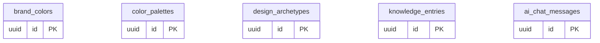
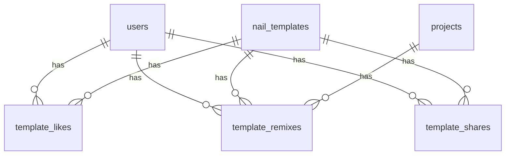

# ER Diagram

## 1. Purpose

แสดงโครงสร้างฐานข้อมูลจริงของระบบ Nail Studio 3D — ตาราง คอลัมน์ ชนิดข้อมูล
Primary Key / Foreign Key / Unique / Nullable / Default / Index และความสัมพันธ์
ระหว่างตาราง (1:1, 1:N, N:M พร้อม junction table)

## 2. Scope

ครอบคลุม **23 ตาราง** และ **14 enum** ทั้งหมดที่ประกาศใน `prisma/schema.prisma`
และมีอยู่จริงหลังรัน migration ทั้ง 12 ชุดใน `prisma/migrations/`

Database: **PostgreSQL** (`datasource db { provider = "postgresql" }`)
Prisma 7 — connection string อยู่ที่ `prisma.config.ts` (`env('DATABASE_URL')`), runtime ใช้ driver adapter `@prisma/adapter-pg`

## 3. Source Analysis

| หลักฐาน | ไฟล์ |
|---|---|
| Schema หลัก (source of truth) | `prisma/schema.prisma` |
| Migration ทั้ง 12 ชุด | `prisma/migrations/0_init/` … `20260815210000_add_registration_details/` |
| Seed ข้อมูลแคตตาล็อกสี/พาเลต/อาร์คีไทป์ | `prisma/seed.mjs`, `apps/api/src/designCatalog/seedData.ts` |
| Seed knowledge base ของ AI | `prisma/migrations/20260815200000_seed_ai_knowledge/migration.sql` |
| Prisma client ที่ generate แล้ว (ยืนยันชื่อ model) | `apps/api/src/generated/prisma/models/*.ts` (23 ไฟล์) |
| การเข้าถึงตารางจากฝั่ง Python | `apps/ai/app/repositories.py` (`knowledge_entries`, `nail_templates`, `ai_chat_messages`) |
| สคริปต์ตรวจสอบ migration | `tools/verify-migration.mjs` (`npm run db:verify`) |

รายชื่อ migration ตามลำดับ:

```text
0_init
20260812205910_add_project_draft
20260815075418_add_assets_and_thumbnail
20260815120000_add_design_catalog
20260815170000_add_nail_templates_community
20260815171000_remove_redundant_template_like_index
20260815180000_add_notifications
20260815193000_add_shop_appointments
20260815194000_add_ai_persistence
20260815195000_align_appointment_defaults
20260815200000_seed_ai_knowledge
20260815210000_add_registration_details
```

## 4. Diagram

### 4.1 ER — ภาพรวมทั้งระบบ

```mermaid
erDiagram
    users ||--o{ sessions : "has"
    users ||--o{ projects : "owns"
    users ||--o{ assets : "owns (nullable)"
    users ||--o{ nail_templates : "authors"
    users ||--o{ template_likes : "gives"
    users ||--o{ template_shares : "shares (nullable)"
    users ||--o{ template_remixes : "remixes"
    users ||--o{ template_comments : "writes"
    users ||--o{ content_reports : "reports"
    users ||--o{ notifications : "receives"
    users ||--o| shop_profiles : "is shop (1:1)"
    users ||--o{ appointments : "books as customer"
    users ||--o{ shop_reviews : "authors"
    users ||--o{ appointment_messages : "sends (nullable)"

    projects ||--o{ design_versions : "has"
    projects ||--o{ template_remixes : "created by remix"
    assets ||--o{ projects : "thumbnail (nullable)"
    assets ||--o{ nail_templates : "thumbnail (nullable)"

    design_versions ||--o{ nail_templates : "frozen source"
    design_versions ||--o{ appointments : "attached design (nullable)"

    nail_templates ||--o{ template_likes : "has"
    nail_templates ||--o{ template_shares : "has"
    nail_templates ||--o{ template_remixes : "has"
    nail_templates ||--o{ template_comments : "has"
    nail_templates ||--o{ nail_templates : "remix source (self)"

    shop_profiles ||--o{ shop_services : "offers"
    shop_profiles ||--o{ appointments : "receives"
    shop_profiles ||--o{ shop_reviews : "is reviewed"

    shop_services ||--o{ appointments : "booked (nullable)"

    appointments ||--o{ appointment_proposals : "negotiation timeline"
    appointments ||--o{ appointment_messages : "thread"
    appointments ||--o| shop_reviews : "one review (1:1)"

    users {
        uuid id PK "default uuid()"
        text email UK "NOT NULL"
        text password_hash "NOT NULL"
        user_role role "NOT NULL default 'user'"
        text display_name "NOT NULL"
        date date_of_birth "NULL"
        timestamptz terms_accepted_at "NULL"
        timestamptz created_at "default now()"
        timestamptz updated_at "@updatedAt"
    }

    sessions {
        uuid id PK
        uuid user_id FK "-> users.id ON DELETE CASCADE"
        bytea token_hash UK "SHA-256 of raw token"
        timestamptz expires_at "NOT NULL, idx"
        timestamptz last_seen_at "default now()"
        timestamptz created_at "default now()"
        text user_agent "NULL"
    }

    projects {
        uuid id PK
        uuid user_id FK "-> users.id CASCADE"
        text name "NOT NULL"
        project_status status "default 'draft'"
        int version_count "default 0"
        timestamptz created_at "default now()"
        timestamptz updated_at "@updatedAt"
        timestamptz deleted_at "NULL (soft delete)"
        uuid thumbnail_asset_id FK "-> assets.id ON DELETE SET NULL, NULL"
        jsonb draft_document "NULL (autosave target)"
        timestamptz draft_updated_at "NULL"
        int draft_base_version "NULL"
    }

    design_versions {
        uuid id PK
        uuid project_id FK "-> projects.id CASCADE"
        int version_number "UK with project_id"
        int schema_version "default 2"
        jsonb document "NOT NULL (DesignDocument)"
        text label "NULL"
        timestamptz created_at "default now()"
    }

    assets {
        uuid id PK
        uuid owner_id FK "-> users.id CASCADE, NULL"
        text kind "NOT NULL e.g. 'thumbnail'"
        text storage_key UK "NOT NULL"
        text mime_type "NOT NULL"
        bigint size_bytes "NOT NULL"
        bytea checksum_sha256 "NOT NULL, idx"
        jsonb metadata "default '{}'"
        timestamptz created_at "default now()"
    }

    nail_templates {
        uuid id PK
        uuid author_id FK "-> users.id CASCADE"
        uuid design_version_id FK "-> design_versions.id ON DELETE RESTRICT"
        text name "NOT NULL"
        text caption "NULL"
        text category "NULL"
        text primary_color "NULL"
        template_origin origin "default 'original'"
        uuid source_template_id FK "-> nail_templates.id SET NULL, NULL"
        uuid thumbnail_asset_id FK "-> assets.id SET NULL, NULL"
        template_visibility visibility "default 'public'"
        int like_count "default 0"
        int share_count "default 0"
        int remix_count "default 0"
        int view_count "default 0"
        int comment_count "default 0"
        int report_count "default 0"
        jsonb recipe "NULL"
        timestamptz created_at "default now()"
        timestamptz updated_at "@updatedAt"
        timestamptz deleted_at "NULL (soft delete)"
    }

    template_likes {
        uuid template_id PK "FK -> nail_templates.id, composite PK"
        uuid user_id PK "FK -> users.id, composite PK"
        timestamptz created_at "default now()"
    }

    template_shares {
        uuid id PK
        uuid template_id FK "-> nail_templates.id CASCADE"
        uuid user_id FK "-> users.id SET NULL, NULL"
        template_share_channel channel "NOT NULL"
        timestamptz created_at "default now()"
    }

    template_remixes {
        uuid id PK
        uuid template_id FK "-> nail_templates.id CASCADE"
        uuid user_id FK "-> users.id CASCADE"
        uuid project_id FK "-> projects.id CASCADE"
        timestamptz created_at "default now()"
    }

    template_comments {
        uuid id PK
        uuid template_id FK "-> nail_templates.id CASCADE"
        uuid user_id FK "-> users.id CASCADE"
        text content "NOT NULL"
        timestamptz created_at "default now()"
        timestamptz deleted_at "NULL"
    }

    content_reports {
        uuid id PK
        content_report_target target_type "UK part"
        uuid target_id "UK part (no FK constraint)"
        uuid reporter_id FK "-> users.id CASCADE, UK part"
        content_report_reason reason "NOT NULL"
        text detail "NULL"
        content_report_status status "default 'pending'"
        timestamptz created_at "default now()"
    }

    notifications {
        uuid id PK
        uuid user_id FK "-> users.id CASCADE"
        notification_kind kind "NOT NULL"
        text title "NOT NULL"
        text source_type "NOT NULL (no FK)"
        uuid source_id "NOT NULL (no FK)"
        boolean is_read "default false"
        timestamptz created_at "default now()"
    }

    shop_profiles {
        uuid user_id PK "FK -> users.id CASCADE, 1:1"
        text shop_name "NOT NULL"
        text description "NULL"
        text location_text "NULL"
        text_array phone_numbers "default []"
        jsonb opening_hours "NULL"
        boolean is_verified "default false"
        decimal rating_avg "Decimal(3,2) default 0"
        int rating_count "default 0"
    }

    shop_services {
        uuid id PK
        uuid shop_id FK "-> shop_profiles.user_id CASCADE"
        text name "NOT NULL"
        text description "NULL"
        decimal price_thb "Decimal(10,2) NOT NULL"
        int duration_minutes "NOT NULL"
        boolean is_active "default true"
        int sort_order "default 0"
    }

    appointments {
        uuid id PK
        uuid customer_id FK "-> users.id CASCADE"
        uuid shop_id FK "-> shop_profiles.user_id CASCADE"
        uuid service_id FK "-> shop_services.id SET NULL, NULL"
        uuid design_version_id FK "-> design_versions.id SET NULL, NULL"
        appointment_status status "default 'pending'"
        timestamptz agreed_start_at "NULL"
        int duration_minutes "NOT NULL"
        decimal price_quoted_thb "Decimal(10,2) NULL"
        text customer_note "NULL"
        text shop_note "NULL"
        timestamptz created_at "default now()"
        timestamptz updated_at "@updatedAt"
    }

    appointment_proposals {
        uuid id PK
        uuid appointment_id FK "-> appointments.id CASCADE"
        proposal_actor proposed_by "NOT NULL"
        timestamptz proposed_start_at "NOT NULL"
        int duration_minutes "NOT NULL"
        text message "NULL"
        proposal_status status "default 'pending'"
        timestamptz created_at "default now()"
    }

    appointment_messages {
        uuid id PK
        uuid appointment_id FK "-> appointments.id CASCADE"
        uuid sender_id FK "-> users.id SET NULL, NULL"
        text content "NOT NULL"
        timestamptz read_at "NULL"
        timestamptz created_at "default now()"
    }

    shop_reviews {
        uuid id PK
        uuid appointment_id FK "-> appointments.id CASCADE, UNIQUE 1:1"
        uuid shop_id FK "-> shop_profiles.user_id CASCADE"
        uuid author_id FK "-> users.id CASCADE"
        smallint rating "1..5 (บังคับใน Zod)"
        text comment "NULL"
        text shop_reply "NULL"
        timestamptz created_at "default now()"
        timestamptz deleted_at "NULL"
    }

    brand_colors {
        uuid id PK
        text brand "UK with hex"
        text name "NOT NULL"
        varchar hex "VarChar(7), UK with brand"
        boolean is_available "default true"
    }

    color_palettes {
        uuid id PK
        text code UK "NOT NULL"
        text name_th "NOT NULL"
        jsonb colors "NOT NULL"
        palette_harmony harmony "NOT NULL"
        palette_source source "default 'curated'"
        int popularity "default 0"
        boolean is_active "default true"
    }

    design_archetypes {
        uuid id PK
        text code UK "NOT NULL"
        text name_th "NOT NULL"
        text composer_key "NOT NULL"
        jsonb default_params "default '{}'"
        text_array supported_zones "NOT NULL"
        int popularity "default 0"
        boolean is_active "default true"
    }

    knowledge_entries {
        uuid id PK
        text question "NOT NULL"
        text answer "NOT NULL"
        text source_type "NULL"
        uuid source_id "NULL (no FK)"
        boolean is_active "default true"
        timestamptz created_at "default now()"
    }

    ai_chat_messages {
        uuid id PK
        uuid session_id "NOT NULL (no FK — client-generated UUID)"
        text role "NOT NULL 'user' | 'assistant'"
        text content "NOT NULL"
        timestamptz created_at "default now()"
    }
```



### 4.2 ตารางอิสระ (ไม่มี FK เชื่อมกับส่วนอื่น)



ทั้ง 5 ตารางนี้ **ไม่มี Foreign Key** เชื่อมกับตารางอื่น:
- 3 ตารางแรกเป็น **catalog / reference data** ที่ seed จาก `prisma/seed.mjs`
- `knowledge_entries.source_id` และ `ai_chat_messages.session_id` เป็น UUID **ที่ไม่มี FK constraint** โดยตั้งใจ (session ของ AI chat สร้างจากฝั่ง client ไม่ผูกกับ `sessions` ของการล็อกอิน)

## 5. Components / Actors — รายละเอียด Enum

| Enum (`@@map`) | ค่า |
|---|---|
| `user_role` | `user`, `shop`, `admin` |
| `project_status` | `draft`, `published`, `archived` |
| `palette_harmony` | `analogous`, `complementary`, `triadic`, `monochrome` |
| `palette_source` | `curated`, `extracted` |
| `template_origin` | `original`, `ai`, `remix` |
| `template_visibility` | `public`, `unlisted`, `hidden` |
| `template_share_channel` | `link`, `facebook`, `line`, `instagram`, `copy` |
| `content_report_target` | `template`, `comment` |
| `content_report_reason` | `spam`, `inappropriate`, `copyright`, `harassment`, `other` |
| `content_report_status` | `pending`, `reviewed`, `dismissed` |
| `notification_kind` | `post_like`, `post_comment`, `template_remix`, `appointment_status`, `appointment_message` |
| `appointment_status` | `pending`, `counter_offered`, `confirmed`, `declined`, `cancelled`, `completed`, `no_show` |
| `proposal_actor` | `customer`, `shop` |
| `proposal_status` | `pending`, `accepted`, `rejected`, `superseded` |

## 6. Flow / Relationship

### 6.1 ความสัมพันธ์แยกตาม Cardinality

**1 : 1**

| ความสัมพันธ์ | การบังคับใน schema |
|---|---|
| `users` — `shop_profiles` | `shop_profiles.user_id` เป็นทั้ง PK และ FK |
| `appointments` — `shop_reviews` | `shop_reviews.appointment_id` `@unique(map: "shop_reviews_appointment_key")` |

**1 : N**

| Parent | Child | FK | On delete |
|---|---|---|---|
| `users` | `sessions` | `user_id` | CASCADE |
| `users` | `projects` | `user_id` | CASCADE |
| `users` | `assets` | `owner_id` (nullable) | CASCADE |
| `users` | `nail_templates` | `author_id` | CASCADE |
| `users` | `template_comments` | `user_id` | CASCADE |
| `users` | `content_reports` | `reporter_id` | CASCADE |
| `users` | `notifications` | `user_id` | CASCADE |
| `users` | `appointments` (customer) | `customer_id` | CASCADE |
| `users` | `shop_reviews` (author) | `author_id` | CASCADE |
| `users` | `appointment_messages` | `sender_id` (nullable) | SET NULL |
| `projects` | `design_versions` | `project_id` | CASCADE |
| `assets` | `projects` (thumbnail) | `thumbnail_asset_id` (nullable) | SET NULL |
| `assets` | `nail_templates` (thumbnail) | `thumbnail_asset_id` (nullable) | SET NULL |
| `design_versions` | `nail_templates` | `design_version_id` | **RESTRICT** (กันลบเวอร์ชันที่ถูกแชร์เป็น template) |
| `design_versions` | `appointments` | `design_version_id` (nullable) | SET NULL |
| `nail_templates` | `template_comments` / `template_shares` | `template_id` | CASCADE / CASCADE |
| `nail_templates` | `nail_templates` (self, remix source) | `source_template_id` (nullable) | SET NULL |
| `shop_profiles` | `shop_services` | `shop_id` | CASCADE |
| `shop_profiles` | `appointments` | `shop_id` | CASCADE |
| `shop_profiles` | `shop_reviews` | `shop_id` | CASCADE |
| `shop_services` | `appointments` | `service_id` (nullable) | SET NULL |
| `appointments` | `appointment_proposals` | `appointment_id` | CASCADE |
| `appointments` | `appointment_messages` | `appointment_id` | CASCADE |

**N : M (พร้อม Junction Table)**

| ความสัมพันธ์ | Junction table | คีย์ | ข้อมูลเพิ่ม |
|---|---|---|---|
| `users` ↔ `nail_templates` (ถูกใจ) | **`template_likes`** | `@@id([template_id, user_id])` — composite PK กันไลก์ซ้ำที่ระดับ DB | `created_at` |
| `users` ↔ `nail_templates` (แชร์) | **`template_shares`** | `id` (surrogate) — ตั้งใจให้แชร์ซ้ำได้หลายครั้ง | `channel`, `created_at` |
| `users` ↔ `nail_templates` (รีมิกซ์) | **`template_remixes`** | `@@unique([template_id, project_id])` | ผูก `project_id` ของงานใหม่ด้วย |
| `users` ↔ target (รายงาน) | **`content_reports`** | `@@unique([target_type, target_id, reporter_id])` — หนึ่งคนรายงานได้ครั้งเดียวต่อชิ้น | `reason`, `detail`, `status` |



### 6.2 Index ทั้งหมด (นอกเหนือจาก PK/UK)

| ตาราง | Index | จุดประสงค์ (ตามคอมเมนต์ในโค้ด) |
|---|---|---|
| `sessions` | `(user_id)`, `(expires_at)` | หา session ของผู้ใช้ / กวาด session หมดอายุ |
| `projects` | `(user_id, updated_at DESC, id DESC)` | keyset pagination หน้ารายการงาน (A-14) — partial index ไม่เก็บแถวที่ถูกลบ |
| `assets` | `(owner_id, kind, created_at DESC)`, `(checksum_sha256)` | ค้น asset ของผู้ใช้ / ตรวจไฟล์ซ้ำ |
| `design_versions` | `@@unique([project_id, version_number])` | รากฐานของ optimistic concurrency |
| `brand_colors` | `@@unique([brand, hex])`, `(brand, is_available)` | |
| `color_palettes` | `code` UK, `(is_active, popularity DESC)` | |
| `design_archetypes` | `code` UK, `(is_active, popularity DESC)` | |
| `nail_templates` | `(author_id, created_at DESC)`, `(source_template_id)` | ฟีดของผู้เขียน / ไล่สายรีมิกซ์ |
| `template_likes` | `(user_id, created_at DESC)` | (index ซ้ำถูกถอดใน migration `20260815171000_remove_redundant_template_like_index`) |
| `template_shares` | `(template_id, created_at DESC)`, `(user_id, created_at DESC)` | |
| `template_remixes` | `@@unique([template_id, project_id])`, `(user_id, created_at DESC)` | |
| `template_comments` | `(template_id, created_at DESC)` | |
| `content_reports` | `@@unique([target_type, target_id, reporter_id])`, `(status, created_at DESC)` | คิว moderation |
| `notifications` | `(user_id, created_at DESC)` | กระดิ่งแจ้งเตือน |
| `shop_profiles` | `(is_verified, rating_avg DESC, rating_count DESC)` ชื่อ `shop_profiles_recommendation_idx` | จัดอันดับร้านแนะนำ |
| `shop_services` | `(shop_id, sort_order)` ชื่อ `shop_services_active_idx` | |
| `appointments` | `(customer_id, created_at DESC)`, `(shop_id, status, created_at DESC)` | รายการฝั่งลูกค้า / ฝั่งร้าน |
| `appointment_proposals` | `(appointment_id, created_at DESC)` ชื่อ `appointment_proposals_timeline_idx` | ไทม์ไลน์ต่อรอง |
| `appointment_messages` | `(appointment_id, created_at DESC)`, `(appointment_id, read_at)` | เธรดแชท / นับข้อความยังไม่อ่าน |
| `shop_reviews` | `(shop_id, created_at DESC)` ชื่อ `shop_reviews_shop_created_idx` | |
| `knowledge_entries` | `(is_active, created_at DESC)` ชื่อ `knowledge_entries_active_idx` | |
| `ai_chat_messages` | `(session_id, created_at)` ชื่อ `ai_chat_messages_session_idx` | |

### 6.3 รูปแบบข้อมูลที่ควรทราบ

| หัวข้อ | รายละเอียด |
|---|---|
| **Soft delete** | `projects.deleted_at`, `nail_templates.deleted_at`, `template_comments.deleted_at`, `shop_reviews.deleted_at` |
| **Denormalized counters** | `nail_templates.{like,share,remix,view,comment,report}_count`, `projects.version_count`, `shop_profiles.{rating_avg,rating_count}` — ทุกตัวถูก increment ภายใน `prisma.$transaction` เดียวกับการ insert |
| **JSONB payload** | `design_versions.document` และ `projects.draft_document` เก็บ **DesignDocument** ที่ validate ด้วย `designDocumentSchema` (`packages/contracts/src/design.ts`) ทุกครั้งที่อ่านและเขียน (นโยบาย "migrate ตอนอ่าน") |
| **Binary** | `sessions.token_hash` (SHA-256 ของ token) และ `assets.checksum_sha256` เป็น `Bytes`/`bytea` |
| **Money** | `shop_services.price_thb` `Decimal(10,2)`, `appointments.price_quoted_thb` `Decimal(10,2)`, `shop_profiles.rating_avg` `Decimal(3,2)` — ส่งออกทาง API เป็น **string** เสมอ (`priceThb: service.priceThb.toString()`) |
| **Timezone** | ทุกคอลัมน์เวลาเป็น `@db.Timestamptz` ยกเว้น `users.date_of_birth` ที่เป็น `@db.Date` |
| **UUID** | ทุก PK เป็น `uuid` `@default(uuid())` (สร้างฝั่งแอป ไม่ใช่ `gen_random_uuid()`) |

## 7. Source References

**Database**
- `prisma/schema.prisma` (แหล่งความจริงหลัก)
- `prisma/migrations/0_init/migration.sql` … `prisma/migrations/20260815210000_add_registration_details/migration.sql`
- `prisma/migrations/migration_lock.toml`
- `prisma/seed.mjs`, `apps/api/src/designCatalog/seedData.ts`
- `prisma.config.ts`, `tools/verify-migration.mjs`

**Tables**

```text
users                  sessions               projects
design_versions        assets                 brand_colors
color_palettes         design_archetypes      nail_templates
template_likes         template_shares        template_remixes
template_comments      content_reports        notifications
shop_profiles          shop_services          appointments
appointment_proposals  shop_reviews           appointment_messages
knowledge_entries      ai_chat_messages
```

**โค้ดที่เข้าถึงฐานข้อมูล**
- `apps/api/src/db.ts` (จุดเดียวที่สร้าง PrismaClient)
- `apps/api/src/{auth,projects,templates,notifications,users}/repository.ts`
- `apps/api/src/{appointments,shops}/service.ts` (โมดูลนี้เรียก `prisma` ตรงจาก service ไม่มี repository ชั้นแยก)
- `apps/ai/app/repositories.py` (SQL ดิบผ่าน psycopg)

**Test ที่ยืนยัน schema**
- `apps/api/src/__tests__/nailTemplates.schema.integration.test.ts`
- `apps/api/src/__tests__/designCatalog.seed.test.ts`
- `apps/api/src/__tests__/{slice1,slice2.draft,slice3.versions,appointments,notifications,users.profile,templates.*}.integration.test.ts`

## 8. Unknown / Missing Information

| ประเด็น | สถานะ / ข้อสังเกต |
|---|---|
| `nail_templates.view_count` | มีคอลัมน์และถูก **อ่าน** ใน `templates/service.ts` + `users/service.ts` แต่ **ไม่มีโค้ดใดเพิ่มค่า** — ค่าจะเป็น 0 เสมอ |
| `template_visibility = 'unlisted'` | มีใน enum และมี label ใน `ModerationPage.tsx` แต่ **ไม่มีโค้ดใดตั้งค่านี้** — ตั้งได้เฉพาะ `public` (default) และ `hidden` (auto-hide เมื่อ `report_count >= 5`) |
| `content_reports.status` | ไม่มี endpoint/โค้ดใดเปลี่ยนจาก `pending` เป็น `reviewed`/`dismissed` — คิว moderation เป็น **read-only** |
| `content_report_target = 'comment'` | มีใน enum แต่ `reportTemplate()` ฝัง `targetType: 'template'` ตายตัว — ยังไม่มีเส้นทางรายงานคอมเมนต์ |
| `content_reports.target_id` | **ไม่มี FK constraint** (เป็น polymorphic reference) — ความสมบูรณ์อ้างอิงต้องบังคับด้วยโค้ด |
| `notifications.source_type` / `source_id` | เช่นเดียวกัน — polymorphic (`'post'`, `'appointment'`) ไม่มี FK |
| `appointments.shop_note` | มีคอลัมน์แต่ไม่มี endpoint ใดเขียนค่า |
| `nail_templates.recipe` (jsonb) | มีคอลัมน์แต่ `createTemplate()` ไม่เขียนค่า — ผลลัพธ์ AI recipe ยังไม่ถูกเก็บลง template |
| `assets.metadata` | มี default `{}` แต่ไม่มีโค้ดใดใส่ค่า |
| `brand_colors`, `color_palettes`, `design_archetypes` | มีข้อมูล seed แต่ **ไม่มี API endpoint ใดอ่านตารางเหล่านี้** — ฝั่ง editor ใช้แคตตาล็อกที่ hardcode ใน `apps/web/src/3d/decorations/decorationCatalog.ts` และ `apps/ai/app/schemas.py` แทน |
| `knowledge_entries` | seed มา 3 แถวจาก migration; ไม่มี UI/endpoint สำหรับเพิ่ม-แก้ |
| `ai_chat_messages` | เขียนจาก `apps/ai` ด้วย SQL ดิบ (ไม่ผ่าน Prisma) และ **ไม่มี API ใดอ่านกลับ** — ประวัติแชทที่แสดงบน UI มาจาก state ในเบราว์เซอร์ |
| Database view / trigger / stored procedure | **NOT FOUND** ใน migration ทั้งหมด |
| Extension เช่น `pgvector` | **NOT FOUND** — `knowledge_entries` ไม่มีคอลัมน์ embedding; `apps/ai` คำนวณ embedding ใหม่ทุกครั้งใน memory |
| Partitioning / archival strategy | **UNKNOWN / NOT FOUND** |
