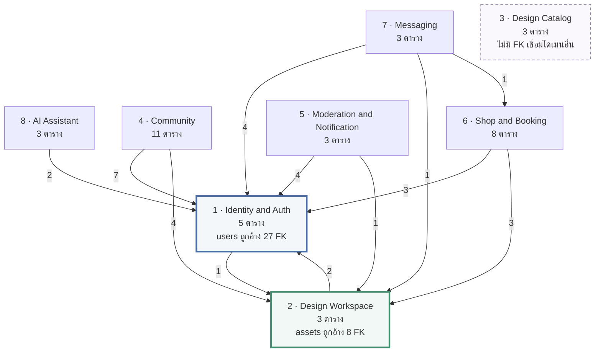

# แผนภาพระดับโดเมน — Nail Studio 3D

ภาพรวมว่าโดเมนไหนพึ่งโดเมนไหน โดยไม่ต้องดูทั้ง 39 ตาราง
ใช้เป็นภาพเปิดบทก่อนลงรายละเอียดแต่ละโดเมน (ไฟล์ `01`–`07`)

- **ไฟล์สำหรับใส่รายงาน:** [`overview-domains.svg`](overview-domains.svg) — เวกเตอร์ ขยายเท่าไรก็คมชัด แทรกใน Word / Google Docs ได้เลย
- **ไฟล์นี้:** เวอร์ชัน Mermaid สำหรับดูบน GitHub/VS Code และตัวเลขอ้างอิงทั้งหมด

ตัวเลขทั้งหมดในหน้านี้คำนวณจาก [`00-full-system.dbml`](00-full-system.dbml) ด้วย `@dbml/core`
ไม่ได้นับมือ

---

## แผนภาพ

อ่านว่า **A → B คือ A มี foreign key ชี้ไป B** (A พึ่ง B) ตัวเลขคือจำนวน foreign key

---

## จำนวนตารางต่อโดเมน

| โดเมน | ตาราง | ไฟล์ |
|---|---:|---|
| 1 · Identity & Auth | 5 | [`01-identity-auth.dbml`](01-identity-auth.dbml) |
| 2 · Design Workspace | 3 | [`02-design-workspace.dbml`](02-design-workspace.dbml) |
| 3 · Design Catalog | 3 | รวมอยู่ใน `02` |
| 4 · Community | 11 | [`03-community.dbml`](03-community.dbml) |
| 5 · Moderation & Notification | 3 | [`04-moderation-notification.dbml`](04-moderation-notification.dbml) |
| 6 · Shop & Booking | 8 | [`05-shop-booking.dbml`](05-shop-booking.dbml) |
| 7 · Messaging | 3 | [`06-messaging.dbml`](06-messaging.dbml) |
| 8 · AI Assistant | 3 | [`07-ai-assistant.dbml`](07-ai-assistant.dbml) |
| **รวม** | **39** | |

ความสัมพันธ์ทั้งหมด 65 เส้น — อยู่ภายในโดเมนเดียวกัน 32 เส้น ข้ามโดเมน 33 เส้น

---

## รายละเอียดเส้นข้ามโดเมน 33 เส้น

| จาก | ไป | จำนวน | foreign key |
|---|---|---:|---|
| 4 · Community | 1 · Identity | 7 | `nail_templates.author_id`, `template_likes.user_id`, `template_ratings.user_id`, `template_comments.user_id`, `template_share_links.created_by`, `template_share_events.user_id`, `template_remixes.user_id` |
| 4 · Community | 2 · Workspace | 4 | `nail_templates.design_version_id`, `nail_templates.thumbnail_asset_id`, `template_comments.image_asset_id`, `template_remixes.project_id` |
| 5 · Moderation | 1 · Identity | 4 | `content_reports.reporter_id`, `content_reports.reviewed_by`, `notifications.user_id`, `user_notification_settings.user_id` |
| 5 · Moderation | 2 · Workspace | 1 | `content_reports.evidence_asset_id` |
| 6 · Shop & Booking | 1 · Identity | 3 | `shop_profiles.user_id`, `appointments.customer_id`, `shop_reviews.author_id` |
| 6 · Shop & Booking | 2 · Workspace | 3 | `appointments.design_version_id`, `appointments.reference_asset_id`, `shop_reviews.image_asset_id` |
| 7 · Messaging | 1 · Identity | 4 | `conversations.participant_a_id`, `conversations.participant_b_id`, `conversations.created_by_id`, `conversation_messages.sender_id` |
| 7 · Messaging | 2 · Workspace | 1 | `message_attachments.asset_id` |
| 7 · Messaging | 6 · Shop & Booking | 1 | `conversations.appointment_id` |
| 8 · AI Assistant | 1 · Identity | 2 | `ai_chat_sessions.user_id`, `knowledge_entries.created_by` |
| 1 · Identity | 2 · Workspace | 1 | `users.avatar_asset_id` |
| 2 · Workspace | 1 · Identity | 2 | `projects.user_id`, `assets.owner_id` |

---

## สิ่งที่แผนภาพนี้บอก

**1. มีโดเมนฐานสองตัวที่ทุกอย่างพึ่ง**

`users` ถูกอ้างจาก 27 foreign key ใน 7 โดเมน และ `assets` ถูกอ้างจาก 8 foreign key ใน 6 โดเมน
สองตารางนี้คือจุดที่ห้ามออกแบบพลาด เพราะแก้ทีหลังกระทบทั้งระบบ

**2. โดเมน 1 กับ 2 อ้างถึงกันสองทาง**

`users.avatar_asset_id → assets` และ `projects.user_id → users` / `assets.owner_id → users`
เป็นวงอ้างอิง (circular reference) ที่ยอมรับได้ เพราะ `users.avatar_asset_id` และ `assets.owner_id`
เป็น nullable ทั้งคู่ จึงแทรกข้อมูลตั้งต้นได้โดยไม่ติด constraint

**3. Design Catalog ไม่เชื่อมกับใครเลย**

`brand_colors`, `color_palettes`, `design_archetypes` เป็นข้อมูลตั้งต้นที่ระบบอ่านอย่างเดียว
ไม่ผูกกับผู้ใช้คนไหน จึงลบทิ้งแล้ว seed ใหม่ได้โดยไม่กระทบข้อมูลผู้ใช้

**4. Messaging เป็นโดเมนเดียวที่พึ่งโดเมนที่ไม่ใช่ฐาน**

`conversations.appointment_id → appointments` — ห้องแชทที่เกิดจากการจอง
เป็นเส้นข้ามแนวนอนเส้นเดียวในระบบ ถ้าตัดออกก็ยังใช้งานได้ (คอลัมน์เป็น nullable)

**5. Community เป็นโดเมนที่ใหญ่ที่สุด**

11 ตาราง และมีเส้นออก 11 เส้น มากกว่าโดเมนอื่นเท่าตัว
สอดคล้องกับที่เป็นฟีเจอร์หลักของระบบ
