# Sequence Diagram — ระบบ Editor (ทั้งระบบ)

## 1. Purpose

แสดงลำดับการทำงานจริงภายใน **ระบบ Editor** ทั้งหมด ตั้งแต่ผู้ใช้แตะหน้าจอ →
ตัวควบคุม event → designStore → HistoryStack/Command → NailTextureSet →
วัสดุและ mesh ของ three.js → ภาพที่เห็นบนจอ

## 2. Scope

| # | Sequence | ประเภท |
|---|---|---|
| ED-01 | เปิด Editor และเตรียมฉาก 3 มิติ | Bootstrap |
| ED-02 | เลือกเล็บ (แถบนิ้ว / คีย์ลัด / คลิกบนโมเดล) | Interaction |
| ED-03 | ควบคุมกล้อง — จ่อเล็บ / ซูม / ดูทั้งมือ | Interaction |
| ED-04 | วาดเส้นบนโมเดล 3 มิติ | Core editing |
| ED-05 | วาดเส้นบนแผงแบน 2 มิติ | Core editing |
| ED-06 | เส้นทางเท็กซ์เจอร์ — จากเอกสารสู่ผิวเล็บ | Rendering |
| ED-07 | จัดการเลเยอร์ | Core editing |
| ED-08 | ปรับคุณสมบัติเล็บ (ทรง / ความยาว / ผิว / สีพื้น) | Core editing |
| ED-09 | ปรับมือ (สีผิว / สัดส่วน) | Core editing |
| ED-10 | ของตกแต่ง — เพิ่ม / เลือก / ลาก / ย่อขยาย / ลบ | Core editing |
| ED-11 | ล้างลายเล็บ และคัดลอกเล็บไปทุกนิ้ว | Bulk edit |
| ED-12 | Undo / Redo | History |
| ED-13 | คีย์ลัดเครื่องมือ และตารางคีย์ลัด | Interaction |
| ED-14 | AI Assistant — ถาม AI แล้วยืนยันคำสั่ง | AI |
| ED-15 | AI Recipe — สร้าง 3 แบบแล้วนำไปใช้ | AI |
| ED-16 | ส่งออกไฟล์ PNG / JSON | Export |
| ED-17 | WebGL ล้มเหลว + ลองใหม่ และการคืนทรัพยากรตอนออก | Resilience |

**อยู่นอกขอบเขตเอกสารนี้ (ตามที่กำหนด):** Project Create / List / Open /
Update / Delete, Autosave, Save Version, Version History, Upload Asset, Get Asset

## 3. Source Analysis

| Sequence | ไฟล์หลักฐาน |
|---|---|
| ED-01, ED-17 | `apps/web/src/pages/EditorPage.tsx`, `features/design/{DesignStoreProvider,NailEditor}.tsx`, `3d/scene/{WebGlGuard,NailScene,DesignScene}.tsx`, `3d/models/{HandModel.tsx,PartsRegistry.ts}` |
| ED-02, ED-03 | `features/design/{NailStrip,ViewportControls}.tsx`, `features/design/fingerShortcuts.ts`, `3d/scene/{NailFocus,CameraZoom}.tsx`, `3d/scene/{nailViews,cameraPresets}.ts` |
| ED-04, ED-05, ED-06 | `3d/painting/{PaintController.tsx,NailTextureSet.ts,brush.ts,picking.ts,simplify.ts,layers.ts,rasterizer.ts,uvMapping.ts,useNailTextures.ts}`, `features/design/NailCanvas2D.tsx`, `3d/painting/nailFlatten.ts` |
| ED-07, ED-08, ED-11, ED-12 | `features/design/designStore.ts`, `3d/history/{HistoryStack.ts,Command.ts}`, `3d/history/commands/*.ts`, `features/design/{LayerPanel,PaintToolbar,NailShapePanel,HistoryControls}.tsx` |
| ED-09 | `3d/models/{useHandProportions.ts,handProportions.ts}`, `features/design/HandPanel.tsx` |
| ED-10 | `3d/interactions/TransformController.tsx`, `3d/decorations/{DecorationInstances.tsx,decorationPicking.ts,decorationCatalog.ts}`, `3d/geometry/{surfaceProjection.ts,pointInHull.ts,nailHulls.ts}`, `features/design/DecorationPanel.tsx` |
| ED-13 | `features/design/{toolShortcuts.ts,fingerShortcuts.ts,historyShortcuts.ts,ShortcutsDialog.tsx}` |
| ED-14, ED-15 | `features/ai/{AiAssistantPanel.tsx,aiClient.ts}`, `3d/generation/{composer.ts,scatter.ts,colorRules.ts}` |
| ED-16 | `3d/scene/{SnapshotCapture.tsx,exporters/exportProjectJson.ts}`, `utils/downloadBlob.ts` |

---

## 4. Diagram

### ED-01 — เปิด Editor และเตรียมฉาก 3 มิติ

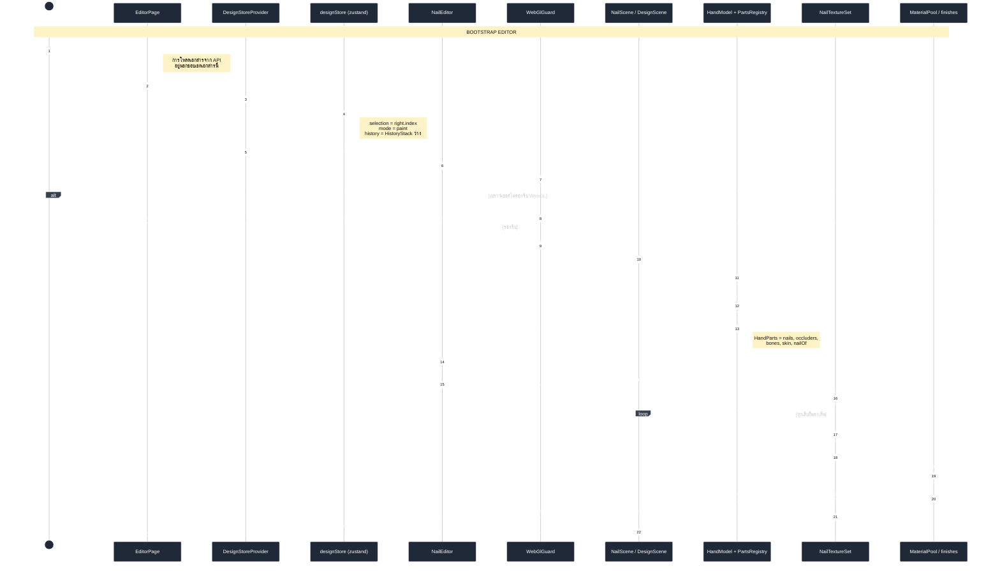
```mermaid
---
config:
  theme: dark
  sequence:
    actorFontSize: 24
    messageFontSize: 22
    noteFontSize: 20
    actorMargin: 100
    width: 220
    height: 65
    messageMargin: 45
    wrap: true
  themeVariables:
    fontFamily: Arial, sans-serif
    fontSize: 22px
    actorBkg: "#1f2937"
    actorBorder: "#ffffff"
    actorTextColor: "#ffffff"
    signalColor: "#ffffff"
    signalTextColor: "#ffffff"
    labelBoxBkgColor: "#374151"
    labelBoxBorderColor: "#ffffff"
    labelTextColor: "#ffffff"
    noteBkgColor: "#fef3c7"
    noteBorderColor: "#ffffff"
    noteTextColor: "#111111"
---
sequenceDiagram
    autonumber

    actor U as User
    participant EP as EditorPage
    participant DSP as DesignStoreProvider
    participant ST as designStore (zustand)
    participant NE as NailEditor
    participant WG as WebGlGuard
    participant SC as NailScene / DesignScene
    participant HM as HandModel + PartsRegistry
    participant TEX as NailTextureSet
    participant MAT as MaterialPool / finishes

    Note over U,MAT: BOOTSTRAP EDITOR

    U->>EP: เปิด /editor/:projectId
    Note right of EP: การโหลดเอกสารจาก API<br/>อยู่นอกขอบเขตเอกสารนี้

    EP->>DSP: mount key = projectId
    DSP->>ST: createDesignStore({ document })
    ST-->>DSP: store พร้อมใช้
    Note right of ST: selection = right.index<br/>mode = paint<br/>history = HistoryStack ว่าง

    DSP->>NE: render editor
    NE->>WG: render ฉาก 3 มิติ
    WG->>WG: supportsWebGl()

    alt เบราว์เซอร์ไม่รองรับ WebGL
        WG-->>U: แจ้ง "เบราว์เซอร์นี้ไม่รองรับ WebGL"
    else รองรับ
        WG->>SC: Canvas dpr 1 ถึง 1.5 + preserveDrawingBuffer
        SC->>HM: useGLTF('/models/hand.glb')
        HM->>HM: clone material ผิวมือจากต้นฉบับ GLTF
        HM->>HM: buildPartsRegistry(scene, EDITABLE_HAND)
        HM-->>NE: onReady(parts)
        Note right of HM: HandParts = nails, occluders,<br/>bones, skin, nailOf

        NE->>NE: computeNailHulls(parts)
        NE->>TEX: useNailTextures(parts)
        TEX->>TEX: setVisibleNails(keys)

        loop ทุกเล็บที่มองเห็น
            TEX->>TEX: surfaceOf(key) → rebuild(key)
            TEX-->>MAT: composite(key) → CanvasTexture
            MAT->>MAT: nailMaterialKey(finish) → acquire จาก pool
            MAT->>SC: mesh.material + applyNailMorphs(shape, length)
        end

        TEX->>ST: subscribe(document) เพื่อ rebuild เฉพาะเล็บที่เปลี่ยน
        SC-->>U: เห็นมือ 3 มิติ พร้อมวาดได้ทันที
    end
```

---

### ED-02 — เลือกเล็บ

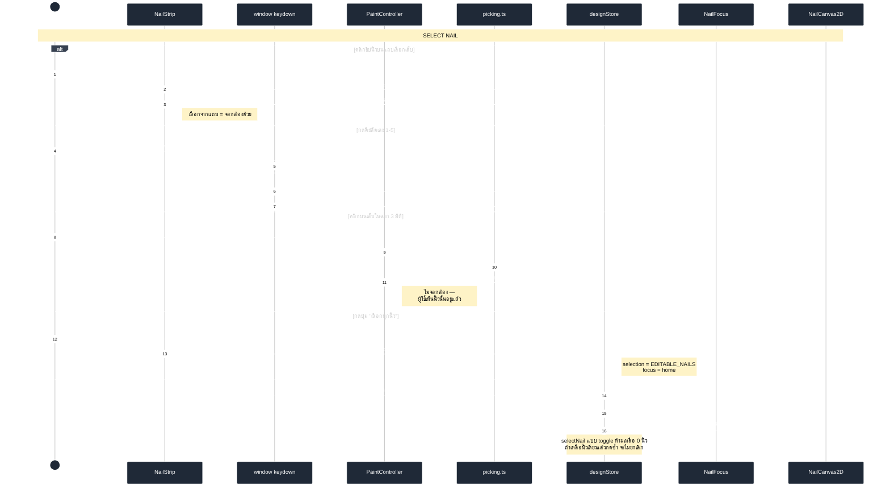
```mermaid
---
config:
  theme: dark
  sequence:
    actorFontSize: 24
    messageFontSize: 22
    noteFontSize: 20
    actorMargin: 100
    width: 220
    height: 65
    messageMargin: 45
    wrap: true
  themeVariables:
    fontFamily: Arial, sans-serif
    fontSize: 22px
    actorBkg: "#1f2937"
    actorBorder: "#ffffff"
    actorTextColor: "#ffffff"
    signalColor: "#ffffff"
    signalTextColor: "#ffffff"
    labelBoxBkgColor: "#374151"
    labelBoxBorderColor: "#ffffff"
    labelTextColor: "#ffffff"
    noteBkgColor: "#fef3c7"
    noteBorderColor: "#ffffff"
    noteTextColor: "#111111"
---
sequenceDiagram
    autonumber

    actor U as User
    participant NS as NailStrip
    participant KB as window keydown
    participant PC as PaintController
    participant PK as picking.ts
    participant ST as designStore
    participant NF as NailFocus
    participant C2 as NailCanvas2D

    Note over U,C2: SELECT NAIL

    alt คลิกชิปนิ้วบนแถบเลือกเล็บ
        U->>NS: click ชิปนิ้ว
        NS->>ST: selectNail(key, shift/ctrl ? toggle : replace)
        NS->>ST: focusNail(key)
        Note right of NS: เลือกจากแถบ = จ่อกล้องด้วย
    else กดคีย์ลัดเลข 1-5
        U->>KB: keydown '1'..'5'
        KB->>KB: fingerIndexFromShortcut(event)
        KB->>ST: selectNail(key, replace)
        KB->>ST: focusNail(key)
    else คลิกบนเล็บในฉาก 3 มิติ
        U->>PC: pointerdown บน canvas
        PC->>PK: pickNail(hits, nailOf, pressure)
        PK-->>PC: { key, point }
        PC->>ST: selectNail(key, shiftKey ? toggle : replace)
        Note right of PC: ไม่จ่อกล้อง — ผู้ใช้เห็นนิ้วนั้นอยู่แล้ว
    else กดปุ่ม "เลือกทุกนิ้ว"
        U->>NS: click เลือกทุกนิ้ว
        NS->>ST: selectAll()
        Note right of ST: selection = EDITABLE_NAILS<br/>focus = home
    end

    ST-->>NS: selection ใหม่ (ไฮไลต์ชิป)
    ST-->>NF: focus ใหม่ → เคลื่อนกล้อง (ดู ED-03)
    ST-->>C2: primaryOf(selection) เปลี่ยน → คลี่เล็บใหม่ลงแผงแบน

    Note over ST: selectNail แบบ toggle ห้ามเหลือ 0 นิ้ว<br/>ถ้าเหลือนิ้วเดียวแล้วกดซ้ำ จะไม่ยกเลิก
```

---

### ED-03 — ควบคุมกล้อง (จ่อเล็บ / ซูม / ดูทั้งมือ)

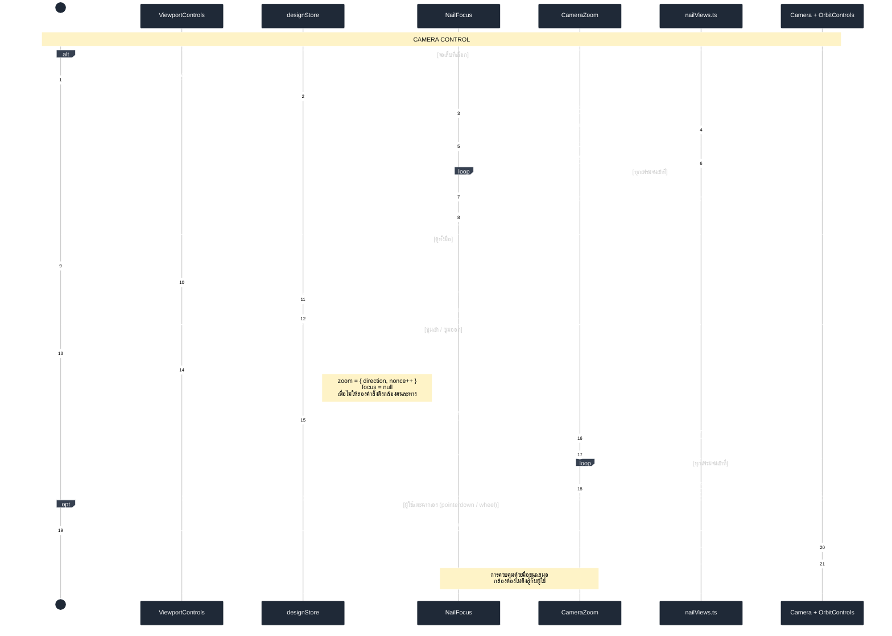
```mermaid
---
config:
  theme: dark
  sequence:
    actorFontSize: 24
    messageFontSize: 22
    noteFontSize: 20
    actorMargin: 100
    width: 220
    height: 65
    messageMargin: 45
    wrap: true
  themeVariables:
    fontFamily: Arial, sans-serif
    fontSize: 22px
    actorBkg: "#1f2937"
    actorBorder: "#ffffff"
    actorTextColor: "#ffffff"
    signalColor: "#ffffff"
    signalTextColor: "#ffffff"
    labelBoxBkgColor: "#374151"
    labelBoxBorderColor: "#ffffff"
    labelTextColor: "#ffffff"
    noteBkgColor: "#fef3c7"
    noteBorderColor: "#ffffff"
    noteTextColor: "#111111"
---
sequenceDiagram
    autonumber

    actor U as User
    participant VC as ViewportControls
    participant ST as designStore
    participant NF as NailFocus
    participant CZ as CameraZoom
    participant NV as nailViews.ts
    participant CAM as Camera + OrbitControls

    Note over U,CAM: CAMERA CONTROL

    alt จ่อเล็บที่เลือก
        U->>ST: focusNail(key)
        ST-->>NF: focus = { kind: nail, key }
        NF->>NV: nailViewOf(mesh)
        NV-->>NF: center, radius, normal (คิดจาก morph ปัจจุบัน)
        NF->>NV: cameraForNail(view, fov)
        NV-->>NF: ตำแหน่งกล้องเป้าหมาย
        loop ทุกเฟรมจนเข้าที่
            NF->>CAM: lerp position/target ด้วย DAMPING = 12
        end
        NF->>NF: ถึงเป้าหมาย (< 1e-4) แล้วหยุดคำนวณ
    else ดูทั้งมือ
        U->>VC: click "ดูทั้งมือ"
        VC->>ST: focusHome()
        ST-->>NF: focus = home → กลับ HOME_POSITION / HOME_TARGET
        ST-->>CZ: focus ไม่ว่าง → ยกเลิกเป้าหมายซูมที่ค้างอยู่
    else ซูมเข้า / ซูมออก
        U->>VC: click ซูมเข้า หรือ ซูมออก
        VC->>ST: zoomBy(direction)
        Note right of ST: zoom = { direction, nonce++ }<br/>focus = null เพื่อไม่ให้สองคำสั่งดึงกล้องคนละทาง
        ST-->>CZ: zoom request ใหม่
        CZ->>CAM: distance × 0.75 หรือ ÷ 0.75 ภายใน MIN/MAX_DISTANCE
        CZ->>ST: clearZoom()
        loop ทุกเฟรมจนเข้าที่
            CZ->>CAM: ขยับระยะกล้องแบบหน่วง
        end
    end

    opt ผู้ใช้แตะฉากเอง (pointerdown / wheel)
        U->>CAM: หมุนหรือซูมด้วยมือ
        CAM-->>NF: cancel → goal = null + clearFocus()
        CAM-->>CZ: cancel → goal = null
        Note over NF,CZ: การควบคุมด้วยมือชนะเสมอ<br/>กล้องต้องไม่ดึงสู้กับผู้ใช้
    end
```

---

### ED-04 — วาดเส้นบนโมเดล 3 มิติ

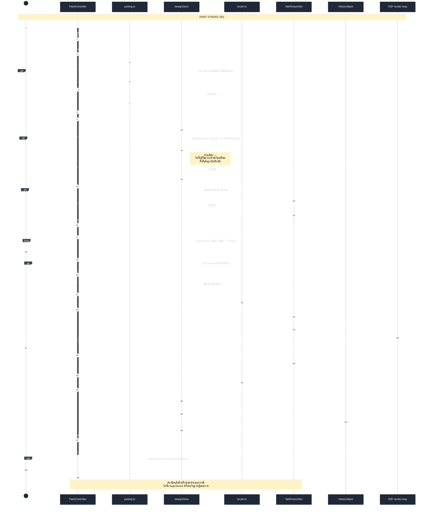
```mermaid
---
config:
  theme: dark
  sequence:
    actorFontSize: 24
    messageFontSize: 22
    noteFontSize: 20
    actorMargin: 100
    width: 220
    height: 65
    messageMargin: 45
    wrap: true
  themeVariables:
    fontFamily: Arial, sans-serif
    fontSize: 22px
    actorBkg: "#1f2937"
    actorBorder: "#ffffff"
    actorTextColor: "#ffffff"
    signalColor: "#ffffff"
    signalTextColor: "#ffffff"
    labelBoxBkgColor: "#374151"
    labelBoxBorderColor: "#ffffff"
    labelTextColor: "#ffffff"
    noteBkgColor: "#fef3c7"
    noteBorderColor: "#ffffff"
    noteTextColor: "#111111"
---
sequenceDiagram
    autonumber

    actor U as User
    participant PC as PaintController
    participant PK as picking.ts
    participant ST as designStore
    participant BR as brush.ts
    participant TEX as NailTextureSet
    participant HS as HistoryStack
    participant R3F as R3F render loop

    Note over U,R3F: PAINT STROKE (3D)

    U->>PC: pointerdown บนเล็บ
    activate PC
    PC->>PC: เก็บ getBoundingClientRect ไว้ทั้งเส้น
    PC->>PK: pointerToNdc + raycaster.intersectObjects(nails + occluders)
    PK->>PK: ดูเฉพาะ hit อันแรกเท่านั้น
    alt hit อันแรกไม่ใช่เล็บ (มีนิ้วอื่นบัง)
        PK-->>PC: null
        PC-->>U: ไม่เริ่มเส้น
    else โดนเล็บ
        PK-->>PC: { key, point(u, v, pressure) }
        PC->>ST: selectNail(key) ถ้ายังไม่ถูกเลือก
        PC->>ST: beginPaint()
        ST->>ST: paintTargetsOf(state) ตรวจทุกนิ้วที่เลือก

        alt เลเยอร์ถูกซ่อน / opacity = 0 / เส้นเต็มเพดาน
            ST-->>PC: null + ตั้ง notice บอกเหตุผล
            Note right of ST: ห้ามเงียบ — ไม่งั้นผู้ใช้ลากแล้วจอไม่เปลี่ยน<br/>ทั้งที่เส้นถูกบันทึกจริง
        else วาดได้
            ST-->>PC: Map(nailKey → layerIndex)
            PC->>TEX: beginStroke(selection, layerIndexes, erase, owner = '3d')
            alt มีเส้นค้างของอีกโหมด
                TEX-->>PC: false → ยกเลิก
            else รับได้
                TEX-->>PC: true
                PC->>PC: ปิด OrbitControls + setPointerCapture
                PC->>BR: createDabAccumulator(settings)

                loop pointermove (ข้ามการขยับ < 0.75px)
                    U->>PC: pointermove
                    PC->>PK: raycast ซ้ำ
                    alt ลากออกนอกเล็บที่เริ่มไว้
                        PC->>PC: เงียบไว้ ไม่จบเส้น (ลากกลับมาต่อได้)
                    else ยังอยู่บนเล็บเดิม
                        PC->>BR: dabs.append(point)
                        BR-->>PC: เฉพาะแต้มใหม่ที่ยังไม่เคยส่ง
                        PC->>TEX: paintDabs(fresh, color, softness)
                        TEX->>TEX: drawDabs ลงแคนวาส wet ทันที
                        TEX->>R3F: schedule rebuildWetTargets 1 ครั้ง/เฟรม
                        R3F-->>U: เห็นเส้นสดตามปลายนิ้ว
                    end
                end

                U->>PC: pointerup
                PC->>TEX: endStroke('3d')
                TEX->>TEX: ล้าง wet + rebuild ทุกเล็บเป้าหมาย
                PC->>BR: simplifyPath(points) + settingsToStroke(settings)
                BR-->>PC: Stroke
                PC->>ST: addStroke(stroke)
                ST->>ST: paintTargetsOf ตรวจซ้ำ (เลเยอร์ถูกซ่อนกลางคันได้)
                ST->>HS: execute(AddStrokeCommand ต่อทุกนิ้วที่เลือก)
                HS-->>ST: document ใหม่ + recorded
                ST-->>TEX: document เปลี่ยน → rebuild(key) (ดู ED-06)
                PC->>PC: เปิด OrbitControls + releasePointerCapture
            end
        end
    end
    deactivate PC

    opt pointercancel / lostpointercapture
        U-->>PC: เส้นถูกยกเลิก
        PC->>TEX: endStroke('3d') เสมอ ไม่ commit เส้น
        Note over PC,TEX: ต้องปิดเส้นฝั่งเท็กซ์เจอร์ก่อนทุกกรณี<br/>ไม่งั้น beginStroke ครั้งต่อไปถูกปฏิเสธถาวร
    end
```

---

### ED-05 — วาดเส้นบนแผงแบน 2 มิติ

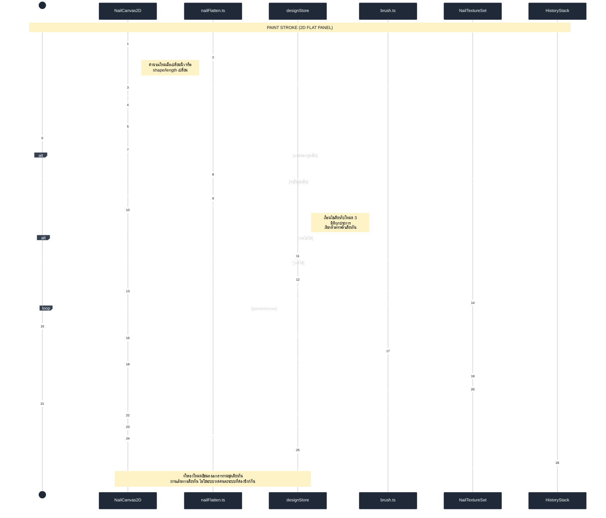
```mermaid
---
config:
  theme: dark
  sequence:
    actorFontSize: 24
    messageFontSize: 22
    noteFontSize: 20
    actorMargin: 100
    width: 220
    height: 65
    messageMargin: 45
    wrap: true
  themeVariables:
    fontFamily: Arial, sans-serif
    fontSize: 22px
    actorBkg: "#1f2937"
    actorBorder: "#ffffff"
    actorTextColor: "#ffffff"
    signalColor: "#ffffff"
    signalTextColor: "#ffffff"
    labelBoxBkgColor: "#374151"
    labelBoxBorderColor: "#ffffff"
    labelTextColor: "#ffffff"
    noteBkgColor: "#fef3c7"
    noteBorderColor: "#ffffff"
    noteTextColor: "#111111"
---
sequenceDiagram
    autonumber

    actor U as User
    participant C2 as NailCanvas2D
    participant FL as nailFlatten.ts
    participant ST as designStore
    participant BR as brush.ts
    participant TEX as NailTextureSet
    participant HS as HistoryStack

    Note over U,HS: PAINT STROKE (2D FLAT PANEL)

    C2->>FL: flattenNail(mesh, VIEW = 512, TEX_SIZE)
    FL-->>C2: สามเหลี่ยมที่คลี่แล้ว + transform
    Note right of C2: คำนวณใหม่เมื่อเปลี่ยนนิ้ว หรือ shape/length เปลี่ยน

    C2->>TEX: composite(activeKey)
    C2->>C2: วาดทีละสามเหลี่ยม + clip + SEAM_BLEED 0.5px
    C2-->>U: เห็นรูปบนแผงตรงกับรูปบนเล็บจริง

    U->>C2: pointerdown บนแผง
    C2->>FL: panelToTexture(shape, x, y)
    alt แตะนอกรูปเล็บ
        FL-->>C2: null → ไม่เริ่มเส้น
    else อยู่ในรูปเล็บ
        FL-->>C2: texel → pixelToUv → toPaintPoint(u, v, pressure)
        C2->>ST: beginPaint()
        Note right of ST: เงื่อนไขเดียวกับโหมด 3 มิติทุกประการ<br/>เรียกตัวตรวจตัวเดียวกัน
        alt วาดไม่ได้
            ST-->>C2: null + notice
        else วาดได้
            ST-->>C2: Map(nailKey → layerIndex)
            C2->>TEX: beginStroke(selection, layerIndexes, erase, owner = '2d')
            TEX-->>C2: true
            loop pointermove
                U->>C2: ลากบนแผง
                C2->>BR: settingsToDabs(points, settings, TEX_SIZE)
                BR-->>C2: dabs (พิกัดของเท็กซ์เจอร์ ไม่ใช่ของแผง)
                C2->>TEX: paintDabs(dabs ที่ยังไม่ส่ง, color, softness)
                TEX-->>C2: onUpdate(key) → repaint แผง
                TEX-->>U: เห็นเส้นสดทั้งบนแผงและบนโมเดล 3 มิติพร้อมกัน
            end
            U->>C2: pointerup
            C2->>TEX: endStroke('2d')
            C2->>BR: simplifyPath + settingsToStroke
            C2->>ST: addStroke(stroke)
            ST->>HS: execute(AddStrokeCommand)
            HS-->>ST: document ใหม่
        end
    end

    Note over C2,ST: ทั้งสองโหมดเขียนลงเอกสารงานชุดเดียวกัน<br/>ผ่านเส้นทางเดียวกัน ไม่ใช่ระบบวาดคนละระบบที่ต้องซิงก์กัน
```

---

### ED-06 — เส้นทางเท็กซ์เจอร์ จากเอกสารสู่ผิวเล็บ

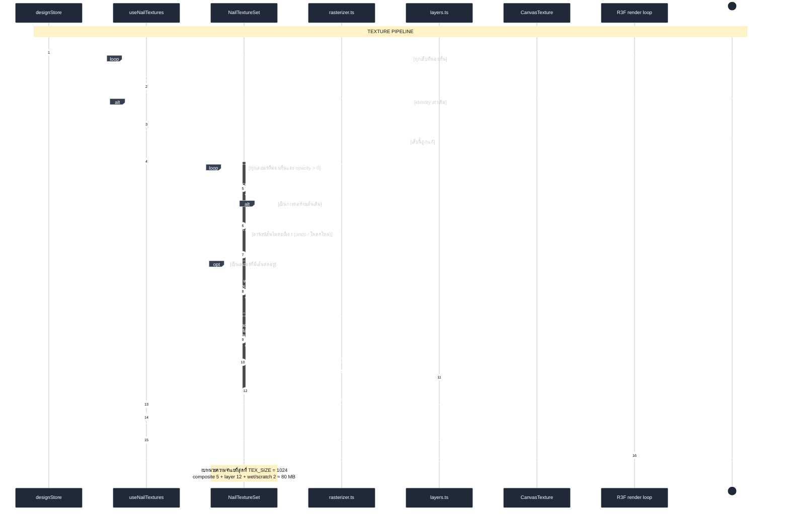
```mermaid
---
config:
  theme: dark
  sequence:
    actorFontSize: 24
    messageFontSize: 22
    noteFontSize: 20
    actorMargin: 100
    width: 220
    height: 65
    messageMargin: 45
    wrap: true
  themeVariables:
    fontFamily: Arial, sans-serif
    fontSize: 22px
    actorBkg: "#1f2937"
    actorBorder: "#ffffff"
    actorTextColor: "#ffffff"
    signalColor: "#ffffff"
    signalTextColor: "#ffffff"
    labelBoxBkgColor: "#374151"
    labelBoxBorderColor: "#ffffff"
    labelTextColor: "#ffffff"
    noteBkgColor: "#fef3c7"
    noteBorderColor: "#ffffff"
    noteTextColor: "#111111"
---
sequenceDiagram
    autonumber

    participant ST as designStore
    participant UNT as useNailTextures
    participant TEX as NailTextureSet
    participant RAS as rasterizer.ts
    participant LAY as layers.ts
    participant CT as CanvasTexture
    participant R3F as R3F render loop
    actor U as User

    Note over ST,U: TEXTURE PIPELINE

    ST-->>UNT: subscribe → document เปลี่ยน
    loop ทุกเล็บที่มองเห็น
        UNT->>UNT: เทียบ identity ของเล็บนี้กับเอกสารก่อนหน้า
        alt identity เท่าเดิม
            UNT->>UNT: ข้าม (O(5) ต่อการแก้ไขหนึ่งครั้ง)
        else เล็บนี้ถูกแก้
            UNT->>TEX: rebuild(key)
            activate TEX
            loop ทุกเลเยอร์ที่มองเห็นและ opacity > 0
                TEX->>TEX: layerSurface(key, layer)
                alt เป็นการต่อท้ายเส้นเดิม
                    TEX->>RAS: renderStroke เฉพาะเส้นใหม่
                else อาร์เรย์เส้นไม่ต่อเนื่อง (undo / โหลดใหม่)
                    TEX->>RAS: renderLayer วาดใหม่ทั้งเลเยอร์
                end
                opt เป็นเลเยอร์ที่มีเส้นสดอยู่
                    TEX->>TEX: ผสมแคนวาส wet ลง scratch<br/>(destination-out เมื่อเป็นยางลบ)
                end
            end
            TEX->>TEX: dropDeadLayers + evictColdSurfaces (เพดาน 12 แคนวาส)
            TEX->>LAY: compositeLayers(sources, size, baseColor)
            LAY-->>TEX: composite ทึบพร้อมใช้เป็นเท็กซ์เจอร์
            TEX-->>UNT: onUpdate(key)
            deactivate TEX
            UNT->>CT: map.needsUpdate = true
            UNT->>UNT: syncFinish(key) + syncShape(key)
            UNT->>R3F: invalidate() ผ่าน LiveTextureInvalidator
            R3F-->>U: เฟรมใหม่ที่เห็นสีบนเล็บ
        end
    end

    Note over TEX: งบหน่วยความจำแย่ที่สุดที่ TEX_SIZE = 1024<br/>composite 5 + layer 12 + wet/scratch 2 ≈ 80 MB
```

---

### ED-07 — จัดการเลเยอร์

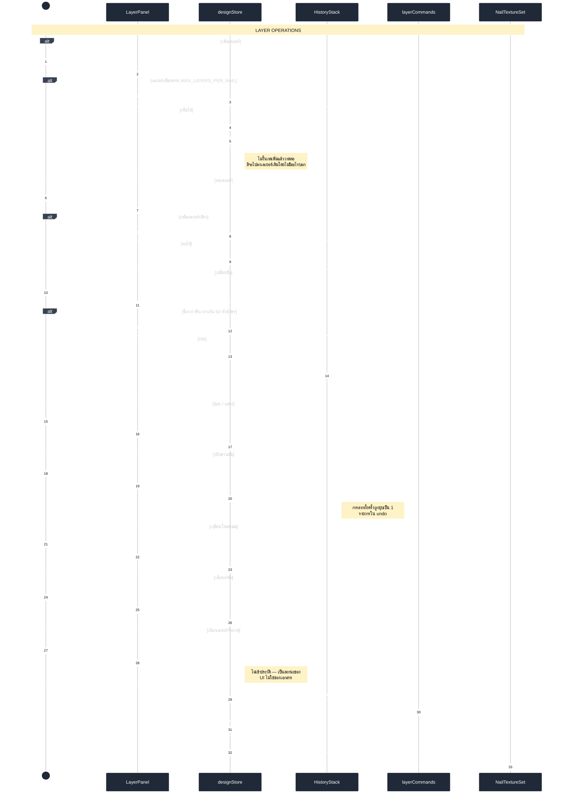
```mermaid
---
config:
  theme: dark
  sequence:
    actorFontSize: 24
    messageFontSize: 22
    noteFontSize: 20
    actorMargin: 100
    width: 220
    height: 65
    messageMargin: 45
    wrap: true
  themeVariables:
    fontFamily: Arial, sans-serif
    fontSize: 22px
    actorBkg: "#1f2937"
    actorBorder: "#ffffff"
    actorTextColor: "#ffffff"
    signalColor: "#ffffff"
    signalTextColor: "#ffffff"
    labelBoxBkgColor: "#374151"
    labelBoxBorderColor: "#ffffff"
    labelTextColor: "#ffffff"
    noteBkgColor: "#fef3c7"
    noteBorderColor: "#ffffff"
    noteTextColor: "#111111"
---
sequenceDiagram
    autonumber

    actor U as User
    participant LP as LayerPanel
    participant ST as designStore
    participant HS as HistoryStack
    participant CMD as layerCommands
    participant TEX as NailTextureSet

    Note over U,TEX: LAYER OPERATIONS

    alt เพิ่มเลเยอร์
        U->>LP: click "เพิ่มเลเยอร์"
        LP->>ST: addLayer(key, layer)
        alt เลเยอร์เต็มเพดาน MAX_LAYERS_PER_NAIL
            ST-->>U: notice "เล็บหนึ่งนิ้วมีได้สูงสุด N เลเยอร์"
        else เพิ่มได้
            ST->>HS: execute(AddLayerCommand)
            ST->>ST: ตั้งเลเยอร์ใหม่เป็นเลเยอร์ที่ใช้งานทันที
            Note right of ST: ไม่งั้นกดเพิ่มแล้ววาดต่อ<br/>สีจะไปลงเลเยอร์เดิมโดยไม่มีอะไรบอก
        end
    else ลบเลเยอร์
        U->>LP: click ลบ
        LP->>ST: removeLayer(key, layerId)
        alt เหลือเลเยอร์เดียว
            ST-->>U: notice "ต้องมีอย่างน้อย 1 เลเยอร์"
        else ลบได้
            ST->>HS: execute(RemoveLayerCommand)
        end
    else เปลี่ยนชื่อ
        U->>LP: แก้ชื่อแล้ว blur
        LP->>ST: renameLayer(..., mergeKey = layer-name:key:id)
        alt ชื่อว่าง หรือ ยาวเกิน 60 ตัวอักษร
            ST-->>U: notice บอกเหตุผล
        else ผ่าน
            ST->>HS: execute(RenameLayerCommand)
            HS->>HS: merge กับคำสั่งก่อนหน้าถ้าอยู่ใน 500ms
        end
    else ซ่อน / แสดง
        U->>LP: toggle แสดง
        LP->>ST: setLayerVisibility(...)
        ST->>HS: execute(SetLayerVisibilityCommand)
    else ปรับความทึบ
        U->>LP: ลากสไลเดอร์
        LP->>ST: setLayerOpacity(..., mergeKey)
        ST->>HS: execute(SetLayerOpacityCommand)
        Note right of HS: การลากทั้งครั้งถูกยุบเป็น 1 รายการใน undo
    else เปลี่ยนโหมดผสม
        U->>LP: เลือก normal / multiply / screen
        LP->>ST: setLayerBlend(...)
        ST->>HS: execute(SetLayerBlendCommand)
    else เลื่อนลำดับ
        U->>LP: click ขึ้น / ลง
        LP->>ST: moveLayer(key, layerId, toIndex)
        ST->>HS: execute(MoveLayerCommand)
    else เลือกเลเยอร์ที่จะวาด
        U->>LP: click ชื่อเลเยอร์
        LP->>ST: selectLayer(key, id)
        Note right of ST: ไม่เข้าประวัติ — เป็นสถานะของ UI ไม่ใช่ของเอกสาร
    end

    ST->>CMD: do(document) คืนเอกสารใหม่แบบ immutable
    CMD-->>ST: { document, affects }
    ST->>ST: repairActiveLayerIds(before, after, activeLayerIds)
    ST-->>TEX: document เปลี่ยน → rebuild(key)
    TEX-->>U: เห็นผลบนเล็บทันที
```

---

### ED-08 — ปรับคุณสมบัติเล็บ (ทรง / ความยาว / ผิว / สีพื้น)

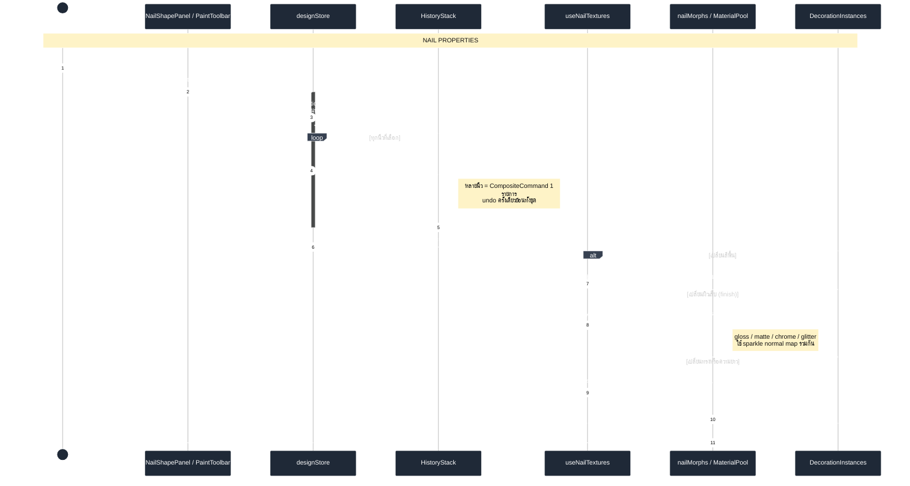
```mermaid
---
config:
  theme: dark
  sequence:
    actorFontSize: 24
    messageFontSize: 22
    noteFontSize: 20
    actorMargin: 100
    width: 220
    height: 65
    messageMargin: 45
    wrap: true
  themeVariables:
    fontFamily: Arial, sans-serif
    fontSize: 22px
    actorBkg: "#1f2937"
    actorBorder: "#ffffff"
    actorTextColor: "#ffffff"
    signalColor: "#ffffff"
    signalTextColor: "#ffffff"
    labelBoxBkgColor: "#374151"
    labelBoxBorderColor: "#ffffff"
    labelTextColor: "#ffffff"
    noteBkgColor: "#fef3c7"
    noteBorderColor: "#ffffff"
    noteTextColor: "#111111"
---
sequenceDiagram
    autonumber

    actor U as User
    participant NP as NailShapePanel / PaintToolbar
    participant ST as designStore
    participant HS as HistoryStack
    participant UNT as useNailTextures
    participant MRP as nailMorphs / MaterialPool
    participant DEC as DecorationInstances

    Note over U,DEC: NAIL PROPERTIES

    U->>NP: เลือกทรง / ความยาว / ผิว / สีพื้น
    NP->>ST: setShape | setLength | setFinish | setBaseColor (+ mergeKey)
    activate ST
    ST->>ST: editableSelection(selection) — ลงพร้อมกันทุกนิ้วที่เลือก
    loop ทุกนิ้วที่เลือก
        ST->>HS: execute(Set...Command(key, before, after, mergeKey))
    end
    Note right of HS: หลายนิ้ว = CompositeCommand 1 รายการ<br/>undo ครั้งเดียวย้อนทั้งชุด
    HS-->>ST: document ใหม่ + recorded
    deactivate ST

    ST-->>UNT: document เปลี่ยน
    alt เปลี่ยนสีพื้น
        UNT->>MRP: rebuild(key) → compositeLayers ใช้ baseColor ใหม่
    else เปลี่ยนผิวเล็บ (finish)
        UNT->>MRP: syncFinish → nailMaterialKey → acquire/release จาก pool
        Note right of MRP: gloss / matte / chrome / glitter<br/>ใช้ sparkle normal map ร่วมกัน
    else เปลี่ยนทรงหรือความยาว
        UNT->>MRP: syncShape → applyNailMorphs(mesh, shape, length)
        MRP-->>DEC: ผิวเล็บขยับ → projectUvToSurface คำนวณตำแหน่งของตกแต่งใหม่
    end

    MRP-->>U: เห็นเล็บเปลี่ยนทันทีทุกนิ้วที่เลือก
```

---

### ED-09 — ปรับมือ (สีผิว / สัดส่วน)

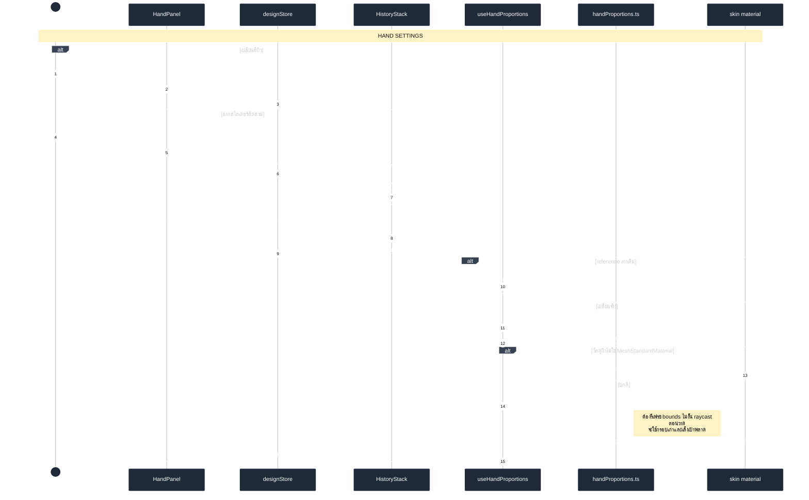
```mermaid
---
config:
  theme: dark
  sequence:
    actorFontSize: 24
    messageFontSize: 22
    noteFontSize: 20
    actorMargin: 100
    width: 220
    height: 65
    messageMargin: 45
    wrap: true
  themeVariables:
    fontFamily: Arial, sans-serif
    fontSize: 22px
    actorBkg: "#1f2937"
    actorBorder: "#ffffff"
    actorTextColor: "#ffffff"
    signalColor: "#ffffff"
    signalTextColor: "#ffffff"
    labelBoxBkgColor: "#374151"
    labelBoxBorderColor: "#ffffff"
    labelTextColor: "#ffffff"
    noteBkgColor: "#fef3c7"
    noteBorderColor: "#ffffff"
    noteTextColor: "#111111"
---
sequenceDiagram
    autonumber

    actor U as User
    participant HP as HandPanel
    participant ST as designStore
    participant HS as HistoryStack
    participant UHP as useHandProportions
    participant BONE as handProportions.ts
    participant SKIN as skin material

    Note over U,SKIN: HAND SETTINGS

    alt เปลี่ยนสีผิว
        U->>HP: เลือกสีผิว
        HP->>ST: setSkinTone(hex)
        ST->>HS: execute(SetSkinToneCommand)
    else ลากสไลเดอร์สัดส่วน
        U->>HP: ลาก (ความยาวนิ้ว / ความหนา / ขนาดมือ)
        HP->>ST: setProportions(partial, mergeKey)
        ST->>HS: execute(SetProportionsCommand(before, after, mergeKey))
        HS->>HS: merge ภายใน 500ms → การลากทั้งครั้งเป็น 1 รายการ
    end

    HS-->>ST: document.hand ใหม่
    ST-->>UHP: subscribe → shouldApplyHand(current, last)
    alt reference เท่าเดิม
        UHP->>UHP: ข้าม ไม่ทำงานซ้ำทุก re-render
    else เปลี่ยนจริง
        UHP->>BONE: applyProportions(parts.bones, proportions)
        UHP->>SKIN: material.color.set(skinTone)
        alt วัสดุผิวไม่ใช่ MeshStandardMaterial
            SKIN-->>UHP: throw — ผิดสัญญาของ pipeline โมเดล
        else ปกติ
            UHP->>BONE: refreshSkinnedBounds(skinnedMeshes)
            Note right of BONE: ต้องรีเฟรช bounds ไม่งั้น raycast ตอนวาด<br/>จะใช้กรอบเก่าและเล็งเป้าพลาด
        end
    end

    UHP-->>U: มือเปลี่ยนรูปและสีทันที
```

---

### ED-10 — ของตกแต่ง (เพิ่ม / เลือก / ลาก / ย่อขยาย / ลบ)

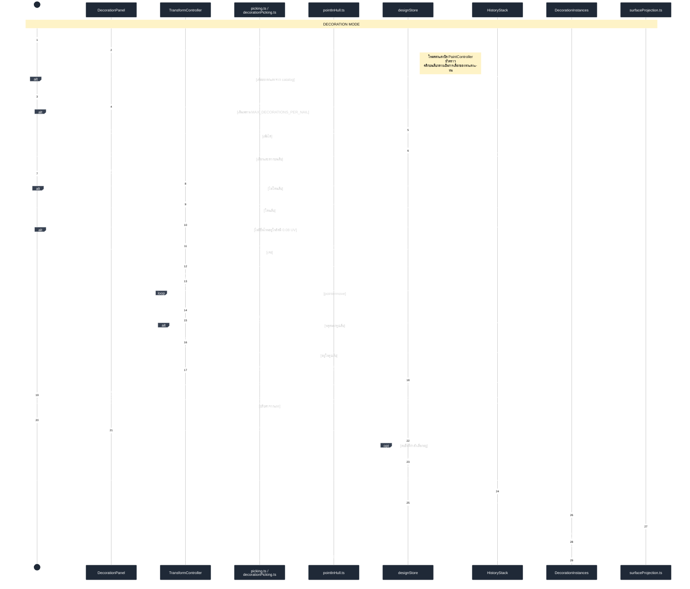
```mermaid
---
config:
  theme: dark
  sequence:
    actorFontSize: 24
    messageFontSize: 22
    noteFontSize: 20
    actorMargin: 100
    width: 220
    height: 65
    messageMargin: 45
    wrap: true
  themeVariables:
    fontFamily: Arial, sans-serif
    fontSize: 22px
    actorBkg: "#1f2937"
    actorBorder: "#ffffff"
    actorTextColor: "#ffffff"
    signalColor: "#ffffff"
    signalTextColor: "#ffffff"
    labelBoxBkgColor: "#374151"
    labelBoxBorderColor: "#ffffff"
    labelTextColor: "#ffffff"
    noteBkgColor: "#fef3c7"
    noteBorderColor: "#ffffff"
    noteTextColor: "#111111"
---
sequenceDiagram
    autonumber

    actor U as User
    participant DP as DecorationPanel
    participant TC as TransformController
    participant PK as picking.ts / decorationPicking.ts
    participant HULL as pointInHull.ts
    participant ST as designStore
    participant HS as HistoryStack
    participant DI as DecorationInstances
    participant SP as surfaceProjection.ts

    Note over U,SP: DECORATION MODE

    U->>DP: เปิดแท็บ "ตกแต่ง"
    DP->>ST: setMode('decorate')
    Note right of ST: โหมดตกแต่งปิด PaintController ชั่วคราว<br/>คลิกบนเล็บกลายเป็นการเลือกของตกแต่งแทน

    alt เพิ่มของตกแต่งจาก catalog
        U->>DP: click ชิ้นงานใน catalog
        DP->>ST: addDecoration(key, { catalogId, u: 0.5, v: 0.5, rotation: 0, scale: 0.3 })
        alt เต็มเพดาน MAX_DECORATIONS_PER_NAIL
            ST-->>U: notice "เล็บหนึ่งนิ้วมีได้สูงสุด N ชิ้น"
        else เพิ่มได้
            ST->>HS: execute(AddDecorationCommand)
        end
    else เลือกและลากบนเล็บ
        U->>TC: pointerdown บนฉาก
        TC->>PK: pickNail(hits, nailOf, 1)
        alt ไม่โดนเล็บ
            TC->>ST: selectDecoration(null)
        else โดนเล็บ
            TC->>PK: nearestDecoration(decorations, u, v)
            alt ไม่มีชิ้นไหนอยู่ในรัศมี 0.08 UV
                TC->>ST: selectDecoration(null)
            else เจอ
                TC->>ST: selectDecoration({ key, decorationId })
                TC->>TC: เริ่มลาก + ปิด OrbitControls + setPointerCapture
                loop pointermove
                    TC->>PK: raycast หา UV ใหม่บนเล็บเดิม
                    TC->>HULL: isPointInHull(hull, point)
                    alt หลุดนอกรูปเล็บ
                        TC->>TC: ค้างตำแหน่งเดิม ไม่ commit
                    else อยู่ในรูปเล็บ
                        TC->>ST: moveDecoration(..., mergeKey = decoration-drag-timestamp)
                        ST->>HS: execute(MoveDecorationCommand) + merge
                    end
                end
                U->>TC: pointerup → คืน OrbitControls
            end
        end
    else ปรับค่าจากแผง
        U->>DP: ปรับหมุน / ย่อขยาย / ลบ
        DP->>ST: moveDecoration | scaleDecoration | removeDecoration
        ST->>HS: execute(Move / Scale / RemoveDecorationCommand)
        opt ลบชิ้นที่กำลังเลือกอยู่
            ST->>ST: selectedDecoration = null
        end
    end

    HS-->>ST: document ใหม่
    ST-->>DI: document เปลี่ยน → rebuild instance matrices
    DI->>SP: projectUvToSurface(mesh, u, v) ต่อชิ้น
    SP-->>DI: position / normal / tangent บนผิวเล็บจริง
    DI->>DI: เขียน instanceMatrix, slot ที่ไม่ใช้ตั้ง scale = 0
    DI-->>U: ของตกแต่งเกาะผิวเล็บตามทรงและสัดส่วนมือปัจจุบัน
```

---

### ED-11 — ล้างลายเล็บ และคัดลอกเล็บไปทุกนิ้ว

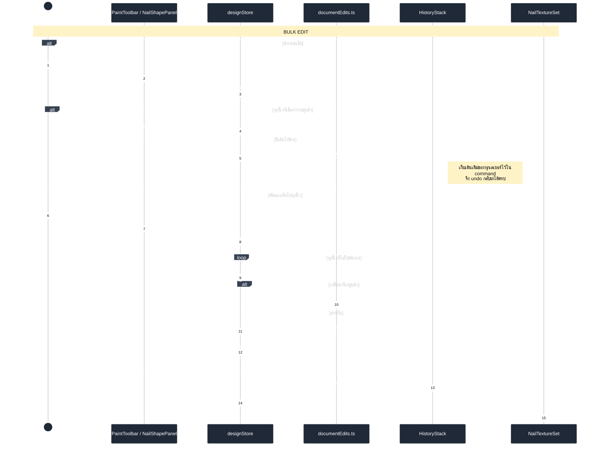
```mermaid
---
config:
  theme: dark
  sequence:
    actorFontSize: 24
    messageFontSize: 22
    noteFontSize: 20
    actorMargin: 100
    width: 220
    height: 65
    messageMargin: 45
    wrap: true
  themeVariables:
    fontFamily: Arial, sans-serif
    fontSize: 22px
    actorBkg: "#1f2937"
    actorBorder: "#ffffff"
    actorTextColor: "#ffffff"
    signalColor: "#ffffff"
    signalTextColor: "#ffffff"
    labelBoxBkgColor: "#374151"
    labelBoxBorderColor: "#ffffff"
    labelTextColor: "#ffffff"
    noteBkgColor: "#fef3c7"
    noteBorderColor: "#ffffff"
    noteTextColor: "#111111"
---
sequenceDiagram
    autonumber

    actor U as User
    participant TB as PaintToolbar / NailShapePanel
    participant ST as designStore
    participant DE as documentEdits.ts
    participant HS as HistoryStack
    participant TEX as NailTextureSet

    Note over U,TEX: BULK EDIT

    alt ล้างลายเล็บ
        U->>TB: click "ล้างลายเล็บ"
        TB->>ST: clearSelectedNails()
        ST->>ST: คัดเฉพาะนิ้วที่มีเส้นอยู่จริง
        alt ทุกนิ้วที่เลือกว่างอยู่แล้ว
            ST-->>U: ไม่ทำอะไร ไม่เพิ่มรายการในประวัติ
        else มีเส้นให้ล้าง
            ST->>HS: execute(CompositeCommand ของ ClearNailCommand)
            Note right of HS: เก็บเส้นเดิมของทุกเลเยอร์ไว้ใน command<br/>จึง undo กลับมาได้ครบ
        end
    else คัดลอกเล็บไปทุกนิ้ว
        U->>TB: click "ใช้กับทุกนิ้ว"
        TB->>ST: copyActiveNailToAll()
        ST->>ST: source = primaryOf(selection)
        loop ทุกนิ้วที่ไม่ใช่ต้นทาง
            ST->>DE: nailsMatch(target, source)
            alt เหมือนกันอยู่แล้ว
                DE-->>ST: ข้าม
            else ต่างกัน
                ST->>HS: execute(CopyNailCommand(key, before, source))
            end
        end
        ST->>ST: selection = ทุกนิ้ว
    end

    HS-->>ST: document ใหม่
    ST-->>TEX: rebuild เฉพาะเล็บที่ identity เปลี่ยน
    TEX-->>U: เห็นผลทั้งมือ
```

---

### ED-12 — Undo / Redo

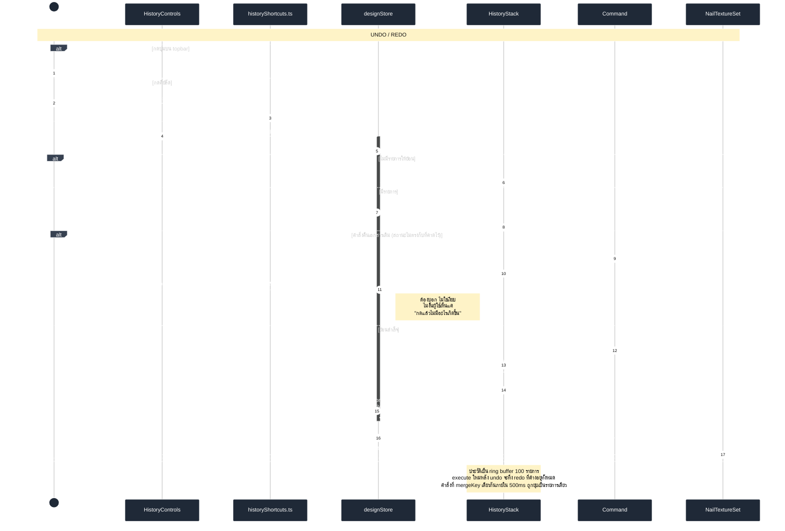
```mermaid
---
config:
  theme: dark
  sequence:
    actorFontSize: 24
    messageFontSize: 22
    noteFontSize: 20
    actorMargin: 100
    width: 220
    height: 65
    messageMargin: 45
    wrap: true
  themeVariables:
    fontFamily: Arial, sans-serif
    fontSize: 22px
    actorBkg: "#1f2937"
    actorBorder: "#ffffff"
    actorTextColor: "#ffffff"
    signalColor: "#ffffff"
    signalTextColor: "#ffffff"
    labelBoxBkgColor: "#374151"
    labelBoxBorderColor: "#ffffff"
    labelTextColor: "#ffffff"
    noteBkgColor: "#fef3c7"
    noteBorderColor: "#ffffff"
    noteTextColor: "#111111"
---
sequenceDiagram
    autonumber

    actor U as User
    participant HC as HistoryControls
    participant KB as historyShortcuts.ts
    participant ST as designStore
    participant HS as HistoryStack
    participant CMD as Command
    participant TEX as NailTextureSet

    Note over U,TEX: UNDO / REDO

    alt กดปุ่มบน topbar
        U->>HC: click ย้อนกลับ / ทำซ้ำ
    else กดคีย์ลัด
        U->>KB: Ctrl+Z หรือ Ctrl+Shift+Z / Ctrl+Y
        KB->>HC: undo / redo
    end

    HC->>ST: undo()
    activate ST
    ST->>HS: state().canUndo ?
    alt ไม่มีรายการให้ย้อน
        HS-->>ST: false → เงียบ ไม่ทำอะไร
    else มีรายการ
        ST->>HS: undo(document)
        HS->>CMD: entry.command.undo(document)
        alt คำสั่งคืนเอกสารเดิม (สถานะไม่ตรงกับที่คาดไว้)
            CMD-->>HS: applied = false, cursor ไม่ขยับ
            HS-->>ST: applied = false
            ST-->>U: notice "ย้อนกลับไม่ได้ — ประวัติไม่ตรงกับงานบนหน้าจอแล้ว"
            Note right of ST: ต้องบอก ไม่ใช่เงียบ<br/>ไม่งั้นผู้ใช้เห็นแค่ "กดแล้วไม่มีอะไรเกิดขึ้น"
        else ย้อนสำเร็จ
            CMD-->>HS: document ก่อนหน้า + affects
            HS->>HS: cursor -= 1
            HS-->>ST: { document, applied: true }
            ST->>ST: revision++ และ repairActiveLayerIds
            deactivate ST
            ST-->>TEX: rebuild เฉพาะเล็บที่เปลี่ยน
            TEX-->>U: เห็นงานย้อนกลับ
        end
    end

    Note over HS: ประวัติเป็น ring buffer 100 รายการ<br/>execute ใหม่หลัง undo จะทิ้ง redo ที่ค้างอยู่ทั้งหมด<br/>คำสั่งที่ mergeKey เดียวกันภายใน 500ms ถูกยุบเป็นรายการเดียว
```

---

### ED-13 — คีย์ลัดเครื่องมือ และตารางคีย์ลัด

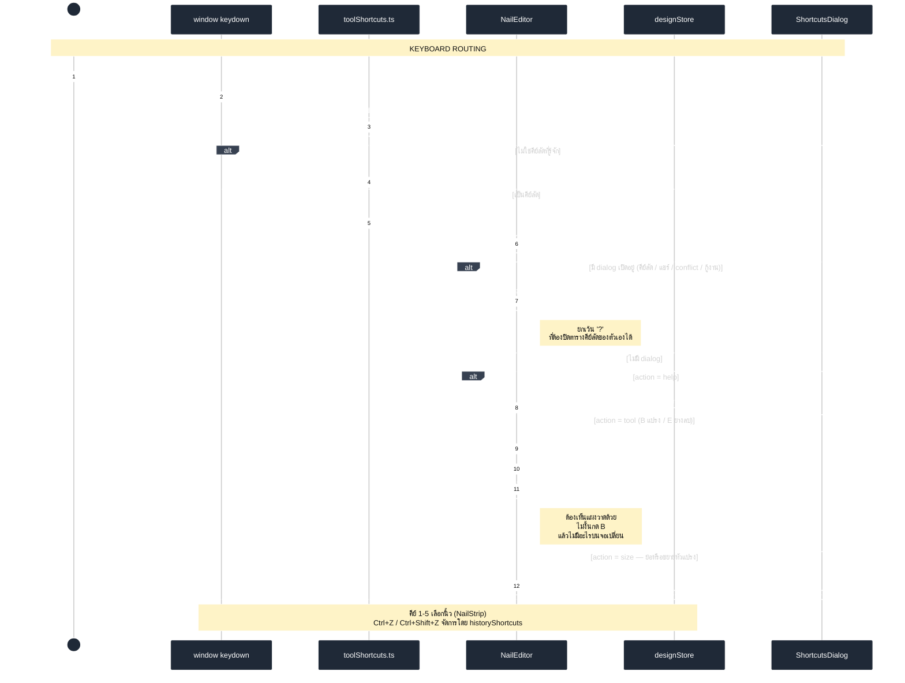
```mermaid
---
config:
  theme: dark
  sequence:
    actorFontSize: 24
    messageFontSize: 22
    noteFontSize: 20
    actorMargin: 100
    width: 220
    height: 65
    messageMargin: 45
    wrap: true
  themeVariables:
    fontFamily: Arial, sans-serif
    fontSize: 22px
    actorBkg: "#1f2937"
    actorBorder: "#ffffff"
    actorTextColor: "#ffffff"
    signalColor: "#ffffff"
    signalTextColor: "#ffffff"
    labelBoxBkgColor: "#374151"
    labelBoxBorderColor: "#ffffff"
    labelTextColor: "#ffffff"
    noteBkgColor: "#fef3c7"
    noteBorderColor: "#ffffff"
    noteTextColor: "#111111"
---
sequenceDiagram
    autonumber

    actor U as User
    participant KB as window keydown
    participant TS as toolShortcuts.ts
    participant NE as NailEditor
    participant ST as designStore
    participant SD as ShortcutsDialog

    Note over U,SD: KEYBOARD ROUTING

    U->>KB: กดคีย์
    KB->>TS: toolShortcutFrom(event)
    TS->>TS: keyboardTarget — อยู่ในช่องกรอกข้อความหรือไม่
    alt ไม่ใช่คีย์ลัดที่รู้จัก
        TS-->>KB: null → ปล่อยผ่าน
    else เป็นคีย์ลัด
        TS-->>NE: action = tool หรือ size หรือ help
        NE->>NE: modalOpen ?
        alt มี dialog เปิดอยู่ (คีย์ลัด / แชร์ / conflict / กู้งาน)
            NE->>NE: กลืนคีย์ทิ้ง
            Note right of NE: ยกเว้น '?' ที่ต้องปิดตารางคีย์ลัดของตัวเองได้
        else ไม่มี dialog
            alt action = help
                NE->>SD: เปิด / ปิดตารางคีย์ลัด
            else action = tool (B แปรง / E ยางลบ)
                NE->>ST: setSettings({ tool })
                NE->>ST: setMode('paint')
                NE->>NE: เปิดแผง "วาด"
                Note right of NE: ต้องเห็นแผงวาดด้วย<br/>ไม่งั้นกด B แล้วไม่มีอะไรบนจอเปลี่ยน
            else action = size — ย่อหรือขยายหัวแปรง
                NE->>ST: setSettings({ size: clamp(size ± SIZE_STEP) })
            end
        end
    end

    Note over KB,ST: คีย์ 1-5 เลือกนิ้ว (NailStrip)<br/>Ctrl+Z / Ctrl+Shift+Z จัดการโดย historyShortcuts
```

---

### ED-14 — AI Assistant (ถาม AI แล้วยืนยันคำสั่ง)

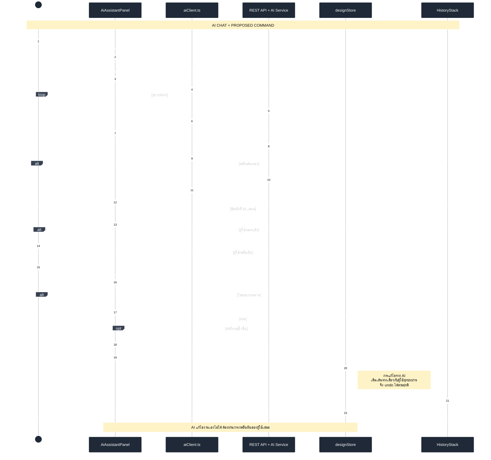
```mermaid
---
config:
  theme: dark
  sequence:
    actorFontSize: 24
    messageFontSize: 22
    noteFontSize: 20
    actorMargin: 100
    width: 220
    height: 65
    messageMargin: 45
    wrap: true
  themeVariables:
    fontFamily: Arial, sans-serif
    fontSize: 22px
    actorBkg: "#1f2937"
    actorBorder: "#ffffff"
    actorTextColor: "#ffffff"
    signalColor: "#ffffff"
    signalTextColor: "#ffffff"
    labelBoxBkgColor: "#374151"
    labelBoxBorderColor: "#ffffff"
    labelTextColor: "#ffffff"
    noteBkgColor: "#fef3c7"
    noteBorderColor: "#ffffff"
    noteTextColor: "#111111"
---
sequenceDiagram
    autonumber

    actor U as User
    participant AP as AiAssistantPanel
    participant AC as aiClient.ts
    participant API as REST API + AI Service
    participant ST as designStore
    participant HS as HistoryStack

    Note over U,HS: AI CHAT + PROPOSED COMMAND

    U->>AP: พิมพ์คำสั่งแล้วกด "ถาม AI"
    AP->>AP: รวม editorContext (นิ้วที่เลือก, สี, ทรง, ผิว)
    AP->>AC: streamAiChat({ sessionId, message, editorContext })
    AC->>API: SSE stream

    loop ทุก token
        API-->>AC: event token
        AC-->>AP: ต่อข้อความคำตอบ
        AP-->>U: เห็นคำตอบไหลทีละคำ
    end

    API-->>AC: event meta (intent, confidence, proposed_command)
    AC-->>AP: เก็บ pendingCommand

    alt สตรีมล้มเหลว
        API-->>AC: error
        AC-->>AP: throw
        AP-->>U: "AI ไม่พร้อมใช้งานชั่วคราว"
    else มีคำสั่งที่ AI เสนอ
        AP-->>U: การ์ด "AI เสนอการแก้ไข" พร้อมปุ่มยืนยัน / ยกเลิก
        alt ผู้ใช้กดยกเลิก
            U->>AP: ยกเลิก → pendingCommand = null
        else ผู้ใช้กดยืนยัน
            U->>AP: ยืนยัน
            AP->>AP: ตรวจ type = SetNailColor และ value ตรงรูปแบบ hex 6 หลัก
            alt ไม่ผ่านการตรวจ
                AP-->>U: "คำสั่งสีจาก AI ไม่ผ่านการตรวจสอบ"
            else ผ่าน
                opt คำสั่งระบุนิ้วอื่น
                    AP->>ST: selectNail(command.nail)
                end
                AP->>ST: setBaseColor(command.value)
                ST->>HS: execute(SetBaseColorCommand)
                Note right of ST: การแก้ไขจาก AI เดินเส้นทางเดียวกับผู้ใช้ทุกประการ<br/>จึง undo ได้ตามปกติ
                HS-->>ST: document ใหม่
                ST-->>U: เห็นสีเปลี่ยนบนเล็บ
            end
        end
    end

    Note over AP,ST: AI แก้ไขงานเองไม่ได้ ต้องผ่านการกดยืนยันของผู้ใช้เสมอ
```

---

### ED-15 — AI Recipe (สร้าง 3 แบบแล้วนำไปใช้)

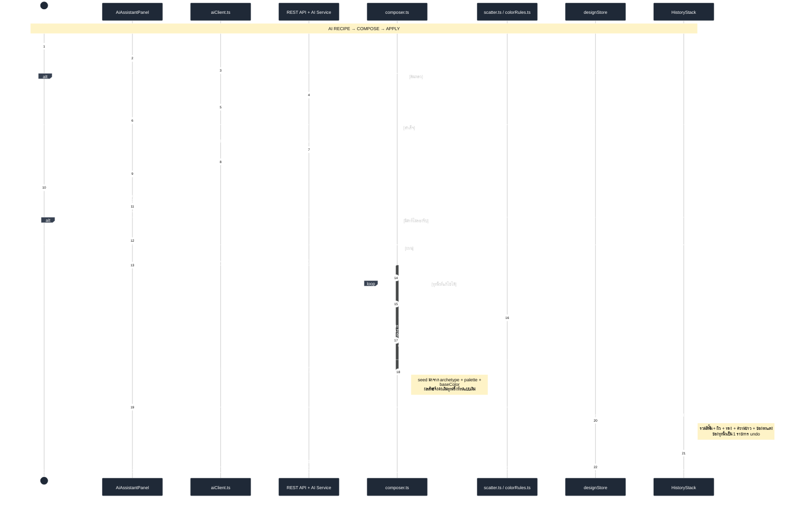
```mermaid
---
config:
  theme: dark
  sequence:
    actorFontSize: 24
    messageFontSize: 22
    noteFontSize: 20
    actorMargin: 100
    width: 220
    height: 65
    messageMargin: 45
    wrap: true
  themeVariables:
    fontFamily: Arial, sans-serif
    fontSize: 22px
    actorBkg: "#1f2937"
    actorBorder: "#ffffff"
    actorTextColor: "#ffffff"
    signalColor: "#ffffff"
    signalTextColor: "#ffffff"
    labelBoxBkgColor: "#374151"
    labelBoxBorderColor: "#ffffff"
    labelTextColor: "#ffffff"
    noteBkgColor: "#fef3c7"
    noteBorderColor: "#ffffff"
    noteTextColor: "#111111"
---
sequenceDiagram
    autonumber

    actor U as User
    participant AP as AiAssistantPanel
    participant AC as aiClient.ts
    participant API as REST API + AI Service
    participant CP as composer.ts
    participant SCT as scatter.ts / colorRules.ts
    participant ST as designStore
    participant HS as HistoryStack

    Note over U,HS: AI RECIPE → COMPOSE → APPLY

    U->>AP: พิมพ์โจทย์แล้วกด "สร้าง 3 แบบ"
    AP->>AC: generateAiRecipes(prompt, 3)
    AC->>API: ขอ recipe
    alt ล้มเหลว
        API-->>AC: error
        AC-->>AP: throw
        AP-->>U: "ไม่สามารถสร้างตัวเลือกดีไซน์ได้"
    else สำเร็จ
        API-->>AC: choices[] (archetype, paletteId, baseColor, finish, shape, length, zones, density)
        AC-->>AP: AiRecipeResponse
        AP-->>U: การ์ดตัวเลือก 3 แบบ

        U->>AP: click การ์ดที่ต้องการ
        AP->>AP: ตรวจ baseColor hex, finish, shape, length ว่าอยู่ในชุดที่รองรับ
        alt มีค่าที่ไม่รองรับ
            AP-->>U: "Recipe จาก AI มีค่าที่ไม่รองรับ"
        else ผ่าน
            AP->>CP: composeFromRecipe(recipe, hulls, seedFromRecipe(recipe))
            activate CP
            CP->>SCT: evaluateColorHarmony(palette) → เลือกสีเน้น
            loop ทุกนิ้วที่แก้ไขได้
                CP->>SCT: poissonDiskInHull(hull, radius, seed ผสมต่อเล็บ)
                SCT-->>CP: ตำแหน่ง UV ของตกแต่งที่ไม่ทับกัน
                CP->>CP: จำกัดจำนวนตาม MAX_DECORATIONS_PER_NAIL ที่เหลือ
            end
            CP-->>AP: Map(NailKey → ComposedNailChange) + warnings
            deactivate CP
            Note right of CP: seed มาจาก archetype + palette + baseColor<br/>ผลลัพธ์จึงคงเดิมทุกครั้งที่กดแบบเดิม

            AP->>ST: applyComposedRecipe(changes)
            ST->>HS: execute(CompositeCommand "ใช้ Recipe จาก AI")
            Note right of HS: รวมสีพื้น + ผิว + ทรง + ความยาว + ของตกแต่ง<br/>ของทุกนิ้วเป็น 1 รายการ undo
            HS-->>ST: document ใหม่
            ST-->>U: เห็นดีไซน์ทั้งมือเปลี่ยนพร้อมกัน
        end
    end
```

---

### ED-16 — ส่งออกไฟล์ PNG / JSON

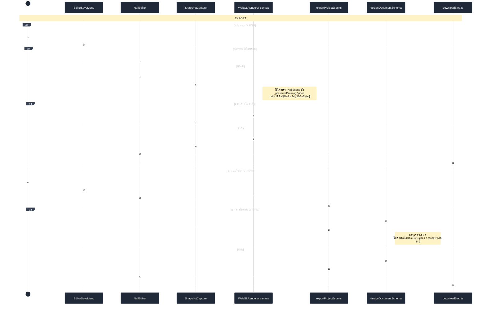
```mermaid
---
config:
  theme: dark
  sequence:
    actorFontSize: 24
    messageFontSize: 22
    noteFontSize: 20
    actorMargin: 100
    width: 220
    height: 65
    messageMargin: 45
    wrap: true
  themeVariables:
    fontFamily: Arial, sans-serif
    fontSize: 22px
    actorBkg: "#1f2937"
    actorBorder: "#ffffff"
    actorTextColor: "#ffffff"
    signalColor: "#ffffff"
    signalTextColor: "#ffffff"
    labelBoxBkgColor: "#374151"
    labelBoxBorderColor: "#ffffff"
    labelTextColor: "#ffffff"
    noteBkgColor: "#fef3c7"
    noteBorderColor: "#ffffff"
    noteTextColor: "#111111"
---
sequenceDiagram
    autonumber

    actor U as User
    participant SM as EditorSaveMenu
    participant NE as NailEditor
    participant SNP as SnapshotCapture
    participant GL as WebGLRenderer canvas
    participant EX as exportProjectJson.ts
    participant ZOD as designDocumentSchema
    participant DL as downloadBlob.ts

    Note over U,DL: EXPORT

    alt ส่งออกภาพ PNG
        U->>SM: click "ดาวน์โหลดภาพ"
        SM->>NE: exportPng()
        alt canvas ยังไม่พร้อม
            NE-->>U: notice "ดาวน์โหลดภาพไม่สำเร็จ"
        else พร้อม
            NE->>SNP: capture()
            SNP->>GL: domElement.toBlob('image/png')
            Note right of GL: ใช้ได้เพราะ NailScene ตั้ง preserveDrawingBuffer<br/>ภาพที่ได้คือมุมกล้องที่ผู้ใช้กำลังดูอยู่
            alt สร้างภาพไม่สำเร็จ
                GL-->>SNP: null → throw
                SNP-->>U: notice ข้อผิดพลาด
            else สำเร็จ
                GL-->>SNP: Blob
                SNP-->>NE: Blob
                NE->>DL: downloadBlob(blob, sanitizeFilename(name) + '.png')
                DL-->>U: ไฟล์ถูกดาวน์โหลด
            end
        end
    else ส่งออกไฟล์งาน JSON
        U->>SM: click "ดาวน์โหลดไฟล์งาน"
        SM->>NE: exportJson()
        NE->>EX: exportProjectJson(store.document)
        EX->>ZOD: designDocumentSchema.parse(document)
        alt เอกสารไม่ผ่าน schema
            ZOD-->>EX: throw
            EX-->>U: notice "ดาวน์โหลดไฟล์งานไม่สำเร็จ"
            Note right of ZOD: ตรวจก่อนเสมอ<br/>ไฟล์งานที่เสียต้องไม่หลุดออกจากระบบเงียบ ๆ
        else ผ่าน
            ZOD-->>EX: document ที่ตรวจแล้ว
            EX-->>NE: JSON string
            NE->>DL: downloadBlob(blob, name + '.nail.json')
            DL-->>U: ไฟล์ถูกดาวน์โหลด
        end
    end
```

---

### ED-17 — WebGL ล้มเหลว + ลองใหม่ และการคืนทรัพยากร

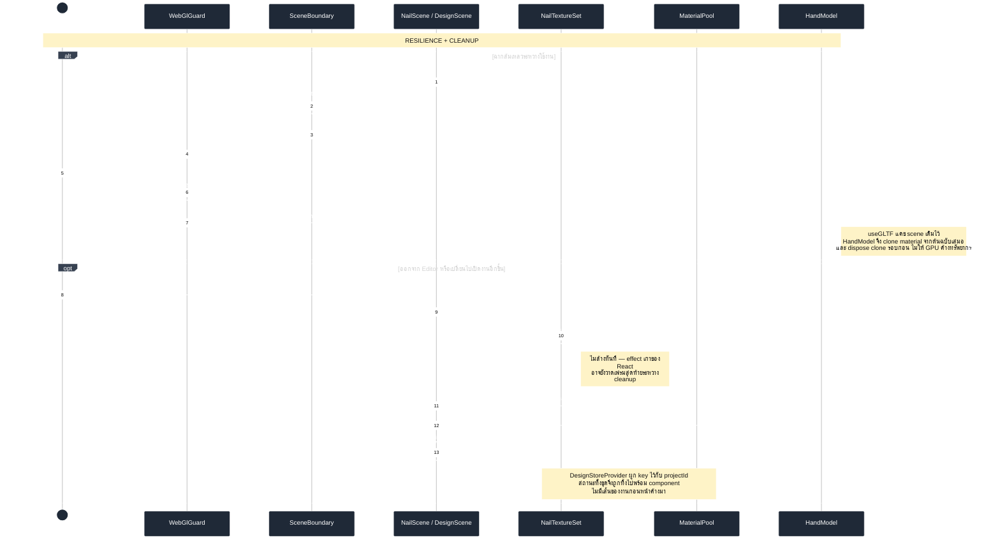
```mermaid
---
config:
  theme: dark
  sequence:
    actorFontSize: 24
    messageFontSize: 22
    noteFontSize: 20
    actorMargin: 100
    width: 220
    height: 65
    messageMargin: 45
    wrap: true
  themeVariables:
    fontFamily: Arial, sans-serif
    fontSize: 22px
    actorBkg: "#1f2937"
    actorBorder: "#ffffff"
    actorTextColor: "#ffffff"
    signalColor: "#ffffff"
    signalTextColor: "#ffffff"
    labelBoxBkgColor: "#374151"
    labelBoxBorderColor: "#ffffff"
    labelTextColor: "#ffffff"
    noteBkgColor: "#fef3c7"
    noteBorderColor: "#ffffff"
    noteTextColor: "#111111"
---
sequenceDiagram
    autonumber

    actor U as User
    participant WG as WebGlGuard
    participant SB as SceneBoundary
    participant SC as NailScene / DesignScene
    participant TEX as NailTextureSet
    participant MAT as MaterialPool
    participant HM as HandModel

    Note over U,HM: RESILIENCE + CLEANUP

    alt ฉากล้มเหลวระหว่างใช้งาน
        SC-->>SB: throw ระหว่าง render
        SB->>SB: getDerivedStateFromError → failed = true
        SB->>WG: onError(message)
        WG-->>U: "แสดงฉาก 3 มิติไม่สำเร็จ" + ปุ่มลองใหม่
        U->>WG: click ลองใหม่
        WG->>WG: attempt++ → remount ฉากทั้งชุด
        WG->>SC: สร้าง Canvas ใหม่
        Note right of HM: useGLTF แคช scene เดิมไว้<br/>HandModel จึง clone material จากต้นฉบับเสมอ<br/>และ dispose clone รอบก่อน ไม่ให้ GPU ค้างทรัพยากร
    end

    opt ออกจาก Editor หรือเปลี่ยนไปเปิดงานอีกชิ้น
        U->>SC: unmount
        SC->>TEX: dispose()
        TEX->>TEX: queueMicrotask ล้าง layerCache / composites / nailTouch
        Note right of TEX: ไม่ล้างทันที — effect เก่าของ React<br/>อาจยังวาดเฟรมสุดท้ายระหว่าง cleanup
        SC->>MAT: release ทุก material key ที่ถือไว้
        SC->>HM: dispose material ผิวมือที่ clone ไว้
        SC->>SC: ถอด pointer listener ทั้งหมด<br/>ถ้ายังลากเส้นค้างอยู่ ให้ endStroke ก่อน
        Note over TEX,MAT: DesignStoreProvider ผูก key ไว้กับ projectId<br/>สถานะทั้งชุดจึงถูกทิ้งไปพร้อม component<br/>ไม่มีเส้นของงานก่อนหน้าค้างมา
    end
```

---

## 5. Invariants ที่ทุก Sequence ต้องรักษา

1. **ทางเข้าเอกสารมีทางเดียว** — ทุกการแก้ไข (ผู้ใช้, คีย์ลัด, AI, recipe) ผ่าน
   action ของ `designStore` → `HistoryStack.execute(Command)` เสมอ จึง undo ได้ทุกกรณี
2. **เอกสารเป็น immutable และรักษา identity** — เล็บที่ไม่ถูกแก้ต้องเป็น object เดิม
   เพราะ `useNailTextures` และ `DecorationInstances` ใช้การเทียบ identity ตัดสินว่าจะ rebuild
3. **ความล้มเหลวต้องมีอาการ** — วาดไม่ได้ / ย้อนไม่ได้ / เกินเพดาน ต้องตั้ง `notice`
   ทุกครั้ง ห้ามเงียบ
4. **การควบคุมด้วยมือชนะการเคลื่อนกล้องอัตโนมัติเสมอ**
5. **เส้นที่กำลังลากมีได้ครั้งละหนึ่งเส้น** และต้อง `endStroke` ทั้งกรณีสำเร็จและถูกยกเลิก
6. **โหมด 2 มิติและ 3 มิติใช้เอกสาร เท็กซ์เจอร์ และเส้นทางบันทึกชุดเดียวกัน**
