# Sequence Diagram

## 1. Purpose

แสดงลำดับการทำงานจริงของ Critical Flow และ Business Flow ทุกเส้นทางสำคัญ ตั้งแต่
Actor → Frontend → Middleware → Router → Service → Repository → Database / Storage /
AI Service / External โดยครอบคลุม Request, Response, Function Call, Database Query,
Validation, Authentication, Authorization, Error และ Alternative Flow

## 2. Scope

| # | Sequence | ประเภท |
|---|---|---|
| SQ-01 | สมัครสมาชิก | Authentication |
| SQ-02 | เข้าสู่ระบบ | Authentication |
| SQ-03 | ตรวจสอบสิทธิ์ทุก request (Session + CSRF) | Cross-cutting |
| SQ-04 | ออกจากระบบ | Authentication |
| SQ-05 | เปิดงานออกแบบ (พร้อม draft) | Main business |
| SQ-06 | Autosave งานค้าง + Conflict + Offline fallback | Main business |
| SQ-07 | บันทึกเวอร์ชัน + อัปโหลดภาพตัวอย่าง | Main business |
| SQ-08 | อ่านฟีดชุมชน (keyset pagination) | CRUD / Read |
| SQ-09 | กดถูกใจ + สร้างการแจ้งเตือน | CRUD / Transaction |
| SQ-10 | รีมิกซ์ผลงาน | Transaction |
| SQ-11 | รายงานเนื้อหา + ซ่อนอัตโนมัติ | Moderation |
| SQ-12 | คิว moderation ของ admin | Admin |
| SQ-13 | สร้างคำขอนัดหมาย | Appointment |
| SQ-14 | ตอบรับข้อเสนอเวลา | Appointment / State machine |
| SQ-15 | รีวิวร้าน + คำนวณคะแนนใหม่ | Appointment |
| SQ-16 | AI Chat แบบ SSE (พร้อม degradation) | AI |
| SQ-17 | AI สร้างสูตรดีไซน์ + fallback | AI |
| SQ-18 | อ่านการแจ้งเตือน | Notification |
| SQ-19 | Error Handling (ทุก error ผ่านเส้นทางนี้) | Cross-cutting |

**ไม่มีในระบบ:** Payment flow, OAuth flow, JWT refresh flow, WebSocket flow (ดูหัวข้อ 8)

## 3. Source Analysis

| Sequence | ไฟล์หลักฐาน |
|---|---|
| SQ-01, SQ-02, SQ-04 | `apps/api/src/auth/{routes,service,repository,session,password}.ts`, `apps/web/src/features/auth/useAuth.ts` |
| SQ-03 | `apps/api/src/middleware/{requestId,csrf,requireUser,rateLimit}.ts`, `apps/web/src/api/client.ts` |
| SQ-05, SQ-06, SQ-07 | `apps/api/src/projects/{routes,service,repository}.ts`, `apps/api/src/storage/**`, `apps/web/src/features/design/{useAutosave,useOfflineDraft}.ts`, `apps/web/src/features/projects/useProjects.ts` |
| SQ-08…SQ-12 | `apps/api/src/templates/{routes,service,repository,cursor}.ts`, `apps/api/src/notifications/repository.ts`, `apps/web/src/features/community/**` |
| SQ-13…SQ-15 | `apps/api/src/appointments/{routes,service}.ts`, `apps/web/src/features/appointments/**` |
| SQ-16, SQ-17 | `apps/api/src/ai/{routes,client}.ts`, `apps/ai/app/routers/{chat,design}.py`, `apps/ai/app/{ollama,repositories}.py`, `app/generation/recipe.py` |
| SQ-18 | `apps/api/src/notifications/{routes,service,repository}.ts`, `apps/web/src/components/NotificationBell.tsx` |
| SQ-19 | `apps/api/src/middleware/errorHandler.ts`, `apps/api/src/errors/AppError.ts` |

## 4. Diagram

### SQ-01 — สมัครสมาชิก

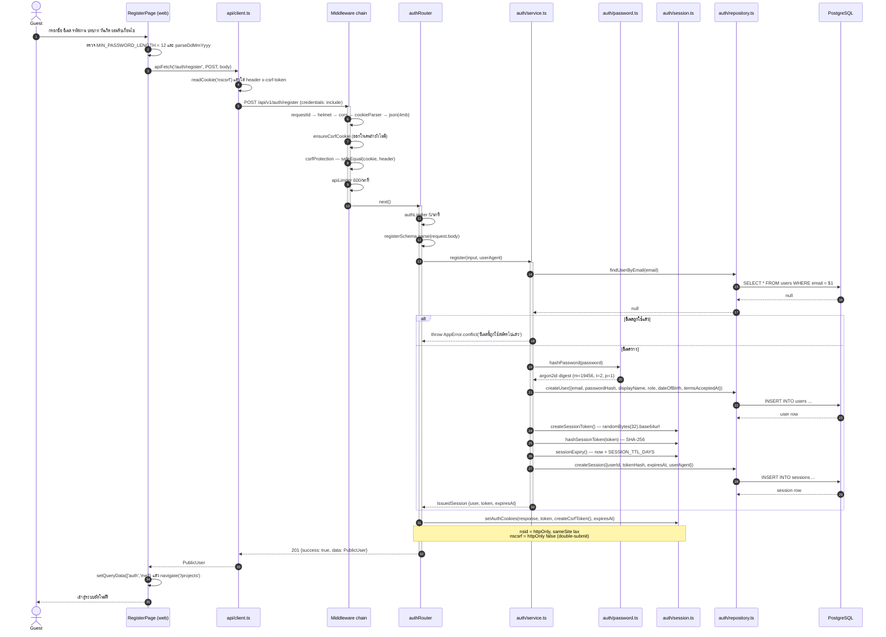
```mermaid
sequenceDiagram
    autonumber
    actor U as Guest
    participant W as RegisterPage (web)
    participant AC as api/client.ts
    participant MW as Middleware chain
    participant R as authRouter
    participant S as auth/service.ts
    participant P as auth/password.ts
    participant SE as auth/session.ts
    participant RP as auth/repository.ts
    participant DB as PostgreSQL

    U->>W: กรอกชื่อ อีเมล รหัสผ่าน บทบาท วันเกิด ยอมรับเงื่อนไข
    W->>W: ตรวจ MIN_PASSWORD_LENGTH = 12 และ parseDdMmYyyy
    W->>AC: apiFetch('/auth/register', POST, body)
    AC->>AC: readCookie('nscsrf') แล้วใส่ header x-csrf-token
    AC->>MW: POST /api/v1/auth/register (credentials: include)
    activate MW
    MW->>MW: requestId → helmet → cors → cookieParser → json(4mb)
    MW->>MW: ensureCsrfCookie (ออกโทเคนถ้ายังไม่มี)
    MW->>MW: csrfProtection — safeEqual(cookie, header)
    MW->>MW: apiLimiter 600/นาที
    MW->>R: next()
    deactivate MW
    activate R
    R->>R: authLimiter 5/นาที
    R->>R: registerSchema.parse(request.body)
    R->>S: register(input, userAgent)
    activate S
    S->>RP: findUserByEmail(email)
    RP->>DB: SELECT * FROM users WHERE email = $1
    DB-->>RP: null
    RP-->>S: null
    alt อีเมลถูกใช้แล้ว
        S-->>R: throw AppError.conflict('อีเมลนี้ถูกใช้สมัครไปแล้ว')
    else อีเมลว่าง
        S->>P: hashPassword(password)
        P-->>S: argon2id digest (m=19456, t=2, p=1)
        S->>RP: createUser({email, passwordHash, displayName, role, dateOfBirth, termsAcceptedAt})
        RP->>DB: INSERT INTO users ...
        DB-->>RP: user row
        S->>SE: createSessionToken() — randomBytes(32).base64url
        S->>SE: hashSessionToken(token) — SHA-256
        S->>SE: sessionExpiry() — now + SESSION_TTL_DAYS
        S->>RP: createSession({userId, tokenHash, expiresAt, userAgent})
        RP->>DB: INSERT INTO sessions ...
        DB-->>RP: session row
        S-->>R: IssuedSession {user, token, expiresAt}
    end
    deactivate S
    R->>SE: setAuthCookies(response, token, createCsrfToken(), expiresAt)
    Note over R,SE: nsid = httpOnly, sameSite lax<br/>nscsrf = httpOnly false (double-submit)
    R-->>AC: 201 {success: true, data: PublicUser}
    deactivate R
    AC-->>W: PublicUser
    W->>W: setQueryData(['auth','me']) แล้ว navigate('/projects')
    W-->>U: เข้าสู่ระบบอัตโนมัติ
```

---

### SQ-02 — เข้าสู่ระบบ (พร้อมการกัน timing attack)

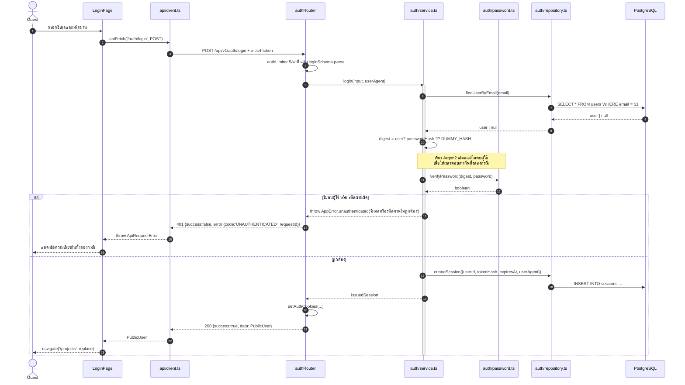
```mermaid
sequenceDiagram
    autonumber
    actor U as Guest
    participant W as LoginPage
    participant AC as api/client.ts
    participant R as authRouter
    participant S as auth/service.ts
    participant P as auth/password.ts
    participant RP as auth/repository.ts
    participant DB as PostgreSQL

    U->>W: กรอกอีเมลและรหัสผ่าน
    W->>AC: apiFetch('/auth/login', POST)
    AC->>R: POST /api/v1/auth/login + x-csrf-token
    R->>R: authLimiter 5/นาที แล้ว loginSchema.parse
    R->>S: login(input, userAgent)
    activate S
    S->>RP: findUserByEmail(email)
    RP->>DB: SELECT * FROM users WHERE email = $1
    DB-->>RP: user | null
    RP-->>S: user | null
    S->>S: digest = user?.passwordHash ?? DUMMY_HASH
    Note over S,P: เรียก Argon2 เสมอแม้ไม่พบผู้ใช้<br/>เพื่อให้เวลาตอบเท่ากันทั้งสองกรณี
    S->>P: verifyPassword(digest, password)
    P-->>S: boolean
    alt ไม่พบผู้ใช้ หรือ รหัสผ่านผิด
        S-->>R: throw AppError.unauthenticated('อีเมลหรือรหัสผ่านไม่ถูกต้อง')
        R-->>AC: 401 {success:false, error:{code:'UNAUTHENTICATED', requestId}}
        AC-->>W: throw ApiRequestError
        W-->>U: แสดงข้อความเดียวกันทั้งสองกรณี
    else ถูกต้อง
        S->>RP: createSession({userId, tokenHash, expiresAt, userAgent})
        RP->>DB: INSERT INTO sessions ...
        S-->>R: IssuedSession
        R->>R: setAuthCookies(...)
        R-->>AC: 200 {success:true, data: PublicUser}
        AC-->>W: PublicUser
        W-->>U: navigate('/projects', replace)
    end
    deactivate S
```

---

### SQ-03 — ตรวจสอบสิทธิ์ทุก request (Session + CSRF + Authorization)

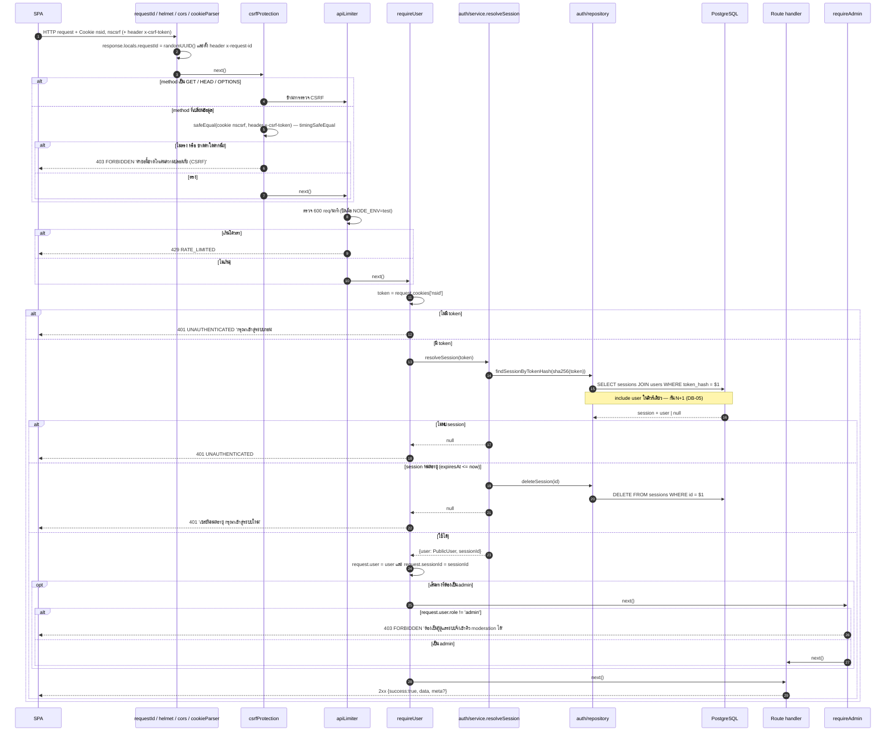
```mermaid
sequenceDiagram
    autonumber
    participant W as SPA
    participant MW as requestId / helmet / cors / cookieParser
    participant CS as csrfProtection
    participant RL as apiLimiter
    participant RU as requireUser
    participant AS as auth/service.resolveSession
    participant RP as auth/repository
    participant DB as PostgreSQL
    participant RT as Route handler
    participant AD as requireAdmin

    W->>MW: HTTP request + Cookie nsid, nscsrf (+ header x-csrf-token)
    MW->>MW: response.locals.requestId = randomUUID() และตั้ง header x-request-id
    MW->>CS: next()
    alt method เป็น GET / HEAD / OPTIONS
        CS->>RL: ข้ามการตรวจ CSRF
    else method ที่เปลี่ยนข้อมูล
        CS->>CS: safeEqual(cookie nscsrf, header x-csrf-token) — timingSafeEqual
        alt ไม่ตรง หรือ ขาดค่าใดค่าหนึ่ง
            CS-->>W: 403 FORBIDDEN 'คำขอนี้ขาดโทเคนความปลอดภัย (CSRF)'
        else ตรง
            CS->>RL: next()
        end
    end
    RL->>RL: ตรวจ 600 req/นาที (ปิดเมื่อ NODE_ENV=test)
    alt เกินโควตา
        RL-->>W: 429 RATE_LIMITED
    else ไม่เกิน
        RL->>RU: next()
    end
    RU->>RU: token = request.cookies['nsid']
    alt ไม่มี token
        RU-->>W: 401 UNAUTHENTICATED 'กรุณาเข้าสู่ระบบก่อน'
    else มี token
        RU->>AS: resolveSession(token)
        AS->>RP: findSessionByTokenHash(sha256(token))
        RP->>DB: SELECT sessions JOIN users WHERE token_hash = $1
        Note over RP,DB: include user ในคิวรีเดียว — กัน N+1 (DB-05)
        DB-->>RP: session + user | null
        alt ไม่พบ session
            AS-->>RU: null
            RU-->>W: 401 UNAUTHENTICATED
        else session หมดอายุ (expiresAt <= now)
            AS->>RP: deleteSession(id)
            RP->>DB: DELETE FROM sessions WHERE id = $1
            AS-->>RU: null
            RU-->>W: 401 'เซสชันหมดอายุ กรุณาเข้าสู่ระบบใหม่'
        else ใช้ได้
            AS-->>RU: {user: PublicUser, sessionId}
            RU->>RU: request.user = user และ request.sessionId = sessionId
            opt เส้นทางที่ต้องเป็น admin
                RU->>AD: next()
                alt request.user.role != 'admin'
                    AD-->>W: 403 FORBIDDEN 'ต้องเป็นผู้ดูแลระบบจึงเข้าคิว moderation ได้'
                else เป็น admin
                    AD->>RT: next()
                end
            end
            RU->>RT: next()
            RT-->>W: 2xx {success:true, data, meta?}
        end
    end
```

**หมายเหตุ** — เส้นทางสาธารณะ (`GET /templates`, `GET /templates/:id`) ใช้ `optionalUser`
ซึ่งเติม `request.user` ถ้ามี session ใช้ได้ แต่**ปล่อยผ่านเสมอ**แม้ไม่มีหรือ resolve ไม่สำเร็จ

---

### SQ-04 — ออกจากระบบ

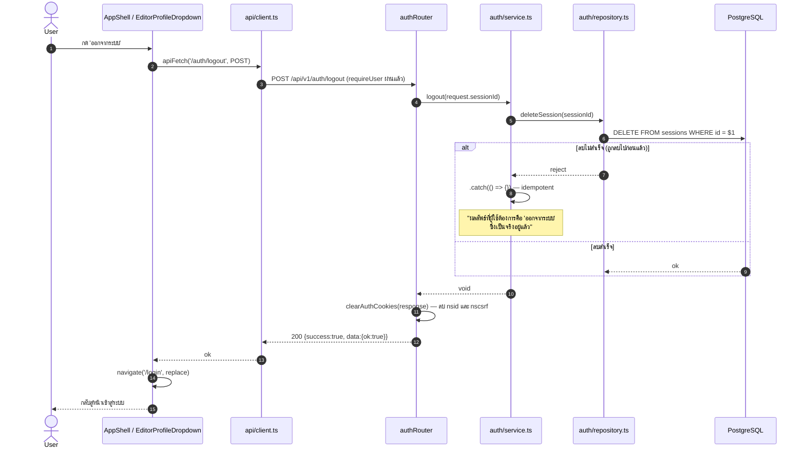
```mermaid
sequenceDiagram
    autonumber
    actor U as User
    participant W as AppShell / EditorProfileDropdown
    participant AC as api/client.ts
    participant R as authRouter
    participant S as auth/service.ts
    participant RP as auth/repository.ts
    participant DB as PostgreSQL

    U->>W: กด 'ออกจากระบบ'
    W->>AC: apiFetch('/auth/logout', POST)
    AC->>R: POST /api/v1/auth/logout (requireUser ผ่านแล้ว)
    R->>S: logout(request.sessionId)
    S->>RP: deleteSession(sessionId)
    RP->>DB: DELETE FROM sessions WHERE id = $1
    alt ลบไม่สำเร็จ (ถูกลบไปก่อนแล้ว)
        RP-->>S: reject
        S->>S: .catch(() => {}) — idempotent
        Note over S: "ผลลัพธ์ที่ผู้ใช้ต้องการคือ 'ออกจากระบบ'<br/>ซึ่งเป็นจริงอยู่แล้ว"
    else ลบสำเร็จ
        DB-->>RP: ok
    end
    S-->>R: void
    R->>R: clearAuthCookies(response) — ลบ nsid และ nscsrf
    R-->>AC: 200 {success:true, data:{ok:true}}
    AC-->>W: ok
    W->>W: navigate('/login', replace)
    W-->>U: กลับสู่หน้าเข้าสู่ระบบ
```

---

### SQ-05 — เปิดงานออกแบบ (พร้อมตรวจ draft ค้าง)

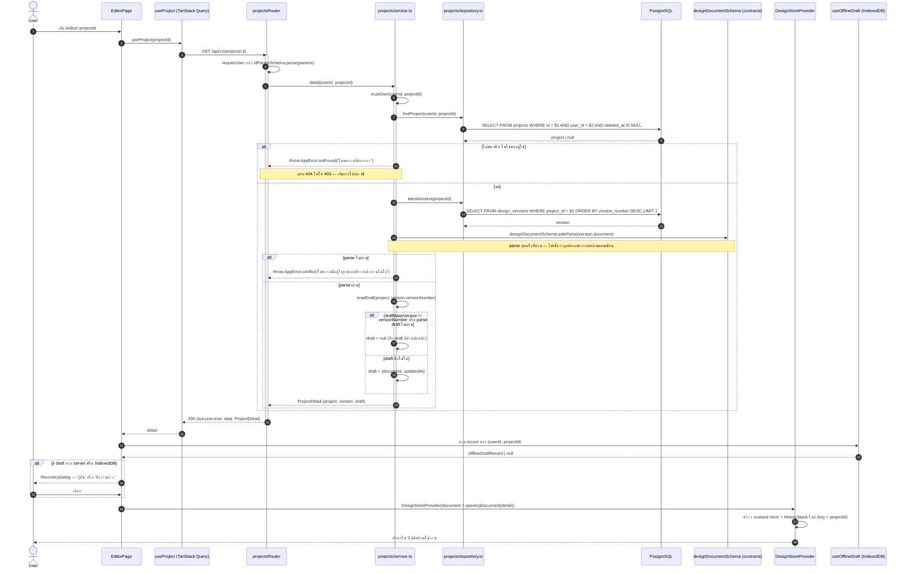
```mermaid
sequenceDiagram
    autonumber
    actor U as User
    participant W as EditorPage
    participant Q as useProject (TanStack Query)
    participant R as projectsRouter
    participant S as projects/service.ts
    participant RP as projects/repository.ts
    participant DB as PostgreSQL
    participant ZS as designDocumentSchema (contracts)
    participant ST as DesignStoreProvider
    participant OD as useOfflineDraft (IndexedDB)

    U->>W: เปิด /editor/:projectId
    W->>Q: useProject(projectId)
    Q->>R: GET /api/v1/projects/:id
    activate R
    R->>R: requireUser แล้ว idParamSchema.parse(params)
    R->>S: detail(userId, projectId)
    activate S
    S->>S: mustOwn(userId, projectId)
    S->>RP: findProject(userId, projectId)
    RP->>DB: SELECT FROM projects WHERE id = $1 AND user_id = $2 AND deleted_at IS NULL
    DB-->>RP: project | null
    alt ไม่พบ หรือ ไม่ใช่ของผู้ใช้
        S-->>R: throw AppError.notFound('ไม่พบงานที่ต้องการ')
        Note over S,R: ตอบ 404 ไม่ใช่ 403 — กันการไล่เดา id
    else พบ
        S->>RP: latestVersion(projectId)
        RP->>DB: SELECT FROM design_versions WHERE project_id = $1 ORDER BY version_number DESC LIMIT 1
        DB-->>RP: version
        S->>ZS: designDocumentSchema.safeParse(version.document)
        Note over S,ZS: parse ทุกครั้งที่อ่าน — ไม่เชื่อว่าถูกต้องเพราะเคยผ่านตอนเขียน
        alt parse ไม่ผ่าน
            S-->>R: throw AppError.conflict('ไฟล์งานนี้อยู่ในรูปแบบที่ระบบยังอ่านไม่ได้')
        else parse ผ่าน
            S->>S: readDraft(project, version.versionNumber)
            alt draftBaseVersion != versionNumber หรือ parse draft ไม่ผ่าน
                S->>S: draft = null (ทิ้ง draft ที่ล้าสมัย/เสีย)
            else draft ยังใช้ได้
                S->>S: draft = {document, updatedAt}
            end
            S-->>R: ProjectDetail {project, version, draft}
        end
    end
    deactivate S
    R-->>Q: 200 {success:true, data: ProjectDetail}
    deactivate R
    Q-->>W: detail
    W->>OD: อ่าน record ของ (userId, projectId)
    OD-->>W: OfflineDraftRecord | null
    alt มี draft จาก server หรือ IndexedDB
        W-->>U: RecoveryDialog — 'กู้คืน' หรือ 'ทิ้งงานค้าง'
        U->>W: เลือก
    end
    W->>ST: DesignStoreProvider(document = openingDocument(detail))
    ST->>ST: สร้าง zustand store + HistoryStack ใหม่ (key = projectId)
    ST-->>U: ตัวแก้ไข 3 มิติพร้อมใช้งาน
```

---

### SQ-06 — Autosave งานค้าง (พร้อม Conflict และ Offline fallback)

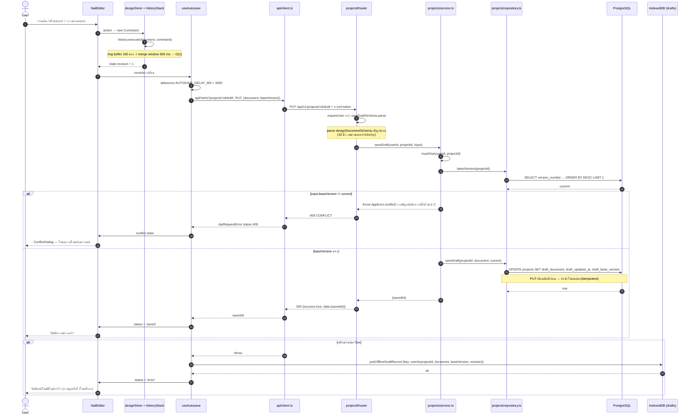
```mermaid
sequenceDiagram
    autonumber
    actor U as User
    participant ED as NailEditor
    participant DS as designStore + HistoryStack
    participant AS as useAutosave
    participant AC as api/client.ts
    participant R as projectsRouter
    participant SV as projects/service.ts
    participant RP as projects/repository.ts
    participant DB as PostgreSQL
    participant IDB as IndexedDB (drafts)

    U->>ED: วาดเส้น / ปรับเลเยอร์ / วางของตกแต่ง
    ED->>DS: action → new Command
    DS->>DS: history.execute(document, command)
    Note over DS: ring buffer 100 ช่อง + merge window 500 ms → O(1)
    DS-->>ED: state.revision + 1
    ED->>AS: revision เปลี่ยน
    AS->>AS: debounce AUTOSAVE_DELAY_MS = 3000
    AS->>AC: apiFetch('/projects/:id/draft', PUT, {document, baseVersion})
    AC->>R: PUT /api/v1/projects/:id/draft + x-csrf-token
    R->>R: requireUser แล้ว saveDraftSchema.parse
    Note over R: parse designDocumentSchema เต็มรูปแบบ<br/>(10 นิ้ว, เพดานเลเยอร์/เส้น/จุด)
    R->>SV: saveDraft(userId, projectId, input)
    SV->>SV: mustOwn(userId, projectId)
    SV->>RP: latestVersion(projectId)
    RP->>DB: SELECT version_number ... ORDER BY DESC LIMIT 1
    DB-->>RP: current
    alt input.baseVersion != current
        SV-->>R: throw AppError.conflict('งานนี้ถูกบันทึกจากที่อื่นไปแล้ว')
        R-->>AC: 409 CONFLICT
        AC-->>AS: ApiRequestError status 409
        AS->>ED: conflict state
        ED-->>U: ConflictDialog — โหลดงานใหม่ก่อนวาดต่อ
    else baseVersion ตรง
        SV->>RP: saveDraft(projectId, document, current)
        RP->>DB: UPDATE projects SET draft_document, draft_updated_at, draft_base_version
        Note over RP,DB: PUT เขียนทับทั้งก้อน → ยิงซ้ำได้ผลเดิม (idempotent)
        DB-->>RP: row
        SV-->>R: {savedAt}
        R-->>AC: 200 {success:true, data:{savedAt}}
        AC-->>AS: savedAt
        AS->>ED: status = 'saved'
        ED-->>U: 'บันทึกงานค้างแล้ว'
    end
    alt เครือข่ายล่ม / 5xx
        AC-->>AS: throw
        AS->>IDB: put(OfflineDraftRecord {key: userId:projectId, document, baseVersion, revision})
        IDB-->>AS: ok
        AS->>ED: status = 'error'
        ED-->>U: 'บันทึกอัตโนมัติไม่สำเร็จ' (งานถูกเก็บไว้ในเครื่อง)
    end
```

---

### SQ-07 — บันทึกเวอร์ชัน + อัปโหลดภาพตัวอย่าง

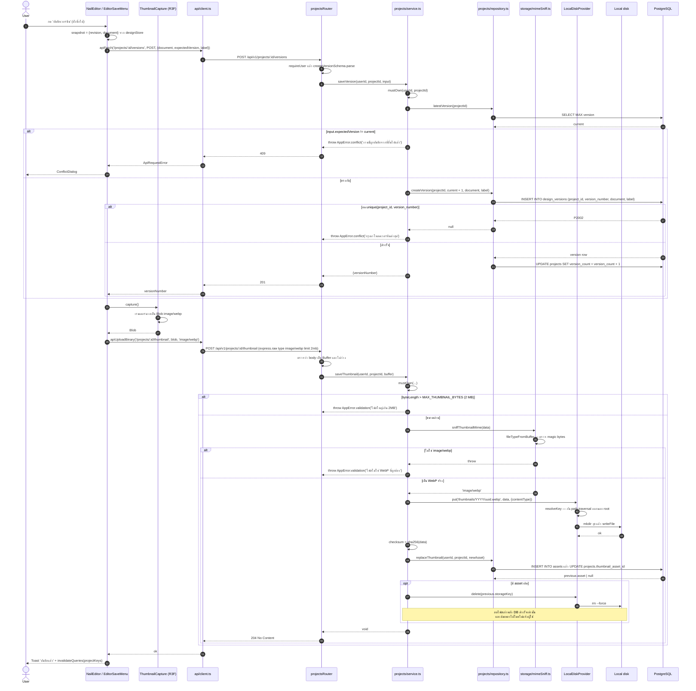
```mermaid
sequenceDiagram
    autonumber
    actor U as User
    participant ED as NailEditor / EditorSaveMenu
    participant TC as ThumbnailCapture (R3F)
    participant AC as api/client.ts
    participant R as projectsRouter
    participant SV as projects/service.ts
    participant RP as projects/repository.ts
    participant MS as storage/mimeSniff.ts
    participant SP as LocalDiskProvider
    participant FS as Local disk
    participant DB as PostgreSQL

    U->>ED: กด 'บันทึกเวอร์ชัน' (ตั้งชื่อได้)
    ED->>ED: snapshot = {revision, document} จาก designStore
    ED->>AC: apiFetch('/projects/:id/versions', POST, {document, expectedVersion, label})
    AC->>R: POST /api/v1/projects/:id/versions
    R->>R: requireUser แล้ว createVersionSchema.parse
    R->>SV: saveVersion(userId, projectId, input)
    SV->>SV: mustOwn(userId, projectId)
    SV->>RP: latestVersion(projectId)
    RP->>DB: SELECT MAX version
    DB-->>RP: current
    alt input.expectedVersion != current
        SV-->>R: throw AppError.conflict('งานนี้ถูกบันทึกจากที่อื่นไปแล้ว')
        R-->>AC: 409
        AC-->>ED: ApiRequestError
        ED-->>U: ConflictDialog
    else ตรงกัน
        SV->>RP: createVersion(projectId, current + 1, document, label)
        RP->>DB: INSERT INTO design_versions (project_id, version_number, document, label)
        alt ชน unique(project_id, version_number)
            DB-->>RP: P2002
            RP-->>SV: null
            SV-->>R: throw AppError.conflict('กรุณาโหลดเวอร์ชันล่าสุด')
        else สำเร็จ
            DB-->>RP: version row
            RP->>DB: UPDATE projects SET version_count = version_count + 1
            SV-->>R: {versionNumber}
            R-->>AC: 201
            AC-->>ED: versionNumber
        end
    end

    ED->>TC: capture()
    TC->>TC: เรนเดอร์ฉากเป็น Blob image/webp
    TC-->>ED: Blob
    ED->>AC: apiUploadBinary('/projects/:id/thumbnail', blob, 'image/webp')
    AC->>R: POST /api/v1/projects/:id/thumbnail (express.raw type image/webp limit 2mb)
    R->>R: ตรวจว่า body เป็น Buffer และไม่ว่าง
    R->>SV: saveThumbnail(userId, projectId, buffer)
    SV->>SV: mustOwn(...)
    alt byteLength > MAX_THUMBNAIL_BYTES (2 MB)
        SV-->>R: throw AppError.validation('ไฟล์ใหญ่เกิน 2MB')
    else ขนาดผ่าน
        SV->>MS: sniffThumbnailMime(data)
        MS->>MS: fileTypeFromBuffer — ตรวจ magic bytes
        alt ไม่ใช่ image/webp
            MS-->>SV: throw
            SV-->>R: throw AppError.validation('ไฟล์ไม่ใช่ WebP ที่ถูกต้อง')
        else เป็น WebP จริง
            MS-->>SV: 'image/webp'
            SV->>SP: put('thumbnails/YYYY/uuid.webp', data, {contentType})
            SP->>SP: resolveKey — กัน path traversal ออกนอก root
            SP->>FS: mkdir -p แล้ว writeFile
            FS-->>SP: ok
            SV->>SV: checksum = sha256(data)
            SV->>RP: replaceThumbnail(userId, projectId, newAsset)
            RP->>DB: INSERT INTO assets แล้ว UPDATE projects.thumbnail_asset_id
            DB-->>RP: previous asset | null
            opt มี asset เดิม
                SV->>SP: delete(previous.storageKey)
                SP->>FS: rm --force
                Note over SV,FS: ลบไฟล์เก่าหลัง DB สำเร็จเท่านั้น<br/>และล้มเหลวได้โดยไม่แจ้งผู้ใช้
            end
            SV-->>R: void
            R-->>AC: 204 No Content
        end
    end
    AC-->>ED: ok
    ED-->>U: Toast 'บันทึกแล้ว' + invalidateQueries(projectKeys)
```

---

### SQ-08 — อ่านฟีดชุมชน (keyset pagination + สถานะไลก์ของผู้ดู)

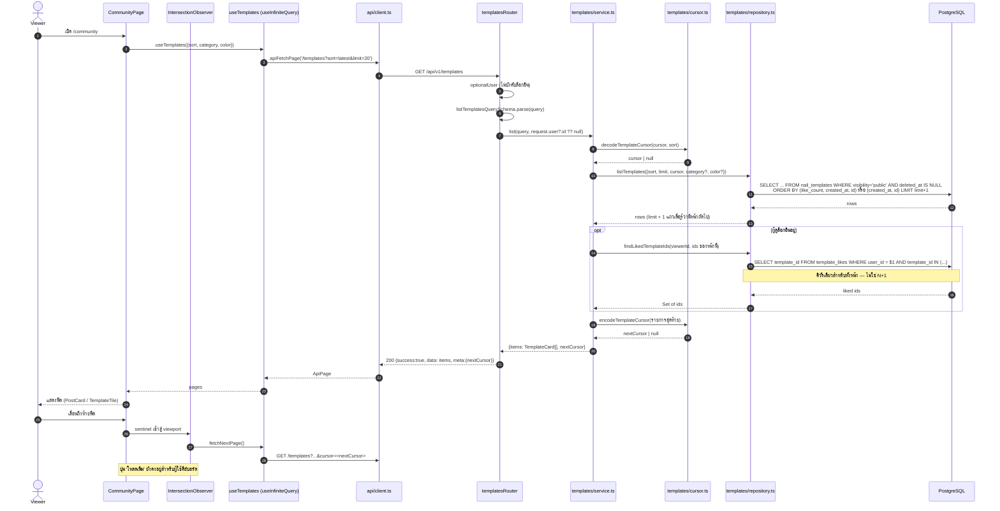
```mermaid
sequenceDiagram
    autonumber
    actor V as Viewer
    participant CP as CommunityPage
    participant IO as IntersectionObserver
    participant Q as useTemplates (useInfiniteQuery)
    participant AC as api/client.ts
    participant R as templatesRouter
    participant SV as templates/service.ts
    participant CU as templates/cursor.ts
    participant RP as templates/repository.ts
    participant DB as PostgreSQL

    V->>CP: เปิด /community
    CP->>Q: useTemplates({sort, category, color})
    Q->>AC: apiFetchPage('/templates?sort=latest&limit=20')
    AC->>R: GET /api/v1/templates
    R->>R: optionalUser (ไม่บังคับล็อกอิน)
    R->>R: listTemplatesQuerySchema.parse(query)
    R->>SV: list(query, request.user?.id ?? null)
    SV->>CU: decodeTemplateCursor(cursor, sort)
    CU-->>SV: cursor | null
    SV->>RP: listTemplates({sort, limit, cursor, category?, color?})
    RP->>DB: SELECT ... FROM nail_templates WHERE visibility='public' AND deleted_at IS NULL<br/>ORDER BY (like_count, created_at, id) หรือ (created_at, id) LIMIT limit+1
    DB-->>RP: rows
    RP-->>SV: rows (limit + 1 แถวเพื่อรู้ว่ามีหน้าถัดไป)
    opt ผู้ดูล็อกอินอยู่
        SV->>RP: findLikedTemplateIds(viewerId, ids ของหน้านี้)
        RP->>DB: SELECT template_id FROM template_likes WHERE user_id = $1 AND template_id IN (...)
        Note over RP,DB: คิวรีเดียวสำหรับทั้งหน้า — ไม่ใช่ N+1
        DB-->>RP: liked ids
        RP-->>SV: Set of ids
    end
    SV->>CU: encodeTemplateCursor(รายการสุดท้าย)
    CU-->>SV: nextCursor | null
    SV-->>R: {items: TemplateCard[], nextCursor}
    R-->>AC: 200 {success:true, data: items, meta:{nextCursor}}
    AC-->>Q: ApiPage
    Q-->>CP: pages
    CP-->>V: แสดงฟีด (PostCard / TemplateTile)
    V->>CP: เลื่อนถึงท้ายฟีด
    CP->>IO: sentinel เข้าสู่ viewport
    IO->>Q: fetchNextPage()
    Q->>AC: GET /templates?...&cursor=<nextCursor>
    Note over CP,IO: ปุ่ม 'โหลดเพิ่ม' ยังคงอยู่สำหรับผู้ใช้คีย์บอร์ด
```

---

### SQ-09 — กดถูกใจ + สร้างการแจ้งเตือน (transaction เดียว)

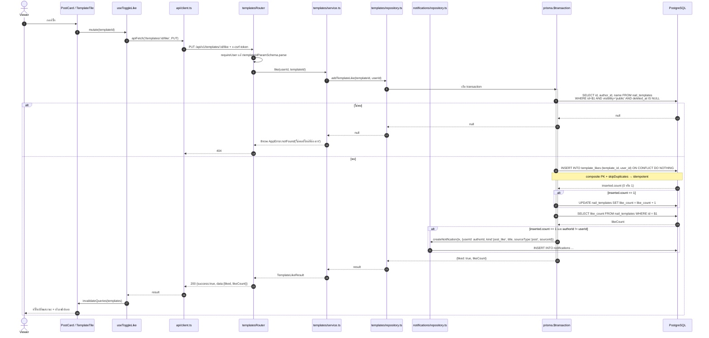
```mermaid
sequenceDiagram
    autonumber
    actor V as Viewer
    participant UI as PostCard / TemplateTile
    participant H as useToggleLike
    participant AC as api/client.ts
    participant R as templatesRouter
    participant SV as templates/service.ts
    participant RP as templates/repository.ts
    participant NR as notifications/repository.ts
    participant TX as prisma.$transaction
    participant DB as PostgreSQL

    V->>UI: กดหัวใจ
    UI->>H: mutate(templateId)
    H->>AC: apiFetch('/templates/:id/like', PUT)
    AC->>R: PUT /api/v1/templates/:id/like + x-csrf-token
    R->>R: requireUser แล้ว templateIdParamSchema.parse
    R->>SV: like(userId, templateId)
    SV->>RP: addTemplateLike(templateId, userId)
    RP->>TX: เปิด transaction
    activate TX
    TX->>DB: SELECT id, author_id, name FROM nail_templates<br/>WHERE id=$1 AND visibility='public' AND deleted_at IS NULL
    alt ไม่พบ
        DB-->>TX: null
        TX-->>RP: null
        RP-->>SV: null
        SV-->>R: throw AppError.notFound('ไม่พบดีไซน์ที่ต้องการ')
        R-->>AC: 404
    else พบ
        TX->>DB: INSERT INTO template_likes (template_id, user_id) ON CONFLICT DO NOTHING
        Note over TX,DB: composite PK + skipDuplicates → idempotent
        DB-->>TX: inserted.count (0 หรือ 1)
        alt inserted.count == 1
            TX->>DB: UPDATE nail_templates SET like_count = like_count + 1
        end
        TX->>DB: SELECT like_count FROM nail_templates WHERE id = $1
        DB-->>TX: likeCount
        alt inserted.count == 1 และ authorId != userId
            TX->>NR: createNotification(tx, {userId: authorId, kind:'post_like', title, sourceType:'post', sourceId})
            NR->>DB: INSERT INTO notifications ...
        end
        TX-->>RP: {liked: true, likeCount}
        deactivate TX
        RP-->>SV: result
        SV-->>R: TemplateLikeResult
        R-->>AC: 200 {success:true, data:{liked, likeCount}}
        AC-->>H: result
        H->>UI: invalidateQueries(templates)
        UI-->>V: หัวใจเปลี่ยนสถานะ + ตัวเลขอัปเดต
    end
```

**Alternative flow — เลิกถูกใจ:** `DELETE /templates/:id/like` → `removeTemplateLike()`
ลด `like_count` เฉพาะเมื่อ `deleteMany` คืน `count === 1` และ**ไม่สร้างการแจ้งเตือน**

---

### SQ-10 — รีมิกซ์ผลงาน (คัดลอกเวอร์ชันเป็น project ใหม่)

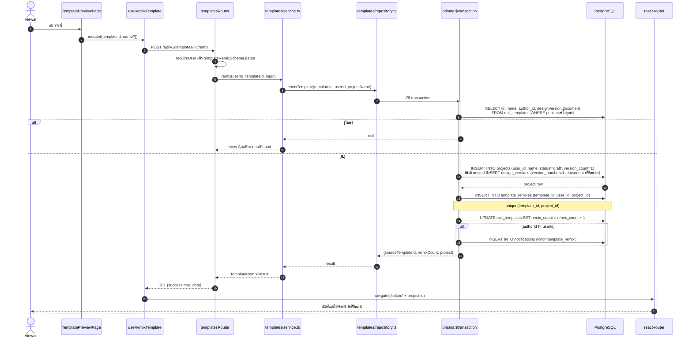
```mermaid
sequenceDiagram
    autonumber
    actor V as Viewer
    participant UI as TemplatePreviewPage
    participant H as useRemixTemplate
    participant R as templatesRouter
    participant SV as templates/service.ts
    participant RP as templates/repository.ts
    participant TX as prisma.$transaction
    participant DB as PostgreSQL
    participant NAV as react-router

    V->>UI: กด 'รีมิกซ์'
    UI->>H: mutate({templateId, name?})
    H->>R: POST /api/v1/templates/:id/remix
    R->>R: requireUser แล้ว templateRemixSchema.parse
    R->>SV: remix(userId, templateId, input)
    SV->>RP: remixTemplate(templateId, userId, projectName)
    RP->>TX: เปิด transaction
    activate TX
    TX->>DB: SELECT id, name, author_id, designVersion.document<br/>FROM nail_templates WHERE public และไม่ถูกลบ
    alt ไม่พบ
        TX-->>SV: null
        SV-->>R: throw AppError.notFound
    else พบ
        TX->>DB: INSERT INTO projects (user_id, name, status='draft', version_count=1)<br/>พร้อม nested INSERT design_versions (version_number=1, document ที่คัดลอกมา)
        DB-->>TX: project row
        TX->>DB: INSERT INTO template_remixes (template_id, user_id, project_id)
        Note over TX,DB: unique(template_id, project_id)
        TX->>DB: UPDATE nail_templates SET remix_count = remix_count + 1
        alt authorId != userId
            TX->>DB: INSERT INTO notifications (kind='template_remix')
        end
        TX-->>RP: {sourceTemplateId, remixCount, project}
        deactivate TX
        RP-->>SV: result
        SV-->>R: TemplateRemixResult
        R-->>H: 201 {success:true, data}
        H->>NAV: navigate('/editor/' + project.id)
        NAV-->>V: เปิดตัวแก้ไขพร้อมงานที่คัดลอกมา
    end
```

**หมายเหตุ** — ชื่อ default คือ `Remix: <ชื่อ template>` ตัดที่ 120 ตัวอักษร
ทุกขั้นตอนอยู่ใน transaction เดียว จึงไม่มีทางเหลือ project ที่สร้างครึ่งเดียว

---

### SQ-11 — รายงานเนื้อหา + ซ่อนอัตโนมัติเมื่อครบ 5 ครั้ง

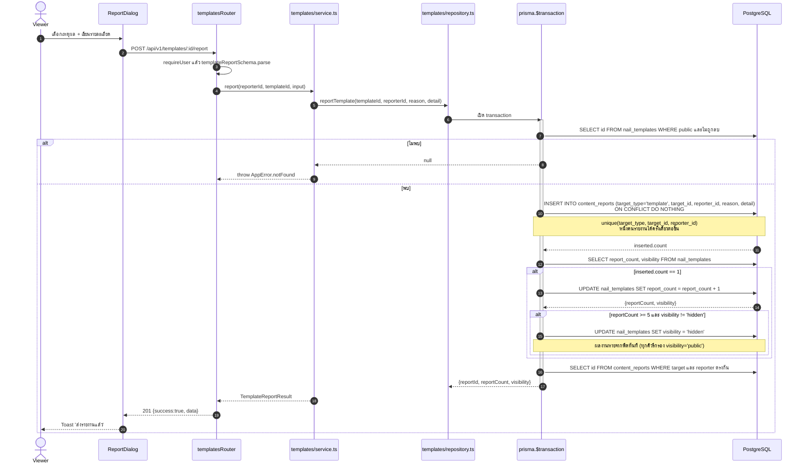
```mermaid
sequenceDiagram
    autonumber
    actor V as Viewer
    participant UI as ReportDialog
    participant R as templatesRouter
    participant SV as templates/service.ts
    participant RP as templates/repository.ts
    participant TX as prisma.$transaction
    participant DB as PostgreSQL

    V->>UI: เลือกเหตุผล + เขียนรายละเอียด
    UI->>R: POST /api/v1/templates/:id/report
    R->>R: requireUser แล้ว templateReportSchema.parse
    R->>SV: report(reporterId, templateId, input)
    SV->>RP: reportTemplate(templateId, reporterId, reason, detail)
    RP->>TX: เปิด transaction
    activate TX
    TX->>DB: SELECT id FROM nail_templates WHERE public และไม่ถูกลบ
    alt ไม่พบ
        TX-->>SV: null
        SV-->>R: throw AppError.notFound
    else พบ
        TX->>DB: INSERT INTO content_reports (target_type='template', target_id, reporter_id, reason, detail)<br/>ON CONFLICT DO NOTHING
        Note over TX,DB: unique(target_type, target_id, reporter_id)<br/>หนึ่งคนรายงานได้ครั้งเดียวต่อชิ้น
        DB-->>TX: inserted.count
        TX->>DB: SELECT report_count, visibility FROM nail_templates
        alt inserted.count == 1
            TX->>DB: UPDATE nail_templates SET report_count = report_count + 1
            DB-->>TX: {reportCount, visibility}
            alt reportCount >= 5 และ visibility != 'hidden'
                TX->>DB: UPDATE nail_templates SET visibility = 'hidden'
                Note over TX,DB: ผลงานหายจากฟีดทันที (ทุกคิวรีกรอง visibility='public')
            end
        end
        TX->>DB: SELECT id FROM content_reports WHERE target และ reporter ตรงกัน
        TX-->>RP: {reportId, reportCount, visibility}
        deactivate TX
        SV-->>R: TemplateReportResult
        R-->>UI: 201 {success:true, data}
        UI-->>V: Toast 'ส่งรายงานแล้ว'
    end
```

---

### SQ-12 — คิว moderation ของผู้ดูแลระบบ

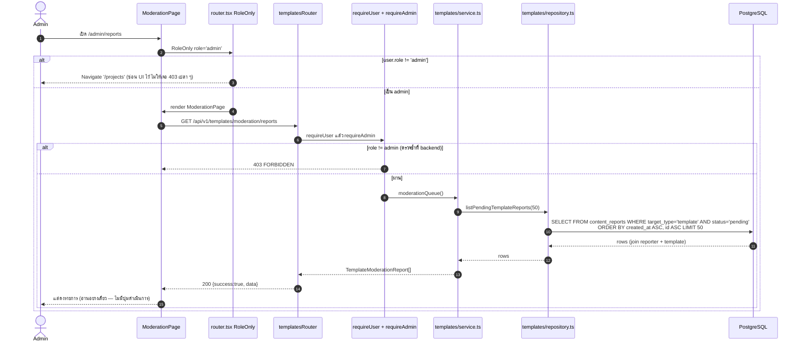
```mermaid
sequenceDiagram
    autonumber
    actor A as Admin
    participant W as ModerationPage
    participant RO as router.tsx RoleOnly
    participant R as templatesRouter
    participant MW as requireUser + requireAdmin
    participant SV as templates/service.ts
    participant RP as templates/repository.ts
    participant DB as PostgreSQL

    A->>W: เปิด /admin/reports
    W->>RO: RoleOnly role='admin'
    alt user.role != 'admin'
        RO-->>A: Navigate '/projects' (ซ่อน UI ไว้ ไม่ให้เจอ 403 เปล่า ๆ)
    else เป็น admin
        RO->>W: render ModerationPage
        W->>R: GET /api/v1/templates/moderation/reports
        R->>MW: requireUser แล้ว requireAdmin
        alt role != admin (ตรวจซ้ำที่ backend)
            MW-->>W: 403 FORBIDDEN
        else ผ่าน
            MW->>SV: moderationQueue()
            SV->>RP: listPendingTemplateReports(50)
            RP->>DB: SELECT FROM content_reports WHERE target_type='template' AND status='pending'<br/>ORDER BY created_at ASC, id ASC LIMIT 50
            DB-->>RP: rows (join reporter + template)
            RP-->>SV: rows
            SV-->>R: TemplateModerationReport[]
            R-->>W: 200 {success:true, data}
            W-->>A: แสดงรายการ (อ่านอย่างเดียว — ไม่มีปุ่มดำเนินการ)
        end
    end
```

---

### SQ-13 — สร้างคำขอนัดหมาย

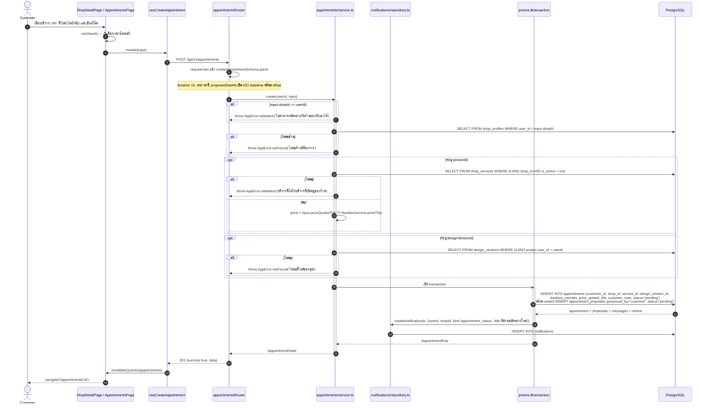
```mermaid
sequenceDiagram
    autonumber
    actor C as Customer
    participant W as ShopDetailPage / AppointmentsPage
    participant H as useCreateAppointment
    participant R as appointmentsRouter
    participant SV as appointments/service.ts
    participant NR as notifications/repository.ts
    participant TX as prisma.$transaction
    participant DB as PostgreSQL

    C->>W: เลือกบริการ เวลา ดีไซน์ (ไม่บังคับ) และเขียนโน้ต
    W->>W: minStartAt — กันเลือกเวลาย้อนหลัง
    W->>H: mutate(input)
    H->>R: POST /api/v1/appointments
    R->>R: requireUser แล้ว createAppointmentSchema.parse
    Note over R: duration 15..480 นาที, proposedStartAt เป็น ISO datetime พร้อม offset
    R->>SV: create(userId, input)
    activate SV
    alt input.shopId == userId
        SV-->>R: throw AppError.validation('ไม่สามารถนัดหมายกับร้านของตัวเองได้')
    end
    SV->>DB: SELECT FROM shop_profiles WHERE user_id = input.shopId
    alt ไม่พบร้าน
        SV-->>R: throw AppError.notFound('ไม่พบร้านที่ต้องการ')
    end
    opt ระบุ serviceId
        SV->>DB: SELECT FROM shop_services WHERE id AND shop_id AND is_active = true
        alt ไม่พบ
            SV-->>R: throw AppError.validation('บริการนี้ไม่ใช่บริการที่เปิดอยู่ของร้าน')
        else พบ
            SV->>SV: price = input.priceQuotedThb ?? Number(service.priceThb)
        end
    end
    opt ระบุ designVersionId
        SV->>DB: SELECT FROM design_versions WHERE id AND project.user_id = userId
        alt ไม่พบ
            SV-->>R: throw AppError.notFound('ไม่พบดีไซน์ของคุณ')
        end
    end
    SV->>TX: เปิด transaction
    activate TX
    TX->>DB: INSERT INTO appointments (customer_id, shop_id, service_id, design_version_id,<br/>duration_minutes, price_quoted_thb, customer_note, status='pending')<br/>พร้อม nested INSERT appointment_proposals (proposed_by='customer', status='pending')
    DB-->>TX: appointment + proposals + messages + review
    TX->>NR: createNotification(tx, {userId: shopId, kind:'appointment_status', title:'มีคำขอนัดหมายใหม่'})
    NR->>DB: INSERT INTO notifications
    TX-->>SV: AppointmentRow
    deactivate TX
    SV-->>R: AppointmentDetail
    deactivate SV
    R-->>H: 201 {success:true, data}
    H->>W: invalidateQueries(appointments)
    W-->>C: navigate('/appointments/:id')
```

---

### SQ-14 — ตอบรับข้อเสนอเวลา (state machine + กัน race condition)

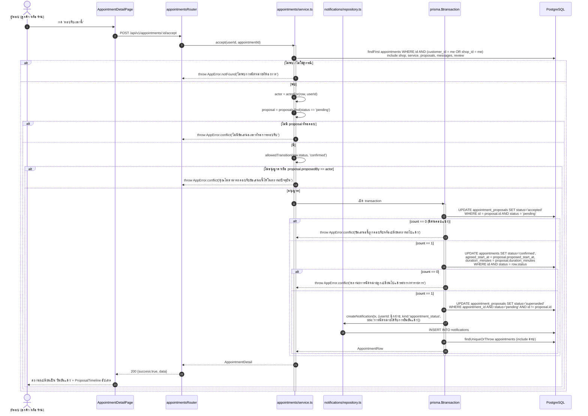
```mermaid
sequenceDiagram
    autonumber
    actor P as ผู้ตอบ (ลูกค้า หรือ ร้าน)
    participant W as AppointmentDetailPage
    participant R as appointmentsRouter
    participant SV as appointments/service.ts
    participant NR as notifications/repository.ts
    participant TX as prisma.$transaction
    participant DB as PostgreSQL

    P->>W: กด 'ตอบรับเวลานี้'
    W->>R: POST /api/v1/appointments/:id/accept
    R->>SV: accept(userId, appointmentId)
    activate SV
    SV->>DB: findFirst appointments WHERE id AND (customer_id = me OR shop_id = me)<br/>include shop, service, proposals, messages, review
    alt ไม่พบ / ไม่ใช่คู่กรณี
        SV-->>R: throw AppError.notFound('ไม่พบการนัดหมายที่ต้องการ')
    else พบ
        SV->>SV: actor = actorFor(row, userId)
        SV->>SV: proposal = proposals.find(status == 'pending')
        alt ไม่มี proposal ที่รอตอบ
            SV-->>R: throw AppError.conflict('ไม่มีข้อเสนอเวลาที่รอการตอบรับ')
        else มี
            SV->>SV: allowedTransition(row.status, 'confirmed')
            alt ไม่อนุญาต หรือ proposal.proposedBy == actor
                SV-->>R: throw AppError.conflict('คุณไม่สามารถตอบรับข้อเสนอนี้ได้ในสถานะปัจจุบัน')
            else อนุญาต
                SV->>TX: เปิด transaction
                activate TX
                TX->>DB: UPDATE appointment_proposals SET status='accepted'<br/>WHERE id = proposal.id AND status = 'pending'
                alt count == 0 (มีคนตอบแซง)
                    TX-->>SV: throw AppError.conflict('ข้อเสนอนี้ถูกตอบรับหรือเปลี่ยนสถานะไปแล้ว')
                else count == 1
                    TX->>DB: UPDATE appointments SET status='confirmed',<br/>agreed_start_at = proposal.proposed_start_at,<br/>duration_minutes = proposal.duration_minutes<br/>WHERE id AND status = row.status
                    alt count == 0
                        TX-->>SV: throw AppError.conflict('สถานะการนัดหมายถูกเปลี่ยนไปแล้วระหว่างทำรายการ')
                    else count == 1
                        TX->>DB: UPDATE appointment_proposals SET status='superseded'<br/>WHERE appointment_id AND status='pending' AND id != proposal.id
                        TX->>NR: createNotification(tx, {userId: อีกฝ่าย, kind:'appointment_status',<br/>title:'การนัดหมายได้รับการยืนยันแล้ว'})
                        NR->>DB: INSERT INTO notifications
                        TX->>DB: findUniqueOrThrow appointments (include ครบ)
                        TX-->>SV: AppointmentRow
                    end
                end
                deactivate TX
                SV-->>R: AppointmentDetail
                R-->>W: 200 {success:true, data}
                W-->>P: สถานะเปลี่ยนเป็น 'ยืนยันแล้ว' + ProposalTimeline อัปเดต
            end
        end
    end
    deactivate SV
```

**หมายเหตุ** — ทุกการเปลี่ยนสถานะใช้ `updateMany` พร้อมเงื่อนไขสถานะเดิม
แล้วตรวจ `count === 0` เพื่อจับกรณีที่อีกฝ่ายทำรายการแซงระหว่างทาง

---

### SQ-15 — รีวิวร้าน + คำนวณคะแนนเฉลี่ยใหม่

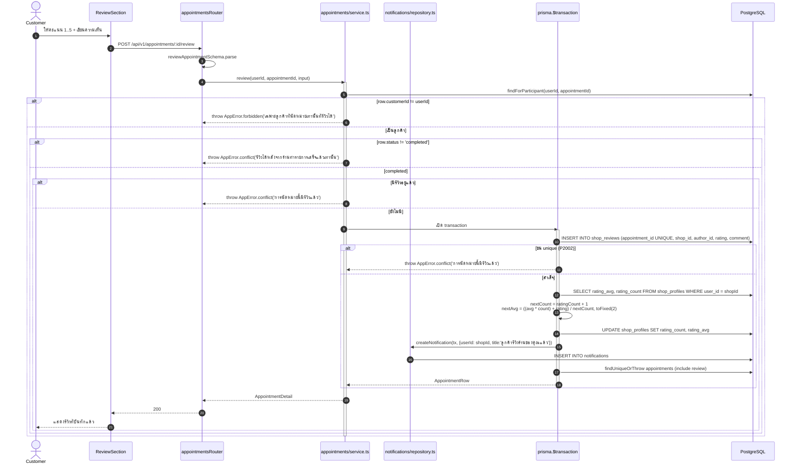
```mermaid
sequenceDiagram
    autonumber
    actor C as Customer
    participant W as ReviewSection
    participant R as appointmentsRouter
    participant SV as appointments/service.ts
    participant NR as notifications/repository.ts
    participant TX as prisma.$transaction
    participant DB as PostgreSQL

    C->>W: ให้คะแนน 1..5 + เขียนความเห็น
    W->>R: POST /api/v1/appointments/:id/review
    R->>R: reviewAppointmentSchema.parse
    R->>SV: review(userId, appointmentId, input)
    activate SV
    SV->>DB: findForParticipant(userId, appointmentId)
    alt row.customerId != userId
        SV-->>R: throw AppError.forbidden('เฉพาะลูกค้าที่นัดหมายเท่านั้นที่รีวิวได้')
    else เป็นลูกค้า
        alt row.status != 'completed'
            SV-->>R: throw AppError.conflict('รีวิวได้หลังจากร้านทำรายการเสร็จแล้วเท่านั้น')
        else completed
            alt มีรีวิวอยู่แล้ว
                SV-->>R: throw AppError.conflict('การนัดหมายนี้มีรีวิวแล้ว')
            else ยังไม่มี
                SV->>TX: เปิด transaction
                activate TX
                TX->>DB: INSERT INTO shop_reviews (appointment_id UNIQUE, shop_id, author_id, rating, comment)
                alt ชน unique (P2002)
                    TX-->>SV: throw AppError.conflict('การนัดหมายนี้มีรีวิวแล้ว')
                else สำเร็จ
                    TX->>DB: SELECT rating_avg, rating_count FROM shop_profiles WHERE user_id = shopId
                    TX->>TX: nextCount = ratingCount + 1<br/>nextAvg = ((avg * count) + rating) / nextCount, toFixed(2)
                    TX->>DB: UPDATE shop_profiles SET rating_count, rating_avg
                    TX->>NR: createNotification(tx, {userId: shopId, title:'ลูกค้ารีวิวร้านของคุณแล้ว'})
                    NR->>DB: INSERT INTO notifications
                    TX->>DB: findUniqueOrThrow appointments (include review)
                    TX-->>SV: AppointmentRow
                end
                deactivate TX
                SV-->>R: AppointmentDetail
                R-->>W: 200
                W-->>C: แสดงรีวิวที่บันทึกแล้ว
            end
        end
    end
    deactivate SV
```

**Alternative flow — ลบรีวิว (`DELETE /appointments/:id/review`)**
เฉพาะผู้เขียน → `deletedAt = now()` (soft delete) → คำนวณใหม่ทั้งร้านด้วย
`aggregate({_avg: rating, _count})` โดยกรอง `deletedAt: null` (ไม่ใช่การลบทีละค่าออกจากค่าเฉลี่ยเดิม)

---

### SQ-16 — AI Chat แบบ SSE (พร้อม degradation ทุกชั้น)

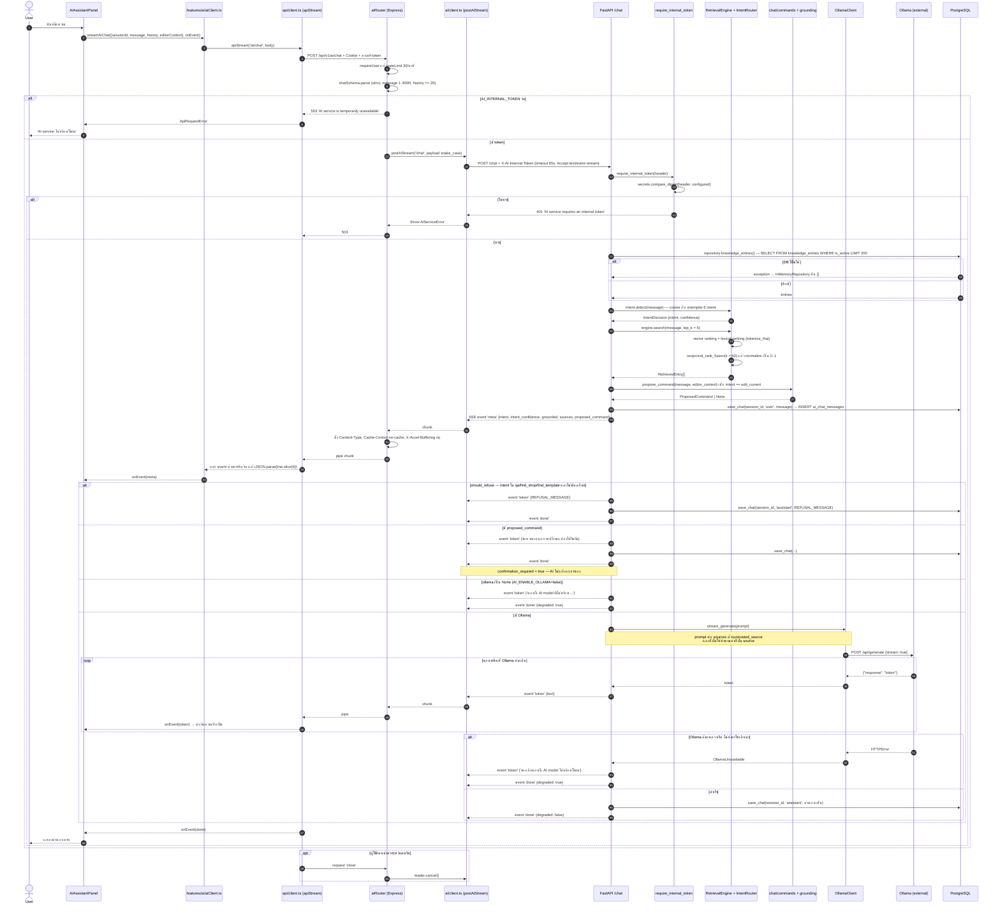
```mermaid
sequenceDiagram
    autonumber
    actor U as User
    participant AP as AiAssistantPanel
    participant AI as features/ai/aiClient.ts
    participant AC as api/client.ts (apiStream)
    participant R as aiRouter (Express)
    participant CL as ai/client.ts (postAiStream)
    participant FA as FastAPI /chat
    participant AU as require_internal_token
    participant RE as RetrievalEngine + IntentRouter
    participant CM as chat/commands + grounding
    participant OL as OllamaClient
    participant OX as Ollama (external)
    participant DB as PostgreSQL

    U->>AP: พิมพ์ข้อความ
    AP->>AI: streamAiChat({sessionId, message, history, editorContext}, onEvent)
    AI->>AC: apiStream('/ai/chat', body)
    AC->>R: POST /api/v1/ai/chat + Cookie + x-csrf-token
    R->>R: requireUser แล้ว rateLimit 30/นาที
    R->>R: chatSchema.parse (strict, message 1..8000, history <= 20)
    alt AI_INTERNAL_TOKEN ว่าง
        R-->>AC: 503 'AI service is temporarily unavailable'
        AC-->>AP: ApiRequestError
        AP-->>U: 'AI service ไม่พร้อมใช้งาน'
    else มี token
        R->>CL: postAiStream('/chat', payload snake_case)
        CL->>FA: POST /chat + X-AI-Internal-Token (timeout 65s, Accept text/event-stream)
        FA->>AU: require_internal_token(header)
        AU->>AU: secrets.compare_digest(header, configured)
        alt ไม่ตรง
            AU-->>CL: 401 'AI service requires an internal token'
            CL-->>R: throw AiServiceError
            R-->>AC: 503
        else ตรง
            FA->>DB: repository.knowledge_entries() — SELECT FROM knowledge_entries WHERE is_active LIMIT 200
            alt DB ใช้ไม่ได้
                DB-->>FA: exception → InMemoryRepository คืน []
            else ปกติ
                DB-->>FA: entries
            end
            FA->>RE: intent.detect(message) — cosine กับ exemplar 6 intent
            RE-->>FA: IntentDecision {intent, confidence}
            FA->>RE: engine.search(message, top_k = 5)
            RE->>RE: vector ranking + lexical ranking (tokenize_thai)
            RE->>RE: reciprocal_rank_fusion(k = 60) แล้ว normalize เป็น 0..1
            RE-->>FA: RetrievedEntry[]
            FA->>CM: propose_command(message, editor_context) เมื่อ intent == edit_current
            CM-->>FA: ProposedCommand | None
            FA->>DB: save_chat(session_id, 'user', message) → INSERT ai_chat_messages
            FA-->>CL: SSE event 'meta' {intent, intent_confidence, grounded, sources, proposed_command}
            CL-->>R: chunk
            R->>R: ตั้ง Content-Type, Cache-Control no-cache, X-Accel-Buffering no
            R-->>AC: pipe chunk
            AC-->>AI: แยก event ด้วยบรรทัดว่าง แล้ว JSON.parse(line.slice(6))
            AI-->>AP: onEvent(meta)

            alt should_refuse — intent ใน qa/find_shop/find_template และไม่มีผลลัพธ์
                FA-->>CL: event 'token' {REFUSAL_MESSAGE}
                FA->>DB: save_chat(session_id, 'assistant', REFUSAL_MESSAGE)
                FA-->>CL: event 'done'
            else มี proposed_command
                FA-->>CL: event 'token' {ข้อความเสนอการเปลี่ยนแปลงให้ยืนยัน}
                FA->>DB: save_chat(...)
                FA-->>CL: event 'done'
                Note over FA,CL: confirmation_required = true — AI ไม่แก้เอกสารเอง
            else ollama เป็น None (AI_ENABLE_OLLAMA=false)
                FA-->>CL: event 'token' {'ตอนนี้ AI model ยังไม่พร้อม...'}
                FA-->>CL: event 'done' {degraded: true}
            else มี Ollama
                FA->>OL: stream_generate(prompt)
                Note over FA,OL: prompt ห่อ sources ด้วย untrusted_source<br/>และสั่งไม่ให้ทำตามคำสั่งใน source
                OL->>OX: POST /api/generate {stream: true}
                loop ทุกบรรทัดที่ Ollama ส่งกลับ
                    OX-->>OL: {"response": "token"}
                    OL-->>FA: token
                    FA-->>CL: event 'token' {text}
                    CL-->>R: chunk
                    R-->>AC: pipe
                    AC-->>AP: onEvent(token) → ต่อข้อความทีละชิ้น
                end
                alt Ollama ล้มเหลว หรือ ไม่ส่งอะไรกลับมา
                    OX-->>OL: HTTPError
                    OL-->>FA: OllamaUnavailable
                    FA-->>CL: event 'token' {'ขออภัย ตอนนี้ AI model ไม่พร้อมใช้งาน'}
                    FA-->>CL: event 'done' {degraded: true}
                else สำเร็จ
                    FA->>DB: save_chat(session_id, 'assistant', คำตอบเต็ม)
                    FA-->>CL: event 'done' {degraded: false}
                end
            end
            AC-->>AP: onEvent(done)
            AP-->>U: แสดงคำตอบครบ
        end
    end
    opt ผู้ใช้ปิดหน้าต่างระหว่างสตรีม
        AC->>R: request 'close'
        R->>CL: reader.cancel()
    end
```

---

### SQ-17 — AI สร้างสูตรดีไซน์ (พร้อมการซ่อม JSON และ fallback)

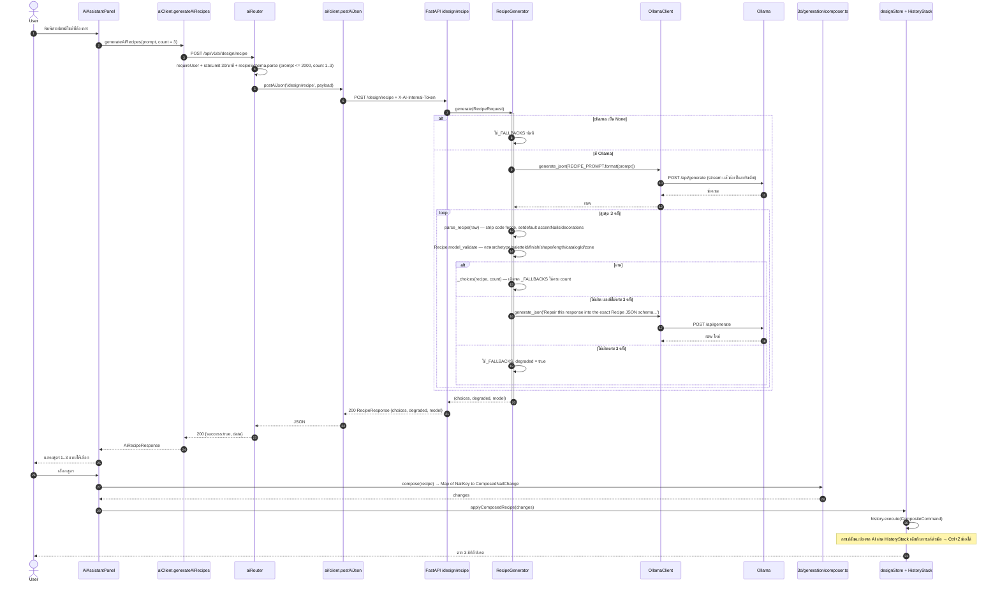
```mermaid
sequenceDiagram
    autonumber
    actor U as User
    participant AP as AiAssistantPanel
    participant AI as aiClient.generateAiRecipes
    participant R as aiRouter
    participant CL as ai/client.postAiJson
    participant FA as FastAPI /design/recipe
    participant RG as RecipeGenerator
    participant OL as OllamaClient
    participant OX as Ollama
    participant CO as 3d/generation/composer.ts
    participant DS as designStore + HistoryStack

    U->>AP: พิมพ์คำอธิบายดีไซน์ที่ต้องการ
    AP->>AI: generateAiRecipes(prompt, count = 3)
    AI->>R: POST /api/v1/ai/design/recipe
    R->>R: requireUser + rateLimit 30/นาที + recipeSchema.parse (prompt <= 2000, count 1..3)
    R->>CL: postAiJson('/design/recipe', payload)
    CL->>FA: POST /design/recipe + X-AI-Internal-Token
    FA->>RG: generate(RecipeRequest)
    activate RG
    alt ollama เป็น None
        RG->>RG: ใช้ _FALLBACKS ทันที
    else มี Ollama
        RG->>OL: generate_json(RECIPE_PROMPT.format(prompt))
        OL->>OX: POST /api/generate (stream แล้วต่อเป็นสตริงเดียว)
        OX-->>OL: ข้อความ
        OL-->>RG: raw
        loop สูงสุด 3 ครั้ง
            RG->>RG: parse_recipe(raw) — strip code fence, setdefault accentNails/decorations
            RG->>RG: Recipe.model_validate — ตรวจ archetype/paletteId/finish/shape/length/catalogId/zone
            alt ผ่าน
                RG->>RG: _choices(recipe, count) — เติมจาก _FALLBACKS ให้ครบ count
            else ไม่ผ่าน และยังไม่ครบ 3 ครั้ง
                RG->>OL: generate_json('Repair this response into the exact Recipe JSON schema...')
                OL->>OX: POST /api/generate
                OX-->>OL: raw ใหม่
            else ไม่ผ่านครบ 3 ครั้ง
                RG->>RG: ใช้ _FALLBACKS, degraded = true
            end
        end
    end
    RG-->>FA: (choices, degraded, model)
    deactivate RG
    FA-->>CL: 200 RecipeResponse {choices, degraded, model}
    CL-->>R: JSON
    R-->>AI: 200 {success:true, data}
    AI-->>AP: AiRecipeResponse
    AP-->>U: แสดงสูตร 1..3 แบบให้เลือก
    U->>AP: เลือกสูตร
    AP->>CO: compose(recipe) → Map of NailKey to ComposedNailChange
    CO-->>AP: changes
    AP->>DS: applyComposedRecipe(changes)
    DS->>DS: history.execute(CompositeCommand)
    Note over DS: การเปลี่ยนแปลงจาก AI ผ่าน HistoryStack เดียวกับการแก้ด้วยมือ → Ctrl+Z ย้อนได้
    DS-->>U: ฉาก 3 มิติอัปเดต
```

---

### SQ-18 — อ่านการแจ้งเตือน

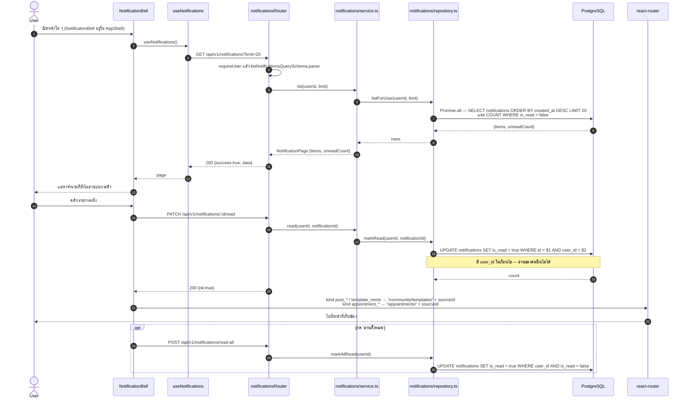
```mermaid
sequenceDiagram
    autonumber
    actor U as User
    participant NB as NotificationBell
    participant Q as useNotifications
    participant R as notificationsRouter
    participant SV as notifications/service.ts
    participant RP as notifications/repository.ts
    participant DB as PostgreSQL
    participant NAV as react-router

    U->>NB: เปิดหน้าใด ๆ (NotificationBell อยู่ใน AppShell)
    NB->>Q: useNotifications()
    Q->>R: GET /api/v1/notifications?limit=20
    R->>R: requireUser แล้ว listNotificationsQuerySchema.parse
    R->>SV: list(userId, limit)
    SV->>RP: listForUser(userId, limit)
    RP->>DB: Promise.all — SELECT notifications ORDER BY created_at DESC LIMIT 20<br/>และ COUNT WHERE is_read = false
    DB-->>RP: {items, unreadCount}
    RP-->>SV: rows
    SV-->>R: NotificationPage {items, unreadCount}
    R-->>Q: 200 {success:true, data}
    Q-->>NB: page
    NB-->>U: แสดงจำนวนที่ยังไม่อ่านบนกระดิ่ง
    U->>NB: คลิกรายการหนึ่ง
    NB->>R: PATCH /api/v1/notifications/:id/read
    R->>SV: read(userId, notificationId)
    SV->>RP: markRead(userId, notificationId)
    RP->>DB: UPDATE notifications SET is_read = true WHERE id = $1 AND user_id = $2
    Note over RP,DB: มี user_id ในเงื่อนไข — อ่านของคนอื่นไม่ได้
    DB-->>RP: count
    R-->>NB: 200 {ok:true}
    NB->>NAV: kind post_* / template_remix → '/community/templates/' + sourceId<br/>kind appointment_* → '/appointments/' + sourceId
    NAV-->>U: ไปยังหน้าที่เกี่ยวข้อง
    opt กด 'อ่านทั้งหมด'
        NB->>R: POST /api/v1/notifications/read-all
        R->>RP: markAllRead(userId)
        RP->>DB: UPDATE notifications SET is_read = true WHERE user_id AND is_read = false
    end
```

---

### SQ-19 — Error Handling (ทุก error ผ่านเส้นทางเดียวกัน)

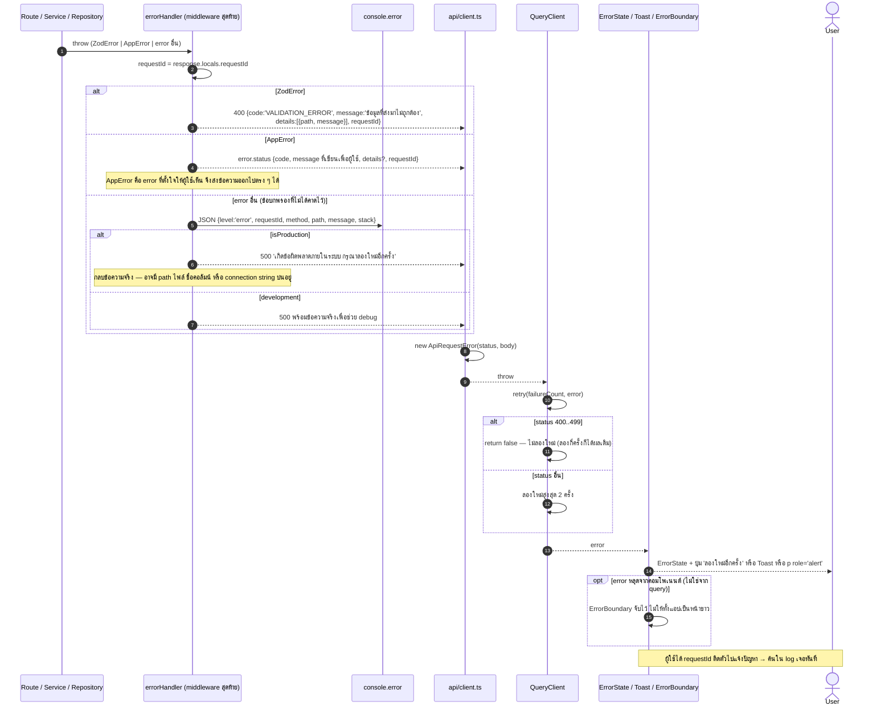
```mermaid
sequenceDiagram
    autonumber
    participant RT as Route / Service / Repository
    participant EH as errorHandler (middleware สุดท้าย)
    participant LOG as console.error
    participant AC as api/client.ts
    participant QC as QueryClient
    participant UI as ErrorState / Toast / ErrorBoundary
    actor U as User

    RT->>EH: throw (ZodError | AppError | error อื่น)
    EH->>EH: requestId = response.locals.requestId
    alt ZodError
        EH-->>AC: 400 {code:'VALIDATION_ERROR', message:'ข้อมูลที่ส่งมาไม่ถูกต้อง',<br/>details:[{path, message}], requestId}
    else AppError
        EH-->>AC: error.status {code, message ที่เขียนเพื่อผู้ใช้, details?, requestId}
        Note over EH: AppError คือ error ที่ตั้งใจให้ผู้ใช้เห็น จึงส่งข้อความออกไปตรง ๆ ได้
    else error อื่น (ข้อบกพร่องที่ไม่ได้คาดไว้)
        EH->>LOG: JSON {level:'error', requestId, method, path, message, stack}
        alt isProduction
            EH-->>AC: 500 'เกิดข้อผิดพลาดภายในระบบ กรุณาลองใหม่อีกครั้ง'
            Note over EH: กลบข้อความจริง — อาจมี path ไฟล์ ชื่อคอลัมน์ หรือ connection string ปนอยู่
        else development
            EH-->>AC: 500 พร้อมข้อความจริงเพื่อช่วย debug
        end
    end
    AC->>AC: new ApiRequestError(status, body)
    AC-->>QC: throw
    QC->>QC: retry(failureCount, error)
    alt status 400..499
        QC->>QC: return false — ไม่ลองใหม่ (ลองกี่ครั้งก็ได้ผลเดิม)
    else status อื่น
        QC->>QC: ลองใหม่สูงสุด 2 ครั้ง
    end
    QC-->>UI: error
    UI-->>U: ErrorState + ปุ่ม 'ลองใหม่อีกครั้ง' หรือ Toast หรือ p role='alert'
    opt error หลุดจากคอมโพเนนต์ (ไม่ใช่จาก query)
        UI->>UI: ErrorBoundary จับไว้ ไม่ให้ทั้งแอปเป็นหน้าขาว
    end
    Note over UI,U: ผู้ใช้ได้ requestId ติดตัวไปแจ้งปัญหา → ค้นใน log เจอทันที
```

## 5. Components / Actors

### 5.1 Participant ที่ใช้ในเอกสารนี้ (ทุกตัวมีอยู่จริงใน `System Architecture.md`)

| Participant | ไฟล์จริง |
|---|---|
| SPA / Page / Panel | `apps/web/src/pages/*.tsx`, `apps/web/src/features/**` |
| `api/client.ts` | `apiFetch`, `apiFetchPage`, `apiUploadBinary`, `apiStream` |
| TanStack Query hook | `apps/web/src/features/*/use*.ts` |
| Middleware chain | `apps/api/src/middleware/*.ts` (`requestId`, `csrf`, `requireUser`, `rateLimit`, `errorHandler`) |
| Router | `apps/api/src/<module>/routes.ts` |
| Service | `apps/api/src/<module>/service.ts` |
| Repository | `apps/api/src/<module>/repository.ts` |
| `prisma.$transaction` | `apps/api/src/db.ts` → `prisma` |
| Storage | `apps/api/src/storage/LocalDiskProvider.ts` |
| FastAPI | `apps/ai/app/routers/*.py` |
| Ollama | external, `OLLAMA_URL` |
| PostgreSQL | `DATABASE_URL` |

### 5.2 Message type ที่ปรากฏ

| ประเภท | ตัวอย่าง |
|---|---|
| HTTP Request | `POST /api/v1/auth/login`, `PUT /api/v1/projects/:id/draft` |
| HTTP Response | `201 {success:true, data}`, `409 {success:false, error:{code:'CONFLICT'}}` |
| SSE event | `data: {"type":"meta"...}`, `data: {"type":"token"...}`, `data: {"type":"done"...}` |
| Binary upload | `Content-Type: image/webp` (express.raw limit 2mb) |
| Function call | `service.saveDraft(...)`, `repository.latestVersion(...)` |
| Database query | `SELECT`, `INSERT`, `UPDATE`, `DELETE` (ผ่าน Prisma) |
| Transaction | `prisma.$transaction(async (tx) => ...)` |
| Validation | `*.parse()` / `.safeParse()` ของ Zod, `model_validate` ของ Pydantic |

## 6. Flow / Relationship

### 6.1 เส้นทางมาตรฐานของทุก request

```text
Actor
  ↓ (UI event)
React component
  ↓ (hook)
TanStack Query
  ↓ (apiFetch — cookie + x-csrf-token)
Express middleware chain
  ↓ (requestId → helmet → cors → cookieParser → json → CSRF → rateLimit)
Router  ── Zod parse ──▶ ZodError → errorHandler
  ↓ (requireUser / optionalUser / requireAdmin)
Service ── AppError ───▶ errorHandler
  ↓ (mustOwn / findForParticipant / assertShop)
Repository
  ↓
prisma (db.ts) → PostgreSQL
```

### 6.2 การใช้ Transaction (ทุกจุดที่มีตัวนับหรือหลายตาราง)

| Sequence | สิ่งที่อยู่ใน transaction เดียวกัน |
|---|---|
| SQ-09 ถูกใจ | insert `template_likes` + increment `like_count` + insert `notifications` |
| SQ-10 รีมิกซ์ | insert `projects` + `design_versions` + `template_remixes` + increment `remix_count` + `notifications` |
| SQ-11 รายงาน | insert `content_reports` + increment `report_count` + (อาจ) set `visibility='hidden'` |
| SQ-13 สร้างนัดหมาย | insert `appointments` + `appointment_proposals` + `notifications` |
| SQ-14 ตอบรับ | update proposal + update appointment + supersede proposal อื่น + `notifications` |
| SQ-15 รีวิว | insert `shop_reviews` + update `shop_profiles.rating_*` + `notifications` |
| คอมเมนต์ | insert `template_comments` + increment `comment_count` + `notifications` |
| แชร์ | insert `template_shares` + increment `share_count` |

### 6.3 ความสอดคล้อง Sequence ↔ Architecture

| Sequence เรียก component | มีใน `System Architecture.md` §5.2 |
|---|---|
| `requestId`, `csrfProtection`, `apiLimiter`, `requireUser`, `requireAdmin`, `errorHandler` | ✔ |
| Router 9 ตัว (`auth`, `projects`, `templates`, `notifications`, `ai`, `shops`, `reviews`, `appointments`, `users`) | ✔ |
| Service / Repository ของแต่ละโมดูล | ✔ |
| `prisma` (db.ts) → PostgreSQL | ✔ |
| `storage` (LocalDiskProvider) → local disk | ✔ |
| `postAiStream` / `postAiJson` → FastAPI | ✔ |
| `OllamaClient` → Ollama | ✔ |
| IndexedDB (`drafts`) | ✔ |

**ไม่มี sequence ใดเรียก component ที่ไม่มีใน architecture**

### 6.4 ความสอดคล้อง Sequence ↔ Use Case ↔ BPMN

| Sequence | Use Case | BPMN |
|---|---|---|
| SQ-01 | UC-01 | BP-01 |
| SQ-02 | UC-02 | BP-02 |
| SQ-03 | UC-S1, UC-S2 | BP-X |
| SQ-04 | UC-03 | BP-03 |
| SQ-05 | UC-12 | BP-04 |
| SQ-06 | UC-15, UC-36 | BP-04 |
| SQ-07 | UC-16, UC-21 | BP-05 |
| SQ-08 | UC-40 | BP-07 |
| SQ-09 | UC-43, UC-63 | BP-07 |
| SQ-10 | UC-46 | BP-07 |
| SQ-11 | UC-47, UC-51 | BP-08 |
| SQ-12 | UC-50 | BP-08 |
| SQ-13 | UC-80 | BP-09 |
| SQ-14 | UC-83 | BP-09 |
| SQ-15 | UC-88 | BP-09 |
| SQ-16 | UC-100, UC-103, UC-104 | BP-11 |
| SQ-17 | UC-101, UC-105 | BP-11 |
| SQ-18 | UC-60, UC-61, UC-62 | BP-07 / BP-09 |
| SQ-19 | ทุก UC | BP-X |

## 7. Source References

**API endpoints ที่ปรากฏใน sequence**

```text
POST   /api/v1/auth/register            POST   /api/v1/auth/login
POST   /api/v1/auth/logout              GET    /api/v1/auth/me
GET    /api/v1/projects/:id             PUT    /api/v1/projects/:id/draft
POST   /api/v1/projects/:id/versions    POST   /api/v1/projects/:id/thumbnail
GET    /api/v1/templates                PUT    /api/v1/templates/:id/like
DELETE /api/v1/templates/:id/like       POST   /api/v1/templates/:id/remix
POST   /api/v1/templates/:id/report     GET    /api/v1/templates/moderation/reports
POST   /api/v1/appointments             POST   /api/v1/appointments/:id/accept
POST   /api/v1/appointments/:id/review  DELETE /api/v1/appointments/:id/review
GET    /api/v1/notifications            PATCH  /api/v1/notifications/:id/read
POST   /api/v1/notifications/read-all
POST   /api/v1/ai/chat                  POST   /api/v1/ai/design/recipe

# internal (apps/ai)
POST   /chat        POST /design/recipe

# external
POST   {OLLAMA_URL}/api/generate
```

**ตารางฐานข้อมูลที่ถูกอ่าน/เขียนใน sequence**

```text
users  sessions  projects  design_versions  assets
nail_templates  template_likes  template_shares  template_remixes  template_comments
content_reports  notifications
shop_profiles  shop_services  appointments  appointment_proposals
appointment_messages  shop_reviews
knowledge_entries  ai_chat_messages
```

**ไฟล์**
- `apps/api/src/app.ts`, `middleware/{requestId,csrf,requireUser,rateLimit,errorHandler}.ts`, `errors/AppError.ts`
- `apps/api/src/auth/{routes,service,repository,session,password}.ts`
- `apps/api/src/projects/{routes,service,repository}.ts`, `storage/{LocalDiskProvider,mimeSniff}.ts`
- `apps/api/src/templates/{routes,service,repository,cursor}.ts`
- `apps/api/src/appointments/{routes,service}.ts`, `shops/{routes,service}.ts`
- `apps/api/src/notifications/{routes,service,repository}.ts`, `users/{routes,service,repository}.ts`
- `apps/api/src/ai/{routes,client}.ts`
- `apps/web/src/api/client.ts`, `app/providers.tsx`
- `apps/web/src/features/{auth,projects,community,appointments,notifications,ai,design}/**`
- `apps/ai/app/routers/{chat,design}.py`, `app/{auth,repositories,ollama}.py`, `app/retrieval/**`, `app/chat/**`, `app/generation/recipe.py`

**Integration test ที่ยืนยันลำดับเหล่านี้**
- `slice1.integration.test.ts` (SQ-01…SQ-05), `slice2.draft.integration.test.ts` (SQ-06)
- `slice3.versions.integration.test.ts` (SQ-07), `thumbnail.integration.test.ts` (SQ-07)
- `templates.{feed,like,remix,moderation,create,detail}.integration.test.ts` (SQ-08…SQ-12)
- `appointments.integration.test.ts` (SQ-13…SQ-15)
- `notifications.integration.test.ts` (SQ-18), `cors.test.ts` + `rateLimit.test.ts` (SQ-03)
- `apps/ai/tests/{test_chat,test_recipe,test_retrieval}.py` (SQ-16, SQ-17)

## 8. Unknown / Missing Information

| ประเด็น | สถานะ |
|---|---|
| **Payment sequence** | **UNKNOWN / NOT FOUND** — ไม่มี payment gateway, ไม่มีตารางธุรกรรม, ไม่มี endpoint ตัดเงิน มีเพียงฟิลด์ราคาอ้างอิง |
| **OAuth / SSO sequence** | **NOT FOUND** — ระบบใช้ opaque session cookie เท่านั้น |
| **JWT refresh-token sequence** | **NOT FOUND** — ไม่มี JWT ในระบบ; session ต่ออายุด้วย `SESSION_TTL_DAYS` ตอนออก cookie |
| **WebSocket / realtime push sequence** | **NOT FOUND** — มีเพียง SSE ทางเดียวสำหรับ AI chat; แชทนัดหมายและการแจ้งเตือนใช้การ poll/refetch ของ TanStack Query |
| **Email / SMS / Push notification sequence** | **NOT FOUND** |
| **Background job / scheduled sequence** | **NOT FOUND** — ไม่มี cron/queue/worker; `deleteExpiredSessions()` ไม่มีผู้เรียก |
| **`touchSession()` (อัปเดต `last_seen_at`)** | มีฟังก์ชันใน `auth/repository.ts` แต่ **ไม่มีจุดใดเรียก** — `last_seen_at` จึงคงค่าตอนสร้าง |
| **no-show sequence** | มี logic ใน `transition()` แต่ไม่มี route จึงไม่มีลำดับการเรียกจริง |
| **การอ่านประวัติแชท AI ย้อนหลัง** | เขียนลง `ai_chat_messages` แต่ไม่มี endpoint อ่านกลับ — ประวัติที่ส่งใน `history` มาจาก state ในเบราว์เซอร์ |
| **Sequence ของ `POST /ai/recommend`** | endpoint ทำงานได้ครบ (SQ ไม่ได้วาดไว้เพราะ) **ไม่มีหน้าจอใดเรียก** — `recommendAiTemplates()` ใน `aiClient.ts` ไม่มีผู้ import |
| **การเพิ่ม `view_count`** | ไม่มีลำดับใดเขียนค่านี้ — คอลัมน์คงเป็น 0 |
