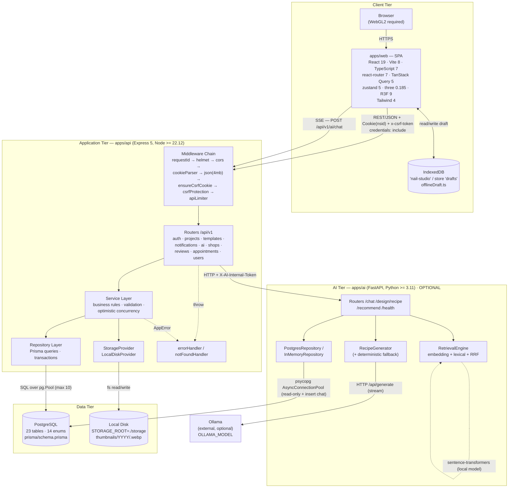
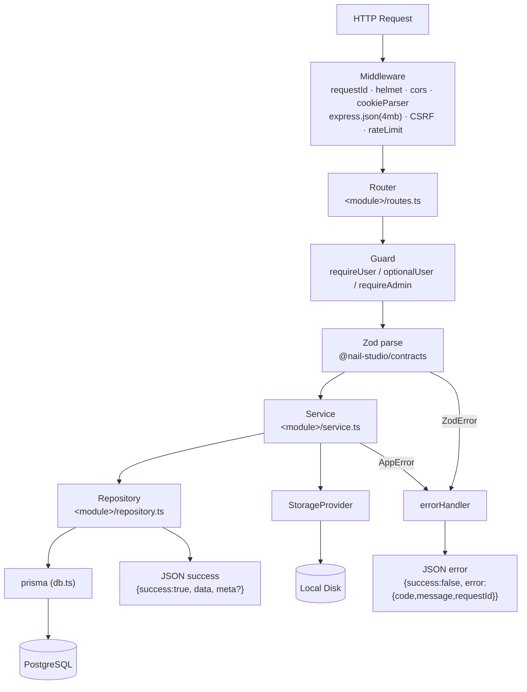
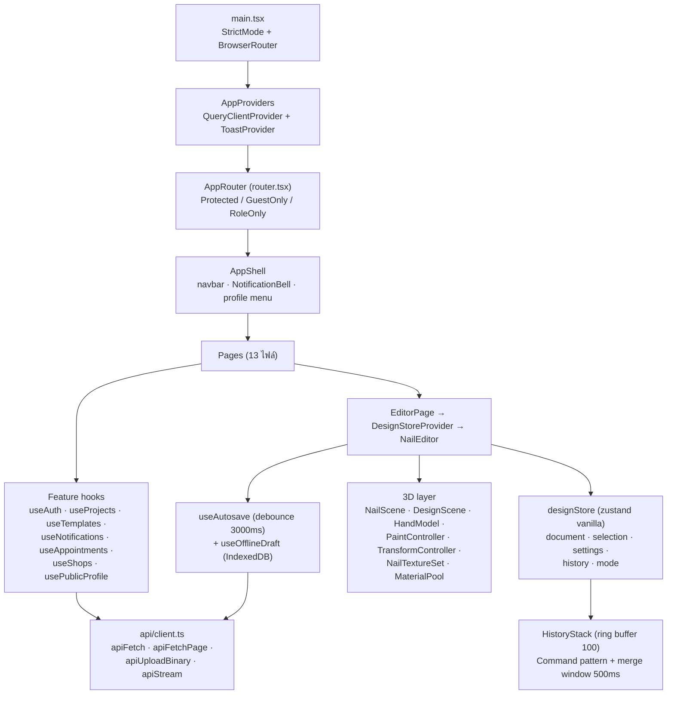
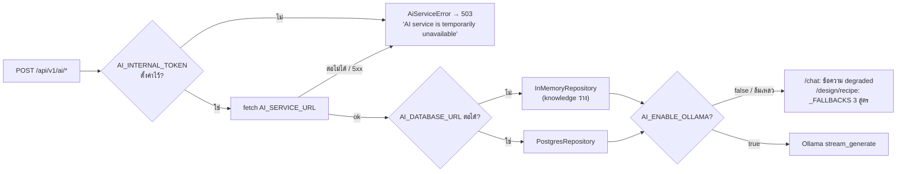

# System Architecture Diagram

## 1. Purpose

แสดงโครงสร้างเชิงสถาปัตยกรรมของระบบ **Nail Studio 3D** ทั้งระบบ — ตั้งแต่ผู้ใช้ผ่าน
Browser → SPA → REST API → Business Logic → Repository → PostgreSQL รวมถึงบริการ AI
ภายในที่แยกออกมาเป็น process ของตัวเอง และ storage ของไฟล์ภาพ

ทุกองค์ประกอบในเอกสารนี้อ้างอิงจากไฟล์จริงใน repository เท่านั้น

## 2. Scope

| อยู่ใน Scope | ไม่อยู่ใน Scope (พร้อมเหตุผล) |
|---|---|
| `apps/web` (SPA) | `Source/` — ซอร์สต้นทางเดิม ถูก `.gitignore` (บรรทัด 34) ไม่ได้อยู่ใน npm workspaces จึงไม่ใช่ส่วนของระบบที่รัน |
| `apps/api` (Express REST API) | `Olddesine/` — ไฟล์ `.txt` สเปกเก่า ไม่ใช่โค้ดที่รัน |
| `apps/ai` (FastAPI internal service) | `spikes/` — โปรเจกต์ทดลอง (spike) แยกจาก workspaces |
| `packages/contracts` (shared Zod schemas) | `docs/` (เอกสาร) |
| `prisma/` (schema + 12 migrations) | |
| `tools/` (สคริปต์ build โมเดล 3D) | |

## 3. Source Analysis

หลักฐานที่ใช้กำหนด Architecture Pattern และองค์ประกอบ:

| หลักฐาน | ไฟล์ |
|---|---|
| Monorepo แบบ npm workspaces | `package.json` → `"workspaces": ["packages/*", "apps/api", "apps/web"]` |
| Express app + การประกอบ router ทั้งหมด | `apps/api/src/app.ts` |
| จุดเข้า HTTP server + graceful shutdown | `apps/api/src/server.ts` |
| ชั้น Route → Service → Repository | `apps/api/src/<module>/routes.ts` / `service.ts` / `repository.ts` |
| จุดเดียวที่สร้าง PrismaClient (D-07) | `apps/api/src/db.ts` — "ชั้น repository เท่านั้นที่ import ไฟล์นี้ได้" |
| Driver adapter ของ Prisma 7 | `apps/api/src/db.ts` → `pg.Pool` + `PrismaPg` |
| SPA + routing ฝั่ง client | `apps/web/src/main.tsx`, `apps/web/src/app/router.tsx` |
| API client ตัวเดียวของทั้ง SPA | `apps/web/src/api/client.ts` |
| บริการ AI แยก process | `apps/ai/app/main.py`, `apps/ai/README.md` |
| การเรียกข้าม service (Express → FastAPI) | `apps/api/src/ai/client.ts` |
| Storage แบบ local disk | `apps/api/src/storage/index.ts`, `LocalDiskProvider.ts` |
| สัญญาข้อมูลร่วม (single source of truth) | `packages/contracts/src/*.ts` |
| การรันระบบ dev | `start.bat`, `stop.bat`, `SETUP.md` |

## 4. Diagram

### 4.1 Architecture Overview (C4 — Container level)

### 4.2 Layered View ของ apps/api (Layered Architecture / Modular Monolith)

### 4.3 Frontend Architecture (apps/web)

## 5. Components / Actors

### 5.1 Runtime processes

| Process | Port | คำสั่งรัน | หลักฐาน |
|---|---|---|---|
| Web (Vite dev server) | 5173 | `npm run dev:web` | `apps/web/vite.config.ts` → `server: { port: 5173 }` |
| API (Express) | 4000 (`API_PORT`) | `npm run dev:api` → `node --env-file=../../.env --watch src/server.ts` | `apps/api/package.json`, `config/env.ts` |
| AI (uvicorn) | 4100 | `uvicorn app.main:app --reload --port 4100` | `apps/ai/README.md`, `start.bat` |
| PostgreSQL | 5432 | ภายนอก | `.env.example` → `DATABASE_URL` |
| Ollama (optional) | 11434 | ภายนอก | `.env.example` → `OLLAMA_URL` |

### 5.2 องค์ประกอบและหน้าที่

| องค์ประกอบ | ไฟล์ | หน้าที่ |
|---|---|---|
| `requestId` | `middleware/requestId.ts` | ออก UUID ต่อ request ใส่ `x-request-id` และแนบในทุก error |
| `helmet` | `app.ts` | CSP + HSTS เฉพาะ production (dev ปิด CSP ให้ Vite client ทำงานได้) |
| `cors` | `app.ts` | allowlist `WEB_ORIGIN` + loopback origin เฉพาะ non-production, `credentials: true` |
| `ensureCsrfCookie` / `csrfProtection` | `middleware/csrf.ts` | double-submit cookie; ยกเว้น GET/HEAD/OPTIONS; เทียบด้วย `timingSafeEqual` |
| `apiLimiter` | `middleware/rateLimit.ts` | 600 req/min ทั้ง `/api/v1` (ปิดเมื่อ `NODE_ENV=test`) |
| `authLimiter` | `auth/routes.ts` | 5 req/min เฉพาะ register/login (เหตุผล: Argon2id ใช้ RAM 19 MiB/ครั้ง) |
| `aiRouter` limiter | `ai/routes.ts` | 30 req/min |
| `requireUser` / `optionalUser` / `requireAdmin` | `middleware/requireUser.ts` | ตรวจ session cookie `nsid` → เติม `request.user` |
| `errorHandler` | `middleware/errorHandler.ts` | จุดเดียวที่แปลง error เป็น HTTP response; กลบข้อความจริงใน production |
| `prisma` | `db.ts` | PrismaClient เดียวของระบบ, `pg.Pool` max 10, `statement_timeout` 5,000 ms |
| `storage` | `storage/index.ts` | เลือก provider จาก `STORAGE_DRIVER` (รองรับเฉพาะ `local`) |
| `@nail-studio/contracts` | `packages/contracts/src` | Zod schema ใช้ร่วมกัน frontend + backend (`designDocumentSchema` เป็นแกน) |
| `AiState` | `apps/ai/app/main_state.py` | ถือ settings / repository / embeddings / intent / recipe generator / ollama |

### 5.3 Communication protocols (เฉพาะที่พบจริง)

| เส้นทาง | โปรโตคอล | รายละเอียด |
|---|---|---|
| Browser ↔ API | HTTP/HTTPS + JSON | `fetch` พร้อม `credentials: 'include'`; header `x-csrf-token` ทุก method ที่ไม่ใช่ GET |
| Browser ← API (AI chat) | **SSE** (`text/event-stream`) | `apiStream('/ai/chat')` → อ่าน `ReadableStream`, แยก event ด้วย `\n\n`, prefix `data: ` |
| Browser ↔ API (thumbnail) | HTTP `image/webp` (raw body) | `apiUploadBinary` → `POST /projects/:id/thumbnail` |
| API ↔ AI service | HTTP + JSON / SSE | header `X-AI-Internal-Token`, timeout 65,000 ms |
| API ↔ PostgreSQL | TCP/SQL ผ่าน `pg` + Prisma driver adapter | pool max 10 |
| AI ↔ PostgreSQL | TCP/SQL ผ่าน `psycopg` AsyncConnectionPool | อ่าน `knowledge_entries`, `nail_templates`; เขียน `ai_chat_messages` |
| AI ↔ Ollama | HTTP streaming `POST /api/generate` | `apps/ai/app/ollama.py` |

**ไม่พบใน Project:** WebSocket, gRPC, GraphQL, message queue, OAuth, JWT

### 5.4 Authentication / Authorization model

- **ไม่ใช่ JWT และไม่ใช่ OAuth** — เป็น **opaque session token** 256 บิต (`randomBytes(32).toString('base64url')`)
- เก็บใน DB เป็น **SHA-256 digest** (`sessions.token_hash`, ชนิด `Bytes`, unique) ไม่เก็บ token ดิบ
- Cookie: `nsid` (httpOnly, sameSite=lax, secure เฉพาะ production, `expires = now + SESSION_TTL_DAYS`)
- CSRF cookie: `nscsrf` (`httpOnly: false` โดยตั้งใจ เพื่อให้ JS คัดลอกไปใส่ header ได้)
- Password hashing: **Argon2id** (`memoryCost 19456`, `timeCost 2`, `parallelism 1`) — `auth/password.ts`
- Authorization: role enum `user | shop | admin`; `requireAdmin` ใช้เฉพาะ `GET /templates/moderation/reports`; สิทธิ์ระดับข้อมูลตรวจใน service (เช่น `mustOwn`, `findForParticipant`, `assertShop`)

## 6. Flow / Relationship

### 6.1 Architecture Pattern

| ระดับ | Pattern | หลักฐาน |
|---|---|---|
| ระบบรวม | **Client–Server** (SPA + REST API) | `apps/web` เรียก `apps/api` ผ่าน `/api/v1` |
| Backend | **Modular Monolith + Layered Architecture** | โมดูล 9 ตัวใน process เดียว (`app.ts`) แต่ละโมดูลแยกชั้น routes / service / repository |
| การเข้าถึงข้อมูล | **Repository Pattern** | `db.ts` ระบุว่า "ชั้น repository เท่านั้นที่ import ไฟล์นี้ได้ — service และ controller ห้ามแตะ" |
| Editor ฝั่ง client | **Command Pattern** สำหรับ undo/redo | `3d/history/Command.ts`, `HistoryStack.ts`, `commands/*.ts` |
| Storage | **Strategy / Provider Pattern** | `StorageProvider` interface + `LocalDiskProvider` + exhaustiveness check ใน `createStorageProvider()` |
| AI | **Sidecar service (optional dependency)** | `apps/ai/README.md`: "so the Express API can remain responsive when Ollama or an embedding model is unavailable" |

**ไม่ใช่** Microservices (ไม่มี service discovery / API gateway / ฐานข้อมูลแยกต่อ service — `apps/ai` ใช้ฐานข้อมูลเดียวกัน)

### 6.2 หลักการ degradation ของ AI

### 6.3 Deployment / Configuration

| หัวข้อ | สถานะ |
|---|---|
| Environment variables | `.env` (root) — ใช้ร่วมทั้ง 3 apps; validate ด้วย Zod ตอนบูต (`config/env.ts` — fail fast) |
| Local orchestration | `start.bat` / `stop.bat` (Windows, เปิด 3 หน้าต่าง cmd) |
| Docker / docker-compose | **UNKNOWN / NOT FOUND** — ไม่มีไฟล์ `Dockerfile` หรือ `docker-compose.yml` |
| CI/CD pipeline | **UNKNOWN / NOT FOUND** — ไม่มีไดเรกทอรี `.github/` |
| Reverse proxy config | **UNKNOWN / NOT FOUND** — มีเพียง `app.set('trust proxy', 1)` ที่บอกว่า *ตั้งใจ* จะอยู่หลัง proxy ตอน production |
| Cache layer (Redis ฯลฯ) | **NOT FOUND** — แคชมีเฉพาะฝั่ง client (TanStack Query `staleTime: 30_000`) และ HTTP `Cache-Control` บน endpoint ภาพ |
| Queue / Background job / Cron | **NOT FOUND** — มี `deleteExpiredSessions()` ใน `auth/repository.ts` แต่ไม่มีจุดใดในระบบเรียกใช้ |
| Logging | `console.log` / `console.error` แบบ JSON บรรทัดเดียว (`server.ts`, `errorHandler.ts`) — ไม่มี logger library |
| Monitoring / APM | **NOT FOUND** |

## 7. Source References

**Backend**
- `apps/api/src/app.ts`, `server.ts`, `db.ts`, `config/env.ts`
- `apps/api/src/middleware/{requestId,csrf,requireUser,rateLimit,errorHandler}.ts`
- `apps/api/src/errors/AppError.ts`
- `apps/api/src/{auth,projects,templates,notifications,ai,shops,appointments,users}/**`
- `apps/api/src/storage/{index,StorageProvider,LocalDiskProvider,mimeSniff}.ts`
- `apps/api/package.json`, `apps/api/vitest.config.ts`

**Frontend**
- `apps/web/src/main.tsx`, `app/providers.tsx`, `app/router.tsx`, `api/client.ts`
- `apps/web/src/components/**`, `features/**`, `pages/**`, `3d/**`, `styles/**`
- `apps/web/vite.config.ts`, `apps/web/package.json`

**AI service**
- `apps/ai/app/{main,main_state,config,auth,schemas,repositories,ollama}.py`
- `apps/ai/app/routers/{chat,design,recommend}.py`
- `apps/ai/app/retrieval/{engine,embedding,intent,lexical,rrf}.py`
- `apps/ai/app/chat/{grounding,commands,memory}.py`
- `apps/ai/app/generation/recipe.py`
- `apps/ai/{pyproject.toml,requirements.txt,README.md}`

**Shared / Data / Ops**
- `packages/contracts/src/{index,api,auth,design,project,template,notification,appointment,profile}.ts`
- `prisma/schema.prisma`, `prisma/migrations/**`, `prisma/seed.mjs`, `prisma.config.ts`
- `package.json`, `tsconfig.base.json`, `.env.example`, `start.bat`, `stop.bat`, `SETUP.md`

**API base path:** `http://localhost:4000/api/v1` (ค่า default จาก `VITE_API_URL`)
**AI base path (internal only):** `http://localhost:4100`

## 8. Unknown / Missing Information

| หัวข้อ | สถานะ | ต้องตรวจเพิ่มจาก |
|---|---|---|
| Dockerfile / docker-compose | **NOT FOUND** | รากโปรเจกต์ / repo ปฏิบัติการแยก |
| CI/CD (GitHub Actions ฯลฯ) | **NOT FOUND** | `.github/`, ระบบ CI ภายนอก |
| Production deployment target (VM / PaaS / K8s) | **UNKNOWN** | เอกสารปฏิบัติการที่ยังไม่มีใน repo |
| Reverse proxy / TLS termination | **UNKNOWN** | ระบุแค่ `trust proxy = 1` |
| Cache server (Redis / Memcached) | **NOT FOUND** | — |
| Message queue / worker | **NOT FOUND** | — |
| WebSocket / realtime push | **NOT FOUND** | มีเฉพาะ SSE ทางเดียวสำหรับ AI chat |
| Payment gateway | **NOT FOUND** | มีเฉพาะฟิลด์ราคา (`price_thb`, `price_quoted_thb`) ไม่มีการตัดเงินใด ๆ |
| Email / SMS / Push provider | **NOT FOUND** | การแจ้งเตือนเก็บในตาราง `notifications` เท่านั้น |
| S3 / Cloud object storage | **NOT FOUND** | `STORAGE_DRIVER` ยอมรับเฉพาะค่า `'local'` (`config/env.ts`) |
| Session cleanup scheduler | **มีฟังก์ชันแต่ไม่มีผู้เรียก** | `auth/repository.ts:deleteExpiredSessions` |
| `apps/ai` เขียน `ai_chat_messages` โดยไม่ผ่าน Prisma | ข้อสังเกต | schema เป็นเจ้าของโดย Prisma แต่ INSERT ทำจาก Python — ต้องระวังเวลาแก้ schema |
