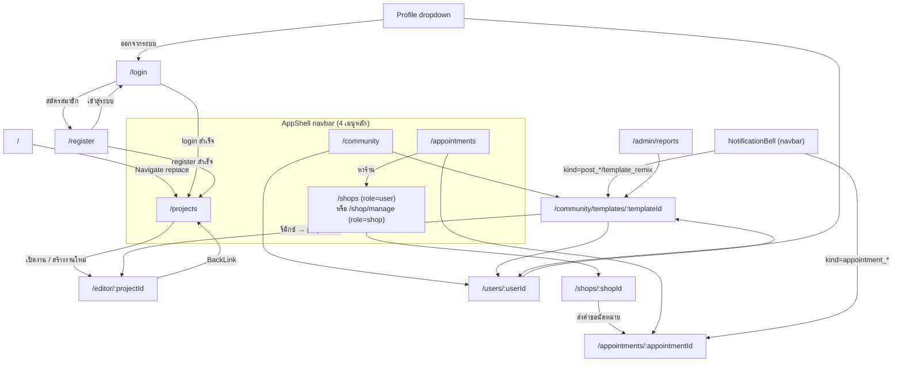
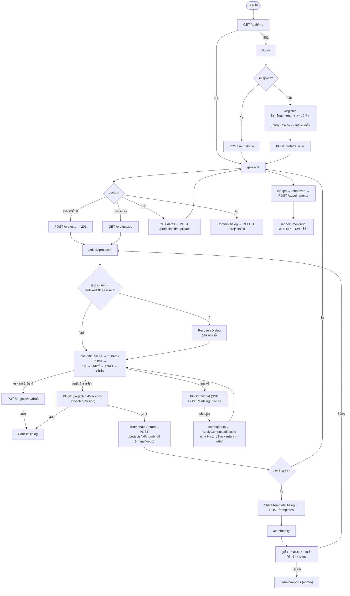
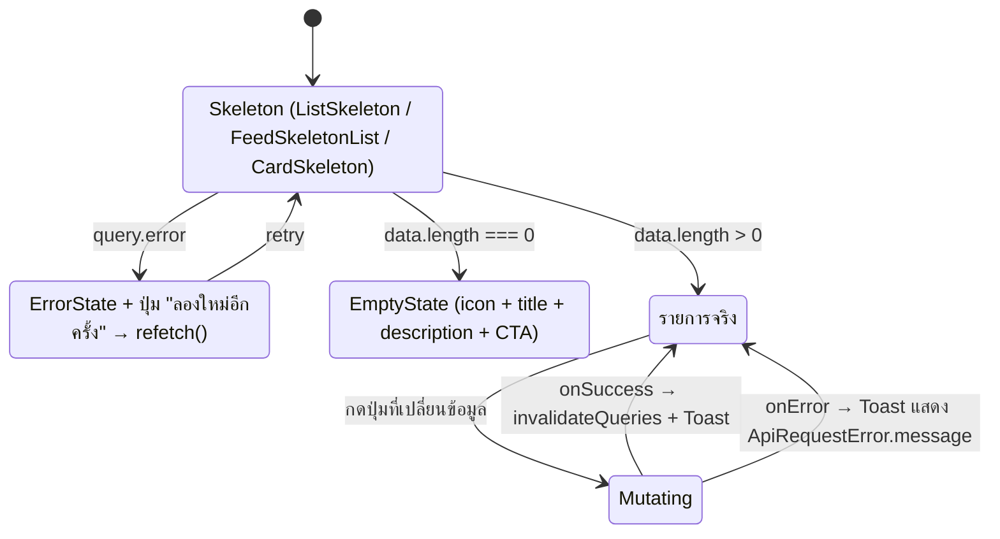

# UX / UI Diagram

## 1. Purpose

แสดงโครงสร้างสารสนเทศ (Information Architecture), แผนที่หน้าจอ (Screen Map) และ
เส้นทางผู้ใช้ (User Flow) ของ SPA `apps/web` พร้อมระบุว่าแต่ละหน้าจอเรียก API ใด
ใช้คอมโพเนนต์ใด และมีสถานะ (loading / error / empty / success) แบบใดบ้าง

## 2. Scope

- ทุก route ที่ประกาศใน `apps/web/src/app/router.tsx` (16 `<Route>`)
- คอมโพเนนต์ที่ประกอบเป็นหน้าจอใน `apps/web/src/pages/` (14 ไฟล์) และ `apps/web/src/features/`
- ระบบ 3D editor ใน `apps/web/src/3d/` เฉพาะส่วนที่เป็นอินเทอร์เฟซผู้ใช้
- ไม่รวม: ระบบ mock UI เดิมใน `Source/` (ถูก `.gitignore`) และ `spikes/`

ภาษา UI: **ภาษาไทย** ทั้งหมด (ข้อความในโค้ดเป็นภาษาไทย)

## 3. Source Analysis

| หลักฐาน | ไฟล์ |
|---|---|
| นิยาม route + guard | `apps/web/src/app/router.tsx` |
| โครงหน้าเว็บ + navbar | `apps/web/src/components/AppShell.tsx` |
| หน้าจอทั้งหมด | `apps/web/src/pages/*.tsx` |
| การเรียก API ต่อหน้าจอ | `apps/web/src/features/*/use*.ts`, `client.ts`, `apps/web/src/api/client.ts` |
| ชุด UI kit | `apps/web/src/components/ui/{Button,Dialog,ConfirmDialog,Toast,States,Avatar,BackLink}.tsx`, `components/{Loading,Icon,TopProgressBar,ErrorBoundary,NotificationBell,AuthLayout}.tsx` |
| Design token / ธีม | `apps/web/src/styles/{tokens,index,ui,community,appointments,shops}.css` |
| Editor 3 มิติ | `apps/web/src/features/design/*.tsx`, `apps/web/src/3d/**` |
| คีย์ลัด | `features/design/{toolShortcuts,fingerShortcuts,historyShortcuts,keyboardTarget}.ts` |
| ชื่อหน้าใน title bar | `apps/web/src/lib/usePageTitle.ts` + การเรียกใน 13 หน้า |

## 4. Diagram

### 4.1 Information Architecture

```text
Nail Studio 3D (SPA)
│
├── Public / Guest zone  ── GuestOnly guard (redirect → /projects ถ้าล็อกอินแล้ว)
│   ├── /login                      เข้าสู่ระบบ
│   └── /register                   สมัครสมาชิก (เลือกบทบาท user | shop)
│
├── Authenticated zone  ── Protected guard (redirect → /login ถ้ายังไม่ล็อกอิน)
│   │                       ทุกหน้าห่อด้วย AppShell + ErrorBoundary
│   │
│   ├── งานของฉัน
│   │   ├── /projects                    รายการงานออกแบบ (สร้าง / ทำซ้ำ / ลบ / ค้นหา / เรียง)
│   │   └── /editor/:projectId           สตูดิโอ 3 มิติ (โหลดแบบ lazy, ซ่อน navbar)
│   │
│   ├── ชุมชน
│   │   ├── /community                   ฟีดผลงาน (lazy)
│   │   ├── /community/templates/:id     รายละเอียดผลงาน + คอมเมนต์ (lazy)
│   │   └── /users/:userId               โปรไฟล์สาธารณะ (+ ?edit=1 เปิดฟอร์มแก้บัญชีของตัวเอง)
│   │
│   ├── ร้านทำเล็บ / การนัดหมาย
│   │   ├── /shops                       รายชื่อร้าน + ค้นหา (lazy)
│   │   ├── /shops/:shopId               รายละเอียดร้าน + ฟอร์มขอนัด (lazy)
│   │   ├── /appointments                รายการนัดหมาย + ฟอร์มขอนัดใหม่ (lazy)
│   │   └── /appointments/:id            รายละเอียด/ต่อรอง/แชท/รีวิว (lazy)
│   │
│   ├── โซนบทบาท shop  ── RoleOnly role="shop"
│   │   └── /shop/manage                 จัดการข้อมูลร้าน + บริการ + ตอบรีวิว (lazy)
│   │
│   ├── โซนบทบาท admin ── RoleOnly role="admin"
│   │   └── /admin/reports               คิวรายงานเนื้อหา (lazy, read-only)
│   │
│   └── Utility
│       ├── /profile                     redirect → /users/:currentUserId?edit=1
│       ├── /                            redirect → /projects
│       └── *                            NotFoundPage
```

### 4.2 Navigation Map



### 4.3 หน้าจอ Editor — โครงสร้าง Layout

```text
┌────────────────────────────────────────────────────────────────────────────┐
│ Editor Topbar                                                              │
│  [← กลับ] [ชื่องาน (แก้ไขได้ inline)]  สถานะ autosave                       │
│  HistoryControls (undo/redo)  EditorSaveMenu (บันทึกเวอร์ชัน/ส่งออก/แชร์)    │
│  NotificationBell   EditorProfileDropdown                                  │
├──────────┬──────────────────────────────────────────┬──────────────────────┤
│ Tool     │  Viewport 3D (NailScene + DesignScene)   │ Right tabs           │
│ Rail     │   HandModel · PaintController ·          │  ┌ แคนวาส (2D)       │
│ (tablist)│   TransformController · NailFocus ·      │  ├ เลเยอร์            │
│  มือ     │   CameraZoom · WebGlGuard                │  └ ประวัติ (เวอร์ชัน) │
│  เล็บ    │                                          │                      │
│  วาด     │  ViewportControls (มุมกล้อง / ซูม)        │  NailCanvas2D        │
│  ตกแต่ง  │                                          │  LayerPanel          │
│  AI      │  NailStrip (เลือกนิ้ว 1–5)                │  VersionHistoryPanel │
├──────────┴──────────────────────────────────────────┴──────────────────────┤
│ Active panel: HandPanel | NailShapePanel | PaintToolbar |                   │
│               DecorationPanel | AiAssistantPanel                           │
└────────────────────────────────────────────────────────────────────────────┘

Dialogs (modal): ConflictDialog · RecoveryDialog · ShareTemplateDialog · ShortcutsDialog
```

### 4.4 User Flow — เส้นทางหลักตั้งแต่เข้าระบบจนได้ผลลัพธ์



### 4.5 State Flow ที่ใช้ซ้ำทุกหน้ารายการ



## 5. Components / Actors — Screen Map

### 5.1 หน้าจอทั้งหมด

| # | Screen | Route | Guard / Role | Purpose | Components หลัก | API |
|---|---|---|---|---|---|---|
| 1 | **LoginPage** | `/login` | GuestOnly | เข้าสู่ระบบ | `AuthLayout`, `AuthPasswordField` | `POST /auth/login` |
| 2 | **RegisterPage** | `/register` | GuestOnly | สมัครสมาชิก + เลือกบทบาท `user`/`shop` | `AuthLayout`, `AuthPasswordField`, `maskDdMmYyyyInput` | `POST /auth/register` |
| 3 | **ProjectsPage** | `/projects` | Protected · ทุกบทบาท | รายการงานออกแบบของฉัน (ค้นหา/เรียง 3 แบบ/สร้าง/ทำซ้ำ/ลบ) | `Button`, `ConfirmDialog`, `EmptyState`, `ErrorState`, `FeedSkeletonList`, `useToast` | `GET /projects`, `POST /projects`, `DELETE /projects/:id`, `GET /projects/:id`, `POST /projects/:id/duplicate`, `GET /projects/:id/thumbnail` |
| 4 | **EditorPage → NailEditor** | `/editor/:projectId` | Protected · เจ้าของงาน | สตูดิโอออกแบบ 3 มิติ | ดูตาราง 5.2 | `GET /projects/:id`, `PUT /projects/:id/draft`, `POST /projects/:id/versions`, `GET/PATCH /projects/:id/versions/:v`, `POST /projects/:id/thumbnail`, `POST /projects/:id/duplicate`, `PATCH /projects/:id`, `POST /templates`, `POST /ai/chat`, `POST /ai/design/recipe` |
| 5 | **CommunityPage** | `/community` | Protected | ฟีดผลงานสาธารณะ + กรอง + infinite scroll | `CommunityComposer`, `CommunityToolbar`, `CommunityRail`, `PostCard`, `TemplateTile`, `TemplateThumb`, `ReportDialog`, `Avatar` | `GET /templates` (cursor), `PUT/DELETE /templates/:id/like`, `POST /templates/:id/{share,remix,report,comments}` |
| 6 | **TemplatePreviewPage** | `/community/templates/:templateId` | Protected | ดูผลงานเต็ม (3D read-only) + คอมเมนต์ + การกระทำ | `ReadOnlyDesignScene`, `EmptyState`, `ErrorState`, `ReportDialog` | `GET /templates/:id`, `GET /templates/:id/thumbnail`, `POST /templates/:id/comments`, like/share/remix/report |
| 7 | **PublicProfilePage** | `/users/:userId` | Protected | โปรไฟล์สาธารณะ + ผลงาน (infinite) + แก้บัญชีตัวเองเมื่อ `?edit=1` | `Avatar`, `BackLink`, `TemplateTile`, `FeedSkeletonList` | `GET /users/:id/profile` (cursor), `PATCH /auth/me`, `POST /auth/logout` |
| 8 | **ShopsPage** | `/shops` | Protected · แสดงเมื่อ role ≠ shop | ค้นหา/รายชื่อร้าน | `ListSkeleton`, `EmptyState`, `ErrorState` | `GET /shops?search=&limit=` |
| 9 | **ShopDetailPage** | `/shops/:shopId` | Protected | ข้อมูลร้าน + บริการ + รีวิว + ฟอร์มขอนัด | `BackLink`, `EmptyState`, `useToast` | `GET /shops/:id`, `POST /appointments` |
| 10 | **ShopManagePage** | `/shop/manage` | RoleOnly `shop` | แก้ข้อมูลร้าน · CRUD บริการ · ตอบรีวิว | ฟอร์มในหน้า, `useToast` | `GET /shops/:id`, `PUT /shops/me`, `POST /shops/me/services`, `PATCH /shops/me/services/:id`, `DELETE /shops/me/services/:id`, `POST /shops/reviews/:id/reply` |
| 11 | **AppointmentsPage** | `/appointments` | Protected | รายการนัดหมาย + ตัวกรองสถานะ + ฟอร์มขอนัดใหม่ | `AppointmentCard`, `AppointmentStatusBadge`, `ListSkeleton`, `EmptyState` | `GET /appointments`, `GET /shops`, `POST /appointments` |
| 12 | **AppointmentDetailPage** | `/appointments/:appointmentId` | Protected · ต้องเป็นคู่กรณี | ยืนยัน/ต่อรอง/ยกเลิก/ปิดงาน · แชท · รีวิว | `ProposalTimeline`, `AppointmentChat`, `ReviewSection`, `AppointmentStatusBadge` | `GET /appointments/:id`, `POST /:id/{accept,propose,decline,cancel,complete,review}`, `DELETE /:id/review`, `GET /:id/same-day`, `GET/POST /:id/messages`, `POST /:id/messages/read` |
| 13 | **ModerationPage** | `/admin/reports` | RoleOnly `admin` | คิวรายงานเนื้อหา (อ่านอย่างเดียว) | `ListSkeleton`, `EmptyState`, `ErrorState` | `GET /templates/moderation/reports` |
| 14 | **NotFoundPage** | `*` | Protected | 404 + ทางออก | `ButtonLink` | — |
| 15 | **ProfileRedirect** | `/profile` | Protected | redirect → `/users/:id?edit=1` | — | — |

### 5.2 คอมโพเนนต์ภายในหน้า Editor

| กลุ่ม | คอมโพเนนต์ | หน้าที่ |
|---|---|---|
| Chrome | `EditorToolRail` (tablist 5 แท็บ), `EditorSaveMenu`, `EditorProfileDropdown`, `HistoryControls`, `NotificationBell` | แถบเครื่องมือ/บันทึก/ประวัติ |
| Panel ซ้าย | `HandPanel`, `NailShapePanel`, `PaintToolbar`, `DecorationPanel`, `AiAssistantPanel` | กลุ่มเครื่องมือตามแท็บที่เลือก |
| Panel ขวา | `NailCanvas2D`, `LayerPanel`, `VersionHistoryPanel` | แคนวาส 2 มิติ / เลเยอร์ / เวอร์ชัน |
| Viewport | `NailScene`, `DesignScene`, `ReadOnlyDesignScene`, `HandModel`, `NailFocus`, `CameraZoom`, `ViewportControls`, `WebGlGuard`, `ThumbnailCapture`, `SnapshotCapture` | ฉาก 3 มิติและการจับภาพ |
| Interaction | `PaintController`, `TransformController`, `DecorationInstances`, `NailStrip` | ลากวาด / ย้าย-หมุน-ย่อของตกแต่ง / เลือกนิ้ว |
| Dialog | `ConflictDialog`, `RecoveryDialog`, `ShareTemplateDialog`, `ShortcutsDialog` | ชนเวอร์ชัน / กู้งานค้าง / แชร์เข้าชุมชน / คีย์ลัด |
| Field | `SliderField` | สไลเดอร์ที่ใช้ซ้ำในหลายแผง |

### 5.3 UI kit ที่ใช้ร่วมทุกหน้า

| คอมโพเนนต์ | ไฟล์ | บทบาท UX |
|---|---|---|
| `AppShell` | `components/AppShell.tsx` | navbar 4 เมนู + เมนูมือถือ + skip link (`ข้ามไปยังเนื้อหาหลัก`) ; ซ่อน navbar ทั้งหมดเมื่ออยู่ที่ `/editor*` |
| `TopProgressBar` | `components/TopProgressBar.tsx` | แถบความคืบหน้าบนสุดระหว่างโหลด |
| `LoadingScreen` / `Spinner` / `InlineLoading` | `components/Loading.tsx` | สถานะรอ |
| `EmptyState` / `ErrorState` | `components/ui/States.tsx` | สถานะว่าง / ผิดพลาด (มีปุ่ม retry) |
| `PostCardSkeleton` / `TemplateCardSkeleton` / `FeedSkeletonList` / `CardSkeleton` / `ListSkeleton` / `SkeletonLine` | `components/ui/States.tsx` | โครงร่างระหว่างโหลด |
| `Dialog` / `ConfirmDialog` | `components/ui/*.tsx` | modal มาตรฐาน + ยืนยันการกระทำอันตราย |
| `Toast` / `useToast` | `components/ui/Toast.tsx` | แจ้งผลสำเร็จ/ล้มเหลว |
| `Button` / `ButtonLink` | `components/ui/Button.tsx` | ปุ่ม (variant + size + icon + block) |
| `Avatar`, `BackLink` | `components/ui/*.tsx` | รูปโปรไฟล์ / ลิงก์ย้อนกลับ |
| `Icon` | `components/Icon.tsx` | ชุดไอคอน SVG inline |
| `ErrorBoundary` | `components/ErrorBoundary.tsx` | กันหน้าขาวทั้งแอปเมื่อคอมโพเนนต์ throw |
| `NotificationBell` | `components/NotificationBell.tsx` | จำนวนที่ยังไม่อ่าน + รายการ + mark read |
| `AuthLayout` / `AuthPasswordField` | `components/AuthLayout.tsx` | เลย์เอาต์ร่วมของหน้า login/register + ปุ่มแสดง/ซ่อนรหัสผ่าน |

## 6. Flow / Relationship

### 6.1 UX/UI ↔ API mapping (สรุปตาม feature hook)

| Hook / client | ไฟล์ | Endpoint ที่เรียก |
|---|---|---|
| `useCurrentUser`, `useLogin`, `useRegister`, `useUpdateProfile`, `useLogout` | `features/auth/useAuth.ts` | `GET/PATCH /auth/me`, `POST /auth/{login,register,logout}` |
| `useProjects`, `useProject`, `useCreateProject`, `useDeleteProject`, `useDuplicateProject`, `useRenameProject`, `useSaveDraft`, `useSaveVersion`, `useVersions`, `useLoadVersion`, `useRenameVersion`, `captureAndUploadThumbnail` | `features/projects/useProjects.ts` | ทุก endpoint ใต้ `/projects` |
| `useTemplates`, `useTemplate`, `useCreateTemplate`, `useToggleLike`, `useShareTemplate`, `useRemixTemplate`, `useCreateTemplateComment`, `useReportTemplate`, `useModerationQueue` | `features/community/useTemplates.ts` | ทุก endpoint ใต้ `/templates` |
| `useNotifications`, `useMarkRead`, `useMarkAllRead` | `features/notifications/useNotifications.ts` | `/notifications*` |
| `useAppointments`, `useAppointment`, `useCreateAppointment`, `useAppointmentAction`, `useProposeAppointment`, `useReviewAppointment`, `useDeleteAppointmentReview`, `useSameDayAppointments`, `useSendAppointmentMessage`, `useMarkMessagesRead` | `features/appointments/{client,useAppointments}.ts` | ทุก endpoint ใต้ `/appointments` |
| `useShopList`, `useShop`, `useUpdateMyShop`, `useCreateMyService`, `useUpdateMyService`, `useDeleteMyService`, `useReplyToReview` | `features/shops/{client,useShops}.ts` | ทุก endpoint ใต้ `/shops` |
| `usePublicProfile` | `features/users/usePublicProfile.ts` | `GET /users/:id/profile` |
| `streamAiChat`, `generateAiRecipes`, `recommendAiTemplates` | `features/ai/aiClient.ts` | `POST /ai/{chat,design/recipe,recommend}` |

**หมายเหตุความไม่สอดคล้อง:** `recommendAiTemplates()` มีนิยามใน `aiClient.ts` แต่ไม่พบหน้าจอใดเรียกใช้ (endpoint `POST /ai/recommend` ยังไม่มีทางเข้าจาก UI)

### 6.2 Form + Validation

| ฟอร์ม | หน้า | Validation ฝั่ง client | Validation ฝั่ง server |
|---|---|---|---|
| เข้าสู่ระบบ | LoginPage | `required`, `type=email` | `loginSchema` |
| สมัครสมาชิก | RegisterPage | `MIN_PASSWORD_LENGTH = 12`, `parseDdMmYyyy` (dd/mm/yyyy), checkbox เงื่อนไข | `registerSchema` (password >= 12, email lowercase/trim, `termsAccepted: literal(true)`) |
| สร้างงานใหม่ | ProjectsPage | ตัดช่องว่าง, ไม่ยอมให้ว่าง | `createProjectSchema` (1–120 ตัวอักษร) |
| แชร์ผลงาน | ShareTemplateDialog | เลือกเวอร์ชัน + ชื่อ + หมวด + สี | `createTemplateSchema` |
| คอมเมนต์ | TemplatePreviewPage / PostCard | ไม่ว่าง | `createTemplateCommentSchema` (1–1000) |
| รายงานเนื้อหา | ReportDialog | เลือกเหตุผล | `templateReportSchema` |
| ขอนัดหมาย | ShopDetailPage / AppointmentsPage | `minStartAt` (ห้ามเลือกเวลาย้อนหลัง), duration 15–480 | `createAppointmentSchema` |
| เสนอเวลาใหม่ | AppointmentDetailPage | เวลา + ข้อความ | `proposeAppointmentSchema` |
| รีวิว | ReviewSection | คะแนน 1–5 | `reviewAppointmentSchema` |
| ข้อมูลร้าน / บริการ | ShopManagePage | ราคา/ระยะเวลาเป็นตัวเลข | `updateShopProfileSchema`, `createShopServiceSchema` |
| แก้ชื่อที่แสดง | PublicProfilePage (`?edit=1`) | ไม่ว่าง | `updateProfileSchema` (1–60) |

ข้อผิดพลาดจาก server แสดงผ่าน `ApiRequestError.message` และ `details[0].message`
(RegisterPage แสดง `details` เพื่อบอกว่าฟิลด์ไหนผิด)

### 6.3 Accessibility & Interaction (ที่พบในโค้ดจริง)

| หัวข้อ | รายละเอียด |
|---|---|
| Skip link | `AppShell` → `<a href="#main-content" class="ui-skip-link">ข้ามไปยังเนื้อหาหลัก</a>` |
| ARIA tablist | `EditorToolRail` และแผงขวาใช้ `role="tablist"` เหมือนกัน + roving tabindex (ArrowUp/Down/Left/Right/Home/End) |
| Live region | `role="alert"` บนข้อความ error ของฟอร์ม |
| เมนูมือถือ | `aria-expanded` / `aria-controls` / `hidden` |
| Reduced motion | `main.tsx` มี `setTimeout(removeSplash, 500)` กันกรณี `transitionend` ไม่ยิง |
| Page title | `usePageTitle()` ตั้งชื่อแท็บทุกหน้า |

### 6.4 คีย์ลัดในหน้า Editor

| ปุ่ม | การกระทำ | ไฟล์ |
|---|---|---|
| `Ctrl/Cmd + Z` | ย้อนกลับ | `historyShortcuts.ts` |
| `Ctrl/Cmd + Shift + Z` หรือ `Ctrl/Cmd + Y` | ทำซ้ำ | `historyShortcuts.ts` |
| `B` | เครื่องมือแปรง | `toolShortcuts.ts` |
| `E` | ยางลบ | `toolShortcuts.ts` |
| `[` / `]` | ลด/เพิ่มขนาดหัวแปรง (`SIZE_STEP = 4`, กดค้างรัวได้) | `toolShortcuts.ts` |
| `?` (Shift + `/`) | เปิด `ShortcutsDialog` | `toolShortcuts.ts` |
| `1`–`5` | เลือกนิ้ว (0-based index) | `fingerShortcuts.ts` |

ทั้งหมดถูกปิดเมื่อโฟกัสอยู่ในช่องกรอกข้อความ (`isEditableTarget` ใน `keyboardTarget.ts`)
และตรวจทั้ง `event.key` และ `event.code` เพื่อให้ใช้ได้กับผังแป้นพิมพ์ไทย

### 6.5 Performance / Loading strategy

| กลไก | รายละเอียด |
|---|---|
| Code splitting | 9 หน้าโหลดแบบ `lazy()` — Community, TemplatePreview, **Editor**, Appointments, AppointmentDetail, Shops, ShopDetail, ShopManage, Moderation |
| Suspense fallback | `<div class="page"><ListSkeleton count={2} lines={4} /></div>` |
| Boot splash | `#boot-splash` ใน `index.html` ถูกถอดใน `main.tsx` |
| Query cache | TanStack Query `staleTime: 30_000`, `refetchOnWindowFocus: false`, ไม่ retry เมื่อ status 4xx |
| Infinite scroll | `IntersectionObserver` บน CommunityPage + ปุ่ม "โหลดเพิ่ม" สำรองสำหรับผู้ใช้คีย์บอร์ด |
| Offline draft | IndexedDB (`nail-studio` / `drafts`) เป็น fallback เมื่อบันทึกขึ้น server ไม่สำเร็จ |
| WebGL guard | `WebGlGuard` แสดงข้อความแทนฉาก 3 มิติเมื่อเบราว์เซอร์ไม่รองรับ |

## 7. Source References

- `apps/web/index.html`, `src/main.tsx`, `src/app/{router,providers}.tsx`
- `apps/web/src/pages/` — `LoginPage.tsx`, `RegisterPage.tsx`, `ProjectsPage.tsx`, `EditorPage.tsx`, `CommunityPage.tsx`, `TemplatePreviewPage.tsx`, `PublicProfilePage.tsx`, `ShopsPage.tsx`, `ShopDetailPage.tsx`, `ShopManagePage.tsx`, `AppointmentsPage.tsx`, `AppointmentDetailPage.tsx`, `ModerationPage.tsx`, `NotFoundPage.tsx`
- `apps/web/src/components/` — `AppShell.tsx`, `AuthLayout.tsx`, `ErrorBoundary.tsx`, `Icon.tsx`, `Loading.tsx`, `NotificationBell.tsx`, `TopProgressBar.tsx`, `ui/{Avatar,BackLink,Button,ConfirmDialog,Dialog,States,Toast}.tsx`
- `apps/web/src/features/design/` — `NailEditor.tsx`, `EditorToolRail.tsx`, `EditorSaveMenu.tsx`, `EditorProfileDropdown.tsx`, `HandPanel.tsx`, `NailShapePanel.tsx`, `PaintToolbar.tsx`, `DecorationPanel.tsx`, `LayerPanel.tsx`, `NailStrip.tsx`, `NailCanvas2D.tsx`, `ViewportControls.tsx`, `HistoryControls.tsx`, `VersionHistoryPanel.tsx`, `SliderField.tsx`, `ConflictDialog.tsx`, `RecoveryDialog.tsx`, `ShareTemplateDialog.tsx`, `ShortcutsDialog.tsx`
- `apps/web/src/features/community/components/` — `CommunityComposer.tsx`, `CommunityRail.tsx`, `CommunityToolbar.tsx`, `PostCard.tsx`, `TemplateTile.tsx`, `TemplateThumb.tsx`, `ReportDialog.tsx`
- `apps/web/src/features/appointments/components/` — `AppointmentCard.tsx`, `AppointmentChat.tsx`, `AppointmentStatusBadge.tsx`, `ProposalTimeline.tsx`, `ReviewSection.tsx`
- `apps/web/src/features/ai/AiAssistantPanel.tsx`, `aiClient.ts`
- `apps/web/src/styles/{tokens,index,ui,community,appointments,shops}.css`
- `apps/web/src/lib/{usePageTitle,datetime,user}.ts`, `utils/{dateFormat,downloadBlob}.ts`

## 8. Unknown / Missing Information

| ประเด็น | สถานะ |
|---|---|
| Design file / Figma / Wireframe ต้นฉบับ | **NOT FOUND** ใน repository — มีเพียง CSS token ใน `styles/tokens.css` |
| หน้าจอสำหรับ **จัดการรายงาน** (เปลี่ยนสถานะ report, ซ่อน/คืนค่า template) | **NOT FOUND** — `/admin/reports` แสดงรายการอย่างเดียว ไม่มีปุ่มดำเนินการ |
| หน้าจอสำหรับ **ผู้ดูแลระบบ** อื่น ๆ (จัดการผู้ใช้, ยืนยันร้าน `is_verified`) | **NOT FOUND** |
| ทางเข้า UI ของ `POST /ai/recommend` | **NOT FOUND** — มี client function แต่ไม่มีหน้าจอเรียก |
| หน้าลืมรหัสผ่าน / เปลี่ยนรหัสผ่าน / ยืนยันอีเมล | **NOT FOUND** — `updateProfileSchema` มีเฉพาะ `displayName` |
| การอัปโหลดรูปโปรไฟล์ | **NOT FOUND** — `Avatar` สร้างจากชื่อ ไม่มี asset |
| Responsive breakpoint / mobile spec ที่เป็นเอกสาร | **UNKNOWN** — มีเฉพาะ CSS จริง (navbar มีเมนูมือถือแยก) |
| Dark mode / theme switcher | **NOT FOUND** — ไม่มี `prefers-color-scheme` หรือ `data-theme` ในไฟล์ CSS ทั้ง 6 ไฟล์ (ธีมเดียวคงที่) |
| i18n / หลายภาษา | **NOT FOUND** — ข้อความไทย hardcode ในคอมโพเนนต์ |
| E2E test (Playwright/Cypress) ที่ยืนยัน flow | **NOT FOUND** — มีเฉพาะ unit/integration test ด้วย Vitest |
