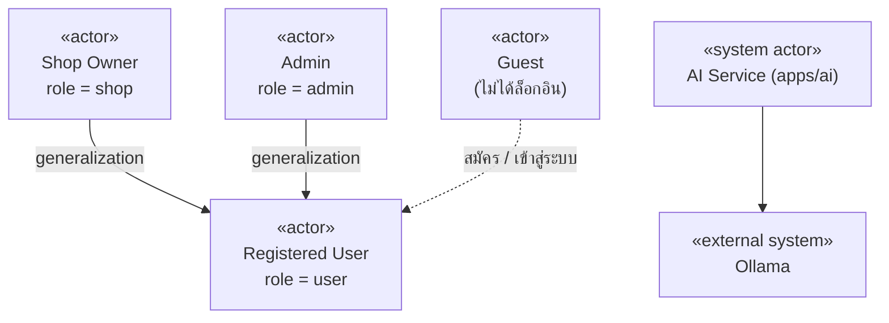
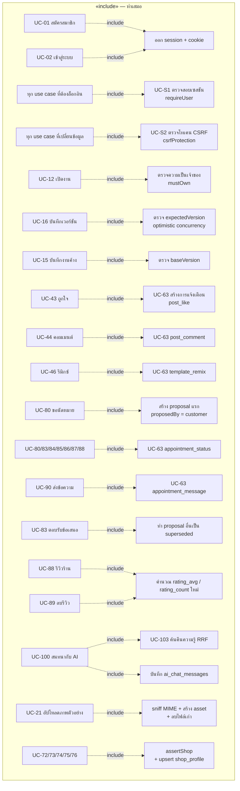
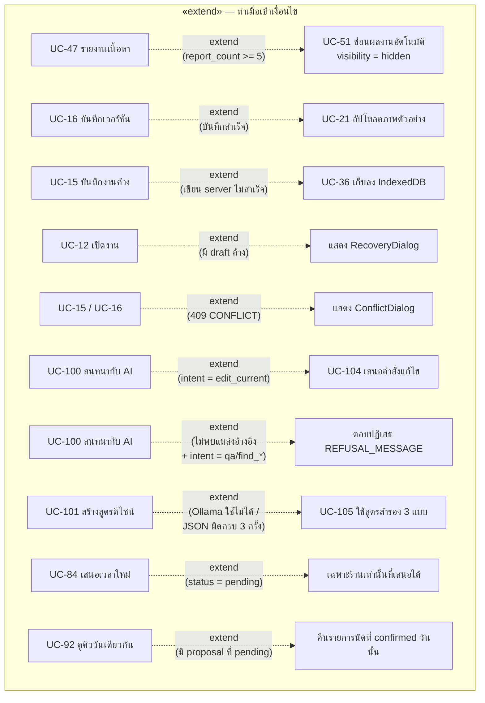

# Use Case Diagram

## 1. Purpose

แสดง Actor ทั้งหมดและ Use Case ทุกอย่างที่ระบบ Nail Studio 3D **รองรับจริง** พร้อม
ความสัมพันธ์ `association`, `<<include>>`, `<<extend>>` และ `generalization`
โดยอ้างอิงจาก endpoint จริง, guard middleware และหน้าจอที่มีอยู่ในโค้ด

## 2. Scope

- Use Case ทุกตัวต้องมี **endpoint หรือหน้าจอจริง** รองรับ — ไม่มีการเติม use case ตามความคาดหวังทั่วไป
- ครอบคลุม 59 REST endpoint ของ `apps/api` และ 4 endpoint ภายในของ `apps/ai`
- ไม่รวมความสามารถที่มีเฉพาะในฐานข้อมูลแต่ไม่มีทางเรียก (ดูหัวข้อ 8)

## 3. Source Analysis

| หลักฐาน | ไฟล์ |
|---|---|
| Actor / role | `prisma/schema.prisma` → `enum UserRole { user shop admin }`; `packages/contracts/src/auth.ts` → `USER_ROLES` |
| การบังคับสิทธิ์ระดับ route | `apps/api/src/middleware/requireUser.ts` (`requireUser`, `optionalUser`, `requireAdmin`) |
| การบังคับสิทธิ์ระดับข้อมูล | `projects/service.ts:mustOwn`, `appointments/service.ts:{findForParticipant,actorFor}`, `shops/service.ts:assertShop` |
| Use case ฝั่ง UI | `apps/web/src/app/router.tsx` (`Protected`, `GuestOnly`, `RoleOnly`) + หน้าจอ 13 ไฟล์ |
| รายการ endpoint | `apps/api/src/app.ts` + `*/routes.ts` ทั้ง 9 โมดูล |
| Use case ของ AI | `apps/ai/app/routers/{chat,design,recommend}.py`, `apps/ai/app/auth.py` |

## 4. Diagram

### 4.1 Actor Generalization



> **หลักฐาน generalization:** `shop` และ `admin` เป็นค่าใน `users.role` ของตาราง `users` เดียวกัน
> ผู้ใช้ทั้งสามบทบาทจึงทำทุกอย่างที่ Registered User ทำได้ (เช่น สร้างงาน แชร์ผลงาน นัดหมาย)
> แล้วมีสิทธิ์เพิ่มเฉพาะของตัวเอง — `requireAdmin` ตรวจ `request.user?.role !== 'admin'`,
> `assertShop` ตรวจ `user.role !== 'shop'`

### 4.2 Use Case Diagram — ภาพรวมทั้งระบบ

```mermaid
flowchart LR
    GUEST(("Guest"))
    USER(("Registered<br/>User"))
    SHOP(("Shop<br/>Owner"))
    ADMIN(("Admin"))
    AI(("AI Service"))
    OLL(("Ollama"))

    subgraph UC_AUTH["Authentication & Account"]
        UC1(["UC-01 สมัครสมาชิก"])
        UC2(["UC-02 เข้าสู่ระบบ"])
        UC3(["UC-03 ออกจากระบบ"])
        UC4(["UC-04 ดูข้อมูลบัญชีตัวเอง"])
        UC5(["UC-05 แก้ไขชื่อที่แสดง"])
        UC_SESS(["UC-S1 ตรวจสอบเซสชัน"])
        UC_CSRF(["UC-S2 ตรวจโทเคน CSRF"])
    end

    subgraph UC_PROJ["Project & Design Version"]
        UC10(["UC-10 ดูรายการงานของฉัน"])
        UC11(["UC-11 สร้างงานใหม่"])
        UC12(["UC-12 เปิดงาน"])
        UC13(["UC-13 เปลี่ยนชื่อ/สถานะงาน"])
        UC14(["UC-14 ลบงาน (soft delete)"])
        UC15(["UC-15 บันทึกงานค้างอัตโนมัติ"])
        UC16(["UC-16 บันทึกเวอร์ชัน"])
        UC17(["UC-17 ดูรายการเวอร์ชัน"])
        UC18(["UC-18 เปิดเวอร์ชันย้อนหลัง"])
        UC19(["UC-19 ตั้งชื่อเวอร์ชัน"])
        UC20(["UC-20 ทำซ้ำงาน"])
        UC21(["UC-21 อัปโหลดภาพตัวอย่าง"])
        UC22(["UC-22 ดูภาพตัวอย่าง"])
    end

    subgraph UC_EDIT["3D Design Editor (client-side)"]
        UC30(["UC-30 ออกแบบเล็บ 3 มิติ"])
        UC31(["UC-31 ย้อน/ทำซ้ำ (undo/redo)"])
        UC32(["UC-32 จัดการเลเยอร์"])
        UC33(["UC-33 เพิ่ม/จัดวางของตกแต่ง"])
        UC34(["UC-34 ปรับสัดส่วนและสีผิวมือ"])
        UC35(["UC-35 ส่งออกไฟล์ JSON/ภาพ"])
        UC36(["UC-36 กู้คืนงานค้างแบบออฟไลน์"])
    end

    subgraph UC_COMM["Community"]
        UC40(["UC-40 ดูฟีดผลงาน"])
        UC41(["UC-41 ดูรายละเอียดผลงาน"])
        UC42(["UC-42 แชร์ผลงานเข้าชุมชน"])
        UC43(["UC-43 ถูกใจ / เลิกถูกใจ"])
        UC44(["UC-44 คอมเมนต์"])
        UC45(["UC-45 บันทึกการแชร์ออกช่องทาง"])
        UC46(["UC-46 รีมิกซ์ผลงาน"])
        UC47(["UC-47 รายงานเนื้อหา"])
        UC48(["UC-48 ดูโปรไฟล์สาธารณะ"])
        UC49(["UC-49 ดูภาพตัวอย่างผลงาน"])
    end

    subgraph UC_MOD["Moderation"]
        UC50(["UC-50 ดูคิวรายงาน"])
        UC51(["UC-51 ซ่อนผลงานอัตโนมัติ"])
    end

    subgraph UC_NOTI["Notification"]
        UC60(["UC-60 ดูการแจ้งเตือน"])
        UC61(["UC-61 ทำเครื่องหมายว่าอ่านแล้ว"])
        UC62(["UC-62 อ่านทั้งหมด"])
        UC63(["UC-63 สร้างการแจ้งเตือน"])
    end

    subgraph UC_SHOP["Shop"]
        UC70(["UC-70 ค้นหา/ดูรายชื่อร้าน"])
        UC71(["UC-71 ดูรายละเอียดร้าน"])
        UC72(["UC-72 แก้ไขข้อมูลร้าน"])
        UC73(["UC-73 เพิ่มบริการ"])
        UC74(["UC-74 แก้ไขบริการ"])
        UC75(["UC-75 ปิดบริการ"])
        UC76(["UC-76 ตอบกลับรีวิว"])
    end

    subgraph UC_APPT["Appointment"]
        UC80(["UC-80 ขอนัดหมาย"])
        UC81(["UC-81 ดูรายการนัดหมาย"])
        UC82(["UC-82 ดูรายละเอียดนัดหมาย"])
        UC83(["UC-83 ตอบรับข้อเสนอเวลา"])
        UC84(["UC-84 เสนอเวลาใหม่"])
        UC85(["UC-85 ปฏิเสธคำขอ"])
        UC86(["UC-86 ยกเลิกนัดหมาย"])
        UC87(["UC-87 ปิดงาน (completed)"])
        UC88(["UC-88 รีวิวร้าน"])
        UC89(["UC-89 ลบรีวิวของตัวเอง"])
        UC90(["UC-90 ส่งข้อความในนัดหมาย"])
        UC91(["UC-91 อ่านข้อความ"])
        UC92(["UC-92 ดูคิวงานวันเดียวกัน"])
    end

    subgraph UC_AI["AI Assistant"]
        UC100(["UC-100 สนทนากับผู้ช่วย AI"])
        UC101(["UC-101 สร้างสูตรดีไซน์"])
        UC102(["UC-102 แนะนำผลงานที่ใกล้เคียง"])
        UC103(["UC-103 ค้นคืนความรู้ (RRF)"])
        UC104(["UC-104 เสนอคำสั่งแก้ไข (confirm-first)"])
        UC105(["UC-105 ใช้สูตรสำรอง (degraded)"])
    end

    GUEST --- UC1
    GUEST --- UC2
    GUEST --- UC40
    GUEST --- UC41
    GUEST --- UC48
    GUEST --- UC70
    GUEST --- UC71
    GUEST --- UC49

    USER --- UC3
    USER --- UC4
    USER --- UC5
    USER --- UC10
    USER --- UC11
    USER --- UC12
    USER --- UC13
    USER --- UC14
    USER --- UC16
    USER --- UC17
    USER --- UC18
    USER --- UC19
    USER --- UC20
    USER --- UC21
    USER --- UC22
    USER --- UC30
    USER --- UC31
    USER --- UC32
    USER --- UC33
    USER --- UC34
    USER --- UC35
    USER --- UC42
    USER --- UC43
    USER --- UC44
    USER --- UC45
    USER --- UC46
    USER --- UC47
    USER --- UC60
    USER --- UC61
    USER --- UC62
    USER --- UC80
    USER --- UC81
    USER --- UC82
    USER --- UC83
    USER --- UC84
    USER --- UC86
    USER --- UC88
    USER --- UC89
    USER --- UC90
    USER --- UC91
    USER --- UC100
    USER --- UC101

    SHOP --- UC72
    SHOP --- UC73
    SHOP --- UC74
    SHOP --- UC75
    SHOP --- UC76
    SHOP --- UC83
    SHOP --- UC84
    SHOP --- UC85
    SHOP --- UC86
    SHOP --- UC87
    SHOP --- UC92

    ADMIN --- UC50

    AI --- UC103
    AI --- UC104
    AI --- UC105
    AI --- OLL
```



### 4.3 ความสัมพันธ์ `<<include>>` และ `<<extend>>`





## 5. Components / Actors

### 5.1 Actor

| Actor | นิยามในระบบ | สิ่งที่ทำได้ |
|---|---|---|
| **Guest** | ไม่มี cookie `nsid` ที่ใช้ได้ | สมัคร/เข้าสู่ระบบ + **อ่าน** ฟีดผลงาน, รายละเอียดผลงาน, ภาพตัวอย่างผลงาน, รายชื่อ/รายละเอียดร้าน, โปรไฟล์สาธารณะ, `/health` (endpoint เหล่านี้ไม่มี `requireUser`) |
| **Registered User** (`role = user`) | มี session ที่ใช้ได้ | ทุกอย่างที่เกี่ยวกับงานของตัวเอง, ชุมชน, การนัดหมายในฐานะลูกค้า, ผู้ช่วย AI |
| **Shop Owner** (`role = shop`) | Registered User + `shop_profiles` (สร้างอัตโนมัติเมื่อจัดการร้านครั้งแรก) | สิทธิ์ของ user ทั้งหมด + จัดการร้าน/บริการ/ตอบรีวิว + ฝั่งร้านของการนัดหมาย (ปฏิเสธ/ปิดงาน/no-show/ดูคิววันเดียวกัน) |
| **Admin** (`role = admin`) | Registered User + `requireAdmin` | สิทธิ์ของ user ทั้งหมด + ดูคิวรายงาน `GET /templates/moderation/reports` |
| **AI Service** (`apps/ai`) | system actor เรียกได้เฉพาะจาก Express ด้วย `X-AI-Internal-Token` | ค้นคืนความรู้, สร้างสูตร, เสนอคำสั่ง, บันทึกประวัติแชท |
| **Ollama** | external system (optional) | สร้างข้อความ/JSON แบบ streaming |

> **ข้อสังเกตความไม่สอดคล้อง UI ↔ API:** ฝั่ง SPA ห่อทุก route ด้วย `Protected` ดังนั้น
> Guest **เข้าถึงหน้าจอไม่ได้เลย** แม้ API จะเปิด endpoint สาธารณะไว้ — Guest ใช้ได้จริง
> เฉพาะเมื่อเรียก API ตรง

### 5.2 ตาราง Use Case ครบทุกตัว

| ID | Use Case | Actor หลัก | Endpoint / จุดเข้า | Precondition สำคัญ |
|---|---|---|---|---|
| UC-01 | สมัครสมาชิก | Guest | `POST /auth/register` | อีเมลยังไม่ถูกใช้; รหัสผ่าน >= 12 ตัว; rate limit 5/นาที |
| UC-02 | เข้าสู่ระบบ | Guest | `POST /auth/login` | ข้อความ error เดียวกันทั้งอีเมลผิดและรหัสผิด |
| UC-03 | ออกจากระบบ | User | `POST /auth/logout` | idempotent |
| UC-04 | ดูข้อมูลบัญชีตัวเอง | User | `GET /auth/me` | — |
| UC-05 | แก้ไขชื่อที่แสดง | User | `PATCH /auth/me` | 1–60 ตัวอักษร |
| UC-10 | ดูรายการงานของฉัน | User | `GET /projects` | keyset pagination `updatedAt|id`, limit 1–50 |
| UC-11 | สร้างงานใหม่ | User | `POST /projects` | สร้าง `createEmptyDocument()` เป็นเวอร์ชัน 1 |
| UC-12 | เปิดงาน | User (เจ้าของ) | `GET /projects/:id` | `mustOwn`; parse document ตาม schema ทุกครั้ง |
| UC-13 | เปลี่ยนชื่อ/สถานะงาน | User (เจ้าของ) | `PATCH /projects/:id` | status ∈ draft/published/archived |
| UC-14 | ลบงาน | User (เจ้าของ) | `DELETE /projects/:id` | soft delete (`deleted_at`) |
| UC-15 | บันทึกงานค้างอัตโนมัติ | User (เจ้าของ) | `PUT /projects/:id/draft` | `baseVersion` ต้องตรงเวอร์ชันล่าสุด มิฉะนั้น 409 |
| UC-16 | บันทึกเวอร์ชัน | User (เจ้าของ) | `POST /projects/:id/versions` | `expectedVersion` ต้องตรง มิฉะนั้น 409 |
| UC-17 | ดูรายการเวอร์ชัน | User (เจ้าของ) | `GET /projects/:id/versions` | — |
| UC-18 | เปิดเวอร์ชันย้อนหลัง | User (เจ้าของ) | `GET /projects/:id/versions/:version` | — |
| UC-19 | ตั้งชื่อเวอร์ชัน | User (เจ้าของ) | `PATCH /projects/:id/versions/:version` | label <= 120 หรือ null |
| UC-20 | ทำซ้ำงาน | User (เจ้าของ) | `POST /projects/:id/duplicate` | ส่ง document ทั้งก้อนมาด้วย |
| UC-21 | อัปโหลดภาพตัวอย่าง | User (เจ้าของ) | `POST /projects/:id/thumbnail` | `Content-Type: image/webp`, <= 2 MB, ตรวจ magic bytes |
| UC-22 | ดูภาพตัวอย่างงาน | User (เจ้าของ) | `GET /projects/:id/thumbnail` | `Cache-Control: private, max-age=60` |
| UC-30 | ออกแบบเล็บ 3 มิติ | User | client-side (`NailEditor`) | ต้องมี WebGL (`WebGlGuard`) |
| UC-31 | ย้อน/ทำซ้ำ | User | `HistoryStack` (Ctrl+Z / Ctrl+Y) | ความจุ 100 คำสั่ง, merge window 500 ms |
| UC-32 | จัดการเลเยอร์ | User | `LayerPanel` | สูงสุด 6 เลเยอร์/เล็บ |
| UC-33 | เพิ่ม/จัดวางของตกแต่ง | User | `DecorationPanel`, `TransformController` | สูงสุด 30 ชิ้น/เล็บ, เก็บพิกัด UV |
| UC-34 | ปรับสัดส่วน/สีผิวมือ | User | `HandPanel` | ช่วงค่า 0.7–1.3 |
| UC-35 | ส่งออกไฟล์ | User | `exportProjectJson`, `SnapshotCapture`, `downloadBlob` | — |
| UC-36 | กู้คืนงานค้างออฟไลน์ | User | IndexedDB `nail-studio/drafts` + `RecoveryDialog` | มี record ที่ยังไม่ได้ sync |
| UC-40 | ดูฟีดผลงาน | Guest/User | `GET /templates` | sort `latest|popular`, กรอง category/color, cursor |
| UC-41 | ดูรายละเอียดผลงาน | Guest/User | `GET /templates/:id` | เฉพาะ `visibility = public` และไม่ถูกลบ |
| UC-42 | แชร์ผลงานเข้าชุมชน | User | `POST /templates` | อ้าง `projectId` + `versionNumber` ของตัวเอง |
| UC-43 | ถูกใจ / เลิกถูกใจ | User | `PUT` / `DELETE /templates/:id/like` | idempotent ด้วย composite PK |
| UC-44 | คอมเมนต์ | User | `POST /templates/:id/comments` | 1–1,000 ตัวอักษร |
| UC-45 | บันทึกการแชร์ออกช่องทาง | User | `POST /templates/:id/share` | channel ∈ link/facebook/line/instagram/copy |
| UC-46 | รีมิกซ์ผลงาน | User | `POST /templates/:id/remix` | คัดลอก document เป็น project ใหม่ (versionNumber 1) |
| UC-47 | รายงานเนื้อหา | User | `POST /templates/:id/report` | 1 คน 1 ครั้งต่อชิ้น (unique constraint) |
| UC-48 | ดูโปรไฟล์สาธารณะ | Guest/User | `GET /users/:id/profile` | cursor pagination ผลงาน |
| UC-49 | ดูภาพตัวอย่างผลงาน | Guest/User | `GET /templates/:id/thumbnail` | `Cache-Control: public, max-age=300` |
| UC-50 | ดูคิวรายงาน | Admin | `GET /templates/moderation/reports` | `requireUser` + `requireAdmin`, สูงสุด 50 รายการ |
| UC-51 | ซ่อนผลงานอัตโนมัติ | System | ภายใน `reportTemplate()` | `report_count >= 5` และยังไม่ hidden |
| UC-60 | ดูการแจ้งเตือน | User | `GET /notifications` | คืน `unreadCount` มาด้วย |
| UC-61 | ทำเครื่องหมายว่าอ่าน | User | `PATCH /notifications/:id/read` | จำกัดเฉพาะของตัวเอง |
| UC-62 | อ่านทั้งหมด | User | `POST /notifications/read-all` | — |
| UC-63 | สร้างการแจ้งเตือน | System | `createNotification(tx, …)` | อยู่ใน transaction เดียวกับเหตุการณ์ต้นทางเสมอ; ไม่แจ้งเมื่อผู้กระทำคือเจ้าของเอง |
| UC-70 | ค้นหา/ดูรายชื่อร้าน | Guest/User | `GET /shops?search=&limit=` | เรียง verified → rating → count |
| UC-71 | ดูรายละเอียดร้าน | Guest/User | `GET /shops/:id` | รวมบริการที่ active + รีวิว 50 รายการล่าสุด |
| UC-72 | แก้ไขข้อมูลร้าน | Shop | `PUT /shops/me` | `assertShop` |
| UC-73 | เพิ่มบริการ | Shop | `POST /shops/me/services` | ราคา 0–1,000,000; 15–480 นาที |
| UC-74 | แก้ไขบริการ | Shop | `PATCH /shops/me/services/:id` | ต้องเป็นบริการของร้านตัวเอง |
| UC-75 | ปิดบริการ | Shop | `DELETE /shops/me/services/:id` | soft — ตั้ง `is_active = false` |
| UC-76 | ตอบกลับรีวิว | Shop | `POST /shops/reviews/:id/reply` และ `POST /reviews/:id/reply` | รีวิวต้องเป็นของร้านและยังไม่ถูกลบ |
| UC-80 | ขอนัดหมาย | User | `POST /appointments` | นัดร้านตัวเองไม่ได้; บริการต้อง active; design version ต้องเป็นของตัวเอง |
| UC-81 | ดูรายการนัดหมาย | User/Shop | `GET /appointments` | เห็นเฉพาะที่ตนเป็นคู่กรณี |
| UC-82 | ดูรายละเอียดนัดหมาย | User/Shop | `GET /appointments/:id` | `findForParticipant` |
| UC-83 | ตอบรับข้อเสนอเวลา | ฝ่ายตรงข้ามผู้เสนอ | `POST /appointments/:id/accept` | ต้องมี proposal `pending` และผู้ตอบต้องไม่ใช่ผู้เสนอ |
| UC-84 | เสนอเวลาใหม่ | User/Shop | `POST /appointments/:id/propose` | ขั้น `pending` ร้านเท่านั้นที่เสนอได้ |
| UC-85 | ปฏิเสธคำขอ | Shop | `POST /appointments/:id/decline` | เฉพาะร้าน |
| UC-86 | ยกเลิกนัดหมาย | User/Shop | `POST /appointments/:id/cancel` | ตาม state machine |
| UC-87 | ปิดงาน | Shop | `POST /appointments/:id/complete` | เฉพาะร้าน; ต้องอยู่สถานะ confirmed |
| UC-88 | รีวิวร้าน | User (ลูกค้า) | `POST /appointments/:id/review` | เฉพาะลูกค้า, สถานะ completed, 1 นัด 1 รีวิว |
| UC-89 | ลบรีวิวของตัวเอง | User (ผู้เขียน) | `DELETE /appointments/:id/review` | soft delete + คำนวณคะแนนใหม่ |
| UC-90 | ส่งข้อความในนัดหมาย | User/Shop | `POST /appointments/:id/messages` | 1–2,000 ตัวอักษร |
| UC-91 | อ่านข้อความ | User/Shop | `POST /appointments/:id/messages/read` + `GET /:id/messages` | mark เฉพาะข้อความของอีกฝ่าย |
| UC-92 | ดูคิวงานวันเดียวกัน | Shop | `GET /appointments/:id/same-day` | เฉพาะร้าน; ต้องมี proposal ที่ pending |
| UC-100 | สนทนากับผู้ช่วย AI | User | `POST /ai/chat` (SSE) | rate limit 30/นาที; ต้องตั้ง `AI_INTERNAL_TOKEN` |
| UC-101 | สร้างสูตรดีไซน์ | User | `POST /ai/design/recipe` | prompt <= 2,000, count 1–3 |
| UC-102 | แนะนำผลงานที่ใกล้เคียง | User | `POST /ai/recommend` | limit 1–50 — **ยังไม่มีหน้าจอเรียก** |
| UC-103 | ค้นคืนความรู้ | AI Service | `RetrievalEngine.search()` | vector + lexical → RRF (k=60) |
| UC-104 | เสนอคำสั่งแก้ไข | AI Service | `propose_command()` | `confirmation_required = true` เสมอ ไม่แก้เอกสารเอง |
| UC-105 | ใช้สูตรสำรอง | AI Service | `_FALLBACKS` ใน `recipe.py` | Ollama ปิด/ล้มเหลว/JSON ไม่ผ่าน 3 รอบ |

## 6. Flow / Relationship

### 6.1 สรุป Association ต่อ Actor

| Actor | จำนวน Use Case ที่เข้าถึงได้ | ข้อจำกัด |
|---|---|---|
| Guest | 8 (UC-01, 02, 40, 41, 48, 49, 70, 71) | เข้าถึงได้ผ่าน API เท่านั้น — SPA บล็อกด้วย `Protected` |
| Registered User | 8 ของ Guest (ยกเว้น 01/02 หลังล็อกอิน) + 44 use case ที่ต้องล็อกอิน | จำกัดที่ข้อมูลของตัวเองด้วย `mustOwn` / `findForParticipant` |
| Shop Owner | ทุกอย่างของ User + 11 (UC-72…76, 83, 84, 85, 86, 87, 92) | `assertShop` ตรวจ `role === 'shop'` |
| Admin | ทุกอย่างของ User + 1 (UC-50) | `requireAdmin` |
| AI Service | 3 (UC-103, 104, 105) + รับ UC-100/101/102 ต่อจาก API | เรียกได้เฉพาะจาก Express ด้วย internal token |

### 6.2 Business Rule ที่ผูกกับ Use Case (มีหลักฐานในโค้ด)

| กฎ | Use Case | ตำแหน่ง |
|---|---|---|
| ตอบ 404 แทน 403 เมื่อทรัพยากรไม่ใช่ของผู้ใช้ (กันการไล่เดา id) | UC-12…22 | `errors/AppError.ts:notFound` |
| อีเมลผิดกับรหัสผ่านผิดต้องตอบเหมือนกันและใช้เวลาเท่ากัน (`DUMMY_HASH`) | UC-02 | `auth/service.ts` |
| draft ถูกทิ้งเมื่อ `draftBaseVersion !== latestVersionNumber` — งานที่ตั้งใจบันทึกชนะเสมอ | UC-12, UC-15 | `projects/service.ts:readDraft` |
| ห้ามให้ autosave สร้างเวอร์ชันใหม่ทุก 3 วินาที | UC-15 vs UC-16 | คอมเมนต์ใน `prisma/schema.prisma` (model `Project`) |
| เวอร์ชันต้องเปลี่ยนแปลงไม่ได้ (immutable) | UC-16, UC-18 | คอมเมนต์เดียวกัน |
| ลบไฟล์ thumbnail เก่า **หลัง** อัปเดต DB สำเร็จเท่านั้น | UC-21 | `projects/service.ts:saveThumbnail` |
| ผลงานที่ถูกรายงานครบ 5 ครั้งถูกซ่อนทันที | UC-47 → UC-51 | `templates/repository.ts:reportTemplate` |
| ไม่แจ้งเตือนตัวเองเมื่อกดถูกใจ/คอมเมนต์/รีมิกซ์งานของตัวเอง | UC-43/44/46 → UC-63 | `templates/repository.ts` (`template.authorId !== userId`) |
| ตารางเวลานัดต้องผ่าน state machine (`allowedTransition`) | UC-83…87 | `appointments/service.ts:allowedTransition` |
| รีวิวได้เฉพาะเมื่อ `status = completed` และหนึ่งนัดหนึ่งรีวิว | UC-88 | `appointments/service.ts:review` + unique constraint |
| AI ห้ามแก้เอกสารเอง — เสนอแล้วรอผู้ใช้ยืนยัน | UC-104 | `apps/ai/app/chat/commands.py` docstring |
| AI ต้องปฏิเสธเมื่อไม่มีแหล่งอ้างอิงสำหรับคำถามเชิงข้อเท็จจริง | UC-100 | `apps/ai/app/chat/grounding.py:should_refuse` |
| Sources เป็น "untrusted data ไม่ใช่คำสั่ง" | UC-100 | prompt ใน `apps/ai/app/routers/chat.py` |

## 7. Source References

**Endpoint**

```text
POST   /api/v1/auth/register            GET    /api/v1/auth/me
POST   /api/v1/auth/login               PATCH  /api/v1/auth/me
POST   /api/v1/auth/logout

GET    /api/v1/projects                 POST   /api/v1/projects
GET    /api/v1/projects/:id             PATCH  /api/v1/projects/:id
DELETE /api/v1/projects/:id             PUT    /api/v1/projects/:id/draft
GET    /api/v1/projects/:id/versions    POST   /api/v1/projects/:id/versions
GET    /api/v1/projects/:id/versions/:version
PATCH  /api/v1/projects/:id/versions/:version
POST   /api/v1/projects/:id/duplicate
POST   /api/v1/projects/:id/thumbnail   GET    /api/v1/projects/:id/thumbnail

GET    /api/v1/templates                POST   /api/v1/templates
GET    /api/v1/templates/:id            GET    /api/v1/templates/:id/thumbnail
PUT    /api/v1/templates/:id/like       DELETE /api/v1/templates/:id/like
POST   /api/v1/templates/:id/share      POST   /api/v1/templates/:id/remix
POST   /api/v1/templates/:id/report     POST   /api/v1/templates/:id/comments
GET    /api/v1/templates/moderation/reports

GET    /api/v1/notifications            PATCH  /api/v1/notifications/:id/read
POST   /api/v1/notifications/read-all

POST   /api/v1/ai/chat                  POST   /api/v1/ai/design/recipe
POST   /api/v1/ai/recommend

GET    /api/v1/shops                    GET    /api/v1/shops/:id
PUT    /api/v1/shops/me                 POST   /api/v1/shops/me/services
PATCH  /api/v1/shops/me/services/:id    DELETE /api/v1/shops/me/services/:id
POST   /api/v1/shops/reviews/:id/reply  POST   /api/v1/reviews/:id/reply

GET    /api/v1/appointments             POST   /api/v1/appointments
GET    /api/v1/appointments/:id         POST   /api/v1/appointments/:id/accept
POST   /api/v1/appointments/:id/propose POST   /api/v1/appointments/:id/decline
POST   /api/v1/appointments/:id/cancel  POST   /api/v1/appointments/:id/complete
POST   /api/v1/appointments/:id/review  DELETE /api/v1/appointments/:id/review
GET    /api/v1/appointments/:id/same-day
GET    /api/v1/appointments/:id/messages
POST   /api/v1/appointments/:id/messages
POST   /api/v1/appointments/:id/messages/read

GET    /api/v1/users/:id/profile        GET    /api/v1/health

# internal (apps/ai, ต้องมี X-AI-Internal-Token)
POST   /chat        POST /design/recipe        POST /recommend        GET /health
```

**ไฟล์**
- `apps/api/src/app.ts`, `apps/api/src/*/routes.ts`, `apps/api/src/*/service.ts`
- `apps/api/src/middleware/requireUser.ts`, `apps/api/src/errors/AppError.ts`
- `apps/web/src/app/router.tsx`, `apps/web/src/pages/*.tsx`, `apps/web/src/features/**`
- `apps/ai/app/routers/*.py`, `apps/ai/app/{auth,schemas}.py`, `apps/ai/app/chat/*.py`, `apps/ai/app/generation/recipe.py`
- `packages/contracts/src/*.ts`
- `prisma/schema.prisma`

**Integration test ที่ยืนยัน use case**
- `apps/api/src/__tests__/slice1.integration.test.ts` (UC-01…UC-12)
- `slice2.draft.integration.test.ts` (UC-15), `slice3.versions.integration.test.ts` (UC-16…UC-20)
- `templates.{create,detail,feed,like,remix,moderation}.integration.test.ts` (UC-40…UC-50)
- `appointments.integration.test.ts` (UC-80…UC-92)
- `notifications.integration.test.ts` (UC-60…UC-63)
- `users.profile.integration.test.ts` (UC-48), `thumbnail.integration.test.ts` (UC-21/22)
- `auth.registration-details.integration.test.ts` (UC-01)

## 8. Unknown / Missing Information

| Use Case ที่ *ไม่มี* ในระบบ | หลักฐาน |
|---|---|
| ลืมรหัสผ่าน / รีเซ็ตรหัสผ่าน / เปลี่ยนรหัสผ่าน | `updateProfileSchema` มีเฉพาะ `displayName`; ไม่มี endpoint ใด ๆ |
| ยืนยันอีเมล (email verification) | ไม่มีตาราง/ฟิลด์/endpoint |
| ชำระเงิน / มัดจำ / คืนเงิน | มีเฉพาะฟิลด์ราคา ไม่มีการตัดเงิน — **UNKNOWN / NOT FOUND** |
| ดำเนินการกับรายงาน (อนุมัติ/ยกคำร้อง/ซ่อนด้วยมือ) | `content_reports.status` ไม่มีโค้ดใดอัปเดต |
| จัดการผู้ใช้โดย admin (ระงับ/ลบบัญชี/เปลี่ยน role) | ไม่มี endpoint |
| ยืนยันร้าน (`shop_profiles.is_verified`) | ไม่มี endpoint ที่ตั้งค่านี้ |
| แก้ไข/ลบคอมเมนต์ | `template_comments.deleted_at` มีคอลัมน์ แต่ไม่มี endpoint |
| ลบผลงานที่แชร์แล้ว (`nail_templates.deleted_at`) | ไม่มี endpoint |
| รายงานคอมเมนต์ (`content_report_target = 'comment'`) | `reportTemplate()` ฝัง `'template'` ตายตัว |
| นับยอดเข้าชม (`view_count`) | ไม่มีโค้ดใดเพิ่มค่า |
| บันทึกโน้ตของร้านในนัดหมาย (`shop_note`) | มีคอลัมน์ ไม่มี endpoint |
| บันทึก `no_show` จาก UI | `allowedTransition` รองรับและ service ตรวจสิทธิ์ไว้ แต่ **ไม่มี route** `/appointments/:id/no-show` |
| ดูประวัติแชท AI ย้อนหลัง | `ai_chat_messages` ถูกเขียนแต่ไม่มี endpoint อ่านกลับ |
| หน้าจอเรียก `POST /ai/recommend` (UC-102) | มี client function ใน `aiClient.ts` แต่ไม่มีหน้าจอใด import |
| อ่านแคตตาล็อก `brand_colors` / `color_palettes` / `design_archetypes` | มีข้อมูล seed แต่ไม่มี endpoint |
